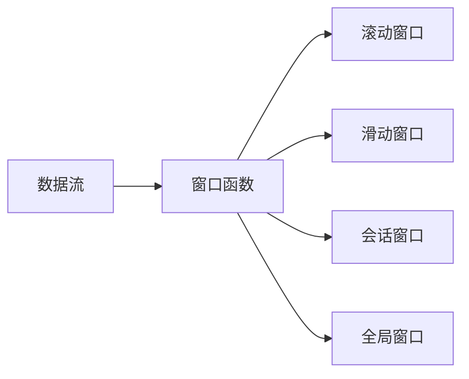

## 1.背景介绍

Apache Flink是一个开源的流处理框架，它为大规模数据流的处理和分析提供了一种快速、灵活和可靠的解决方案。Flink的核心是其流处理引擎，它可以在各种环境中运行，并能处理无限的数据流，同时保持低延迟和高吞吐量。在Flink中，Window是一个重要的概念，它允许我们在无限的数据流上定义有限的数据集，以便进行计算和分析。

## 2.核心概念与联系

Window是Flink流处理的核心概念之一。它的本质是将无限的数据流划分为有限的数据集，以便进行聚合和分析。Flink支持多种类型的Window，包括滚动窗口（Tumbling Window）、滑动窗口（Sliding Window）、会话窗口（Session Window）和全局窗口（Global Window）。这些Window类型提供了不同的数据分割和计算方式，以满足各种复杂的业务需求。



## 3.核心算法原理具体操作步骤

Flink的Window操作是通过窗口函数来实现的。窗口函数定义了如何对窗口中的数据进行计算。Flink提供了一些内置的窗口函数，如ReduceFunction、AggregateFunction和ProcessWindowFunction，用户也可以自定义窗口函数来满足特定的业务需求。

在Flink中，窗口的创建和数据的分配是通过Window Assigner来完成的。Window Assigner负责将元素分配到一个或多个窗口中。每个窗口都有一个特定的开始和结束时间，这些时间是由Window Assigner定义的。

Trigger是另一个重要的概念，它定义了何时对窗口中的数据进行计算。当Trigger的条件被满足时，窗口函数就会被触发，对窗口中的数据进行计算。

## 4.数学模型和公式详细讲解举例说明

在Flink的窗口操作中，我们通常会遇到一些关于时间和窗口大小的计算。这些计算可以通过一些简单的数学模型和公式来进行。例如，对于滑动窗口，我们可以通过以下公式来计算窗口的数量：

$$
N = \frac{T - S}{S} + 1
$$

其中，$T$是数据流的总时间，$S$是窗口的滑动步长。这个公式告诉我们，在给定的时间范围内，我们可以有多少个滑动窗口。

## 5.项目实践：代码实例和详细解释说明

以下是一个使用Flink的滑动窗口进行流处理的简单示例：

```java
DataStream<String> input = ...;
DataStream<String> windowCounts = input
    .keyBy((KeySelector<String, String>) value -> value)
    .window(SlidingProcessingTimeWindows.of(Time.seconds(60), Time.seconds(10)))
    .reduce((ReduceFunction<String>) (value1, value2) -> value1 + "," + value2);
```

在这个示例中，我们首先通过`keyBy`函数对数据进行分组，然后通过`window`函数定义滑动窗口，窗口的长度是60秒，滑动步长是10秒。最后，我们通过`reduce`函数对窗口中的数据进行聚合。

## 6.实际应用场景

Flink的窗口操作在许多实际应用场景中都有广泛的应用，如实时统计分析、事件检测、异常检测等。例如，在电商平台中，我们可以通过滑动窗口来实时统计每分钟的销售额；在金融风控中，我们可以通过会话窗口来检测用户的异常行为。

## 7.工具和资源推荐

为了更好地理解和使用Flink的窗口操作，我推荐以下工具和资源：

- Apache Flink官方文档：提供了详细的Flink介绍和使用指南，是学习Flink的最好资源。
- IntelliJ IDEA：一个强大的Java IDE，可以帮助你更高效地编写和调试Flink程序。
- Flink Forward：Flink的年度用户大会，你可以在这里了解到Flink的最新动态和最佳实践。

## 8.总结：未来发展趋势与挑战

随着数据量的不断增长和实时计算需求的提升，Flink的窗口操作将会发挥越来越重要的作用。然而，如何在保证计算准确性的同时，提高窗口操作的性能和效率，仍然是一个挑战。此外，如何更好地支持复杂的业务逻辑和窗口操作，也是未来Flink需要解决的问题。

## 9.附录：常见问题与解答

1. **问：Flink的窗口操作是否支持事件时间？**
   
   答：是的，Flink支持基于事件时间的窗口操作。你可以通过`window(EventTimeSessionWindows.withGap(Time.minutes(10)))`来创建一个基于事件时间的会话窗口。

2. **问：如何处理窗口操作中的迟到数据？**
   
   答：Flink提供了Watermark机制来处理迟到数据。你可以通过`allowedLateness`函数来设置窗口的延迟时间，对于在这个时间内到达的迟到数据，Flink仍然会将其纳入窗口进行计算。

作者：禅与计算机程序设计艺术 / Zen and the Art of Computer Programming