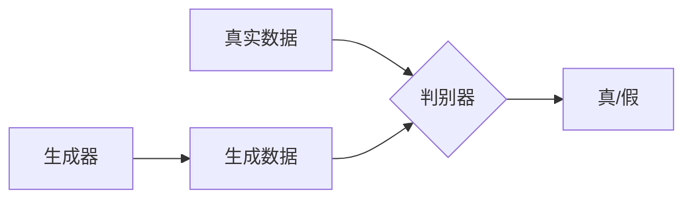

## 1. 背景介绍

生成对抗网络（Generative Adversarial Networks，简称GAN）是深度学习领域的一项革命性创新。自2014年由Ian Goodfellow等人提出以来，GAN已经在图像生成、语音合成、数据增强等多个领域展现出了巨大的潜力。GAN的核心思想是通过两个神经网络——生成器（Generator）和判别器（Discriminator）的对抗过程，来训练生成器产生高质量的数据。

## 2. 核心概念与联系

GAN的工作机制可以类比于伪造者与警察的博弈。生成器（伪造者）试图生成逼真的假数据，而判别器（警察）的任务是区分真实数据和生成器产生的假数据。通过这种对抗过程，生成器学习到如何产生与真实数据越来越相似的结果。



## 3. 核心算法原理具体操作步骤

GAN的训练过程涉及以下步骤：

1. 随机生成噪声数据。
2. 将噪声数据输入生成器，生成假数据。
3. 将真实数据和假数据输入判别器。
4. 判别器对输入数据进行真假分类。
5. 根据判别器的分类结果，调整生成器和判别器的参数。

这个过程不断重复，直到生成器生成的数据足够逼真，判别器无法区分真假为止。

## 4. 数学模型和公式详细讲解举例说明

GAN的目标函数可以表示为一个零和博弈（zero-sum game），即：

$$
\min_G \max_D V(D, G) = \mathbb{E}_{x\sim p_{data}(x)}[\log D(x)] + \mathbb{E}_{z\sim p_z(z)}[\log(1 - D(G(z)))]
$$

其中，$D(x)$是判别器对于真实数据$x$的判别结果，$G(z)$是生成器根据输入噪声$z$生成的数据。$\mathbb{E}$表示期望操作，$p_{data}$是真实数据的分布，$p_z$是噪声数据的分布。

## 5. 项目实践：代码实例和详细解释说明

以下是一个简单的GAN代码实例，使用Python和TensorFlow框架实现：

```python
import tensorflow as tf
from tensorflow.keras import layers

# 构建生成器模型
def build_generator():
    model = tf.keras.Sequential()
    model.add(layers.Dense(128, activation='relu', input_shape=(100,)))
    model.add(layers.Dense(256, activation='relu'))
    model.add(layers.Dense(512, activation='relu'))
    model.add(layers.Dense(1024, activation='tanh'))
    return model

# 构建判别器模型
def build_discriminator():
    model = tf.keras.Sequential()
    model.add(layers.Dense(1024, activation='relu', input_shape=(1024,)))
    model.add(layers.Dense(512, activation='relu'))
    model.add(layers.Dense(256, activation='relu'))
    model.add(layers.Dense(1, activation='sigmoid'))
    return model

# 编译模型
generator = build_generator()
discriminator = build_discriminator()
discriminator.compile(optimizer='adam', loss='binary_crossentropy')

# GAN模型组合
discriminator.trainable = False
gan_input = tf.keras.Input(shape=(100,))
fake_image = generator(gan_input)
gan_output = discriminator(fake_image)
gan = tf.keras.Model(gan_input, gan_output)
gan.compile(optimizer='adam', loss='binary_crossentropy')
```

在这个例子中，我们构建了一个简单的全连接网络作为生成器和判别器。生成器的输入是一个100维的噪声向量，输出是一个1024维的向量，代表生成的数据。判别器的输入是一个1024维的向量，输出是一个标量，表示数据为真实数据的概率。

## 6. 实际应用场景

GAN在以下领域有着广泛的应用：

- 图像合成与编辑
- 风格迁移
- 数据增强
- 超分辨率
- 文本到图像的转换

## 7. 工具和资源推荐

- TensorFlow
- PyTorch
- Keras
- NVIDIA cuDNN
- GAN相关的开源项目和论文

## 8. 总结：未来发展趋势与挑战

GAN的研究仍然是一个活跃的领域，未来的发展趋势包括提高生成数据的质量和多样性、降低训练难度、提升模型的稳定性等。同时，GAN面临的挑战包括模式崩溃（mode collapse）、训练不稳定等问题。

## 9. 附录：常见问题与解答

- Q: GAN训练时如何避免模式崩溃？
- A: 可以通过改进训练策略、引入正则化项、使用不同的架构等方法来缓解模式崩溃。

- Q: 如何判断GAN的训练是否成功？
- A: 通常通过观察生成数据的质量和多样性，以及判别器的分类准确率来评估训练效果。

作者：禅与计算机程序设计艺术 / Zen and the Art of Computer Programming