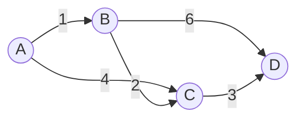

# Giraph图计算框架原理与代码实例讲解

## 1. 背景介绍
### 1.1 大数据时代下的图计算需求
在当今大数据时代,各行各业都在产生海量的数据,其中很大一部分数据都蕴含着复杂的关联关系,例如社交网络、电商推荐、金融风控等领域。如何高效地分析和挖掘这些图结构数据,成为了业界亟需解决的难题。传统的关系型数据库和MapReduce计算框架很难满足图计算的需求,因此专门的分布式图计算框架应运而生。

### 1.2 Giraph的诞生
Giraph是Apache基金会的一个开源项目,是一个可扩展的分布式迭代图处理系统,基于Hadoop的MapReduce实现。它起源于Google的Pregel论文,由Yahoo!和Facebook的工程师共同开发,并在2012年成为Apache的顶级项目。Giraph采用了类似BSP的计算模型,支持海量图数据的高效计算。

### 1.3 Giraph的应用场景
Giraph在工业界有着广泛的应用,特别是在社交网络和推荐系统领域。例如:
- Facebook使用Giraph进行好友推荐、社区发现等社交网络分析
- Twitter利用Giraph实现了WTF(Who to Follow)的用户推荐系统
- LinkedIn用Giraph优化了个性化推荐和相关性排序
- Paypal基于Giraph构建了大规模的金融风险控制系统

可以看出,Giraph在处理海量图数据和复杂网络关系方面有着得天独厚的优势。

## 2. 核心概念与联系
### 2.1 图的基本概念
在介绍Giraph之前,我们先来回顾一下图论的一些基本概念:
- 顶点(Vertex):图中的基本单元,包含唯一的id和对应的属性值
- 边(Edge):连接顶点的有向或无向线段,可以带有权重
- 邻居(Neighbor):与某个顶点直接相连的其他顶点
- 度(Degree):某个顶点的边数,有出度和入度之分
- 路径(Path):顶点和边交替连接形成的序列

这些概念是理解图算法的基础。

### 2.2 Giraph的核心概念
Giraph中有三个核心概念:
- 图(Graph):由顶点(Vertex)和边(Edge)组成的数据结构
- 顶点(Vertex):拥有唯一ID,包含对应的属性值、边集合、发送和接收消息等
- 消息(Message):顶点之间传递的信息,用于协调和更新顶点状态

在Giraph中,图被切分成多个分区(Partition),分布在不同的计算节点上。每个Worker负责处理一部分图分区。

### 2.3 BSP计算模型
Giraph采用了Bulk Synchronous Parallel (BSP)的计算模型。一个典型的BSP程序由以下三个部分组成:
1. 初始化:加载图数据,初始化图的顶点和边,分配到各个Worker
2. 迭代计算:所有Worker并行执行,每个Worker负责处理自己分区内的顶点。每个顶点可以向其他顶点发送消息,也可以接收消息更新自己的状态。当所有顶点都没有消息可以发送时,当前迭代(super-step)结束。
3. 同步:所有Worker将消息同步到对应的目标顶点,并准备下一轮迭代。

BSP模型中有两个关键概念:
- 超步(Super-step):一次迭代对应一个超步,所有顶点并行计算和通信
- 屏障(Barrier):超步之间的同步点,所有消息被发送到目标顶点

下面是一个BSP计算模型的简单示意图:


## 3. 核心算法原理与操作步骤
接下来,我们以单源最短路径(SSSP)算法为例,讲解Giraph的核心原理和操作步骤。SSSP是图论中的经典算法,旨在找到从一个源顶点到图中其他所有顶点的最短路径。

### 3.1 算法原理
SSSP可以用Bellman-Ford算法来实现,其基本原理如下:
1. 初始化:将源顶点的距离设为0,其他顶点的距离设为无穷大
2. 迭代更新:对每个顶点v,更新它的所有出边(v, u),如果`d(v) + w(v,u) < d(u)`,则更新`d(u) = d(v) + w(v,u)`
3. 如果某一轮迭代没有更新任何顶点的距离,则算法结束

其中d(v)表示源顶点到v的最短距离,w(v,u)表示边(v,u)的权重。

### 3.2 Giraph实现SSSP
在Giraph中,SSSP可以用如下步骤实现:
1. 初始化:加载图数据,将源顶点的距离设为0,并发送给所有邻居顶点
2. 迭代计算:
   - 每个顶点接收消息(距离值),更新自己的距离
   - 如果距离有更新,则将新距离发送给所有邻居
   - 当没有消息可以发送时,当前超步结束
3. 同步消息,进入下一个超步,重复步骤2
4. 当没有顶点的距离再发生变化,算法结束

下面是Giraph实现SSSP的简化伪代码:

```java
class SSSPVertex extends Vertex<LongWritable, DoubleWritable, DoubleWritable> {
  
  public void compute(Iterable<DoubleWritable> messages) {
    if (getSuperstep() == 0) { // 初始化
      if (getId().get() == sourceId) {
        setValue(new DoubleWritable(0));
        sendMessageToAllEdges(getValue());
      }
    } else { // 迭代计算
      double minDist = isSource() ? 0 : Double.MAX_VALUE;
      for (DoubleWritable message : messages) {
        minDist = Math.min(minDist, message.get());
      }
      if (minDist < getValue().get()) {
        setValue(new DoubleWritable(minDist));
        sendMessageToAllEdges(new DoubleWritable(minDist + getEdgeValue()));
      }
    }
    voteToHalt(); // 当前顶点计算完成
  }
  
  private boolean isSource() {
    return getId().get() == sourceId;
  }
}
```

其中compute方法定义了每个顶点的计算逻辑,在超步0进行初始化,在后续超步中根据收到的消息更新距离值。

## 4. 数学模型与公式详解
SSSP算法可以用如下数学模型来表示:

设图G=(V,E),其中V为顶点集合,E为边集合。边(u,v)∈E的权重为w(u,v)。给定源顶点s∈V,求解s到V中其他顶点的最短距离d(v)。

初始化:
$$
d(v) = 
\begin{cases}
0 & v = s \\
\infty & v \neq s
\end{cases}
$$

迭代更新:
$$
d(v) = \min\{d(v), \min_{(u,v)\in E}\{d(u) + w(u,v)\}\}
$$

当d(v)不再发生变化时,算法收敛,得到从s到所有顶点的最短距离。

以下是一个示例图:



设顶点A为源点,则SSSP的计算过程如下:

初始化:
- d(A) = 0
- d(B) = d(C) = d(D) = ∞

第1步:
- d(B) = min(∞, 0 + 1) = 1
- d(C) = min(∞, 0 + 4) = 4

第2步:
- d(C) = min(4, 1 + 2) = 3
- d(D) = min(∞, 1 + 6) = 7

第3步:
- d(D) = min(7, 3 + 3) = 6

此时所有顶点的距离都不再变化,得到最终结果:
- d(A) = 0
- d(B) = 1
- d(C) = 3
- d(D) = 6

可见Giraph中的SSSP实现完全符合该数学模型。

## 5. 项目实践:代码实例与详解
下面我们通过一个完整的代码实例来演示Giraph中SSSP的实现。

### 5.1 创建Giraph项目
首先需要创建一个Maven项目,并添加Giraph的依赖:

```xml
<dependencies>
  <dependency>
    <groupId>org.apache.giraph</groupId>
    <artifactId>giraph-core</artifactId>
    <version>1.3.0</version>
  </dependency>
</dependencies>
```

### 5.2 定义顶点类
创建一个SSSPVertex类,继承自Vertex,定义顶点的计算逻辑:

```java
public class SSSPVertex extends Vertex<LongWritable, DoubleWritable, DoubleWritable> {
  
  @Override
  public void compute(Iterable<DoubleWritable> messages) {
    if (getSuperstep() == 0) { // 初始化
      if (getId().get() == sourceId) {
        setValue(new DoubleWritable(0));
        sendMessageToAllEdges(getValue());
      }
    } else { // 迭代计算
      double minDist = isSource() ? 0 : Double.MAX_VALUE;
      for (DoubleWritable message : messages) {
        minDist = Math.min(minDist, message.get());
      }
      if (minDist < getValue().get()) {
        setValue(new DoubleWritable(minDist));
        sendMessageToAllEdges(new DoubleWritable(minDist + getEdgeValue()));
      }
    }
    voteToHalt();
  }
  
  private boolean isSource() {
    return getId().get() == sourceId;
  }
  
  private static long sourceId = 1;
}
```

其中compute方法在每个超步中被调用,实现了SSSP的核心逻辑。源顶点id默认为1。

### 5.3 加载图数据
Giraph支持多种图数据的输入格式,例如JSON、CSV等。这里我们使用TextInputFormat来加载一个简单的文本格式的图:

```
1,2,1.0
1,3,4.0
2,3,2.0
2,4,6.0
3,4,3.0
```

每行代表一条有向边,格式为"srcId,dstId,edgeValue"。

创建一个SSSPRunner类来配置和运行Giraph作业:

```java
public class SSSPRunner {
  
  public static void main(String[] args) throws Exception {
    GiraphConfiguration conf = new GiraphConfiguration();
    conf.setVertexClass(SSSPVertex.class);
    conf.setVertexInputFormatClass(TextVertexInputFormat.class);
    conf.setVertexOutputFormatClass(TextVertexOutputFormat.class);
    conf.setWorkerConfiguration(1, 1, 100.0f);
    
    GiraphFileInputFormat.addVertexInputPath(conf, new Path("input/graph.txt"));
    GiraphFileOutputFormat.setOutputPath(conf, new Path("output"));
    
    Giraph.run(conf);
  }
}
```

这里设置了顶点类、输入输出格式以及Worker的配置。图数据文件路径为"input/graph.txt",输出路径为"output"。

### 5.4 运行和结果解读
在本地运行SSSPRunner,Giraph会启动MapReduce作业来执行SSSP计算。运行结束后,在输出目录可以看到计算结果:

```
1       0.0
2       1.0
3       3.0
4       6.0
```

每行表示"顶点ID  最短距离",与前面的示例结果一致。

至此,我们就完成了一个基于Giraph的SSSP算法实现。Giraph屏蔽了分布式计算的细节,让开发者可以专注于图算法的逻辑。

## 6. 实际应用场景
Giraph在实际业务中有非常广泛的应用,下面列举几个典型场景。

### 6.1 社交网络分析
社交网络是一个典型的图结构,用户是顶点,用户之间的关系是边。Giraph可以用于社交网络的各种分析任务,例如:
- 社区发现:识别紧密联系的用户群体
- 影响力分析:计算用户的影响力和传播路径
- 好友推荐:基于共同好友、相似兴趣等关系推荐好友

Facebook利用Giraph实现了大规模的社交网络分析,支撑了其用户增长和活跃度提升。

### 6.2 推荐系统
推荐系统也可以用图模型来表示,将用户和物品看作顶点,