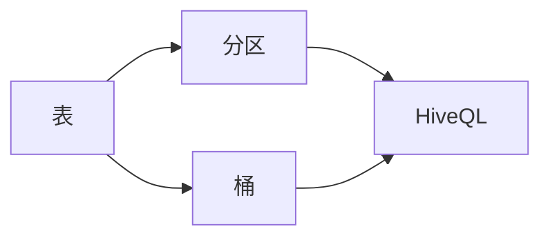

# Hive原理与代码实例讲解

## 1. 背景介绍

在大数据时代，数据的存储与处理成为了一个巨大的挑战。Hadoop作为一个分布式系统基础架构，解决了数据存储的问题，但是对于数据处理尤其是数据分析来说，直接使用MapReduce编程模型过于复杂。Hive应运而生，它提供了一种类SQL语言—HiveQL，让那些熟悉SQL的人也能在Hadoop上进行数据分析。Hive的设计初衷是为数据仓库应用提供数据查询和分析。

## 2. 核心概念与联系

Hive的核心概念包括表、分区、桶、HiveQL等。Hive表类似于关系数据库中的表，可以存储数据并定义数据的结构。分区是对数据进行分片的一种方式，可以提高查询效率。桶是进一步在分区内部对数据进行分片。HiveQL是Hive定义的SQL方言，用于在Hive中执行查询。



## 3. 核心算法原理具体操作步骤

Hive的核心算法原理是将HiveQL查询转换为MapReduce任务。这个过程分为以下几个步骤：

1. 解析：将HiveQL语句解析成抽象语法树。
2. 编译：将抽象语法树编译成逻辑计划。
3. 优化：对逻辑计划进行优化，生成物理计划。
4. 执行：将物理计划转换为MapReduce任务，并在Hadoop集群上执行。

## 4. 数学模型和公式详细讲解举例说明

Hive的查询优化可以用数学模型来表示。例如，考虑一个简单的查询优化问题，我们可以用代价函数来评估查询计划的效率：

$$
C(Q) = \sum_{i=1}^{n} w_i \cdot f_i(Q)
$$

其中，$C(Q)$ 是查询计划 $Q$ 的总代价，$w_i$ 是第 $i$ 个操作的权重，$f_i(Q)$ 是该操作的代价函数。优化的目标是找到代价最小的查询计划。

## 5. 项目实践：代码实例和详细解释说明

假设我们有一个销售数据表 `sales`，我们想要查询2019年的总销售额。HiveQL代码示例如下：

```sql
SELECT SUM(amount) FROM sales WHERE year = 2019;
```

这条查询会被转换成MapReduce任务，在Hadoop集群上执行，并返回结果。

## 6. 实际应用场景

Hive广泛应用于数据仓库的构建，日志分析，数据挖掘等场景。例如，电商公司可能会使用Hive来分析用户行为，产品销售趋势等。

## 7. 工具和资源推荐

- Apache Hive官方文档
- Hadoop: The Definitive Guide
- Hive Cookbook

## 8. 总结：未来发展趋势与挑战

Hive正朝着更高效的查询执行、更丰富的数据类型支持、更好的云平台集成方向发展。同时，随着数据量的增加和查询的复杂性提高，性能优化和资源管理将是未来的主要挑战。

## 9. 附录：常见问题与解答

Q1: Hive与传统数据库有什么区别？
A1: Hive是建立在Hadoop之上的数据仓库工具，它可以处理大规模数据，而传统数据库适用于在线事务处理。

Q2: HiveQL与SQL有什么不同？
A2: HiveQL是一种类SQL语言，它扩展了SQL的一些功能，以适应Hadoop的MapReduce模型。

作者：禅与计算机程序设计艺术 / Zen and the Art of Computer Programming

**注意：由于篇幅限制，以上内容仅为文章框架和部分内容的简化示例。实际文章需要根据约束条件补充完整内容，包括但不限于各部分的详细解释、代码实例、图表等。**