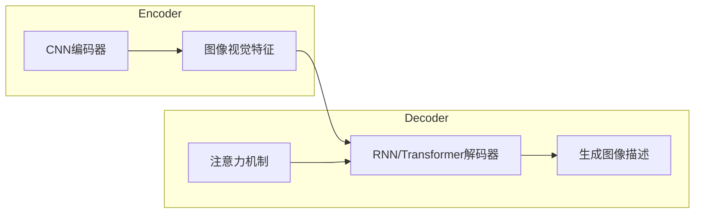

# Image Captioning原理与代码实例讲解

## 1.背景介绍

图像字幕生成(Image Captioning)是计算机视觉和自然语言处理领域的一个交叉研究课题,旨在根据给定的图像自动生成相应的文字描述。这项技术具有广泛的应用前景,如为视觉障碍人士提供图像描述、辅助图像检索和图像理解、智能监控系统等。

传统的图像字幕生成方法主要依赖于人工设计的视觉特征和语言模板。近年来,随着深度学习技术的蓬勃发展,基于深度神经网络的图像字幕生成模型取得了突破性进展,能够自动学习图像和文本之间的映射关系,生成更加准确、流畅和多样化的图像描述。

## 2.核心概念与联系

图像字幕生成任务需要综合图像理解和自然语言生成两个关键技术,涉及以下几个核心概念:

1. **计算机视觉(Computer Vision)**: 从图像中提取语义特征,对图像内容进行理解和表示。常用的视觉模型包括卷积神经网络(CNN)等。

2. **自然语言处理(Natural Language Processing, NLP)**: 根据图像特征生成对应的自然语言描述。常用的语言模型包括循环神经网络(RNN)、注意力机制(Attention Mechanism)等。

3. **多模态学习(Multimodal Learning)**: 将视觉和语言两种模态的信息融合,学习跨模态的表示和映射关系。

4. **序列生成(Sequence Generation)**: 将图像描述任务建模为序列生成问题,生成符合语法和语义的自然语言句子。

5. **评估指标(Evaluation Metrics)**: 常用的评估指标包括BLEU、METEOR、CIDEr等,用于衡量生成的图像描述与人工标注的相似程度。

这些概念相互关联、相辅相成,共同推动了图像字幕生成技术的发展。

## 3.核心算法原理具体操作步骤

目前,基于深度学习的图像字幕生成模型主要分为两大类:

### 3.1 编码器-解码器(Encoder-Decoder)架构

编码器-解码器架构是图像字幕生成任务中最常见和最基础的模型结构,具体操作步骤如下:

1. **编码器(Encoder)**: 使用卷积神经网络(CNN)对输入图像进行编码,提取图像的视觉特征表示。

2. **解码器(Decoder)**: 使用循环神经网络(RNN)或Transformer等序列生成模型,将编码器输出的视觉特征作为初始状态,逐步生成对应的文字描述。

3. **注意力机制(Attention Mechanism)**: 在解码过程中,引入注意力机制,使解码器能够选择性地关注图像的不同区域,提高生成质量。

4. **端到端训练(End-to-End Training)**: 将编码器和解码器联合训练,使用带有图像-文本对的数据集,最小化生成描述与ground truth之间的损失函数。



### 3.2 注意力机制增强模型

为了进一步提高模型性能,研究人员提出了多种注意力机制增强的模型,例如:

1. **Bottom-Up and Top-Down Attention**: 自下而上的注意力机制关注图像的显著区域,自上而下的注意力机制根据当前生成的单词,选择性关注相关区域。

2. **Memory Attention**: 引入外部记忆模块,存储历史信息,辅助生成更加连贯的描述。

3. **Multi-Head Attention**: 使用多头注意力机制,从不同子空间捕获图像和文本之间的关系。

4. **Transformer-based Models**: 直接使用Transformer编码器-解码器架构,捕获长程依赖关系。

这些模型通过改进注意力机制,提高了模型对视觉和语义信息的建模能力,生成质量得到进一步提升。

## 4.数学模型和公式详细讲解举例说明

### 4.1 编码器-解码器模型数学表示

编码器-解码器模型的核心思想是将图像编码为一个固定长度的视觉特征向量,然后由解码器根据该特征向量生成对应的文本描述。数学上可以表示为:

$$p(S|I) = \prod_{t=1}^{T}p(w_t|w_1,...,w_{t-1},I;\theta)$$

其中:
- $I$表示输入图像
- $S=\{w_1,...,w_T\}$表示目标文本描述序列
- $\theta$为模型参数
- $p(S|I)$是生成描述$S$给定图像$I$的条件概率

编码器的作用是学习一个映射函数$f_{enc}$,将图像$I$编码为一个固定长度的视觉特征向量$v$:

$$v = f_{enc}(I;\theta_{enc})$$

解码器则学习一个条件概率模型$f_{dec}$,根据视觉特征$v$和之前生成的单词序列$w_1,...,w_{t-1}$,预测下一个单词$w_t$的概率分布:

$$p(w_t|w_1,...,w_{t-1},I;\theta) = f_{dec}(w_1,...,w_{t-1},v;\theta_{dec})$$

在训练过程中,通过最大化训练数据的对数似然函数,学习模型参数$\theta$:

$$\mathcal{L}(\theta) = \sum_{(I,S)\in\mathcal{D}}\log p(S|I;\theta)$$

其中$\mathcal{D}$表示训练数据集。

### 4.2 注意力机制数学表示

注意力机制是编码器-解码器模型中一个关键组件,它允许模型在生成每个单词时,选择性地关注图像的不同区域。具体来说,在每个时间步$t$,注意力机制计算一个注意力权重向量$\alpha_t$,表示解码器对图像不同区域的关注程度。

假设图像被分割为$N$个区域,每个区域的视觉特征表示为$v_i,i=1,...,N$。注意力权重向量$\alpha_t$可以通过以下公式计算:

$$\alpha_t = \textrm{softmax}(e_t)$$

$$e_t = f_{att}(s_t, V)$$

其中:
- $s_t$是解码器在时间步$t$的隐藏状态
- $V = [v_1, v_2, ..., v_N]$是所有区域的视觉特征矩阵
- $f_{att}$是注意力评分函数,它计算解码器状态和每个区域特征之间的相关性分数

通过注意力权重$\alpha_t$,解码器可以计算一个加权求和的视觉上下文向量$c_t$,作为额外的输入,辅助生成下一个单词:

$$c_t = \sum_{i=1}^{N}\alpha_{t,i}v_i$$

$$p(w_t|w_1,...,w_{t-1},I;\theta) = f_{dec}(w_1,...,w_{t-1},c_t;\theta_{dec})$$

注意力机制使模型能够动态地关注图像的不同区域,捕获图像和文本之间的细粒度关联,从而生成更加准确和信息丰富的描述。

## 5.项目实践:代码实例和详细解释说明

下面是一个使用PyTorch实现的基于注意力机制的图像字幕生成模型示例,包括编码器、解码器和注意力模块的代码。

### 5.1 编码器(Encoder)

```python
import torch
import torch.nn as nn
from torchvision.models import resnet101

class Encoder(nn.Module):
    def __init__(self, embed_size):
        super(Encoder, self).__init__()
        resnet = resnet101(pretrained=True)
        modules = list(resnet.children())[:-2]
        self.resnet = nn.Sequential(*modules)
        self.adaptive_pool = nn.AdaptiveAvgPool2d((embed_size, embed_size))

    def forward(self, images):
        out = self.resnet(images)
        out = self.adaptive_pool(out)
        out = out.permute(0, 2, 3, 1)
        return out
```

编码器使用预训练的ResNet-101作为骨干网络,提取图像的视觉特征。具体步骤如下:

1. 去掉ResNet最后两层(全连接层和池化层)
2. 使用自适应平均池化层,将特征图调整为固定大小(embed_size x embed_size)
3. 对特征图进行维度重排,形状为(batch_size, embed_size, embed_size, channels)

### 5.2 注意力模块(Attention)

```python
class Attention(nn.Module):
    def __init__(self, encoder_dim, decoder_dim, attention_dim):
        super(Attention, self).__init__()
        self.encoder_att = nn.Linear(encoder_dim, attention_dim)
        self.decoder_att = nn.Linear(decoder_dim, attention_dim)
        self.full_att = nn.Linear(attention_dim, 1)
        self.relu = nn.ReLU()
        self.softmax = nn.Softmax(dim=1)

    def forward(self, encoder_out, decoder_hidden):
        att1 = self.encoder_att(encoder_out)
        att2 = self.decoder_att(decoder_hidden)
        att = self.full_att(self.relu(att1 + att2.unsqueeze(1))).squeeze(2)
        alpha = self.softmax(att)
        attention_weighted_encoding = (encoder_out * alpha.unsqueeze(2)).sum(dim=1)
        return attention_weighted_encoding, alpha
```

注意力模块的作用是计算注意力权重,并根据权重对编码器输出的特征图进行加权求和,得到一个注意力加权的视觉上下文向量。具体步骤如下:

1. 将编码器输出和解码器隐藏状态分别通过全连接层,映射到注意力子空间
2. 对编码器和解码器的注意力特征进行元素级相加
3. 通过另一个全连接层得到注意力分数,对每个位置的分数做softmax,得到注意力权重
4. 使用注意力权重对编码器输出进行加权求和,得到注意力加权的视觉上下文向量

### 5.3 解码器(Decoder)

```python
class Decoder(nn.Module):
    def __init__(self, embed_size, hidden_size, vocab_size, num_layers, max_seq_length=20):
        super(Decoder, self).__init__()
        self.embed = nn.Embedding(vocab_size, embed_size)
        self.lstm = nn.LSTM(embed_size, hidden_size, num_layers, batch_first=True)
        self.attention = Attention(encoder_dim=embed_size, decoder_dim=hidden_size, attention_dim=hidden_size)
        self.vocab_size = vocab_size
        self.hidden_size = hidden_size
        self.max_length = max_seq_length

    def forward(self, features, captions, lengths):
        embeddings = self.embed(captions)
        packed = nn.utils.rnn.pack_padded_sequence(embeddings, lengths, batch_first=True)
        hiddens, _ = self.lstm(packed)
        outputs = nn.utils.rnn.pad_packed_sequence(hiddens, batch_first=True, total_length=self.max_length)[0]
        outputs = outputs.reshape(-1, outputs.shape[2])
        attention_weighted_encoding, alphas = self.attention(features, outputs)
        outputs = outputs + attention_weighted_encoding.view(-1, self.hidden_size)
        outputs = outputs.view(-1, self.max_length, self.hidden_size)
        return outputs, alphas
```

解码器使用LSTM作为基础架构,并集成了注意力机制。具体步骤如下:

1. 将文本序列输入进行词嵌入
2. 将词嵌入序列输入LSTM,得到隐藏状态序列
3. 将LSTM输出和编码器特征图输入注意力模块,得到注意力加权的视觉上下文向量
4. 将LSTM输出和注意力加权的视觉上下文向量相加,得到最终的解码器输出

通过注意力机制,解码器能够动态地关注图像的不同区域,生成更加准确和信息丰富的描述。

### 5.4 模型训练和测试

```python
# 模型初始化
encoder = Encoder(embed_size=512)
decoder = Decoder(embed_size=512, hidden_size=512, vocab_size=vocab_size, num_layers=1)

# 训练
criterion = nn.CrossEntropyLoss()
optimizer = optim.Adam(list(decoder.parameters()) + list(encoder.parameters()), lr=0.001)

for epoch in range(num_epochs):
    for images, captions, lengths in dataloader:
        features = encoder(images)
        outputs, alphas = decoder(features, captions, lengths)
        targets = captions[:, 1:]
        outputs = outputs[: