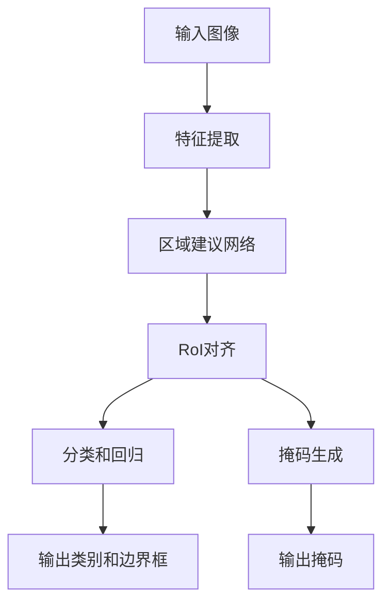
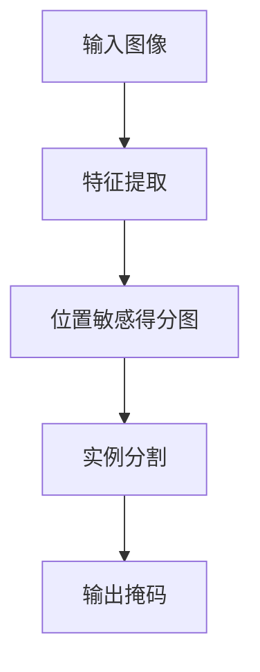

# Instance Segmentation原理与代码实例讲解

## 1.背景介绍

在计算机视觉领域，图像分割是一项重要的任务。图像分割可以分为语义分割和实例分割。语义分割的目标是将图像中的每个像素分类到一个特定的类别，而实例分割不仅要分类，还要区分同一类别中的不同实例。实例分割在自动驾驶、医疗影像分析、视频监控等领域有着广泛的应用。

## 2.核心概念与联系

### 2.1 图像分割

图像分割是将图像划分为多个有意义的区域，每个区域代表一个对象或对象的一部分。图像分割可以分为以下几类：

- **语义分割**：将图像中的每个像素分类到一个特定的类别。
- **实例分割**：不仅要分类，还要区分同一类别中的不同实例。
- **全景分割**：结合语义分割和实例分割，提供每个像素的类别标签和实例标签。

### 2.2 实例分割

实例分割的目标是识别图像中的每个对象实例，并为每个实例生成一个独立的掩码。实例分割的输出通常包括：

- **类别标签**：每个实例的类别。
- **边界框**：每个实例的边界框。
- **掩码**：每个实例的像素级掩码。

### 2.3 语义分割与实例分割的联系

语义分割和实例分割在某些方面是相似的，但实例分割更具挑战性，因为它需要区分同一类别中的不同实例。实例分割通常在语义分割的基础上进行，通过增加实例级别的信息来实现。

## 3.核心算法原理具体操作步骤

### 3.1 Mask R-CNN

Mask R-CNN 是一种流行的实例分割算法，它在 Faster R-CNN 的基础上增加了一个分支，用于生成像素级的掩码。Mask R-CNN 的主要步骤如下：

1. **特征提取**：使用卷积神经网络（如 ResNet）提取图像特征。
2. **区域建议网络（RPN）**：生成候选区域。
3. **RoI对齐**：对候选区域进行对齐，以便后续处理。
4. **分类和回归**：对候选区域进行分类，并回归边界框。
5. **掩码生成**：为每个候选区域生成像素级的掩码。

以下是 Mask R-CNN 的流程图：



### 3.2 FCIS

FCIS（Fully Convolutional Instance-aware Semantic Segmentation）是一种基于全卷积网络的实例分割方法。它通过共享特征图来同时进行语义分割和实例分割。FCIS 的主要步骤如下：

1. **特征提取**：使用卷积神经网络提取图像特征。
2. **位置敏感得分图**：生成位置敏感得分图，用于区分不同实例。
3. **实例分割**：根据位置敏感得分图生成实例掩码。

以下是 FCIS 的流程图：



## 4.数学模型和公式详细讲解举例说明

### 4.1 Mask R-CNN 的数学模型

Mask R-CNN 的损失函数由三部分组成：分类损失、边界框回归损失和掩码损失。总损失函数可以表示为：

$$
L = L_{cls} + L_{box} + L_{mask}
$$

其中，$L_{cls}$ 是分类损失，$L_{box}$ 是边界框回归损失，$L_{mask}$ 是掩码损失。

#### 4.1.1 分类损失

分类损失使用交叉熵损失函数：

$$
L_{cls} = -\sum_{i} y_i \log(p_i)
$$

其中，$y_i$ 是第 $i$ 类的真实标签，$p_i$ 是第 $i$ 类的预测概率。

#### 4.1.2 边界框回归损失

边界框回归损失使用平滑 $L_1$ 损失函数：

$$
L_{box} = \sum_{i} \text{smooth}_{L_1}(t_i - t_i^*)
$$

其中，$t_i$ 是预测的边界框参数，$t_i^*$ 是真实的边界框参数。

#### 4.1.3 掩码损失

掩码损失使用二元交叉熵损失函数：

$$
L_{mask} = -\sum_{i,j} [y_{ij} \log(p_{ij}) + (1 - y_{ij}) \log(1 - p_{ij})]
$$

其中，$y_{ij}$ 是第 $i$ 个像素的真实标签，$p_{ij}$ 是第 $i$ 个像素的预测概率。

### 4.2 FCIS 的数学模型

FCIS 的损失函数由位置敏感得分图的损失和实例掩码的损失组成。总损失函数可以表示为：

$$
L = L_{score} + L_{mask}
$$

#### 4.2.1 位置敏感得分图的损失

位置敏感得分图的损失使用交叉熵损失函数：

$$
L_{score} = -\sum_{i} y_i \log(p_i)
$$

其中，$y_i$ 是第 $i$ 类的真实标签，$p_i$ 是第 $i$ 类的预测概率。

#### 4.2.2 实例掩码的损失

实例掩码的损失使用二元交叉熵损失函数：

$$
L_{mask} = -\sum_{i,j} [y_{ij} \log(p_{ij}) + (1 - y_{ij}) \log(1 - p_{ij})]
$$

其中，$y_{ij}$ 是第 $i$ 个像素的真实标签，$p_{ij}$ 是第 $i$ 个像素的预测概率。

## 5.项目实践：代码实例和详细解释说明

### 5.1 环境准备

在开始代码实例之前，我们需要准备好开发环境。以下是所需的主要工具和库：

- Python 3.x
- TensorFlow 或 PyTorch
- OpenCV
- Matplotlib

### 5.2 数据集准备

我们将使用 COCO 数据集进行实例分割任务。COCO 数据集包含大量标注的图像，适合用于训练和评估实例分割模型。

### 5.3 代码实例

以下是使用 Mask R-CNN 进行实例分割的代码示例：

```python
import numpy as np
import cv2
import matplotlib.pyplot as plt
from mrcnn.config import Config
from mrcnn import model as modellib, utils

# 配置
class InferenceConfig(Config):
    NAME = "coco_inference"
    GPU_COUNT = 1
    IMAGES_PER_GPU = 1
    NUM_CLASSES = 1 + 80  # COCO 数据集有 80 个类别

config = InferenceConfig()

# 模型加载
model = modellib.MaskRCNN(mode="inference", model_dir="logs", config=config)
model.load_weights("mask_rcnn_coco.h5", by_name=True)

# 图像加载
image = cv2.imread("input.jpg")
image = cv2.cvtColor(image, cv2.COLOR_BGR2RGB)

# 实例分割
results = model.detect([image], verbose=1)
r = results[0]

# 可视化结果
def display_instances(image, boxes, masks, class_ids, class_names, scores):
    n_instances = boxes.shape[0]
    for i in range(n_instances):
        if not np.any(boxes[i]):
            continue
        y1, x1, y2, x2 = boxes[i]
        mask = masks[:, :, i]
        image = apply_mask(image, mask)
        color = (1.0, 0.0, 0.0)
        image = cv2.rectangle(image, (x1, y1), (x2, y2), color, 2)
        label = class_names[class_ids[i]]
        caption = "{} {:.2f}".format(label, scores[i])
        image = cv2.putText(image, caption, (x1, y1 - 10), cv2.FONT_HERSHEY_SIMPLEX, 0.5, color, 2)
    plt.imshow(image)
    plt.axis('off')
    plt.show()

def apply_mask(image, mask, color=(1.0, 0.0, 0.0), alpha=0.5):
    for c in range(3):
        image[:, :, c] = np.where(mask == 1, image[:, :, c] * (1 - alpha) + alpha * color[c] * 255, image[:, :, c])
    return image

class_names = ['BG', 'person', 'bicycle', 'car', 'motorcycle', 'airplane', 'bus', 'train', 'truck', 'boat', 'traffic light', 'fire hydrant', 'stop sign', 'parking meter', 'bench', 'bird', 'cat', 'dog', 'horse', 'sheep', 'cow', 'elephant', 'bear', 'zebra', 'giraffe', 'backpack', 'umbrella', 'handbag', 'tie', 'suitcase', 'frisbee', 'skis', 'snowboard', 'sports ball', 'kite', 'baseball bat', 'baseball glove', 'skateboard', 'surfboard', 'tennis racket', 'bottle', 'wine glass', 'cup', 'fork', 'knife', 'spoon', 'bowl', 'banana', 'apple', 'sandwich', 'orange', 'broccoli', 'carrot', 'hot dog', 'pizza', 'donut', 'cake', 'chair', 'couch', 'potted plant', 'bed', 'dining table', 'toilet', 'tv', 'laptop', 'mouse', 'remote', 'keyboard', 'cell phone', 'microwave', 'oven', 'toaster', 'sink', 'refrigerator', 'book', 'clock', 'vase', 'scissors', 'teddy bear', 'hair drier', 'toothbrush']

display_instances(image, r['rois'], r['masks'], r['class_ids'], class_names, r['scores'])
```

### 5.4 代码解释

1. **配置**：定义了一个继承自 `Config` 的类 `InferenceConfig`，用于配置模型参数。
2. **模型加载**：加载预训练的 Mask R-CNN 模型权重。
3. **图像加载**：读取输入图像并进行颜色转换。
4. **实例分割**：使用模型对图像进行实例分割，得到分割结果。
5. **可视化结果**：定义了两个函数 `display_instances` 和 `apply_mask`，用于可视化分割结果。

## 6.实际应用场景

实例分割在多个领域有着广泛的应用，以下是一些典型的应用场景：

### 6.1 自动驾驶

在自动驾驶中，实例分割可以用于识别和区分道路上的不同车辆、行人和其他障碍物，从而提高自动驾驶系统的安全性和可靠性。

### 6.2 医疗影像分析

在医疗影像分析中，实例分割可以用于识别和分割不同的器官和病变区域，辅助医生进行诊断和治疗。

### 6.3 视频监控

在视频监控中，实例分割可以用于识别和跟踪不同的目标，如行人、车辆等，从而提高监控系统的智能化水平。

### 6.4 增强现实

在增强现实中，实例分割可以用于识别和分割现实世界中的物体，从而实现虚拟物体与现实物体的交互。

## 7.工具和资源推荐

### 7.1 工具

- **Mask R-CNN**：一种流行的实例分割算法，基于 TensorFlow 和 Keras 实现。
- **Detectron2**：Facebook AI Research 开发的一个高效的实例分割库，基于 PyTorch 实现。
- **OpenCV**：一个开源的计算机视觉库，提供了丰富的图像处理和计算机视觉算法。

### 7.2 资源

- **COCO 数据集**：一个大规模的图像数据集，包含丰富的标注信息，适合用于训练和评估实例分割模型。
- **Kaggle**：一个数据科学竞赛平台，提供了大量的公开数据集和竞赛，适合用于实例分割任务的研究和实践。
- **arXiv**：一个开放的学术论文预印本平台，提供了大量的实例分割相关的研究论文和技术报告。

## 8.总结：未来发展趋势与挑战

### 8.1 未来发展趋势

随着深度学习技术的不断发展，实例分割算法也在不断进步。未来，实例分割的发展趋势可能包括：

- **更高的精度**：通过改进模型结构和训练方法，提高实例分割的精度。
- **更快的速度**：通过优化算法和硬件加速，提高实例分割的速度。
- **更广泛的应用**：实例分割将在更多的领域得到应用，如机器人、无人机等。

### 8.2 挑战

尽管实例分割技术已经取得了显著的进展，但仍然面临一些挑战：

- **复杂场景**：在复杂场景中，实例分割的精度和鲁棒性仍然有待提高。
- **实时性**：在一些实时应用中，实例分割的速度仍然是一个瓶颈。
- **数据依赖**：实例分割模型的性能高度依赖于训练数据的质量和数量，如何获取和标注高质量的数据仍然是一个挑战。

## 9.附录：常见问题与解答

### 9.1 实例分割与语义分割的区别是什么？

实例分割不仅要分类，还要区分同一类别中的不同实例，而语义分割只需要分类。

### 9.2 Mask R-CNN 的主要优点是什么？

Mask R-CNN 的主要优点是能够同时进行目标检测和实例分割，具有较高的精度和鲁棒性。

### 9.3 如何提高实例分割的精度？

可以通过改进模型结构、增加训练数据、使用数据增强技术等方法来提高实例分割的精度。

### 9.4 实例分割在自动驾驶中的应用有哪些？

实例分割可以用于识别和区分道路上的不同车辆、行人和其他障碍物，从而提高自动驾驶系统的安全性和可靠性。

### 9.5 实例分割在医疗影像分析中的应用有哪些？

实例分割可以用于识别和分割不同的器官和病变区域，辅助医生进行诊断和治疗。

---

作者：禅与计算机程序设计艺术 / Zen and the Art of Computer Programming