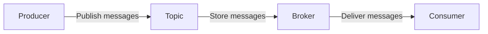
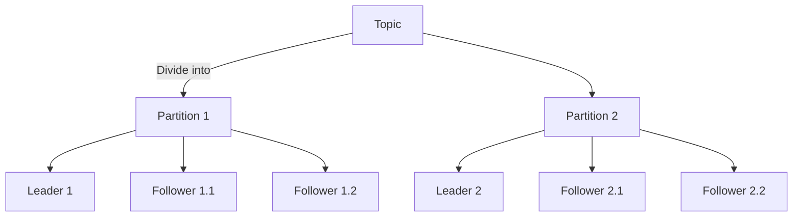

## 1.背景介绍

Apache Kafka是一个开源的分布式流处理平台，由LinkedIn公司开发，并于2011年贡献给了Apache软件基金会。Kafka是设计用来处理实时数据流的，并具有高吞吐量、可扩展性、可靠性和实时性的特点。它在许多企业和组织中被广泛应用，包括LinkedIn、Netflix、Uber、Twitter等。

## 2.核心概念与联系

Kafka的主要构成部分包括：Producer、Broker、Consumer和Topic。Producer负责生产消息，Broker负责存储消息，Consumer负责消费消息，Topic则是消息的类别。

Kafka的架构是基于发布/订阅模式的，生产者将消息发布到特定的主题，消费者订阅主题并处理其中的消息。在Kafka中，消息是不可变的，一旦写入，就不能修改或删除。这样可以确保数据的一致性和可靠性。



## 3.核心算法原理具体操作步骤

Kafka使用了一种名为“日志”的数据结构来存储消息。日志是一个按时间顺序排列的消息序列，新的消息被追加到日志的末尾，消费者通过读取日志来获取消息。

每个主题可以分为多个分区，每个分区都有一个Leader和若干个Follower。Leader负责处理读写请求，Follower负责复制Leader的数据，以提供数据冗余。当Leader宕机时，Follower可以接管Leader的角色，保证服务的可用性。



## 4.数学模型和公式详细讲解举例说明

在Kafka中，我们可以使用公式来计算消息的存储位置和消费者的读取位置。

假设我们有一个主题T，它被分为了n个分区，每个分区都有一个唯一的ID。每个消息在分区中的位置由一个名为“偏移量”的值表示。

我们可以用以下的公式来表示消息的存储位置：

$$
位置 = 主题T + 分区ID + 偏移量
$$

消费者读取消息的位置可以用以下的公式来表示：

$$
位置 = 主题T + 分区ID + 当前偏移量
$$

其中，当前偏移量是消费者已经读取到的最后一个消息的偏移量。

## 5.项目实践：代码实例和详细解释说明

以下是一个简单的Kafka生产者和消费者的Java代码示例：

```java
// Producer
Properties props = new Properties();
props.put("bootstrap.servers", "localhost:9092");
props.put("key.serializer", "org.apache.kafka.common.serialization.StringSerializer");
props.put("value.serializer", "org.apache.kafka.common.serialization.StringSerializer");

Producer<String, String> producer = new KafkaProducer<>(props);
producer.send(new ProducerRecord<String, String>("my-topic", "key", "value"));
producer.close();

// Consumer
Properties props = new Properties();
props.put("bootstrap.servers", "localhost:9092");
props.put("group.id", "test");
props.put("key.deserializer", "org.apache.kafka.common.serialization.StringDeserializer");
props.put("value.deserializer", "org.apache.kafka.common.serialization.StringDeserializer");

Consumer<String, String> consumer = new KafkaConsumer<>(props);
consumer.subscribe(Arrays.asList("my-topic"));

while (true) {
    ConsumerRecords<String, String> records = consumer.poll(Duration.ofMillis(100));
    for (ConsumerRecord<String, String> record : records)
        System.out.printf("offset = %d, key = %s, value = %s%n", record.offset(), record.key(), record.value());
}
```

这段代码首先创建了一个Kafka生产者，然后向主题"my-topic"发送了一条消息。之后，创建了一个Kafka消费者，订阅了"my-topic"，并不断地从主题中拉取新的消息。

## 6.实际应用场景

Kafka被广泛应用在实时数据处理、日志收集、监控数据聚合等场景。例如，Uber使用Kafka来处理实时的位置数据，Netflix使用Kafka来处理实时的视频播放数据，Twitter使用Kafka来处理实时的用户推文数据。

## 7.工具和资源推荐

如果你想要深入学习和使用Kafka，以下是一些推荐的工具和资源：

- Apache Kafka官方文档：提供了详细的Kafka使用指南和API文档。
- Kafka Manager：一个开源的Kafka集群管理工具，可以方便地查看和管理Kafka集群。
- Confluent Platform：一个基于Kafka的流处理平台，提供了一些增强的功能和工具。

## 8.总结：未来发展趋势与挑战

随着数据量的增长和实时处理需求的提高，Kafka的应用会越来越广泛。然而，Kafka也面临着一些挑战，如如何处理大规模的数据，如何保证数据的一致性和可靠性，如何提高系统的可用性等。

## 9.附录：常见问题与解答

1. Kafka如何保证数据的可靠性？

Kafka通过副本机制来保证数据的可靠性。每个分区都有一个Leader和若干个Follower，Follower复制Leader的数据。当Leader宕机时，Follower可以接管Leader的角色，保证服务的可用性。

2. Kafka如何处理大规模数据？

Kafka通过分区机制来处理大规模数据。每个主题可以分为多个分区，每个分区可以独立地存储和处理数据，从而实现数据的并行处理。

作者：禅与计算机程序设计艺术 / Zen and the Art of Computer Programming