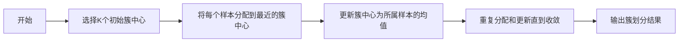

## 1. 背景介绍

在数据科学和机器学习的领域中，聚类算法是一种重要的无监督学习技术，用于发现数据中的内在结构和模式。K-均值聚类（K-means clustering）是最常用的聚类算法之一，它以其简洁性和效率在众多领域得到广泛应用。本文将深入探讨K-均值聚类的原理，并通过代码实例展示其在实际问题中的应用。

## 2. 核心概念与联系

K-均值聚类的核心概念是将数据集中的样本划分为K个簇（cluster），使得同一个簇内的样本相似度高，而不同簇的样本相似度低。这里的“均值”指的是簇内样本的均值点，即簇中心（centroid），它代表了簇内所有样本的中心位置。

### 2.1 簇和簇中心
- **簇（Cluster）**：数据集的一个子集，其中包含相似的元素。
- **簇中心（Centroid）**：簇内所有点的均值位置，代表簇的中心。

### 2.2 相似度和距离度量
- **相似度（Similarity）**：衡量数据点之间相似程度的指标。
- **距离度量（Distance Metric）**：常用的相似度衡量方法，如欧氏距离。

### 2.3 聚类准则
- **聚类准则（Clustering Criterion）**：用于评估聚类质量的标准，K-均值聚类通常使用簇内误差平方和（SSE）最小化作为准则。

## 3. 核心算法原理具体操作步骤

K-均值聚类算法的操作步骤可以用以下流程图表示：



1. **选择K个初始簇中心**：随机选择或使用启发式方法确定初始的K个簇中心。
2. **将每个样本分配到最近的簇中心**：根据距离度量，将每个样本点分配到与其最近的簇中心所在的簇。
3. **更新簇中心为所属样本的均值**：重新计算每个簇的簇中心，即簇内所有样本点的均值。
4. **重复分配和更新直到收敛**：不断重复步骤2和步骤3，直到簇中心不再发生变化，或者达到预设的迭代次数。

## 4. 数学模型和公式详细讲解举例说明

K-均值聚类的目标是最小化簇内误差平方和（SSE），其数学模型可以表示为：

$$
SSE = \sum_{i=1}^{K} \sum_{x \in C_i} ||x - \mu_i||^2
$$

其中，$K$ 是簇的数量，$C_i$ 是第$i$个簇中的样本集合，$x$ 是簇中的样本点，$\mu_i$ 是第$i$个簇的簇中心，$||x - \mu_i||$ 是样本点$x$到簇中心$\mu_i$的欧氏距离。

### 4.1 举例说明

假设有一个二维数据集，我们选择$K=3$，即将数据分为3个簇。初始簇中心随机选取，然后根据上述步骤进行迭代，直到簇中心稳定。每次迭代后，我们计算SSE，并选择SSE最小的划分作为最终的聚类结果。

## 5. 项目实践：代码实例和详细解释说明

在Python中，我们可以使用`sklearn`库中的`KMeans`类来实现K-均值聚类。以下是一个简单的代码实例：

```python
from sklearn.cluster import KMeans
import numpy as np

# 示例数据集
X = np.array([[1, 2], [1, 4], [1, 0],
              [10, 2], [10, 4], [10, 0]])

# 初始化KMeans
kmeans = KMeans(n_clusters=2, random_state=0).fit(X)

# 输出簇中心和簇标签
print("簇中心:\n", kmeans.cluster_centers_)
print("簇标签:\n", kmeans.labels_)
```

### 5.1 代码解释

- `KMeans`类初始化时，`n_clusters`参数指定了簇的数量，`random_state`用于确保可重复性。
- `fit`方法对数据集`X`进行聚类。
- `cluster_centers_`属性包含了最终的簇中心。
- `labels_`属性包含了每个样本点对应的簇标签。

## 6. 实际应用场景

K-均值聚类在许多领域都有广泛的应用，包括但不限于：

- 市场细分：根据消费者行为或偏好将客户分组。
- 图像分割：将图像中的像素聚类以区分不同的对象。
- 文档聚类：对文档进行分组，以便于信息检索和组织。

## 7. 工具和资源推荐

- **Scikit-learn**：一个强大的Python机器学习库，提供了K-均值聚类的实现。
- **NumPy**：用于高效的数值计算，是进行数据预处理和操作的基础。
- **Matplotlib**：用于数据可视化，可以帮助理解聚类结果。

## 8. 总结：未来发展趋势与挑战

K-均值聚类作为一种经典的聚类算法，其简洁高效的特点使其在实际应用中仍然占有一席之地。然而，随着数据量的增加和数据维度的提高，K-均值聚类面临着计算效率和准确性的挑战。未来的发展趋势可能包括算法优化、并行计算以及与其他机器学习技术的结合，以应对大规模高维数据的挑战。

## 9. 附录：常见问题与解答

- **Q1：如何选择合适的K值？**
  - A1：可以使用肘部法则（Elbow Method）或轮廓系数（Silhouette Coefficient）等方法来评估不同K值的聚类效果。

- **Q2：K-均值聚类对初始簇中心的选择敏感吗？**
  - A2：是的，不同的初始簇中心可能导致不同的聚类结果。可以通过多次运行算法并选择最佳结果来缓解这一问题。

- **Q3：K-均值聚类能否处理非球形的簇或不同大小和密度的簇？**
  - A3：K-均值聚类假设簇是球形且具有相似的大小和密度，对于非球形或不同大小和密度的簇，可能需要使用其他聚类算法，如谱聚类或DBSCAN。

作者：禅与计算机程序设计艺术 / Zen and the Art of Computer Programming