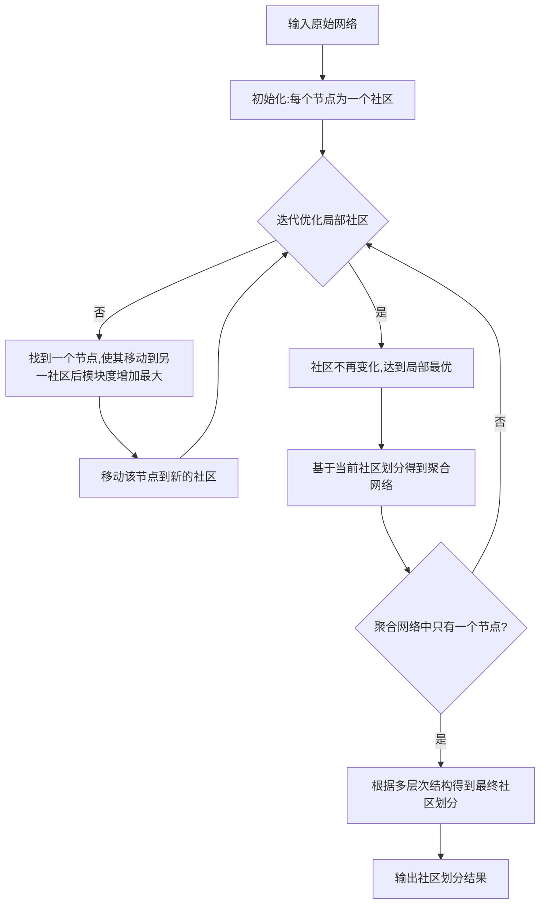
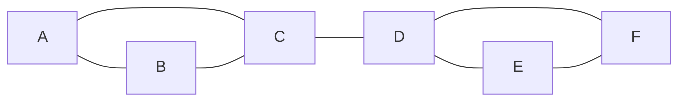

# Louvain社区发现算法原理与代码实例讲解

## 1. 背景介绍
### 1.1 复杂网络中的社区发现问题
在现实世界中,许多复杂系统都可以用复杂网络来建模和表示,如社交网络、引文网络、蛋白质相互作用网络等。在这些复杂网络中,往往存在一些紧密联系的节点群,它们之间的连接比较密集,而与其他部分的连接相对较少,我们称这些子群为社区(community)或模块(module)。社区反映了网络中的一些共性,在现实中有重要意义,例如在社交网络中可以发现具有相同兴趣爱好的群体,在引文网络中可以发现同一领域的论文,在蛋白质相互作用网络中可以识别出功能相关的蛋白质组等。因此,社区发现成为复杂网络研究中的一个重要问题。

### 1.2 社区发现算法概述
社区发现就是要把网络中的节点划分成不同的社区,同一社区内部节点联系紧密,不同社区之间联系相对较少。社区发现可以帮助我们更好地理解复杂网络的结构和功能。目前已经提出了大量的社区发现算法,主要可以分为以下几类:

- 基于图划分的方法:将网络划分为不相交的子图,使得子图内部的边尽可能多,子图之间的边尽可能少。代表算法有Kernighan-Lin算法、谱聚类算法等。
- 基于模块度的方法:模块度(modularity)衡量了社区划分的好坏,模块度越大表示社区内部连接越紧密,社区之间连接越稀疏。很多算法都是通过优化模块度来得到社区划分,如Newman的快速算法、Louvain算法等。 
- 基于动态过程的方法:通过定义节点之间的相似性,模拟一个动态过程使得相似节点最终归于同一社区。代表算法有标签传播算法(LPA)、Markov聚类(MCL)等。
- 基于统计推断的方法:采用概率生成模型刻画网络数据,然后推断模型参数得到社区结构。常见的有随机块模型(SBM)和混合成员模型等。

其中,基于模块度的Louvain算法由于其高效性和对大规模网络的适用性,得到了广泛应用。本文将重点介绍Louvain算法的原理,并通过Python代码实例进行演示说明。

## 2. 核心概念与联系
### 2.1 模块度的定义
模块度(modularity)由Newman等人提出,用于衡量一个社区划分的优劣。直观上,一个好的社区划分应该是:社区内部边的连接非常多,而社区间的边相对较少。模块度 $Q$ 的定义为:

$$Q=\frac{1}{2m}\sum_{i,j} \left(A_{ij}-\frac{k_i k_j}{2m}\right)\delta(c_i,c_j)$$

其中,$A_{ij}$ 表示节点 $i$ 和 $j$ 之间的边的权重(对于无权图,$A_{ij}=1$ 表示有边相连,$A_{ij}=0$ 表示没有边相连);$k_i$ 和 $k_j$ 分别表示节点 $i$ 和 $j$ 的度(与之相连的边数);$m=\frac{1}{2}\sum_{i,j}A_{ij}$ 是图中边的总数; $\delta(c_i,c_j)$ 表示节点 $i$ 和 $j$ 是否属于同一个社区,是的话 $\delta(c_i,c_j)=1$,否则为0。

模块度 $Q$ 的取值在 $[-1,1]$ 之间,$Q$ 越大表示社区划分的质量越高。$Q$ 的意义在于,它度量了社区内部边的数量与随机网络相比多出了多少。如果社区内部边恰好与随机网络一样多,那么 $Q=0$。

### 2.2 最大模块度社区发现
最大模块度社区发现问题就是要找到一个社区划分,使得模块度 $Q$ 达到最大。这是一个NP-hard的组合优化问题。Louvain算法采用了贪心策略,通过不断迭代优化局部社区来得到全局较优的社区划分。

### 2.3 Louvain算法的多层次思想
Louvain算法的一个关键思想是多层次(multi-level)。它先在初始的网络上找到一个局部最优的社区划分,然后基于这个社区划分得到一个更小的聚合网络(将每个社区看作一个节点)。在聚合网络上再次应用社区发现过程,如此迭代,直到模块度不再显著提升。最后将原始网络的节点按照得到的多层次社区结构进行划分,得到最终的社区发现结果。

Louvain算法的多层次过程可以用下面的流程图表示:



## 3. 核心算法原理具体操作步骤
Louvain算法主要分为两个阶段,每个阶段都进行迭代优化,直到满足终止条件:
1. 局部社区优化阶段
- 初始化:将每个节点划分为一个独立的社区。 
- 对于每个节点 $i$,考虑将其移动到其邻居节点所在的社区,选择使模块度增加最大的社区进行移动。
- 重复上述过程,直到每个节点的社区归属不再改变。

2. 聚合网络构建阶段  
- 基于上一阶段得到的社区划分,将每个社区看作一个新的节点,两个新节点之间的边权重等于原社区之间边的权重之和,从而得到一个聚合网络。
- 如果聚合网络不止一个节点,则返回步骤1,在聚合网络上重复上述过程;否则,算法结束。

最后,根据多层次的社区结构,将原始网络的节点进行划分,得到最终的社区发现结果。

## 4. 数学模型和公式详细讲解举例说明
### 4.1 模块度增益的计算
Louvain算法的关键在于如何快速评估一个节点改变社区归属后模块度的变化。令 $\Delta Q$ 表示节点 $i$ 从社区 $C$ 移动到社区 $D$ 后模块度的增益,可以证明 $\Delta Q$ 有以下表达式:

$$\Delta Q=\left[\frac{\sum_{in}+k_{i,in}}{2m}-\left(\frac{\sum_{tot}+k_i}{2m}\right)^2\right]-\left[\frac{\sum_{in}}{2m}-\left(\frac{\sum_{tot}}{2m}\right)^2-\left(\frac{k_i}{2m}\right)^2\right]$$

其中,$\sum_{in}$ 表示社区 $D$ 内部的边权重之和,$\sum_{tot}$ 表示与社区 $D$ 中节点相连的所有边的权重之和,$k_{i,in}$ 表示节点 $i$ 与社区 $D$ 内部节点相连的边的权重之和,$k_i$ 是节点 $i$ 的加权度。

利用这个公式,可以快速计算节点社区归属改变后的模块度变化,避免了重复计算整个网络的模块度。

### 4.2 举例说明
下面以一个简单的网络为例,演示Louvain算法的过程。考虑如下无权图:



初始时,每个节点是一个独立的社区:

```mermaid
graph LR
A((A)) B((B)) C((C)) D((D)) E((E)) F((F))
```

在第一轮迭代中,节点A考虑加入B或C所在的社区。如果加入B的社区,模块度增益为:

$$\Delta Q_{A\rightarrow B}=\left[\frac{1}{2\times 7}-\left(\frac{2+2}{2\times 7}\right)^2\right]-\left[0-\left(\frac{2}{2\times 7}\right)^2-\left(\frac{2}{2\times 7}\right)^2\right]=\frac{1}{14}-\frac{4}{49}=\frac{3}{98}$$

类似地,如果加入C的社区,模块度增益为 $\frac{3}{98}$。A随机选择一个最大增益的社区加入,这里假设加入了B的社区。然后考虑节点C,如果加入A和B所在的社区,模块度增益为:

$$\Delta Q_{C\rightarrow AB}=\left[\frac{3}{2\times 7}-\left(\frac{4+3}{2\times 7}\right)^2\right]-\left[0-\left(\frac{4}{2\times 7}\right)^2-\left(\frac{3}{2\times 7}\right)^2\right]=\frac{9}{98}-\frac{1}{98}=\frac{8}{98}$$

C加入A和B的社区可以使模块度增加,因此C也加入该社区。此时形成两个社区{A,B,C}和{D,E,F},模块度为 $Q=\frac{3}{7}$。

在聚合阶段,将{A,B,C}和{D,E,F}各自看作一个节点,它们之间有1条边相连。以此类推,不断迭代优化和聚合,直到结束。最终得到的社区划分为:{A,B,C}和{D,E,F},总模块度为 $Q=\frac{3}{7}$。

## 5. 项目实践:代码实例和详细解释说明
下面给出Louvain算法的Python实现。使用了Python的igraph库处理图数据和可视化。完整代码如下:

```python
import igraph as ig

def louvain(graph, max_iter=10):
    """
    Louvain算法的主函数,输入一个igraph图,返回社区划分结果
    """
    # 初始化:每个节点为一个社区
    partition = list(range(graph.vcount()))
    
    for _ in range(max_iter):
        # 局部社区优化阶段
        partition = _optimize_local(graph, partition)
        # 聚合网络构建阶段
        graph, partition = _aggregate(graph, partition)
        if graph.vcount() == 1:
            break
    
    return partition

def _optimize_local(graph, partition):
    """
    局部社区优化,返回优化后的社区划分
    """
    modified = True
    while modified:
        modified = False
        for v in range(graph.vcount()):
            max_dq = 0.0
            max_com = partition[v]
            
            # 计算节点v移动到每个邻居社区的模块度增益
            for u in graph.neighbors(v):
                com = partition[u]
                if com != max_com:
                    dq = _modularity_gain(graph, v, com, partition)
                    if dq > max_dq:
                        max_dq = dq
                        max_com = com
            
            # 如果模块度有提升,则移动节点到新的社区
            if max_com != partition[v]:
                partition[v] = max_com
                modified = True
        
    return partition

def _aggregate(graph, partition):
    """
    基于当前社区划分聚合网络,返回聚合后的网络和社区划分
    """
    # 构建社区间边的权重字典
    edges = {}
    for e in graph.es():
        c1 = partition[e.source]
        c2 = partition[e.target]
        if (c1, c2) not in edges:
            edges[(c1,c2)] = 0
        edges[(c1,c2)] += e["weight"]
    
    # 创建聚合网络
    com_graph = ig.Graph(n=len(set(partition)), edges=[])
    com_graph.es["weight"] = []
    for (c1, c2), w in edges.items():
        com_graph.add_edge(c1, c2, weight=w)
    
    # 更新社区编号
    com_partition = [0] * com_graph.vcount()
    for i, c in enumerate(set(partition)):
        for v in [v for v,p in enumerate(partition) if p==c]:
            com_partition[i] = i
    
    return com_graph, com_partition

def _modularity_gain(graph, v, com, partition):
    """
    计算节点v移动