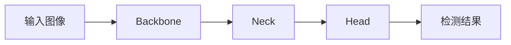
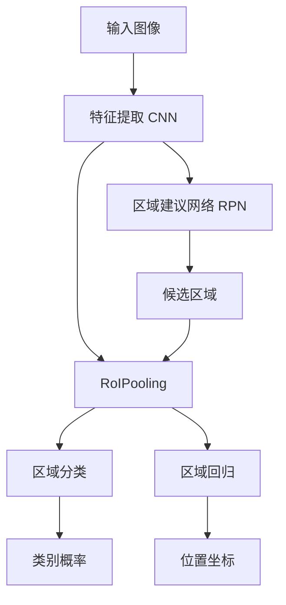

# Object Detection 原理与代码实战案例讲解

## 1. 背景介绍
### 1.1 什么是目标检测
目标检测(Object Detection)是计算机视觉领域的一个重要研究方向,旨在从图像或视频中检测出特定的目标对象,并给出其类别和位置信息。目标检测技术在安防监控、无人驾驶、医学影像分析等领域有广泛应用。

### 1.2 目标检测的发展历程
目标检测技术经历了从传统方法到基于深度学习的方法的发展过程:

- 传统方法:如Viola-Jones人脸检测、HOG+SVM、DPM等,主要基于人工设计的特征和分类器。
- 两阶段检测器:如R-CNN系列,先通过区域建议网络提取候选区域,再对候选区域进行分类和位置回归。
- 单阶段检测器:如YOLO、SSD等,直接在整张图上回归出目标边界框和类别,简化了检测流程,速度更快。
- 基于Anchor-Free的检测器:如CornerNet、CenterNet等,摒弃了预设的锚框,直接学习目标的关键点。

### 1.3 目标检测的技术挑战
尽管目标检测取得了长足进展,但仍面临着诸多技术挑战:

- 尺度变化:目标在图像中的尺寸差异很大,需要模型能够处理不同尺度的目标。
- 形变和遮挡:目标可能发生形变或部分遮挡,给检测带来困难。  
- 类别不平衡:不同类别目标数量差异大,少样本类别的学习是一大挑战。
- 小目标检测:小目标由于分辨率低,信息量少,检测难度大。
- 实时性要求:很多应用场景对检测速度有苛刻要求,如何兼顾精度和速度是一pair trade-off。

## 2. 核心概念与联系
### 2.1 Bounding Box 
Bounding Box表示目标的矩形检测框,用$(x,y,w,h)$的四元组表示,其中$(x,y)$为矩形框左上角坐标,$w$和$h$分别为宽度和高度。

### 2.2 Anchor
Anchor是一组预设的不同尺度和宽高比的矩形框,在图像的每个位置都放置一组Anchor,模型基于Anchor进行分类和回归,从而得到最终的检测框。Anchor一定程度上决定了模型可以检测的目标尺度范围。

### 2.3 Intersection over Union (IoU)
IoU衡量两个矩形框的重叠度,是目标检测中常用的一个指标。设预测框和真实框的面积分别为$S_p$和$S_g$,重叠部分面积为$S_o$,则IoU定义为:

$$IoU = \frac{S_o}{S_p \cup S_g - S_o}$$

IoU常用于训练时的正负样本划分、推理时的非极大值抑制等。

### 2.4 非极大值抑制 (Non-Maximum Suppression, NMS)
NMS是去除冗余检测框的一种常用后处理方法。对于同一目标,模型可能会输出多个高置信度的检测框,NMS基于分类置信度和IoU,只保留置信度最高且与其他检测框IoU小于阈值的检测框,从而得到最终的检测结果。

### 2.5 mAP (mean Average Precision)
mAP是评估目标检测模型性能的常用指标,表示所有类别的平均准确率。对每一类别,在不同置信度阈值下,统计Precision和Recall,绘制PR曲线,计算PR曲线下的面积即为该类别的AP值。mAP即为所有类别AP的平均值。

### 2.6 Backbone、Neck和Head
现代目标检测器一般采用三段式结构:

- Backbone:特征提取网络,常用ResNet、VGG等分类网络。
- Neck:特征融合模块,融合Backbone不同阶段的特征,如FPN。
- Head:检测头,基于融合特征进行分类和回归。

它们的关系如下图所示:



## 3. 核心算法原理具体操作步骤
本节以经典的两阶段检测器Faster R-CNN为例,讲解其核心算法原理和具体步骤。

### 3.1 特征提取
首先使用预训练的CNN网络(如ResNet)对输入图像做特征提取,得到特征图。特征图相比原图尺寸缩小了16倍,但保留了丰富的语义信息。

### 3.2 区域建议网络 (Region Proposal Network, RPN)
RPN在特征图上滑动一个$3\times3$的卷积核,在每个位置上生成$k$个Anchor框(默认$k=9$)。对每个Anchor,RPN输出其是否包含目标的2分类概率和位置偏移量$(dx, dy, dw, dh)$。

RPN的训练采用二分类交叉熵损失和Smooth L1回归损失:

$$L({p_i}, {t_i}) = \frac{1}{N_{cls}} \sum_i L_{cls}(p_i, p_i^*) + \lambda \frac{1}{N_{reg}} \sum_i p_i^* L_{reg}(t_i, t_i^*)$$

其中$p_i$是第$i$个Anchor的目标概率,$t_i$是位置偏移量。

### 3.3 感兴趣区域汇集 (Region of Interest Pooling, RoIPooling)
RPN给出候选区域后,需要对这些区域提取固定长度的特征。RoIPooling将每个候选区域在特征图上的映射区域划分为$H\times W$个网格(如$7\times 7$),对每个网格做最大池化,从而得到固定大小的特征图。

### 3.4 区域分类和回归
对RoIPooling后的特征图,通过全连接层做分类和位置回归。分类支路输出每个类别的概率,回归支路输出相对候选区域的位置偏移量。

Faster R-CNN的整体流程如下:



## 4. 数学模型和公式详细讲解举例说明
本节详细讲解Faster R-CNN中涉及的几个关键数学模型和公式。

### 4.1 Smooth L1损失
位置回归一般使用Smooth L1损失,其定义为:

$$
\text{Smooth}_{L1}(x) = 
\begin{cases}
0.5x^2& \text{if } |x| < 1\\
|x| - 0.5& \text{otherwise}
\end{cases}
$$

相比L2损失,其对离群点、异常值更加鲁棒。以一维情形为例,Smooth L1损失函数图像如下:

<div align="center">

</div>

可见,Smooth L1损失在$[-1,1]$区间内采用L2损失,在区间外采用L1损失,平滑地连接了L1和L2,避免了L2损失对异常值过于敏感的问题。

### 4.2 参数化边界框回归
设候选框坐标为$P=(P_x,P_y,P_w,P_h)$,Ground Truth边界框为$G=(G_x,G_y,G_w,G_h)$,模型学习二者的归一化偏移量$\Delta=(\delta_x,\delta_y,\delta_w,\delta_h)$:

$$
\begin{aligned}
\delta_x &= (G_x - P_x) / P_w \\
\delta_y &= (G_y - P_y) / P_h \\
\delta_w &= \log(G_w / P_w) \\
\delta_h &= \log(G_h / P_h)
\end{aligned}
$$

这种参数化使回归目标更加稳定,有利于模型学习。在推理时,预测的偏移量应用于候选框,即可得到最终的预测框$\hat{G}$:

$$
\begin{aligned}
\hat{G}_x &= \delta_x P_w + P_x \\
\hat{G}_y &= \delta_y P_h + P_y \\
\hat{G}_w &= P_w \exp(\delta_w) \\
\hat{G}_h &= P_h \exp(\delta_h)
\end{aligned}
$$

### 4.3 在线难例挖掘 (Online Hard Example Mining, OHEM)
OHEM是一种提升两阶段检测器性能的训练技巧。传统的训练方式是随机采样固定数量(如128个)的正负样本,但这样容易导致易分样本主导训练,难分样本得不到足够学习。

OHEM在每次迭代时,根据RPN的损失值对所有候选框排序,选取损失最高的样本构成一个小批量进行训练。这种在线难例挖掘机制,使得模型更加聚焦于难分样本,提升检测性能。

设第$i$个候选框的损失为$l_i$,OHEM目标函数可表示为:

$$L_{OHEM} = \frac{1}{N} \sum_{i \in \mathcal{H}} l_i$$

其中$\mathcal{H}$为选取的难例集合,$N$为难例数量。

## 5. 项目实践：代码实例和详细解释说明
本节基于Python和PyTorch,以Faster R-CNN为例,给出目标检测的项目实践代码。

### 5.1 数据准备
首先定义Dataset类,用于加载和预处理VOC数据集:

```python
class VOCDataset(Dataset):
    def __init__(self, root_dir, split='train', transforms=None):
        self.root_dir = root_dir
        self.split = split
        self.transforms = transforms
        
        # 载入图像文件名和标注信息
        self.img_names = ...
        self.annotations = ... 
        
    def __getitem__(self, idx):
        img_path = os.path.join(self.root_dir, 'JPEGImages', self.img_names[idx])
        img = Image.open(img_path).convert('RGB')
        
        boxes, labels = self.parse_voc_xml(self.annotations[idx])
        
        if self.transforms is not None:
            img, boxes, labels = self.transforms(img, boxes, labels)
        
        return img, boxes, labels
    
    def __len__(self):
        return len(self.img_names)
    
    def parse_voc_xml(self, xml_path):
        # 解析VOC格式的标注文件,返回边界框坐标和类别
        ...
        return boxes, labels
```

`__getitem__`方法定义了数据集的读取逻辑,对图像和标注应用数据增强变换,返回图像、边界框和类别。`parse_voc_xml`则从xml文件中解析出边界框和类别信息。

### 5.2 搭建模型
使用FasterRCNN类搭建Faster R-CNN模型,主要包括:

```python
class FasterRCNN(nn.Module):
    def __init__(self, num_classes):
        super(FasterRCNN, self).__init__()
        # Backbone网络,提取特征
        self.backbone = resnet50(pretrained=True)
        
        # 区域建议网络
        self.rpn = RegionProposalNetwork()
        
        # RoIPooling层
        self.roi_pool = RoIPool(output_size=(7,7))
        
        # 分类和回归头
        self.cls_head = nn.Sequential(...)
        self.reg_head = nn.Sequential(...)
        
    def forward(self, images, targets=None):
        # 提取图像特征
        features = self.backbone(images)
        
        # RPN生成候选区域
        proposals, rpn_loss = self.rpn(features, targets)
        
        # RoIPooling
        roi_feats = self.roi_pool(features, proposals)
        
        # 分类和回归
        cls_scores = self.cls_head(roi_feats)
        bbox_preds = self.reg_head(roi_feats)
        
        if self.training:
            losses = self.compute_loss(cls_scores, bbox_preds, targets)
            return losses
        else:
            return self