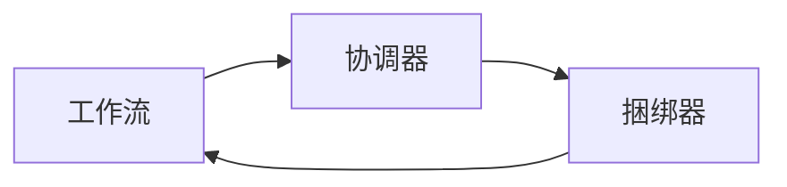

# Oozie原理与代码实例讲解

## 1. 背景介绍
在大数据处理领域，工作流的自动化管理是提高效率、保证数据处理质量的关键。Apache Oozie作为一个开源的工作流调度系统，专为Hadoop作业设计，它可以将多个作业链接起来，按照预定的顺序执行。Oozie的出现极大地简化了复杂作业的管理和调度，使得数据工程师可以更加专注于数据处理逻辑本身。

## 2. 核心概念与联系
Oozie的核心概念包括工作流（Workflow）、协调器（Coordinator）和捆绑器（Bundle）。工作流定义了一系列作业的执行顺序，协调器用于定时触发工作流，而捆绑器则可以管理多个协调器。这些概念之间的联系构成了Oozie的基础架构。



## 3. 核心算法原理具体操作步骤
Oozie的核心算法原理是基于有向无环图（DAG）来定义工作流。每个节点代表一个作业，边代表作业之间的依赖关系。Oozie通过解析工作流定义文件（通常是XML格式），构建DAG，并按照DAG的拓扑顺序执行作业。

操作步骤如下：
1. 编写工作流定义文件。
2. 将工作流定义文件部署到Oozie服务器。
3. 使用Oozie客户端或API触发工作流执行。

## 4. 数学模型和公式详细讲解举例说明
Oozie工作流的数学模型可以用图论中的DAG来表示。例如，一个简单的工作流可能包含三个作业A、B和C，其中A必须在B和C之前执行，但B和C可以并行执行。这可以用以下公式表示：

$$
A \rightarrow \{B, C\}
$$

这意味着作业A的完成是作业B和C开始的前提条件。

## 5. 项目实践：代码实例和详细解释说明
以一个数据清洗和分析的工作流为例，我们需要先执行数据清洗作业，然后并行执行数据分析和数据备份作业。工作流定义文件workflow.xml可能如下所示：

```xml
<workflow-app xmlns="uri:oozie:workflow:0.5" name="data-cleaning-analysis">
    <start to="clean-data"/>
    <action name="clean-data">
        <hive xmlns="uri:oozie:hive-action:0.5">
            <!-- Hive数据清洗作业配置 -->
        </hive>
        <ok to="fork-analysis-backup"/>
        <error to="fail"/>
    </action>
    <fork name="fork-analysis-backup">
        <path start="data-analysis"/>
        <path start="data-backup"/>
    </fork>
    <action name="data-analysis">
        <hive xmlns="uri:oozie:hive-action:0.5">
            <!-- Hive数据分析作业配置 -->
        </hive>
        <ok to="join"/>
        <error to="fail"/>
    </action>
    <action name="data-backup">
        <hive xmlns="uri:oozie:hive-action:0.5">
            <!-- Hive数据备份作业配置 -->
        </hive>
        <ok to="join"/>
        <error to="fail"/>
    </action>
    <join name="join" to="end"/>
    <end name="end"/>
    <kill name="fail">
        <message>Workflow failed, error message[${wf:errorMessage(wf:lastErrorNode())}]</message>
    </kill>
</workflow-app>
```

在这个例子中，`<start>`、`<action>`、`<fork>`、`<join>`和`<end>`元素定义了工作流的结构。`<hive>`元素指定了Hive作业的具体配置。

## 6. 实际应用场景
Oozie广泛应用于数据仓库管理、日志处理、数据挖掘等场景。在电商平台，Oozie可以用于每日销售数据的汇总和分析；在社交网络中，它可以用于用户行为日志的处理和洞察挖掘。

## 7. 工具和资源推荐
- Oozie官方文档：提供详细的安装指南、用户手册和API文档。
- Hue：一个Web界面，可以更方便地管理和监控Oozie工作流。
- Oozie Workflow Generator：一个工具，可以帮助生成Oozie工作流定义文件。

## 8. 总结：未来发展趋势与挑战
随着云计算和容器技术的发展，Oozie也在逐步向云原生和Kubernetes集成方向发展。未来的挑战包括提高可扩展性、支持更多种类的作业类型和更紧密的云服务集成。

## 9. 附录：常见问题与解答
Q1: Oozie是否支持跨集群的工作流调度？
A1: 是的，Oozie可以配置为支持跨Hadoop集群的作业调度。

Q2: 如何监控Oozie工作流的执行状态？
A2: 可以通过Oozie的Web UI或使用Oozie提供的命令行工具来监控工作流状态。

Q3: Oozie工作流执行失败如何处理？
A3: 需要检查Oozie工作流的日志，定位错误原因，并根据错误信息进行调整和重试。

作者：禅与计算机程序设计艺术 / Zen and the Art of Computer Programming