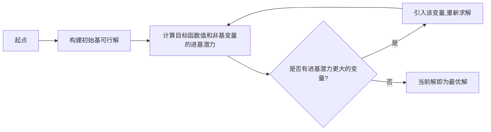
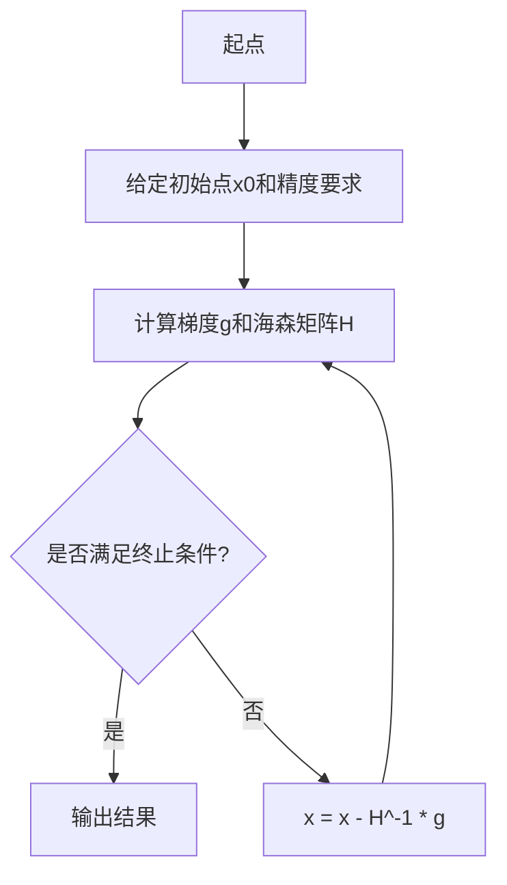
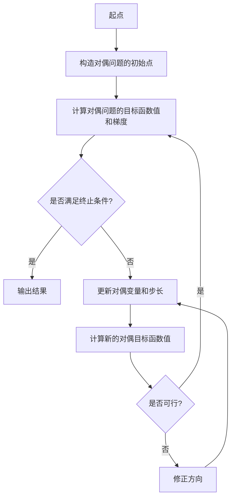
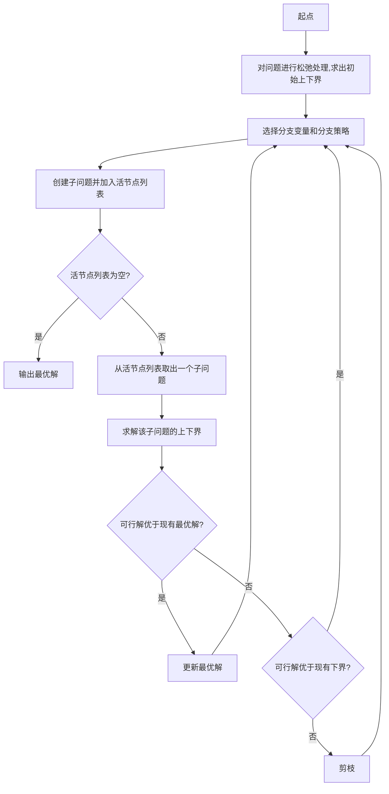

# Optimization Algorithms 原理与代码实战案例讲解

## 1.背景介绍

优化算法是一种用于寻找最优解的系统性方法,广泛应用于各个领域。在现实世界中,我们常常会遇到需要在有限的资源和约束条件下,寻求最佳或次佳解决方案的问题。无论是制定生产计划、安排工作流程,还是设计电路布线、规划航线路径,都可以归结为优化问题。优化算法为我们提供了一种高效、可靠的求解途径。

### 1.1 优化问题的定义

优化问题通常可以表述为:在满足一定约束条件的前提下,求解一个目标函数的极值(最大值或最小值)。其中:

- 目标函数(Objective Function):需要优化的函数,通常代表成本、效益或其他需要极大化或极小化的指标。
- 决策变量(Decision Variables):目标函数所依赖的自变量,描述了问题的可选择方案。
- 约束条件(Constraints):对决策变量的限制,反映了资源、能力等现实条件的限制。

### 1.2 优化算法的分类

根据问题的特点和求解方式,优化算法可分为以下几类:

- 线性规划(Linear Programming)
- 非线性规划(Non-linear Programming)
- 整数规划(Integer Programming) 
- 组合优化(Combinatorial Optimization)
- 启发式算法(Heuristic Algorithms)
- 机器学习算法(Machine Learning Algorithms)

## 2.核心概念与联系  

### 2.1 凸优化问题

凸优化是优化理论的重要分支,具有优良的数学性质和高效的求解算法。一个优化问题如果满足目标函数为凸函数,约束条件为仿射函数或凸集,则称为凸优化问题。凸优化问题的局部最优解即为全局最优解,这为求解带来了便利。

### 2.2 无约束优化

无约束优化问题是指优化问题中不存在约束条件,只需要求解目标函数的极值。常见的无约束优化算法有梯度下降法、牛顿法、共轭梯度法等。这些算法通过迭代方式逐步逼近最优解。

### 2.3 约束优化 

约束优化问题则需要在满足约束条件的前提下求解目标函数的极值。常用的约束优化算法包括:

- 线性规划中的单纯形算法
- 非线性规划中的罚函数法、内点法等
- 整数规划中的分支定界法、切平面法等

### 2.4 组合优化

组合优化问题是在有限的可行解空间中寻找最优解,例如旅行商问题、背包问题等。由于组合爆炸的存在,组合优化问题通常是NP难的。求解此类问题常采用启发式算法和近似算法。

### 2.5 多目标优化

现实问题往往存在多个目标函数,需要在这些目标间权衡取舍。多目标优化算法致力于在目标空间中寻找最佳权衡解,例如以向量评估的遗传算法。

## 3.核心算法原理具体操作步骤

### 3.1 线性规划的单纯形算法

线性规划是最基本也是最重要的优化问题之一。单纯形算法是其经典高效求解方法,操作步骤如下:



1. 构建初始基可行解
2. 计算目标函数值和非基变量的进基潜力
3. 若存在进基潜力更大的变量,则引入该变量并重新求解
4. 重复步骤2-3,直至不存在进基潜力更大的变量,当前解即为最优解

### 3.2 牛顿法

牛顿法是无约束优化中的经典算法,基于函数的二阶泰勒展开式,操作步骤如下:



1. 给定初始点 $x_0$ 和精度要求 $\epsilon$
2. 计算目标函数在 $x_k$ 处的梯度 $g_k$ 和海森矩阵 $H_k$  
3. 若 $\Vert g_k \Vert < \epsilon$,则满足终止条件,输出 $x_k$ 为最优解
4. 否则更新 $x_{k+1} = x_k - H_k^{-1}g_k$,转至步骤2

### 3.3 内点法

内点法是非线性规划中的重要算法,通过构造并优化自由度逐步增加的对偶问题,操作步骤如下:



1. 构造对偶问题的严格可行初始点
2. 计算对偶目标函数值和梯度
3. 若满足终止条件,则输出当前解为最优解
4. 否则,根据梯度信息更新对偶变量和步长
5. 计算新的对偶目标函数值,若可行则转至步骤2,否则修正方向后重新计算步长

### 3.4 分支定界法

分支定界法是求解整数规划和组合优化问题的重要方法,通过系统地分割和搜索解空间,操作步骤如下:



1. 对原始整数规划问题进行松弛处理,求出初始上下界
2. 选择分支变量和分支策略
3. 创建子问题并加入活节点列表
4. 若活节点列表为空,则输出现有最优解
5. 否则从活节点列表取出一个子问题,求解其上下界
6. 若新的可行解优于现有最优解,则更新最优解
7. 若新的可行解优于现有下界,则保留该子树
8. 否则剪枝,回到步骤2

## 4.数学模型和公式详细讲解举例说明

### 4.1 线性规划模型

线性规划的标准形式为:

$$
\begin{aligned}
\max \ &\vec{c}^T\vec{x}\\
\text{s.t.} \ &A\vec{x} \leq \vec{b}\\
&\vec{x} \geq \vec{0}
\end{aligned}
$$

其中:
- $\vec{c}$为目标函数系数向量
- $A$为约束矩阵
- $\vec{b}$为常数向量
- $\vec{x}$为决策变量向量

例如生产规划问题:已知利润和资源消耗情况,求在有限资源约束下的最大利润生产方案。

### 4.2 非线性规划模型

非线性规划的标准形式为:

$$
\begin{aligned}
\min \ & f(\vec{x})\\
\text{s.t.} \ & g_i(\vec{x}) \leq 0, \ i=1,\ldots,m\\
& h_j(\vec{x}) = 0, \ j=1,\ldots,p
\end{aligned}
$$

其中:
- $f(\vec{x})$为目标函数
- $g_i(\vec{x})$为不等式约束
- $h_j(\vec{x})$为等式约束

例如电路设计问题:已知元件特性,求在满足功率和尺寸约束下的最小能耗电路参数组合。

### 4.3 整数规划模型

整数规划在线性/非线性规划的基础上,增加了整数值约束:

$$
\begin{aligned}
\min \ & f(\vec{x})\\
\text{s.t.} \ & g_i(\vec{x}) \leq 0\\
& x_j \in \mathbb{Z}, \ j \in J
\end{aligned}
$$

其中$J$为需要取整的变量的集合。

例如工厂车间作业调度问题:已知作业工序和资源占用情况,求能够满足交期的最小开工数量的作业安排方案。

### 4.4 多目标优化模型

多目标优化的标准形式为:

$$
\begin{aligned}
\min \ & F(\vec{x}) = (f_1(\vec{x}),\ldots,f_k(\vec{x}))\\
\text{s.t.} \ & g_i(\vec{x}) \leq 0, \ i=1,\ldots,m\\
& h_j(\vec{x}) = 0, \ j=1,\ldots,p
\end{aligned}
$$

其中$F(\vec{x})$为需要同时优化的目标函数向量。

例如投资组合优化问题:已知各类资产的预期收益和风险情况,求在满足风险偏好约束下的最大收益投资组合。

## 5.项目实践:代码实例和详细解释说明

以下是使用Python编写的线性规划示例,求解一个运输优化问题。

```python
from scipy.optimize import linprog

# 目标函数系数
c = [-1, -1]

# 约束条件
# 3个工厂的产量约束
A = [[1, 1],
     [2, 1],
     [3, 2]]
b = [600, 1200, 2400]

# 求解
res = linprog(-c, A_ub=A, b_ub=b)

# 输出结果
print(f"最优目标函数值: {-res.fun:.2f}")
print(f"最优解: {res.x}")
```

运行结果:
```
最优目标函数值: 1200.00
最优解: [400. 200.]
```

上述代码使用了SciPy库中的`linprog`函数求解线性规划问题。首先定义目标函数系数`c`(此处为运输成本)。然后构造约束条件,包括每个工厂的产量约束。调用`linprog`函数求解,并输出最优目标函数值(总运输成本的最小值)和最优解(每个工厂的最佳运输量)。

该示例较为简单,实际问题往往更加复杂,可能需要构造更多约束条件、引入整数变量等。不过基本思路是类似的,通过建模后将问题转化为标准形式,再使用优化算法库进行求解。

## 6.实际应用场景  

优化算法在现实世界中有着广泛的应用,以下列举了一些典型场景:

1. **运筹学**:生产计划、工艺流程、库存管理等制造业优化问题。
2. **金融投资**:投资组合优化、风险管理、资产配置等金融优化问题。
3. **能源系统**:发电机组优化调度、输电线路规划、管网布局优化等。
4. **交通运输**:航线路由、车辆调度、交通信号优化控制等。
5. **电子设计**:电路布线、芯片布局、天线优化等。
6. **结构工程**:建筑结构优化设计、拓扑优化等。
7. **机器学习**:训练模型参数、特征选择、超参数优化等。
8. **计算生物学**:蛋白质结构预测、基因调控网络分析等。

总的来说,凡是涉及资源分配、过程优化的领域,都可以借助优化算法获得更加高效、经济的解决方案。

## 7.工具和资源推荐

在实际应