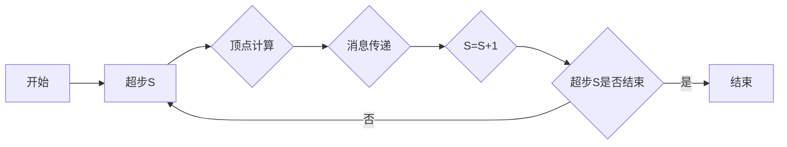

## 1.背景介绍

在大数据处理领域，图计算是一个重要的研究领域。Pregel是Google于2010年提出的一种面向大规模图计算的框架，它以顶点为中心的计算模型简化了大规模图计算的复杂性。本文将详细介绍Pregel的原理，并通过代码实例进行讲解。

## 2.核心概念与联系

Pregel采用了Bulk Synchronous Parallel (BSP)模型，每个顶点都可以执行相同的用户定义函数，对其邻接顶点发送消息，然后在下一个超步（superstep）中接收消息。每个超步包含了顶点的计算和消息的传递两个阶段。



## 3.核心算法原理具体操作步骤

Pregel的执行流程分为以下几个步骤：

1. 初始化：每个顶点读取其本地值和边，执行用户定义的初始化函数。
2. 超步循环：在每个超步中，每个顶点都会接收上一超步中发送的消息，然后根据这些消息和自身的状态进行计算，并可能向其邻接顶点发送消息，或者修改其边的值。如果一个顶点在某个超步中没有收到消息，并且也不发送消息，那么它将在下一个超步中变为非活跃状态，不再参与计算。
3. 终止检测：当所有顶点都变为非活跃状态，并且没有未处理的消息时，算法结束。

## 4.数学模型和公式详细讲解举例说明

Pregel的数学模型可以用图的形式表示，图$G=(V, E)$由顶点集$V$和边集$E$组成。每个顶点$v$都有一个唯一的标识符和一个用户定义的值，每个边$e$都包含一个源顶点、一个目标顶点和一个用户定义的值。

Pregel的计算过程可以用如下公式表示：

$$
M^{(t+1)}(v) = \bigcup_{u \in N(v)} m^{(t)}(u, v)
$$

其中，$M^{(t)}(v)$表示在$t$时刻顶点$v$收到的消息集合，$N(v)$表示$v$的邻接顶点集合，$m^{(t)}(u, v)$表示在$t$时刻顶点$u$发送给顶点$v$的消息。

## 5.项目实践：代码实例和详细解释说明

下面通过一个简单的Pregel程序来说明其工作原理，这个程序的目标是计算每个顶点的出度。

```java
public class OutDegreeCount extends BasicComputation<
    LongWritable, LongWritable, NullWritable, LongWritable> {

  @Override
  public void compute(
      Vertex<LongWritable, LongWritable, NullWritable> vertex,
      Iterable<LongWritable> messages) {
    if (getSuperstep() == 0) {
      sendMessageToAllEdges(vertex, new LongWritable(1));
    } else {
      long outDegree = 0;
      for (LongWritable msg : messages) {
        outDegree += msg.get();
      }
      vertex.getValue().set(outDegree);
      vertex.voteToHalt();
    }
  }
}
```

在这个程序中，每个顶点在第0个超步向其所有邻接顶点发送消息1，然后在第1个超步中接收消息并计算消息的总和，得到的结果就是其出度。

## 6.实际应用场景

Pregel在处理大规模图数据时具有很高的效率，因此在社交网络分析、网络结构挖掘、机器学习等领域都有广泛的应用。

## 7.工具和资源推荐

Apache Giraph是一个开源的Pregel实现，提供了丰富的接口和功能，是进行图计算的优秀工具。

## 8.总结：未来发展趋势与挑战

随着大数据的发展，图计算的重要性日益突出。Pregel作为一个有效的图计算框架，将在未来的大数据处理中发挥更大的作用。但同时，Pregel的一些限制，如对图的全局信息处理不足，也需要进一步的研究和改进。

## 9.附录：常见问题与解答

1. Pregel如何处理图的全局信息？

Pregel的计算模型是顶点为中心的，每个顶点只能处理和发送局部信息，对于全局信息的处理不足。一种解决方法是使用累加器进行全局信息的收集和处理。

2. Pregel如何处理动态图？

Pregel的计算过程是静态的，不支持图的动态变化。但用户可以通过修改顶点和边的值来模拟图的动态变化。

作者：禅与计算机程序设计艺术 / Zen and the Art of Computer Programming