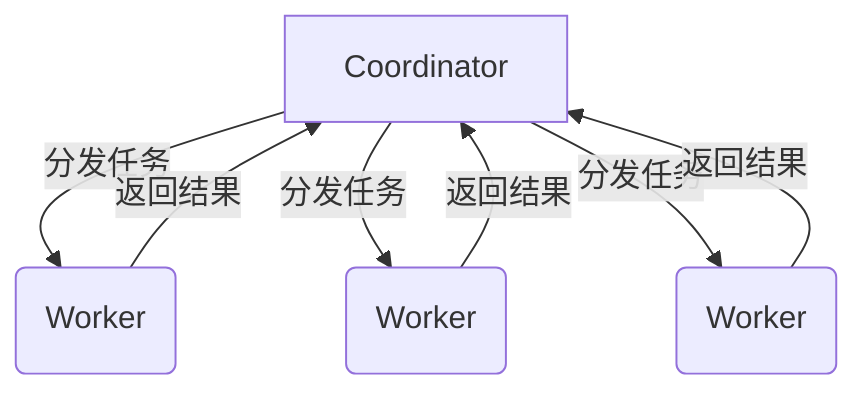

# Presto原理与代码实例讲解

## 1.背景介绍

在当今大数据时代，数据分析和查询已经成为企业和组织的一项关键任务。传统的数据库系统往往无法满足对大规模数据集进行快速、高效查询的需求。这就催生了一种新型的大数据查询引擎——Presto。

Presto是一个开源的大数据分布式SQL查询引擎,最初由Facebook公司开发和使用。它旨在查询各种不同的数据源,包括Hive、Cassandra、关系数据库和专有数据存储。Presto的主要目标是以低延迟和高吞吐量的方式查询大数据,使用户能够快速访问和分析数据。

Presto的核心思想是将计算过程尽可能地向数据源推送,而不是将大量数据加载到中间存储区进行处理。这种设计理念使得Presto在处理大规模数据集时表现出色,能够充分利用现有的分布式存储和计算资源。

## 2.核心概念与联系

### 2.1 Presto架构概览

Presto采用主从架构,由一个协调器(Coordinator)和多个工作节点(Worker)组成。协调器负责解析SQL查询、制定查询计划并将任务分发给工作节点。工作节点则执行实际的数据处理和计算工作。



### 2.2 查询执行流程

1. 客户端提交SQL查询到Coordinator
2. Coordinator解析SQL,生成分布式查询计划
3. Coordinator将查询任务分发给Worker节点
4. Worker节点读取数据源,执行计算并返回结果
5. Coordinator汇总Worker结果,返回给客户端

### 2.3 核心组件

- **Coordinator**：负责查询管理、解析SQL、生成查询计划、分发任务等。
- **Worker**：执行实际的数据处理和计算工作。
- **Metadata**：存储数据源元数据信息,如表结构、分区等。
- **Execution**：执行查询计划,管理Worker资源。
- **Connector**：连接不同数据源,读取和写入数据。

## 3.核心算法原理具体操作步骤  

### 3.1 查询优化

Presto在查询执行前会进行一系列优化,以提高查询效率:

1. **谓词下推(Predicate Pushdown)**:将查询条件下推到数据源,避免读取不需要的数据。

2. **投影列剪裁(Column Pruning)**:只读取查询需要的列,减少数据传输量。

3. **分区剪裁(Partition Pruning)**:根据分区条件过滤不需要的分区,减少读取数据量。

4. **成本优化(Cost-Based Optimization)**:根据数据统计信息选择最优的查询计划。

5. **并行执行(Parallel Execution)**:利用多个Worker并行执行查询任务。

### 3.2 数据处理

Presto采用了向量化执行和代码生成等技术,提高了数据处理效率:

1. **向量化执行(Vectorized Execution)**:以向量(batch)的形式处理数据,减少函数调用开销。

2. **代码生成(Code Generation)**:根据查询计划生成高度优化的代码,避免解释执行的开销。

3. **内存管理(Memory Management)**:高效利用内存,避免不必要的内存拷贝和GC开销。

4. **数据交换(Data Exchange)**:在Worker间高效传输数据,支持广播(Broadcast)和哈希分区(Hash Partitioning)等策略。

## 4.数学模型和公式详细讲解举例说明

在查询优化和执行过程中,Presto会利用一些数学模型和公式进行成本估算和资源分配。

### 4.1 查询成本模型

Presto使用基于成本的优化器(Cost-Based Optimizer)选择最优的查询计划。成本模型主要考虑以下几个方面:

- $Cost_{read}$:读取数据的成本,与读取数据量成正比。
- $Cost_{network}$:网络传输成本,与传输数据量成正比。
- $Cost_{cpu}$:CPU计算成本,与计算复杂度和数据量有关。
- $Cost_{memory}$:内存使用成本,与中间数据量有关。

总成本可以表示为:

$$Cost_{total} = Cost_{read} + Cost_{network} + Cost_{cpu} + Cost_{memory}$$

优化器会估算不同查询计划的总成本,选择成本最小的计划执行。

### 4.2 资源分配模型

Presto需要在多个Worker节点之间合理分配资源,以充分利用集群计算能力。资源分配主要考虑以下因素:

- 数据位置:尽量将计算任务分配到存储相应数据的节点。
- 节点负载:根据节点的CPU、内存、网络等负载情况进行任务调度。
- 数据倾斜:避免个别节点处理过多数据导致负载过高。

令$w_i$表示第$i$个Worker节点的权重,可由CPU、内存等资源情况计算得到。对于一个查询任务,可将其划分为$n$个子任务,其中第$i$个子任务的权重为$t_i$。则第$i$个Worker分配到的子任务数量$x_i$可由以下公式计算:

$$x_i = \frac{t_i \times w_i}{\sum_{j=1}^{n}t_j}$$

该公式保证了按照节点权重对任务进行加权分配,从而实现负载均衡。

## 5.项目实践:代码实例和详细解释说明

接下来,我们通过一个简单的示例来演示如何使用Presto进行数据查询。我们将查询一个存储在Hive中的表,并对查询结果进行过滤和聚合操作。

### 5.1 准备工作

首先,我们需要启动Presto集群。可以使用Docker快速启动一个单节点的Presto实例:

```bash
docker run -p 8080:8080 prestosql/presto
```

然后,我们创建一个Hive表作为示例数据源。这里我们使用一个存储员工信息的表`employees`:

```sql
CREATE TABLE employees (
  emp_no INT,
  birth_date DATE,
  first_name STRING,
  last_name STRING,
  gender STRING,
  hire_date DATE
)
ROW FORMAT DELIMITED
FIELDS TERMINATED BY ','
STORED AS TEXTFILE;

LOAD DATA LOCAL INPATH '/path/to/employees.txt' OVERWRITE INTO TABLE employees;
```

### 5.2 使用Presto查询

现在,我们可以使用Presto的命令行客户端连接到集群并执行SQL查询:

```bash
presto --server localhost:8080 --catalog hive --schema default
```

我们首先查询所有员工的姓名和性别:

```sql
SELECT first_name, last_name, gender FROM employees;
```

接下来,我们过滤出1990年之后入职的女性员工,并按照入职日期对结果进行排序:

```sql
SELECT first_name, last_name, hire_date
FROM employees
WHERE gender = 'F' AND hire_date >= '1990-01-01'
ORDER BY hire_date;
```

最后,我们统计每个性别的员工数量:

```sql
SELECT gender, COUNT(*) AS count
FROM employees
GROUP BY gender;
```

### 5.3 代码解释

让我们来解释一下上面示例中的SQL查询:

1. `SELECT first_name, last_name, gender FROM employees;`
   - 这条查询从`employees`表中选择`first_name`、`last_name`和`gender`三列。
   - Presto会读取整个表的数据,并将结果返回给客户端。

2. ```sql
   SELECT first_name, last_name, hire_date
   FROM employees
   WHERE gender = 'F' AND hire_date >= '1990-01-01'
   ORDER BY hire_date;
   ```
   - 该查询首先使用`WHERE`子句过滤出性别为`'F'`且入职日期大于等于`1990-01-01`的员工记录。
   - 然后,使用`ORDER BY`子句按照`hire_date`列对结果进行排序。
   - Presto会将谓词(`gender = 'F'`和`hire_date >= '1990-01-01'`)下推到Hive数据源,只读取满足条件的数据,从而减少了数据传输量。

3. ```sql
   SELECT gender, COUNT(*) AS count
   FROM employees
   GROUP BY gender;
   ```
   - 这条查询按照`gender`列对员工记录进行分组,并使用`COUNT(*)`计算每个组的记录数量。
   - Presto会在Worker节点上并行执行聚合操作,最后将结果合并并返回给客户端。

通过这些示例,我们可以看到Presto提供了标准的SQL语法,能够方便地查询和分析数据。同时,Presto在查询执行过程中会自动应用多种优化策略,以提高查询效率。

## 6.实际应用场景

Presto凭借其高效的查询能力,在多个领域得到了广泛应用:

1. **交互式分析**:Presto可以快速响应adhoc查询,支持数据探索和交互式分析。
2. **报表和仪表板**:使用Presto生成各种报表和仪表板,提供实时的业务数据分析。
3. **数据湖分析**:通过连接Hive、HDFS等数据源,高效查询数据湖中的数据。
4. **ETL(Extraction,Transformation,Loading)**:利用Presto进行数据抽取、转换和加载。
5. **机器学习特征工程**:从大规模数据中提取特征,为机器学习模型做准备。

## 7.工具和资源推荐

以下是一些有用的Presto工具和学习资源:

- **Presto UI**:Presto自带的Web UI,可查看集群状态、查询执行情况等。
- **Presto CLI**:命令行客户端,方便执行SQL查询。
- **Presto JDBC驱动**:支持使用JDBC连接Presto,可与BI工具集成。
- **Presto官方文档**:https://prestodb.io/docs/current/
- **Presto源代码**:https://github.com/prestodb/presto
- **Presto Slack社区**:https://prestosql.slack.com/

## 8.总结:未来发展趋势与挑战

Presto自诞生以来,已经成为大数据分析领域的佼佼者。然而,随着数据量和查询复杂度的不断增加,Presto仍然面临一些挑战和发展方向:

1. **查询优化**:持续优化查询执行引擎,提高查询效率和资源利用率。
2. **数据源连接**:支持更多数据源,如云存储、NoSQL数据库等。
3. **安全性和权限管理**:增强安全性,提供细粒度的权限控制。
4. **集群管理和监控**:提供更好的集群管理和监控工具。
5. **机器学习支持**:为机器学习工作负载提供优化和加速。

总的来说,Presto将继续发展,以满足不断增长的大数据分析需求,为用户提供更快、更智能的查询能力。

## 9.附录:常见问题与解答

1. **Presto与Hive/Spark的区别是什么?**

   Presto是一个专门为交互式分析而设计的查询引擎,侧重于低延迟和高吞吐量。相比之下,Hive更适合批处理工作负载,而Spark则是一个通用的数据处理引擎。

2. **Presto如何处理数据倾斜问题?**

   Presto采用了多种策略来缓解数据倾斜,包括动态分区剪裁、重新分区等。此外,Presto还提供了一些配置参数,允许用户根据需要调整相关策略。

3. **如何监控Presto集群的状态?**

   Presto自带了Web UI,可以查看集群节点、查询执行情况等信息。此外,Presto还提供了JMX指标,可与监控工具(如Prometheus)集成。

4. **Presto支持哪些数据源?**

   Presto支持多种数据源,包括Hive、HDFS、MySQL、PostgreSQL、Cassandra、Kafka等。用户也可以开发自定义连接器,连接其他数据源。

5. **如何提高Presto的查询性能?**

   优化查询性能的一些技巧包括:合理利用分区和bucketing、避免不必要的shuffle操作、适当使用缓存、调整内存和并行度配置等。

作者: 禅与计算机程序设计艺术 / Zen and the Art of Computer Programming