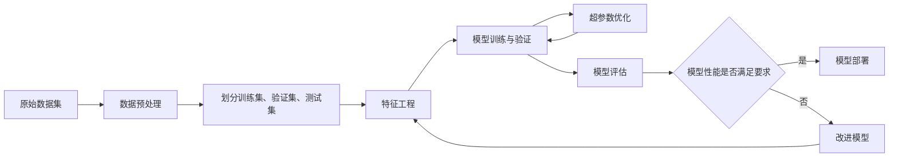

# Python机器学习实战：模型评估与验证的最佳策略

## 1.背景介绍
### 1.1 机器学习模型评估与验证的重要性
在机器学习项目中,模型评估与验证是至关重要的一环。它能够帮助我们客观地衡量模型的性能,发现模型的优缺点,进而指导我们改进模型。如果缺乏合理的评估与验证策略,我们很可能陷入过拟合或欠拟合的陷阱,导致模型在实际应用中表现不佳。

### 1.2 评估与验证面临的挑战
机器学习模型的评估与验证并非易事。我们需要考虑诸多因素,例如:

- 选择合适的评估指标。不同的任务需要关注不同的指标,比如分类任务常用准确率、召回率等,而回归任务常用均方误差、R平方等。
- 合理划分训练集、验证集和测试集。我们要尽量避免数据泄露,即在训练时使用到了验证集或测试集的信息。  
- 采用恰当的交叉验证方法。常见的有k折交叉验证、留一交叉验证等,它们各有优缺点。
- 模型选择与超参数调优。我们需要在验证集上比较不同模型和参数的性能,从而选出最优的模型。

### 1.3 本文的主要内容
本文将重点介绍Python机器学习中模型评估与验证的最佳实践。内容涵盖:

- 机器学习常用的评估指标
- 数据集划分与交叉验证方法  
- 网格搜索与随机搜索等超参数优化技术
- 模型评估与验证的代码实战
- 评估结果的解读与模型改进策略

通过学习本文,你将掌握在Python机器学习项目中评估与验证模型的一整套流程和方法,并能够运用到实战中去。

## 2. 核心概念与联系
### 2.1 模型评估
模型评估(Model Evaluation)是指用某种评估指标来度量模型的预测性能。常见的评估指标有:

- 分类任务:准确率(Accuracy)、精确率(Precision)、召回率(Recall)、F1分数、ROC曲线下面积(AUC)等。
- 回归任务:平均绝对误差(MAE)、均方误差(MSE)、均方根误差(RMSE)、R平方(R-Squared)等。

模型评估可以帮助我们了解模型的优劣,但单一的指标往往不足以全面评价模型。我们需要结合任务的特点,综合考虑多个指标。

### 2.2 模型验证 
模型验证(Model Validation)是指用独立的数据集来评估模型的泛化性能。通常做法是将数据划分为训练集、验证集和测试集。其中:

- 训练集(Training Set):用于训练模型的数据。
- 验证集(Validation Set):用于评估不同模型和超参数的性能,并选择最优的模型。
- 测试集(Test Set):用于评估模型的泛化能力,不能用于调参和选模型。

交叉验证(Cross Validation)是一种常用的验证方法。它将数据分成k份,每次取其中1份作为验证集,其余k-1份作为训练集,最后取k次结果的平均值。这样可以减少数据划分的随机性。

### 2.3 超参数优化
超参数优化(Hyperparameter Optimization)是指搜索模型的最优超参数组合,使模型在验证集上的性能最好。常见的搜索方法有:

- 网格搜索(Grid Search):穷举所有参数组合。
- 随机搜索(Random Search):随机采样参数组合。
- 贝叶斯优化(Bayesian Optimization):建模参数与性能的关系,引导下一步的采样。

超参数优化可以自动找到较优的参数,提高模型性能,减少人工调参的成本。

### 2.4 概念之间的联系
下图展示了模型评估、验证与超参数优化之间的关系:

可见,模型评估贯穿机器学习的整个流程。我们先用训练集训练模型,再用验证集评估模型,并进行超参数优化。得到最优模型后,再用测试集做最终评估。如果模型性能不够好,我们需要分析原因,并从数据预处理、特征工程、模型选择等方面进行改进,不断迭代。

## 3. 核心算法原理与具体操作步骤
本节我们将详细介绍几种常用的模型评估与验证方法,包括留出法、k折交叉验证、分层k折交叉验证等。同时,我们也会讲解网格搜索、随机搜索等超参数优化算法的原理和使用方法。

### 3.1 留出法(Hold-Out)
留出法是最基本的模型验证方法。其步骤为:

1. 将原始数据集按一定比例(如7:3)随机划分为训练集和测试集。 
2. 用训练集训练模型,用测试集评估模型性能。

留出法操作简单,但有以下缺点:

- 数据利用率低,测试集不能用于训练。
- 划分的随机性会影响评估结果的稳定性。
- 对于数据量小的情况,评估结果可能有较大偏差。

### 3.2 k折交叉验证(k-Fold Cross Validation)
k折交叉验证是处理留出法缺点的一种改进方法。其步骤为:

1. 将原始数据集平均分成k份。
2. 每次取其中1份作为验证集,其余k-1份作为训练集。
3. 重复步骤2共k次,得到k个模型和k个评估结果。
4. 对k个评估结果取平均,作为最终的评估指标。

相比留出法,k折交叉验证有以下优点:

- 每个样本都被用作训练集和验证集,数据利用率高。
- 随机性对评估结果的影响小,结果更稳定。
- 适合小数据量的情况。

但k折交叉验证的计算开销比留出法大,因为要训练k个模型。一般k取5或10。

### 3.3 分层k折交叉验证(Stratified k-Fold)
对于分类任务,如果各类别的样本数量不平衡,普通的k折交叉验证可能会导致某些折的验证集中缺少小类别的样本。为了保证每折的类别分布与原始数据集一致,我们可以使用分层k折交叉验证。

其思路是在划分数据集时,先按类别划分,再在每个类别内部做k折划分,最后把各类别的k折结果组合起来。这样,每折的类别分布就与原始数据集一致了。

### 3.4 网格搜索(Grid Search)
网格搜索是一种穷举式的超参数优化方法。其步骤为:

1. 指定每个超参数的候选值。
2. 列举所有超参数组合,形成一个"网格"。
3. 对每个超参数组合,用交叉验证评估模型性能。
4. 选取性能最优的超参数组合。

网格搜索的优点是简单直观,缺点是计算量大,尤其当超参数数量多、候选值多时,搜索空间会指数级增长。

### 3.5 随机搜索(Random Search)  
随机搜索是一种改进的超参数优化方法。与网格搜索不同,它不列举所有参数组合,而是按照某种分布(如均匀分布)随机采样参数组合。这样可以在有限的搜索次数内,覆盖更广的参数空间。

随机搜索通常比网格搜索更高效,尤其在超参数数量多的情况下。但它的缺点是无法保证找到全局最优的参数组合。

### 3.6 算法选择建议
- 如果数据量较大(如大于1万),可以优先考虑留出法。
- 如果数据量较小,优先考虑k折交叉验证。分类任务推荐分层k折交叉验证。
- 如果超参数数量较少(如小于4个),可以考虑网格搜索。 
- 如果超参数数量较多,推荐使用随机搜索。

当然,具体的选择还要根据任务的特点、时间和计算资源的限制等因素综合考虑。

## 4. 数学模型和公式详细讲解举例说明
本节我们将详细讲解几个常用的模型评估指标的数学定义和计算公式,并给出具体的例子加以说明。

### 4.1 分类任务评估指标
#### 4.1.1 准确率(Accuracy)
准确率衡量的是分类器预测正确的样本数占总样本数的比例。其公式为:

$$Accuracy = \frac{TP+TN}{TP+TN+FP+FN}$$

其中,TP、TN、FP、FN分别表示:

- TP(True Positive):真阳性,即实际为正例且预测为正例的样本数。
- TN(True Negative):真阴性,即实际为负例且预测为负例的样本数。
- FP(False Positive):假阳性,即实际为负例但预测为正例的样本数。
- FN(False Negative):假阴性,即实际为正例但预测为负例的样本数。

举例说明:假设一个二分类器在100个样本上的预测结果如下:

- 实际为正例且预测为正例的有60个(TP)
- 实际为负例且预测为负例的有30个(TN) 
- 实际为负例但预测为正例的有5个(FP)
- 实际为正例但预测为负例的有5个(FN)

则该分类器的准确率为:

$$Accuracy = \frac{60+30}{60+30+5+5} = 0.90$$

可见,这个分类器在这100个样本上的准确率达到了90%。

#### 4.1.2 精确率(Precision)和召回率(Recall)
精确率衡量的是预测为正例的样本中实际为正例的比例,公式为:

$$Precision = \frac{TP}{TP+FP}$$

召回率衡量的是实际为正例的样本中被预测为正例的比例,公式为:

$$Recall = \frac{TP}{TP+FN}$$

还是以上面的例子,该分类器的精确率和召回率分别为:

$$Precision = \frac{60}{60+5} = 0.923$$
$$Recall = \frac{60}{60+5} = 0.923$$

可见,该分类器在预测为正例的样本中,有92.3%是真正的正例;而在实际为正例的样本中,有92.3%被预测为了正例。

精确率和召回率是一对矛盾的指标。一般来说,增大召回率会降低精确率,反之亦然。我们需要根据任务的需求,来平衡二者。

#### 4.1.3 F1分数(F1-Score)
F1分数是精确率和召回率的调和平均数,兼顾了二者。其公式为:

$$F1 = 2 \cdot \frac{Precision \cdot Recall}{Precision + Recall}$$

当精确率和召回率都很高时,F1分数也会很高。

仍以上面的例子,该分类器的F1分数为:

$$F1 = 2 \cdot \frac{0.923 \cdot 0.923}{0.923 + 0.923} = 0.923$$

可见,该分类器在这个例子上的F1分数也达到了0.923,表现不错。

### 4.2 回归任务评估指标
#### 4.2.1 平均绝对误差(MAE)
平均绝对误差衡量的是预测值与真实值之差的绝对值的平均,公式为:

$$MAE = \frac{1}{n}\sum_{i=1}^n |y_i - \hat{y}_i|$$

其中,$y_i$是第$i$个样本的真实值,$\hat{y}_i$是预测值,$n$是样本数。

举例说明:假设一个回归器在5个样本上的预测结果如下:

| 样本编号 | 真实值 | 预测值 | 绝对误差 |
|:-------:|:-----:|:-----:|:-------:|
| 1       | 10    | 12    | 2       |
| 2       | 20    | 18    | 2