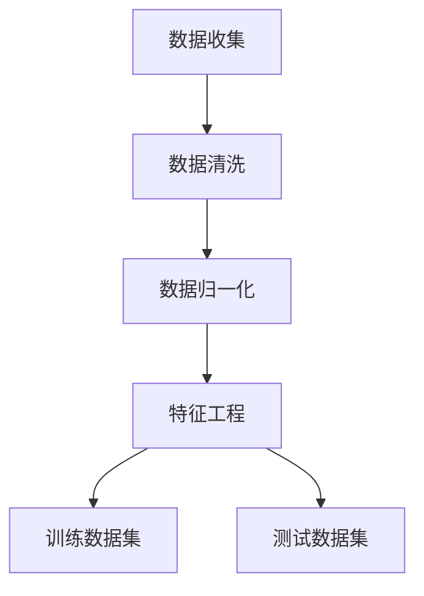

# Python深度学习实践：AI在股票市场预测中的应用

## 1.背景介绍

在金融市场中，股票价格的预测一直是一个备受关注的课题。随着人工智能和深度学习技术的迅猛发展，越来越多的研究者和从业者开始尝试将这些先进的技术应用于股票市场预测。Python作为一种高效、灵活且功能强大的编程语言，已经成为实现这些技术的首选工具。

本篇文章将深入探讨如何利用Python和深度学习技术进行股票市场预测。我们将从基础概念入手，逐步深入到核心算法、数学模型、代码实例和实际应用场景，最终为读者提供一个全面的技术指南。

## 2.核心概念与联系

### 2.1 深度学习简介

深度学习是机器学习的一个分支，主要通过多层神经网络来模拟人脑的工作方式。其核心在于通过大量数据的训练，使模型能够自动提取特征并进行预测。

### 2.2 股票市场预测的挑战

股票市场具有高度的随机性和复杂性，受多种因素影响，如经济指标、公司财报、市场情绪等。因此，传统的统计方法在预测股票价格时往往效果不佳，而深度学习技术则有望通过其强大的特征提取能力和非线性建模能力，提供更准确的预测结果。

### 2.3 深度学习与股票市场预测的联系

深度学习技术在股票市场预测中的应用主要体现在以下几个方面：

- **特征提取**：通过深度神经网络自动提取股票价格的潜在特征。
- **时间序列预测**：利用循环神经网络（RNN）和长短期记忆网络（LSTM）对股票价格进行时间序列预测。
- **多因子分析**：结合多种影响因素，如技术指标、基本面数据等，进行综合预测。

## 3.核心算法原理具体操作步骤

### 3.1 数据预处理

数据预处理是股票市场预测的第一步，主要包括数据清洗、归一化和特征工程等步骤。



### 3.2 模型选择

在股票市场预测中，常用的深度学习模型包括：

- **多层感知机（MLP）**：适用于简单的回归和分类任务。
- **卷积神经网络（CNN）**：适用于图像数据和时序数据的特征提取。
- **循环神经网络（RNN）**：适用于时间序列数据的预测。
- **长短期记忆网络（LSTM）**：RNN的改进版本，能够更好地捕捉长时间依赖关系。

### 3.3 模型训练

模型训练是深度学习的核心步骤，通过反向传播算法不断调整模型参数，使其在训练数据上的预测误差最小化。

### 3.4 模型评估

模型评估是验证模型性能的重要环节，常用的评估指标包括均方误差（MSE）、平均绝对误差（MAE）和决定系数（R²）等。

## 4.数学模型和公式详细讲解举例说明

### 4.1 神经网络的基本结构

一个典型的神经网络由输入层、隐藏层和输出层组成。每一层由若干个神经元构成，神经元之间通过权重连接。

$$
y = f(Wx + b)
$$

其中，$W$ 是权重矩阵，$x$ 是输入向量，$b$ 是偏置向量，$f$ 是激活函数。

### 4.2 反向传播算法

反向传播算法是训练神经网络的核心，通过计算损失函数的梯度来更新权重。

$$
\Delta W = -\eta \frac{\partial L}{\partial W}
$$

其中，$\Delta W$ 是权重的更新量，$\eta$ 是学习率，$L$ 是损失函数。

### 4.3 LSTM的结构和公式

LSTM是一种特殊的RNN，能够有效解决长时间依赖问题。其核心在于引入了记忆单元和门控机制。

$$
f_t = \sigma(W_f \cdot [h_{t-1}, x_t] + b_f)
$$

$$
i_t = \sigma(W_i \cdot [h_{t-1}, x_t] + b_i)
$$

$$
\tilde{C}_t = \tanh(W_C \cdot [h_{t-1}, x_t] + b_C)
$$

$$
C_t = f_t * C_{t-1} + i_t * \tilde{C}_t
$$

$$
o_t = \sigma(W_o \cdot [h_{t-1}, x_t] + b_o)
$$

$$
h_t = o_t * \tanh(C_t)
$$

## 5.项目实践：代码实例和详细解释说明

### 5.1 数据收集与预处理

首先，我们需要收集股票市场的数据，并进行预处理。

```python
import pandas as pd
import numpy as np
from sklearn.preprocessing import MinMaxScaler

# 读取数据
data = pd.read_csv('stock_data.csv')

# 数据清洗
data = data.dropna()

# 数据归一化
scaler = MinMaxScaler(feature_range=(0, 1))
scaled_data = scaler.fit_transform(data)

# 特征工程
X = []
y = []
for i in range(60, len(scaled_data)):
    X.append(scaled_data[i-60:i, 0])
    y.append(scaled_data[i, 0])
X, y = np.array(X), np.array(y)
```

### 5.2 构建LSTM模型

接下来，我们构建一个LSTM模型来进行股票价格预测。

```python
from keras.models import Sequential
from keras.layers import LSTM, Dense, Dropout

# 构建模型
model = Sequential()
model.add(LSTM(units=50, return_sequences=True, input_shape=(X.shape[1], 1)))
model.add(Dropout(0.2))
model.add(LSTM(units=50, return_sequences=False))
model.add(Dropout(0.2))
model.add(Dense(units=1))

# 编译模型
model.compile(optimizer='adam', loss='mean_squared_error')

# 训练模型
model.fit(X, y, epochs=100, batch_size=32)
```

### 5.3 模型评估与预测

最后，我们对模型进行评估，并使用其进行股票价格预测。

```python
# 评估模型
loss = model.evaluate(X_test, y_test)
print(f'Model Loss: {loss}')

# 进行预测
predicted_stock_price = model.predict(X_test)
predicted_stock_price = scaler.inverse_transform(predicted_stock_price)

# 可视化结果
import matplotlib.pyplot as plt

plt.plot(real_stock_price, color='red', label='Real Stock Price')
plt.plot(predicted_stock_price, color='blue', label='Predicted Stock Price')
plt.title('Stock Price Prediction')
plt.xlabel('Time')
plt.ylabel('Stock Price')
plt.legend()
plt.show()
```

## 6.实际应用场景

### 6.1 短期交易策略

利用深度学习模型预测短期股票价格波动，制定高频交易策略。

### 6.2 长期投资决策

结合基本面分析和技术指标，利用深度学习模型进行长期投资决策。

### 6.3 风险管理

通过预测市场波动，提前采取风险管理措施，如对冲和分散投资。

## 7.工具和资源推荐

### 7.1 开发工具

- **Python**：主要编程语言。
- **Jupyter Notebook**：交互式开发环境。
- **Keras**：深度学习框架。
- **Pandas**：数据处理库。
- **Matplotlib**：数据可视化库。

### 7.2 数据源

- **Yahoo Finance**：免费股票数据源。
- **Alpha Vantage**：提供API接口的股票数据源。
- **Quandl**：金融和经济数据平台。

### 7.3 学习资源

- **《深度学习》**：Ian Goodfellow等著，深度学习领域的经典教材。
- **Coursera**：提供深度学习和金融市场相关的在线课程。
- **Kaggle**：数据科学竞赛平台，提供丰富的数据集和代码示例。

## 8.总结：未来发展趋势与挑战

### 8.1 未来发展趋势

随着深度学习技术的不断进步，股票市场预测的准确性和实用性将进一步提升。未来，结合自然语言处理（NLP）技术，利用新闻、社交媒体等非结构化数据进行预测将成为一个重要的发展方向。

### 8.2 挑战

尽管深度学习在股票市场预测中展现了巨大的潜力，但仍面临诸多挑战：

- **数据质量**：股票市场数据的噪声和缺失值问题。
- **模型解释性**：深度学习模型的黑箱性质使得其预测结果难以解释。
- **市场变化**：金融市场的动态变化和突发事件对模型的鲁棒性提出了更高的要求。

## 9.附录：常见问题与解答

### 9.1 深度学习模型在股票市场预测中的优势是什么？

深度学习模型具有强大的特征提取能力和非线性建模能力，能够捕捉股票价格的复杂模式和潜在特征，从而提供更准确的预测结果。

### 9.2 如何选择合适的深度学习模型？

选择合适的深度学习模型需要根据具体的应用场景和数据特点进行综合考虑。对于时间序列数据，LSTM和RNN是常用的选择；对于多因子分析，可以考虑使用多层感知机（MLP）或卷积神经网络（CNN）。

### 9.3 如何提高模型的预测准确性？

提高模型预测准确性的方法包括：

- **数据预处理**：确保数据的质量和一致性。
- **特征工程**：提取有用的特征，减少噪声。
- **模型优化**：调整模型参数，选择合适的损失函数和优化器。
- **集成学习**：结合多个模型的预测结果，提升整体性能。

### 9.4 深度学习模型在实际应用中有哪些限制？

深度学习模型在实际应用中主要面临以下限制：

- **数据依赖性**：需要大量高质量的数据进行训练。
- **计算资源**：训练深度学习模型需要大量的计算资源和时间。
- **模型解释性**：深度学习模型的黑箱性质使得其预测结果难以解释。

### 9.5 如何应对金融市场的动态变化？

应对金融市场的动态变化可以通过以下方法：

- **模型更新**：定期更新模型，确保其适应市场变化。
- **多模型组合**：结合多个模型的预测结果，提升鲁棒性。
- **实时监控**：实时监控市场动态，及时调整策略。

---

作者：禅与计算机程序设计艺术 / Zen and the Art of Computer Programming