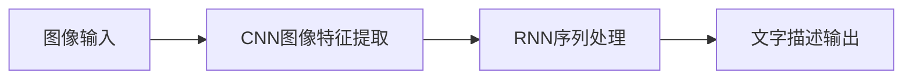

## 1. 背景介绍

随着深度学习技术的飞速发展，图像识别已经取得了巨大的进步。然而，仅仅识别出图像中的物体并不足以满足人们对智能系统的期待。人们期望计算机能够像人类一样，不仅识别图像中的内容，还能理解场景并生成相应的文字描述。这种从图像识别到图像理解的转变，是深度学习领域的一个重要里程碑，它涉及到计算机视觉和自然语言处理的交叉领域，即图像字幕生成（Image Captioning）。

## 2. 核心概念与联系

图像字幕生成通常涉及两个主要的深度学习模型：卷积神经网络（CNN）和循环神经网络（RNN）。CNN擅长于提取图像的视觉特征，而RNN则擅长于处理序列数据，生成连贯的文本描述。这两个模型的结合，使得计算机能够从视觉数据中提取关键信息，并转化为自然语言描述。



## 3. 核心算法原理具体操作步骤

图像字幕生成的核心算法可以分为以下几个步骤：

1. 使用预训练的CNN模型（如VGGNet, ResNet等）提取图像特征。
2. 将提取的特征作为序列生成模型的初始状态。
3. 使用RNN（通常是LSTM或GRU）根据图像特征逐词生成描述。
4. 应用注意力机制（Attention Mechanism）来关注图像的特定部分，以生成更加精确的描述。
5. 通过词汇表将生成的序列转换为自然语言文字。

## 4. 数学模型和公式详细讲解举例说明

以长短期记忆网络（LSTM）为例，其数学模型可以表示为：

$$
\begin{align}
f_t &= \sigma(W_f \cdot [h_{t-1}, x_t] + b_f) \\
i_t &= \sigma(W_i \cdot [h_{t-1}, x_t] + b_i) \\
\tilde{C}_t &= \tanh(W_C \cdot [h_{t-1}, x_t] + b_C) \\
C_t &= f_t * C_{t-1} + i_t * \tilde{C}_t \\
o_t &= \sigma(W_o \cdot [h_{t-1}, x_t] + b_o) \\
h_t &= o_t * \tanh(C_t)
\end{align}
$$

其中，$f_t, i_t, o_t$ 分别是遗忘门、输入门和输出门的激活向量，$C_t$ 是细胞状态，$h_t$ 是隐藏状态，$x_t$ 是输入向量，$W$ 和 $b$ 是模型参数，$\sigma$ 是sigmoid激活函数。

## 5. 项目实践：代码实例和详细解释说明

以Keras框架为例，以下是一个简化的图像字幕生成模型的代码实例：

```python
from keras.models import Model
from keras.layers import Dense, LSTM, Embedding, Input
from keras.applications.vgg16 import VGG16, preprocess_input
from keras.preprocessing.sequence import pad_sequences
from keras.preprocessing.image import load_img, img_to_array

# 加载预训练的VGG16模型
vgg_model = VGG16(weights='imagenet')
vgg_model.layers.pop()
vgg_model = Model(inputs=vgg_model.inputs, outputs=vgg_model.layers[-1].output)

# 图像特征提取
def extract_features(filename):
    image = load_img(filename, target_size=(224, 224))
    image = img_to_array(image)
    image = preprocess_input(image)
    feature = vgg_model.predict(image.reshape((1, image.shape[0], image.shape[1], image.shape[2])))
    return feature

# 构建字幕生成模型
def build_captioning_model(vocab_size, max_length):
    # 图像特征提取器
    inputs1 = Input(shape=(4096,))
    fe1 = Dense(256, activation='relu')(inputs1)
    
    # 序列模型
    inputs2 = Input(shape=(max_length,))
    se1 = Embedding(vocab_size, 256, mask_zero=True)(inputs2)
    se2 = LSTM(256)(se1)
    
    # 解码器
    decoder1 = add([fe1, se2])
    decoder2 = Dense(256, activation='relu')(decoder1)
    outputs = Dense(vocab_size, activation='softmax')(decoder2)
    
    # 合并两个网络
    model = Model(inputs=[inputs1, inputs2], outputs=outputs)
    model.compile(loss='categorical_crossentropy', optimizer='adam')
    
    return model

# 示例：加载图像，提取特征
features = extract_features('example.jpg')

# 示例：加载描述，预处理
sequence = [word_to_id[word] for word in 'startseq little girl running in field endseq'.split() if word in word_to_id]
sequence = pad_sequences([sequence], maxlen=max_length)

# 示例：生成描述
model = build_captioning_model(vocab_size, max_length)
model.predict([features, sequence])
```

在这个例子中，我们首先使用VGG16模型提取图像特征，然后构建一个字幕生成模型，该模型结合了图像特征和输入序列来生成文字描述。

## 6. 实际应用场景

图像字幕生成技术在多个领域都有实际应用，包括：

- 辅助视障人士理解周围环境
- 社交媒体自动生成图片描述
- 视频内容自动生成字幕
- 智能监控系统中的事件描述

## 7. 工具和资源推荐

- TensorFlow和Keras：用于构建和训练深度学习模型的开源库
- PyTorch：另一种流行的深度学习框架
- COCO数据集：一个广泛用于图像字幕生成任务的数据集
- NLTK：自然语言处理工具包，用于文本预处理

## 8. 总结：未来发展趋势与挑战

图像字幕生成技术仍然面临着许多挑战，包括提高生成描述的准确性、多样性和丰富性。未来的发展趋势可能包括更加复杂的模型结构，更好的注意力机制，以及更多的跨模态学习方法。

## 9. 附录：常见问题与解答

Q1: 图像字幕生成模型如何处理不同长度的描述？
A1: 通常使用填充（Padding）和掩码（Masking）技术来处理不同长度的序列。

Q2: 注意力机制在图像字幕生成中的作用是什么？
A2: 注意力机制可以帮助模型关注图像的特定部分，从而生成更加相关和准确的描述。

作者：禅与计算机程序设计艺术 / Zen and the Art of Computer Programming