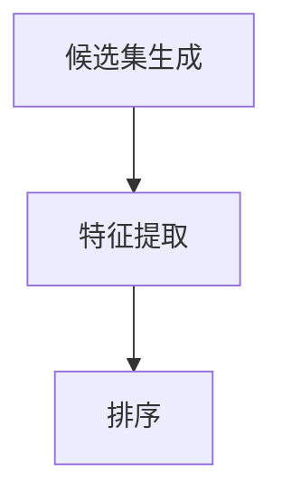

## 1.背景介绍

在信息爆炸的时代，如何从海量的信息中找到对自己有用的信息，已经成为了一个重要的问题。在搜索引擎、推荐系统等领域，Recall（召回）就是解决这个问题的关键技术之一。Recall的目标是从大量的候选集中，找到最可能与用户相关的项目。

## 2.核心概念与联系

Recall的核心概念包括候选集生成、特征提取、排序三个步骤。候选集生成是指从大量的信息中筛选出一部分可能与用户相关的信息，形成候选集。特征提取是指对候选集中的每个项目提取特征，包括项目本身的特性、用户的行为特性等。排序是指根据特征对候选集中的项目进行排序，将最可能与用户相关的项目排在前面。



## 3.核心算法原理具体操作步骤

Recall的核心算法包括协同过滤算法、矩阵分解算法、深度学习算法等。这些算法的共同目标是根据用户的历史行为和项目的特性，预测用户对项目的兴趣。

协同过滤算法主要包括用户基于协同过滤和项目基于协同过滤。用户基于协同过滤是指找到与目标用户兴趣相似的用户，然后推荐他们喜欢的项目给目标用户。项目基于协同过滤是指找到与目标项目相似的项目，然后推荐给喜欢目标项目的用户。

矩阵分解算法是指将用户-项目的评分矩阵分解为两个矩阵的乘积，一个矩阵表示用户的隐藏特性，另一个矩阵表示项目的隐藏特性。通过这种方式，我们可以预测用户对未评分项目的评分。

深度学习算法是指使用深度神经网络模型预测用户对项目的兴趣。这种方法可以自动提取特征，并能处理非线性关系。

## 4.数学模型和公式详细讲解举例说明

以矩阵分解算法为例，我们假设有m个用户和n个项目，用户-项目的评分矩阵为R，我们希望找到两个矩阵P和Q，使得他们的乘积近似于R。我们可以通过最小化以下目标函数来找到P和Q：

$$
\min_{P,Q} \sum_{(i,j)\in R} (R_{ij} - P_iQ_j)^2 + \lambda (||P_i||^2 + ||Q_j||^2)
$$

其中，$P_i$是用户i的特性向量，$Q_j$是项目j的特性向量，$\lambda$是正则化参数，用于防止过拟合。

## 5.项目实践：代码实例和详细解释说明

下面我们使用Python的Surprise库来实现矩阵分解算法。首先，我们加载数据：

```python
from surprise import Dataset
data = Dataset.load_builtin('ml-100k')
```

然后，我们使用SVD算法进行矩阵分解：

```python
from surprise import SVD
algo = SVD()
```

接着，我们使用交叉验证来评估算法的性能：

```python
from surprise.model_selection import cross_validate
cross_validate(algo, data, measures=['RMSE', 'MAE'], cv=5, verbose=True)
```

最后，我们可以使用训练好的模型来预测用户对项目的评分：

```python
uid = str(196)
iid = str(302)
pred = algo.predict(uid, iid, r_ui=4, verbose=True)
```

## 6.实际应用场景

Recall在许多领域都有应用，例如搜索引擎、推荐系统、广告系统等。在搜索引擎中，Recall用于从大量的网页中找到与用户查询相关的网页。在推荐系统中，Recall用于从大量的项目中找到可能与用户兴趣相关的项目。在广告系统中，Recall用于从大量的广告中找到可能与用户兴趣相关的广告。

## 7.工具和资源推荐

推荐使用Python的Surprise库来实现Recall算法。Surprise是一个Python的推荐系统库，提供了许多常用的推荐算法，如协同过滤、矩阵分解等。

## 8.总结：未来发展趋势与挑战

随着深度学习的发展，Recall的算法也在不断进化。深度学习算法可以自动提取特征，处理非线性关系，因此在Recall任务上表现优秀。然而，深度学习算法也有其挑战，如需要大量的数据、计算资源，以及模型解释性差等。

## 9.附录：常见问题与解答

Q: Recall和Precision有什么区别？

A: Recall是指从所有相关项目中找到的比例，Precision是指从找到的项目中真正相关的比例。在某些情况下，我们更关心Recall，如在搜索引擎中，我们希望找到尽可能多的相关网页。在其他情况下，我们更关心Precision，如在推荐系统中，我们希望推荐的项目尽可能与用户兴趣相关。

作者：禅与计算机程序设计艺术 / Zen and the Art of Computer Programming