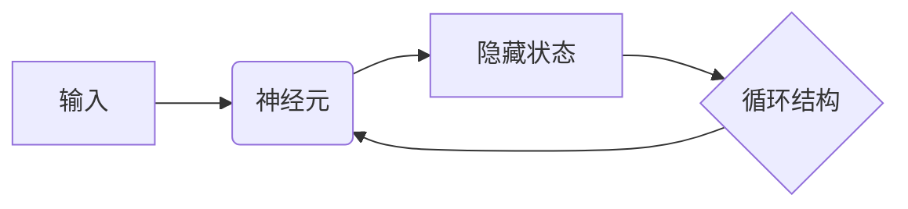

## 1.背景介绍

循环神经网络（Recurrent Neural Networks，RNN）是一种强大的人工神经网络，它具有处理序列数据的能力，如时间序列数据、文本、语音等。RNN的主要特点是具有“记忆”功能，可以将前一时刻的信息传递到下一时刻，因此在处理序列问题上，RNN有着其他神经网络无法比拟的优势。

## 2.核心概念与联系

RNN的核心概念是“隐藏状态”和“循环结构”。

- 隐藏状态：RNN每个神经元都有一个隐藏状态，这个状态包含了当前时刻的输入信息和前一时刻的隐藏状态信息，因此可以理解为RNN的“记忆”。
- 循环结构：RNN的神经元是通过一个循环结构连接起来的，每个神经元在每个时刻都会接收到当前时刻的输入和前一时刻的隐藏状态，然后计算出新的隐藏状态。



## 3.核心算法原理具体操作步骤

RNN的运行可以分为以下几个步骤：

1. 初始化隐藏状态。
2. 在每个时刻，接收当前时刻的输入和前一时刻的隐藏状态。
3. 计算当前时刻的隐藏状态。
4. 将当前时刻的隐藏状态传递到下一时刻。
5. 重复步骤2-4，直到处理完所有的输入序列。

## 4.数学模型和公式详细讲解举例说明

RNN的运行可以用以下数学公式表示：

- 隐藏状态的计算：$h_t = \sigma(W_{hh}h_{t-1} + W_{xh}x_t + b_h)$
- 输出的计算：$y_t = W_{hy}h_t + b_y$

其中，$h_t$是当前时刻的隐藏状态，$h_{t-1}$是前一时刻的隐藏状态，$x_t$是当前时刻的输入，$\sigma$是激活函数，$W_{hh}$、$W_{xh}$、$W_{hy}$是权重矩阵，$b_h$、$b_y$是偏置。

## 5.项目实践：代码实例和详细解释说明

下面是一个用Python实现的简单RNN的例子：

```python
import numpy as np

class SimpleRNN:
    def __init__(self, input_dim, hidden_dim, output_dim):
        # 初始化权重和偏置
        self.Wxh = np.random.randn(hidden_dim, input_dim) * 0.01
        self.Whh = np.random.randn(hidden_dim, hidden_dim) * 0.01
        self.Why = np.random.randn(output_dim, hidden_dim) * 0.01
        self.bh = np.zeros((hidden_dim, 1))
        self.by = np.zeros((output_dim, 1))

    def forward(self, inputs):
        h = np.zeros((self.Whh.shape[0], 1)) # 初始化隐藏状态
        y = []
        for t in range(len(inputs)):
            h = np.tanh(np.dot(self.Wxh, inputs[t]) + np.dot(self.Whh, h) + self.bh)
            y_t = np.dot(self.Why, h) + self.by
            y.append(y_t)
        return y, h
```

## 6.实际应用场景

RNN广泛应用于自然语言处理（如文本分类、情感分析、机器翻译等）、语音识别、时间序列预测等领域。

## 7.工具和资源推荐

- TensorFlow和PyTorch：这两个是目前最流行的深度学习框架，都提供了RNN的实现。
- Keras：这是一个高级的深度学习框架，可以用更简洁的代码实现RNN。

## 8.总结：未来发展趋势与挑战

虽然RNN在处理序列问题上有着显著的优势，但是也存在一些挑战，如梯度消失和梯度爆炸问题、长依赖问题等。为了解决这些问题，研究者们提出了一些改进的RNN，如长短期记忆网络（LSTM）和门控循环单元（GRU）。未来，随着深度学习技术的发展，我们期待看到更多高效、强大的RNN模型。

## 9.附录：常见问题与解答

Q: RNN和CNN有什么区别？
A: RNN和CNN都是神经网络的一种，但是他们的结构和用途有所不同。RNN主要用于处理序列数据，具有“记忆”功能；而CNN主要用于处理网格数据（如图像），具有局部连接和权值共享的特点。

Q: 为什么说RNN有“记忆”功能？
A: 因为RNN的每个神经元都有一个隐藏状态，这个状态包含了当前时刻的输入信息和前一时刻的隐藏状态信息，因此可以理解为RNN的“记忆”。

Q: RNN如何解决梯度消失和梯度爆炸问题？
A: RNN解决梯度消失和梯度爆炸问题的常用方法是使用门控循环单元（GRU）或长短期记忆网络（LSTM）。这些网络通过引入门控机制，可以有效地控制信息的流动，从而缓解梯度消失和梯度爆炸问题。

作者：禅与计算机程序设计艺术 / Zen and the Art of Computer Programming