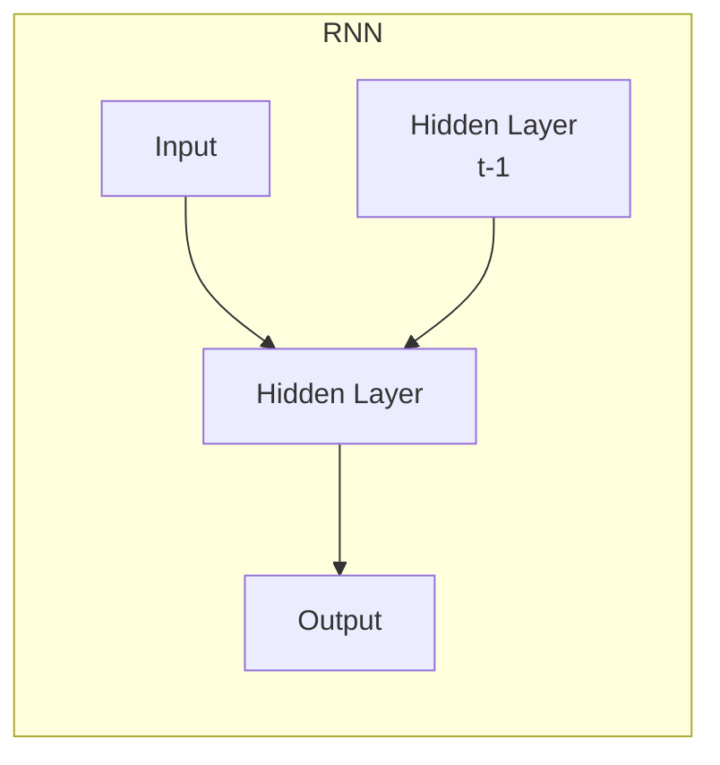

# Recurrent Neural Networks (RNN)原理与代码实例讲解

## 1.背景介绍

在深度学习的领域中,循环神经网络(Recurrent Neural Networks, RNN)是一种强大的模型,能够有效地处理序列数据,例如自然语言处理、语音识别、时间序列预测等。与传统的前馈神经网络不同,RNN具有内部记忆机制,可以捕捉序列数据中的动态行为和长期依赖关系。

RNN的核心思想是在每个时间步骤中,将当前输入与前一状态的隐藏层输出进行组合,以生成当前时间步的隐藏层输出,并将其传递到下一时间步。这种循环结构使得RNN能够建模序列数据,并学习到数据中的长期依赖关系。

然而,传统的RNN存在梯度消失和梯度爆炸的问题,导致了长期依赖关系的捕捉能力受到限制。为了解决这一问题,研究人员提出了改进的RNN变体,如长短期记忆网络(Long Short-Term Memory, LSTM)和门控循环单元(Gated Recurrent Unit, GRU),它们引入了门控机制,有效地缓解了梯度问题,提高了模型的性能。

## 2.核心概念与联系

### 2.1 循环神经网络的基本结构

RNN的基本结构由一个输入层、一个隐藏层和一个输出层组成。隐藏层的神经元不仅与当前时间步的输入相连,还与前一时间步的隐藏层输出相连,形成了一个循环结构。这种循环结构使得RNN能够捕捉序列数据中的动态行为和长期依赖关系。

### 2.2 RNN的前向传播

在RNN的前向传播过程中,每个时间步的隐藏层输出不仅依赖于当前时间步的输入,还依赖于前一时间步的隐藏层输出。具体计算过程如下:

$$h_t = f(W_{xh}x_t + W_{hh}h_{t-1} + b_h)$$
$$y_t = g(W_{hy}h_t + b_y)$$

其中:
- $x_t$ 是当前时间步的输入
- $h_t$ 是当前时间步的隐藏层输出
- $h_{t-1}$ 是前一时间步的隐藏层输出
- $y_t$ 是当前时间步的输出
- $W_{xh}$、$W_{hh}$、$W_{hy}$ 分别是输入到隐藏层、隐藏层到隐藏层和隐藏层到输出层的权重矩阵
- $b_h$、$b_y$ 是隐藏层和输出层的偏置项
- $f$ 和 $g$ 是非线性激活函数,通常使用 tanh 或 ReLU 函数

### 2.3 RNN的反向传播

在训练RNN时,需要使用反向传播算法计算损失函数相对于模型参数的梯度,并通过优化算法(如梯度下降)更新模型参数。由于RNN具有循环结构,反向传播过程需要通过时间反向传播误差,这被称为反向传播through time (BPTT)算法。

BPTT算法的核心思想是将RNN在每个时间步上的计算视为一个层,并将整个序列视为一个深度神经网络。然后,通过链式法则计算损失函数相对于每个时间步的参数的梯度,并将这些梯度累加得到总的梯度。

### 2.4 梯度消失和梯度爆炸问题

尽管RNN理论上能够捕捉长期依赖关系,但在实践中,由于反向传播过程中的梯度消失和梯度爆炸问题,RNN很难有效地学习长期依赖关系。

梯度消失问题是指,当序列长度增加时,梯度会指数级衰减,导致无法有效地更新模型参数。梯度爆炸问题则是指,当序列长度增加时,梯度会指数级增长,导致参数更新失控。

为了解决这些问题,研究人员提出了改进的RNN变体,如LSTM和GRU,它们引入了门控机制,有效地缓解了梯度问题,提高了模型的性能。

## 3.核心算法原理具体操作步骤

### 3.1 长短期记忆网络(LSTM)

LSTM是RNN的一种变体,它通过引入门控机制来解决梯度消失和梯度爆炸的问题。LSTM的核心思想是维护一个细胞状态(cell state),并通过三个门(遗忘门、输入门和输出门)来控制信息的流动。

LSTM的前向传播过程如下:

1. 遗忘门(Forget Gate)决定了从前一时间步传递到当前时间步的细胞状态中保留多少信息:

$$f_t = \sigma(W_f \cdot [h_{t-1}, x_t] + b_f)$$

2. 输入门(Input Gate)决定了从当前输入和前一隐藏状态中获取多少信息,并将其与新的候选细胞状态 $\tilde{C}_t$ 进行组合,以生成当前时间步的新细胞状态:

$$i_t = \sigma(W_i \cdot [h_{t-1}, x_t] + b_i)$$
$$\tilde{C}_t = \tanh(W_C \cdot [h_{t-1}, x_t] + b_C)$$
$$C_t = f_t \odot C_{t-1} + i_t \odot \tilde{C}_t$$

3. 输出门(Output Gate)决定了从当前细胞状态中输出多少信息,并将其与当前隐藏状态进行组合,以生成当前时间步的输出:

$$o_t = \sigma(W_o \cdot [h_{t-1}, x_t] + b_o)$$
$$h_t = o_t \odot \tanh(C_t)$$

其中:
- $\sigma$ 是sigmoid激活函数
- $\odot$ 表示元素wise乘积
- $W_f$、$W_i$、$W_C$、$W_o$ 分别是遗忘门、输入门、候选细胞状态和输出门的权重矩阵
- $b_f$、$b_i$、$b_C$、$b_o$ 是相应的偏置项

通过这种门控机制,LSTM能够有效地捕捉长期依赖关系,并避免梯度消失和梯度爆炸的问题。

### 3.2 门控循环单元(GRU)

GRU是另一种改进的RNN变体,它与LSTM类似,也引入了门控机制,但结构更加简单。GRU只有两个门:重置门(Reset Gate)和更新门(Update Gate)。

GRU的前向传播过程如下:

1. 重置门(Reset Gate)决定了从前一隐藏状态中获取多少信息,用于计算当前候选隐藏状态:

$$r_t = \sigma(W_r \cdot [h_{t-1}, x_t] + b_r)$$

2. 更新门(Update Gate)决定了从前一隐藏状态和当前候选隐藏状态中获取多少信息,用于计算当前隐藏状态:

$$z_t = \sigma(W_z \cdot [h_{t-1}, x_t] + b_z)$$
$$\tilde{h}_t = \tanh(W_h \cdot [r_t \odot h_{t-1}, x_t] + b_h)$$
$$h_t = (1 - z_t) \odot h_{t-1} + z_t \odot \tilde{h}_t$$

其中:
- $\sigma$ 是sigmoid激活函数
- $\odot$ 表示元素wise乘积
- $W_r$、$W_z$、$W_h$ 分别是重置门、更新门和候选隐藏状态的权重矩阵
- $b_r$、$b_z$、$b_h$ 是相应的偏置项

GRU的结构比LSTM更加简单,但在许多任务上表现也非常出色。

## 4.数学模型和公式详细讲解举例说明

在上一节中,我们介绍了LSTM和GRU的核心算法原理。现在,让我们通过一个具体的例子来详细说明LSTM的数学模型和公式。

假设我们有一个序列数据 $X = (x_1, x_2, \ldots, x_T)$,其中 $x_t$ 是第 $t$ 个时间步的输入。我们的目标是使用LSTM模型对该序列进行建模,并预测每个时间步的输出 $y_t$。

LSTM的数学模型可以表示为:

$$\begin{aligned}
f_t &= \sigma(W_f \cdot [h_{t-1}, x_t] + b_f) \\
i_t &= \sigma(W_i \cdot [h_{t-1}, x_t] + b_i) \\
\tilde{C}_t &= \tanh(W_C \cdot [h_{t-1}, x_t] + b_C) \\
C_t &= f_t \odot C_{t-1} + i_t \odot \tilde{C}_t \\
o_t &= \sigma(W_o \cdot [h_{t-1}, x_t] + b_o) \\
h_t &= o_t \odot \tanh(C_t) \\
y_t &= W_y \cdot h_t + b_y
\end{aligned}$$

其中:
- $f_t$、$i_t$、$o_t$ 分别表示第 $t$ 个时间步的遗忘门、输入门和输出门
- $C_t$ 是第 $t$ 个时间步的细胞状态
- $\tilde{C}_t$ 是第 $t$ 个时间步的候选细胞状态
- $h_t$ 是第 $t$ 个时间步的隐藏状态
- $y_t$ 是第 $t$ 个时间步的输出
- $W_f$、$W_i$、$W_C$、$W_o$、$W_y$ 分别是遗忘门、输入门、候选细胞状态、输出门和输出层的权重矩阵
- $b_f$、$b_i$、$b_C$、$b_o$、$b_y$ 是相应的偏置项
- $\sigma$ 是sigmoid激活函数
- $\odot$ 表示元素wise乘积

让我们以一个简单的序列加和任务为例,说明LSTM的工作原理。假设我们有一个长度为 $T$ 的序列 $X = (x_1, x_2, \ldots, x_T)$,其中每个 $x_t$ 是一个实数。我们的目标是使用LSTM模型计算序列的累积和 $y_T = \sum_{t=1}^T x_t$。

在每个时间步 $t$,LSTM模型会根据当前输入 $x_t$ 和前一隐藏状态 $h_{t-1}$ 计算出当前时间步的遗忘门 $f_t$、输入门 $i_t$、候选细胞状态 $\tilde{C}_t$、细胞状态 $C_t$、输出门 $o_t$ 和隐藏状态 $h_t$。

由于我们的目标是计算序列的累积和,因此在最后一个时间步 $T$,LSTM模型的输出 $y_T$ 应该等于序列的累积和 $\sum_{t=1}^T x_t$。为了实现这一目标,LSTM模型需要在每个时间步 $t$ 将当前输入 $x_t$ 加到细胞状态 $C_t$ 中,并将累积和存储在细胞状态中。

具体来说,在第一个时间步 $t=1$,LSTM模型的初始细胞状态 $C_0$ 和隐藏状态 $h_0$ 通常被初始化为全零向量。在后续的每个时间步 $t$,LSTM模型会根据前一细胞状态 $C_{t-1}$ 和当前输入 $x_t$ 计算出新的细胞状态 $C_t$。由于我们希望将当前输入 $x_t$ 加到累积和中,因此在计算 $C_t$ 时,我们需要将输入门 $i_t$ 设置为较大的值,以允许更多的信息从候选细胞状态 $\tilde{C}_t$ 流入细胞状态 $C_t$。同时,我们需要将遗忘门 $f_t$ 设置为较小的值,以保留前一细胞状态 $C_{t-1}$ 中的累积和信息。

在最后一个时间步 $T$,LSTM模型的输出 $y_T$ 应该等于细胞状态 $C_T$ 中存储的累积和。为了实现这一目标,我们可以将输出门 $o_T$ 设置为较大的值,以允许更多的信息从细胞状态 