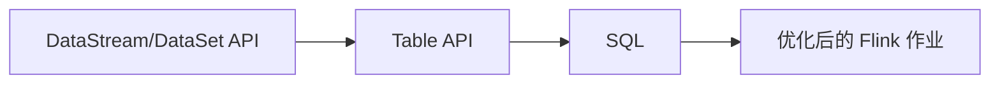

# Table API和SQL 原理与代码实例讲解

## 1.背景介绍
### 1.1 Table API和SQL的发展历程
### 1.2 Table API和SQL在大数据处理中的重要性
### 1.3 本文的主要内容和目标受众

## 2.核心概念与联系
### 2.1 Table API概述
#### 2.1.1 Table API的定义和特点 
#### 2.1.2 Table API的优势和局限性
### 2.2 SQL概述
#### 2.2.1 SQL的定义和特点
#### 2.2.2 SQL的优势和局限性
### 2.3 Table API与SQL的异同点比较
#### 2.3.1 相同点
#### 2.3.2 不同点
### 2.4 Table API与SQL在Flink中的关系


## 3.核心算法原理具体操作步骤
### 3.1 创建表环境
### 3.2 在表环境中注册表
#### 3.2.1 从 DataStream 创建表
#### 3.2.2 从 DataSet 创建表
#### 3.2.3 从外部系统创建表
### 3.3 表的查询操作
#### 3.3.1 Table API 的查询操作
#### 3.3.2 SQL 的查询操作
### 3.4 表的输出
#### 3.4.1 将表转换为 DataStream
#### 3.4.2 将表转换为 DataSet
#### 3.4.3 将表输出到外部系统

## 4.数学模型和公式详细讲解举例说明
### 4.1 关系代数基础
#### 4.1.1 选择 $\sigma$
#### 4.1.2 投影 $\pi$ 
#### 4.1.3 笛卡尔积 $\times$
#### 4.1.4 并集 $\cup$
#### 4.1.5 差集 $-$
#### 4.1.6 重命名 $\rho$
### 4.2 窗口操作的数学模型
#### 4.2.1 滚动窗口
$$ W_{tumbling}(t, size) = [t - size, t) $$
#### 4.2.2 滑动窗口  
$$ W_{sliding}(t, size, slide) = [t - size, t) \quad\text{with}\quad t \in \{n \cdot slide | n \in \mathbb{N}\} $$
#### 4.2.3 会话窗口
$$ W_{session}(t, gap) = [t_s, t_e) \quad\text{with}\quad t_e - t_s \geq gap \land \forall_{t' \in [t_s,t_e)} t' - t_{prev} < gap $$

## 5.项目实践：代码实例和详细解释说明
### 5.1 环境准备
### 5.2 使用 Table API 进行 WordCount
```java
// 创建表环境
StreamExecutionEnvironment env = StreamExecutionEnvironment.getExecutionEnvironment();
StreamTableEnvironment tEnv = StreamTableEnvironment.create(env);

// 创建源表
DataStream<String> stream = env.fromElements("Hello World", "Hello Flink");
Table table = tEnv.fromDataStream(stream, $("word"));

// 执行 Table API 查询
Table resultTable = table
  .groupBy($("word"))
  .select($("word"), $("word").count().as("count"));
  
// 将结果表转换回 DataStream 并打印
tEnv.toDataStream(resultTable, Row.class).print();

// 执行作业
env.execute();
```

### 5.3 使用 SQL 进行 WordCount
```java
// 创建表环境
StreamExecutionEnvironment env = StreamExecutionEnvironment.getExecutionEnvironment();
StreamTableEnvironment tEnv = StreamTableEnvironment.create(env);

// 创建源表
DataStream<String> stream = env.fromElements("Hello World", "Hello Flink");
tEnv.createTemporaryView("WordTable", stream, $("word"));

// 执行 SQL 查询
Table resultTable = tEnv.sqlQuery(
  "SELECT word, COUNT(word) AS `count` FROM WordTable GROUP BY word"
);

// 将结果表转换回 DataStream 并打印  
tEnv.toDataStream(resultTable, Row.class).print();

// 执行作业
env.execute();
```

## 6.实际应用场景
### 6.1 实时数据分析
### 6.2 实时数据清洗和预处理
### 6.3 实时异常检测
### 6.4 实时报表生成

## 7.工具和资源推荐
### 7.1 Apache Flink
### 7.2 Apache Beam
### 7.3 Alibaba MaxCompute
### 7.4 相关学习资源

## 8.总结：未来发展趋势与挑战
### 8.1 Table API 和 SQL 的未来发展方向
### 8.2 面临的挑战和机遇
### 8.3 总结

## 9.附录：常见问题与解答
### 9.1 Table API 和 SQL 的性能问题
### 9.2 Table API 和 SQL 的兼容性问题
### 9.3 如何选择 Table API 还是 SQL
### 9.4 常见错误及解决方法

作者：禅与计算机程序设计艺术 / Zen and the Art of Computer Programming