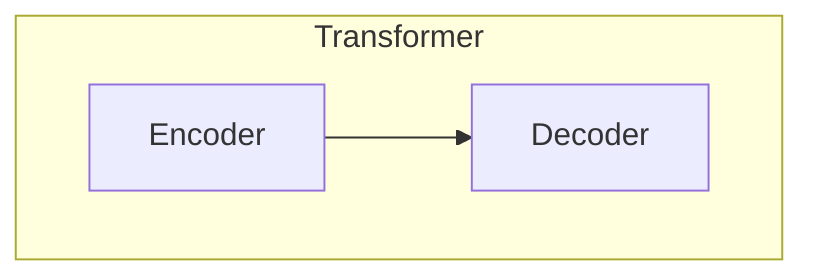
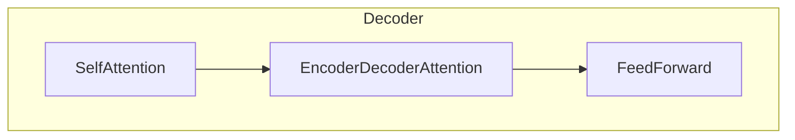

# Transformer大模型实战 理解解码器

## 1.背景介绍

在自然语言处理(NLP)领域,Transformer模型凭借其出色的性能,已经成为主流的神经网络架构之一。作为一种基于注意力机制的序列到序列(Seq2Seq)模型,Transformer擅长捕捉长距离依赖关系,并且可以高效地并行计算。其中,解码器(Decoder)作为Transformer模型的核心组件之一,负责将编码器(Encoder)的输出转化为目标序列。

随着大规模语言模型(如GPT、BERT等)的兴起,解码器在自然语言生成、机器翻译、对话系统等领域发挥着越来越重要的作用。本文将深入探讨Transformer解码器的工作原理、关键技术细节以及实际应用场景,旨在帮助读者全面理解这一核心组件,并为未来的模型优化和应用实践提供参考。

## 2.核心概念与联系

### 2.1 Transformer模型概览

在介绍解码器之前,我们先简要回顾一下Transformer模型的整体架构。Transformer由编码器(Encoder)和解码器(Decoder)两个子模块组成,如下图所示:

编码器的主要任务是将输入序列(如源语言句子)映射为一系列连续的表示向量,而解码器则负责根据这些表示向量生成目标序列(如目标语言句子)。两个子模块都采用了自注意力(Self-Attention)和位置编码(Positional Encoding)等关键技术,以捕捉输入序列中的长距离依赖关系。

### 2.2 解码器的作用

在机器翻译等序列到序列的任务中,解码器扮演着生成目标序列的关键角色。它基于编码器的输出,一个词元一个词元地预测目标序列,直到遇到特定的结束符号。在这个过程中,解码器需要综合考虑以下几个方面的信息:

1. 编码器的输出,即源序列的表示
2. 已生成的目标词元序列
3. 当前位置的词元预测

为了实现上述功能,解码器内部包含了多个子层,如自注意力层、编码器-解码器注意力层和前馈神经网络层等。这些子层通过精心设计的结构和注意力机制,实现了对上述信息的综合处理。

## 3.核心算法原理具体操作步骤 

### 3.1 解码器的结构

Transformer解码器的具体结构如下图所示:

解码器由三个主要子层组成:

1. 自注意力层(Self-Attention Layer):捕捉已生成目标序列中的长距离依赖关系。
2. 编码器-解码器注意力层(Encoder-Decoder Attention Layer):将编码器的输出与当前解码器状态进行融合。
3. 前馈神经网络层(Feed-Forward Layer):对序列表示进行进一步的非线性转换。

上述三个子层按顺序堆叠,并采用了残差连接(Residual Connection)和层归一化(Layer Normalization)等技术,以提高模型的性能和收敛速度。

### 3.2 自注意力层

自注意力层是解码器的核心部分,它允许模型关注输入序列中的任何位置,捕捉长距离依赖关系。在解码器中,自注意力层需要处理两个方面的信息:

1. 已生成的目标序列
2. 当前位置的预测

为了避免在预测当前词元时利用了来自未来词元的信息(即作弊),解码器的自注意力层采用了"掩码"(Masking)技术。具体来说,对于序列中的第 $i$ 个位置,它只能关注位置小于等于 $i$ 的词元,而无法看到后面的词元。这种"掩码"机制通过在注意力分数矩阵中人为设置一个很小的值(如 $-\infty$),来屏蔽掉不应被关注的词元。

$$
\begin{aligned}
\text{Attention}(Q, K, V) &= \text{softmax}(\frac{QK^T}{\sqrt{d_k}})V \\
\text{Masked-Attention}(Q, K, V) &= \text{softmax}(\frac{QK^T}{\sqrt{d_k}} + M)V
\end{aligned}
$$

其中, $M$ 是一个掩码张量,用于屏蔽掉不应被关注的位置。通过这种方式,解码器在生成目标序列时,只能基于当前和之前的信息,而不会"作弊"地利用了未来的信息。

### 3.3 编码器-解码器注意力层

编码器-解码器注意力层的作用是将编码器的输出(源序列的表示)与当前解码器状态进行融合。具体来说,该层会计算解码器的查询向量(Query)与编码器的键向量(Key)和值向量(Value)之间的注意力分数,从而获得一个注意力加权和,作为编码器信息的表示。

$$
\text{Attention}(Q, K, V) = \text{softmax}(\frac{QK^T}{\sqrt{d_k}})V
$$

其中, $Q$ 来自解码器,而 $K$ 和 $V$ 来自编码器。通过这种注意力机制,解码器可以选择性地关注源序列中的不同部分,并将相关信息融入到当前的解码状态中。

### 3.4 前馈神经网络层

前馈神经网络层是一个简单的全连接层,它对序列表示进行进一步的非线性转换。该层的计算过程如下:

$$
\text{FFN}(x) = \max(0, xW_1 + b_1)W_2 + b_2
$$

其中, $W_1$、$W_2$、$b_1$ 和 $b_2$ 是可训练的权重和偏置参数。前馈神经网络层可以看作是一个简单的前馈网络,它为每个位置的表示增加了非线性变换能力。

### 3.5 残差连接和层归一化

为了提高模型的性能和收敛速度,Transformer解码器采用了残差连接(Residual Connection)和层归一化(Layer Normalization)等技术。

残差连接的作用是将子层的输入和输出进行相加,以缓解深度网络的梯度消失问题。例如,自注意力层的输出 $\text{SelfAttention}(x)$ 和输入 $x$ 会通过残差连接相加,得到 $x + \text{SelfAttention}(x)$。

层归一化则是对每一层的输入或输出进行归一化处理,以加速模型的收敛。具体来说,对于一个小批量的输入 $\{x_1, x_2, \dots, x_n\}$,层归一化的计算过程如下:

$$
\mu = \frac{1}{n}\sum_{i=1}^n x_i \\
\sigma^2 = \frac{1}{n}\sum_{i=1}^n(x_i - \mu)^2 \\
\hat{x_i} = \frac{x_i - \mu}{\sqrt{\sigma^2 + \epsilon}} \\
\text{LayerNorm}(x_i) = \gamma \hat{x_i} + \beta
$$

其中, $\mu$ 和 $\sigma^2$ 分别是小批量的均值和方差, $\epsilon$ 是一个很小的常数以确保数值稳定性, $\gamma$ 和 $\beta$ 是可训练的缩放和偏移参数。

通过残差连接和层归一化,Transformer解码器能够更好地传播梯度信号,从而提高模型的收敛速度和性能。

## 4.数学模型和公式详细讲解举例说明

在上一节中,我们介绍了Transformer解码器的核心算法原理和操作步骤。现在,我们将更深入地探讨其中涉及的数学模型和公式,并通过具体的例子加以说明。

### 4.1 注意力机制(Attention Mechanism)

注意力机制是Transformer模型的核心,它允许模型动态地关注输入序列中的不同部分,并据此计算出相应的表示向量。在解码器中,注意力机制主要体现在自注意力层和编码器-解码器注意力层。

#### 4.1.1 缩放点积注意力(Scaled Dot-Product Attention)

Transformer中采用的是缩放点积注意力(Scaled Dot-Product Attention),其计算过程如下:

$$
\begin{aligned}
\text{Attention}(Q, K, V) &= \text{softmax}(\frac{QK^T}{\sqrt{d_k}})V \\
\text{head}_i &= \text{Attention}(QW_i^Q, KW_i^K, VW_i^V) \\
\text{MultiHead}(Q, K, V) &= \text{Concat}(\text{head}_1, \dots, \text{head}_h)W^O
\end{aligned}
$$

其中, $Q$、$K$ 和 $V$ 分别表示查询(Query)、键(Key)和值(Value)矩阵。注意力分数是通过查询和键的缩放点积计算得到的,即 $\frac{QK^T}{\sqrt{d_k}}$,其中 $d_k$ 是键的维度。缩放操作可以避免较大的点积值导致softmax函数的梯度较小。

为了提高模型的表示能力,Transformer采用了多头注意力(Multi-Head Attention)机制。具体来说,查询、键和值首先通过不同的线性投影($W_i^Q$、$W_i^K$ 和 $W_i^V$)分别得到 $h$ 组不同的表示,然后分别计算 $h$ 组注意力头(head),最后将这些注意力头的结果拼接(Concat)并通过另一个线性投影($W^O$)融合。

多头注意力机制赋予了模型关注不同位置和不同表示子空间的能力,从而提高了模型的表示能力。

#### 4.1.2 掩码自注意力(Masked Self-Attention)

在解码器的自注意力层中,我们需要防止模型"作弊"地利用了未来位置的信息。为此,Transformer采用了掩码自注意力(Masked Self-Attention)机制,其计算过程如下:

$$
\begin{aligned}
\text{Masked-Attention}(Q, K, V) &= \text{softmax}(\frac{QK^T}{\sqrt{d_k}} + M)V \\
M_{ij} &= \begin{cases}
0, & \text{if } i \geq j \\
-\infty, & \text{if } i < j
\end{cases}
\end{aligned}
$$

其中, $M$ 是一个掩码张量,用于屏蔽掉不应被关注的位置。具体来说,对于序列中的第 $i$ 个位置,它只能关注位置小于等于 $i$ 的词元,而无法看到后面的词元。这种"掩码"机制通过在注意力分数矩阵中人为设置一个很小的值(如 $-\infty$),来屏蔽掉不应被关注的词元。

例如,对于输入序列 "我 爱 学习 自然语言处理",在预测第三个词元"学习"时,掩码自注意力机制会屏蔽掉后面的"自然语言处理"部分,只关注前面的"我"和"爱"两个词元。通过这种方式,解码器在生成目标序列时,只能基于当前和之前的信息,而不会"作弊"地利用了未来的信息。

### 4.2 位置编码(Positional Encoding)

由于Transformer模型没有像RNN那样的递归结构,因此它无法直接捕捉序列中词元的位置信息。为了解决这个问题,Transformer引入了位置编码(Positional Encoding)机制,将位置信息编码到输入的嵌入向量中。

具体来说,对于序列中的第 $i$ 个位置,其位置编码 $\text{PE}_{(i, 2j)}$ 和 $\text{PE}_{(i, 2j+1)}$ 分别计算如下:

$$
\begin{aligned}
\text{PE}_{(i, 2j)} &= \sin\left(\frac{i}{10000^{\frac{2j}{d_\text{model}}}}\right) \\
\text{PE}_{(i, 2j+1)} &= \cos\left(\frac{i}{10000^{\frac{2j}{d_\text{model}}}}\right)
\end{aligned}
$$

其中, $j$ 是位置编码的维度索引,取值范围为 $[0, \frac{d_\text{model}}{2})$。$d_\text{model}$ 是模型的嵌入维度。

通过这种方式,每个位置都会对应一个唯一的位置编码向量,并将其与