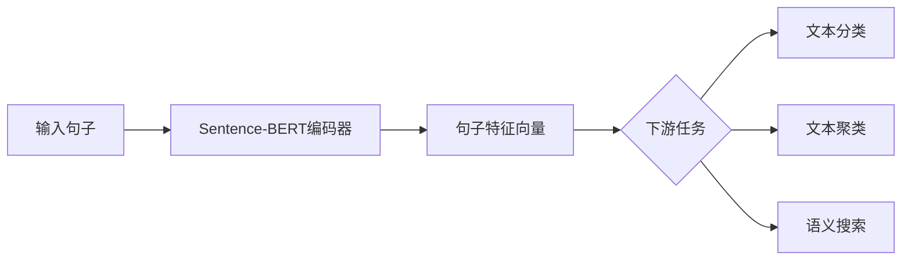

# Transformer大模型实战 用Sentence-BERT模型生成句子特征

## 1. 背景介绍
### 1.1 Transformer模型的发展历程
#### 1.1.1 Transformer模型的诞生
#### 1.1.2 Transformer模型的优势
#### 1.1.3 Transformer模型的应用领域

### 1.2 Sentence-BERT模型概述 
#### 1.2.1 Sentence-BERT模型的特点
#### 1.2.2 Sentence-BERT模型的性能表现
#### 1.2.3 Sentence-BERT模型的应用场景

## 2. 核心概念与联系
### 2.1 Transformer模型的核心概念
#### 2.1.1 注意力机制(Attention Mechanism)
#### 2.1.2 自注意力机制(Self-Attention)
#### 2.1.3 多头注意力(Multi-Head Attention)

### 2.2 Sentence-BERT模型的核心概念
#### 2.2.1 Siamese网络结构
#### 2.2.2 对比损失函数(Contrastive Loss)
#### 2.2.3 句子嵌入(Sentence Embedding)

### 2.3 Transformer和Sentence-BERT模型的联系
#### 2.3.1 Sentence-BERT模型对Transformer的继承和改进
#### 2.3.2 两者在应用场景上的异同

## 3. 核心算法原理具体操作步骤
### 3.1 Transformer模型的核心算法
#### 3.1.1 Transformer的编码器(Encoder)结构
#### 3.1.2 Transformer的解码器(Decoder)结构 
#### 3.1.3 位置编码(Positional Encoding)

### 3.2 Sentence-BERT模型的核心算法
#### 3.2.1 Siamese BERT网络结构
#### 3.2.2 对比损失函数的计算过程
#### 3.2.3 句子特征提取流程

### 3.3 Sentence-BERT模型的训练步骤
#### 3.3.1 数据准备和预处理
#### 3.3.2 模型初始化和超参数设置
#### 3.3.3 模型训练和评估

## 4. 数学模型和公式详细讲解举例说明
### 4.1 Transformer模型的数学表示
#### 4.1.1 自注意力机制的数学公式
$$Attention(Q,K,V) = softmax(\frac{QK^T}{\sqrt{d_k}})V$$
其中，$Q$,$K$,$V$分别表示查询向量、键向量和值向量，$d_k$为键向量的维度。

#### 4.1.2 多头注意力的数学公式
$$MultiHead(Q,K,V) = Concat(head_1,...,head_h)W^O$$
$$head_i = Attention(QW_i^Q, KW_i^K, VW_i^V)$$
其中，$W_i^Q \in \mathbb{R}^{d_{model} \times d_k}$,$W_i^K \in \mathbb{R}^{d_{model} \times d_k}$,$W_i^V \in \mathbb{R}^{d_{model} \times d_v}$,$W^O \in \mathbb{R}^{hd_v \times d_{model}}$。

### 4.2 Sentence-BERT模型的数学表示
#### 4.2.1 对比损失函数的数学公式
$$L = \sum_{i=1}^N \Big[ \log \Big( \sum_{j \neq i} \exp(sim(u_i, u_j)/\tau) \Big) - sim(u_i, u_{i^+})/\tau \Big]$$
其中，$u_i$表示句子$i$的嵌入向量，$u_{i^+}$表示与句子$i$语义相似的正样本嵌入向量，$\tau$为温度超参数。

#### 4.2.2 余弦相似度的数学公式
$$sim(u,v) = \frac{u \cdot v}{||u|| \cdot ||v||}$$
其中，$u$和$v$为两个向量，$\cdot$表示向量点积，$||\cdot||$表示向量的$L_2$范数。

## 5. 项目实践：代码实例和详细解释说明
### 5.1 环境准备和依赖安装
```bash
pip install sentence-transformers
```

### 5.2 加载预训练的Sentence-BERT模型
```python
from sentence_transformers import SentenceTransformer

model = SentenceTransformer('paraphrase-MiniLM-L6-v2')
```

### 5.3 生成句子特征向量
```python
sentences = [
    "The cat sits outside",
    "A man is playing guitar",
    "The new movie is awesome"
]

embeddings = model.encode(sentences)
print(embeddings.shape) # (3, 384)
```

### 5.4 计算句子之间的相似度
```python
from scipy.spatial.distance import cosine

sentence1 = "The cat sits outside"
sentence2 = "The dog plays in the garden"

embedding1 = model.encode(sentence1)
embedding2 = model.encode(sentence2)

cos_sim = 1 - cosine(embedding1, embedding2)
print(cos_sim) # 0.4899
```

## 6. 实际应用场景
### 6.1 文本相似度计算
#### 6.1.1 重复文本检测
#### 6.1.2 相似问题匹配

### 6.2 文本聚类
#### 6.2.1 主题发现
#### 6.2.2 文档分类

### 6.3 语义搜索
#### 6.3.1 相似文档检索
#### 6.3.2 问答系统

## 7. 工具和资源推荐
### 7.1 开源实现
- [sentence-transformers](https://github.com/UKPLab/sentence-transformers)
- [HuggingFace Transformers](https://github.com/huggingface/transformers)

### 7.2 预训练模型
- [paraphrase-MiniLM-L6-v2](https://huggingface.co/sentence-transformers/paraphrase-MiniLM-L6-v2)
- [all-MiniLM-L6-v2](https://huggingface.co/sentence-transformers/all-MiniLM-L6-v2)

### 7.3 相关论文
- [Sentence-BERT: Sentence Embeddings using Siamese BERT-Networks](https://arxiv.org/abs/1908.10084)
- [Attention Is All You Need](https://arxiv.org/abs/1706.03762)

## 8. 总结：未来发展趋势与挑战
### 8.1 Sentence-BERT模型的优势和局限性
#### 8.1.1 优势：高效、通用、语言无关
#### 8.1.2 局限性：语义理解能力有限

### 8.2 未来发展趋势
#### 8.2.1 更大规模的预训练模型
#### 8.2.2 多模态句子表示学习
#### 8.2.3 领域自适应的句子嵌入

### 8.3 面临的挑战
#### 8.3.1 模型的可解释性
#### 8.3.2 低资源语言的句子表示学习
#### 8.3.3 长文本的有效表示

## 9. 附录：常见问题与解答
### 9.1 Sentence-BERT和BERT的区别是什么？
Sentence-BERT是在BERT的基础上，通过Siamese网络结构和对比损失函数，专门用于生成句子级别的嵌入向量。而BERT主要用于生成词级别的嵌入向量，需要额外的池化操作才能得到句子表示。

### 9.2 Sentence-BERT模型可以处理变长的输入吗？
可以。Sentence-BERT模型在对句子进行编码时，会自动对输入进行截断或填充，以保证输入长度的一致性。因此，可以处理变长的输入句子。

### 9.3 Sentence-BERT模型在训练时需要大量的标注数据吗？
不需要。Sentence-BERT模型可以通过无监督的方式在大规模语料上进行预训练，然后再在特定任务上进行微调。因此，在训练时并不需要大量的标注数据。

### 9.4 Sentence-BERT模型生成的句子特征向量可以直接用于下游任务吗？
可以。Sentence-BERT模型生成的句子特征向量是一个固定长度的实值向量，可以直接作为下游任务的输入特征，如文本分类、聚类、语义搜索等。

### 9.5 Sentence-BERT模型在实际应用中需要注意哪些问题？
在实际应用中，需要注意以下几点：
1. 选择合适的预训练模型，根据任务的特点选择不同的模型版本。
2. 对输入文本进行必要的预处理，如去除噪声、标点符号等。
3. 合理设置编码器的最大输入长度，避免过长或过短的输入影响模型性能。
4. 根据任务的需求，选择合适的相似度计算方式，如余弦相似度、欧氏距离等。



总的来说，Sentence-BERT模型是一种强大的句子表示学习工具，可以有效地将句子映射到固定长度的实值向量空间，捕捉句子的语义信息。通过在大规模语料上的预训练和在特定任务上的微调，Sentence-BERT模型可以在各种自然语言处理任务中取得优异的性能。未来，随着预训练模型的不断发展和多模态学习的深入研究，Sentence-BERT模型有望在更广泛的应用场景中发挥重要作用。

作者：禅与计算机程序设计艺术 / Zen and the Art of Computer Programming