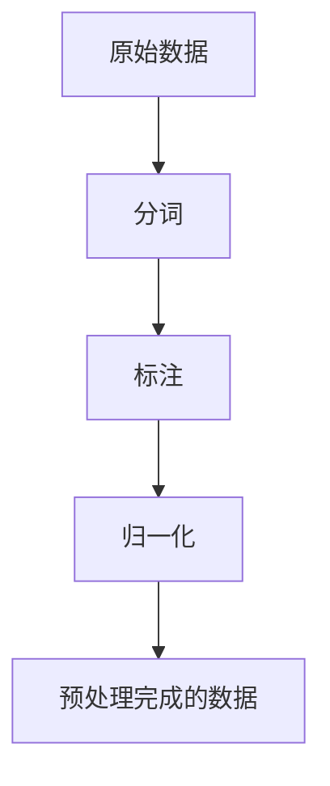
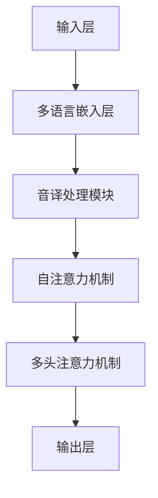

# Transformer大模型实战 语码混用和音译的影响

## 1.背景介绍

在自然语言处理（NLP）领域，Transformer模型已经成为了主流的架构。其在机器翻译、文本生成、情感分析等任务中表现出色。然而，随着全球化的发展，语码混用（Code-Switching）和音译（Transliteration）现象在多语言环境中变得越来越普遍。这些现象对Transformer模型的性能提出了新的挑战和机遇。

语码混用指的是在同一段话中使用两种或多种语言，而音译则是将一种语言的词汇用另一种语言的字母或发音来表示。这两种现象在社交媒体、跨国公司内部沟通以及多语言社区中非常常见。理解和处理这些现象对于提升NLP模型的实用性和准确性至关重要。

## 2.核心概念与联系

### 2.1 语码混用

语码混用是指在同一段话或对话中交替使用两种或多种语言。这种现象在多语言社区中非常常见。例如，在印度，很多人会在同一句话中混用印地语和英语。

### 2.2 音译

音译是指将一种语言的词汇用另一种语言的字母或发音来表示。例如，将“computer”音译成中文可以写作“康普特”。

### 2.3 Transformer模型

Transformer模型是一种基于注意力机制的深度学习模型，广泛应用于NLP任务。其核心组件包括自注意力机制、多头注意力机制和位置编码。

### 2.4 语码混用与音译的联系

语码混用和音译在多语言环境中常常同时出现。例如，在一段混合了英语和中文的对话中，可能会出现将“computer”音译为“康普特”的情况。这对NLP模型提出了更高的要求，因为模型需要同时处理多种语言和音译现象。

## 3.核心算法原理具体操作步骤

### 3.1 数据预处理

在处理语码混用和音译现象时，数据预处理是关键的一步。需要对数据进行分词、标注和归一化处理。



### 3.2 模型架构设计

在处理语码混用和音译现象时，可以在Transformer模型的基础上进行一些改进。例如，可以引入多语言嵌入层和音译处理模块。



### 3.3 训练与优化

在训练过程中，可以使用多语言数据集和音译数据集进行联合训练。优化过程中，可以采用自适应学习率和梯度裁剪等技术。

## 4.数学模型和公式详细讲解举例说明

### 4.1 自注意力机制

自注意力机制是Transformer模型的核心组件。其计算公式如下：

$$
\text{Attention}(Q, K, V) = \text{softmax}\left(\frac{QK^T}{\sqrt{d_k}}\right)V
$$

其中，$Q$、$K$和$V$分别表示查询、键和值矩阵，$d_k$表示键的维度。

### 4.2 多头注意力机制

多头注意力机制通过并行计算多个自注意力机制来捕捉不同的特征。其计算公式如下：

$$
\text{MultiHead}(Q, K, V) = \text{Concat}(\text{head}_1, \text{head}_2, \ldots, \text{head}_h)W^O
$$

其中，$\text{head}_i = \text{Attention}(QW_i^Q, KW_i^K, VW_i^V)$，$W_i^Q$、$W_i^K$、$W_i^V$和$W^O$是可训练的权重矩阵。

### 4.3 位置编码

由于Transformer模型不包含循环神经网络（RNN）或卷积神经网络（CNN），需要通过位置编码来引入序列信息。其计算公式如下：

$$
PE_{(pos, 2i)} = \sin\left(\frac{pos}{10000^{2i/d_{model}}}\right)
$$

$$
PE_{(pos, 2i+1)} = \cos\left(\frac{pos}{10000^{2i/d_{model}}}\right)
$$

其中，$pos$表示位置，$i$表示维度索引，$d_{model}$表示模型的维度。

## 5.项目实践：代码实例和详细解释说明

### 5.1 数据预处理

以下是一个简单的Python代码示例，用于对语码混用和音译数据进行预处理。

```python
import re

def preprocess_text(text):
    # 分词
    words = re.findall(r'\w+', text)
    # 标注
    tagged_words = [(word, 'EN' if word.isascii() else 'OTHER') for word in words]
    # 归一化
    normalized_words = [word.lower() for word, tag in tagged_words]
    return normalized_words

text = "This is a test sentence with 语码混用 and 音译 like computer."
preprocessed_text = preprocess_text(text)
print(preprocessed_text)
```

### 5.2 模型训练

以下是一个简单的PyTorch代码示例，用于训练一个处理语码混用和音译现象的Transformer模型。

```python
import torch
import torch.nn as nn
import torch.optim as optim

class TransformerModel(nn.Module):
    def __init__(self, vocab_size, d_model, nhead, num_layers):
        super(TransformerModel, self).__init__()
        self.embedding = nn.Embedding(vocab_size, d_model)
        self.transformer = nn.Transformer(d_model, nhead, num_layers)
        self.fc = nn.Linear(d_model, vocab_size)

    def forward(self, src, tgt):
        src = self.embedding(src)
        tgt = self.embedding(tgt)
        output = self.transformer(src, tgt)
        output = self.fc(output)
        return output

# 模型参数
vocab_size = 10000
d_model = 512
nhead = 8
num_layers = 6

# 初始化模型
model = TransformerModel(vocab_size, d_model, nhead, num_layers)
criterion = nn.CrossEntropyLoss()
optimizer = optim.Adam(model.parameters(), lr=0.001)

# 训练循环
for epoch in range(10):
    for src, tgt in data_loader:
        optimizer.zero_grad()
        output = model(src, tgt)
        loss = criterion(output.view(-1, vocab_size), tgt.view(-1))
        loss.backward()
        optimizer.step()
    print(f'Epoch {epoch}, Loss: {loss.item()}')
```

## 6.实际应用场景

### 6.1 社交媒体分析

在社交媒体平台上，用户常常使用语码混用和音译现象。通过改进的Transformer模型，可以更准确地进行情感分析、话题检测和用户行为预测。

### 6.2 跨国公司内部沟通

跨国公司内部的沟通常常涉及多种语言和音译现象。改进的Transformer模型可以帮助自动翻译和信息提取，提高沟通效率。

### 6.3 多语言社区服务

在多语言社区中，提供高质量的自动翻译和信息检索服务是一个重要的需求。改进的Transformer模型可以显著提升这些服务的质量。

## 7.工具和资源推荐

### 7.1 工具

- **Hugging Face Transformers**：一个开源的NLP库，支持多种Transformer模型。
- **SpaCy**：一个高效的自然语言处理库，支持多语言分词和标注。
- **NLTK**：一个经典的自然语言处理库，提供丰富的工具和数据集。

### 7.2 资源

- **多语言数据集**：如WMT、IWSLT等，提供丰富的多语言平行语料。
- **音译数据集**：如CMUdict、PanLex等，提供丰富的音译词汇。

## 8.总结：未来发展趋势与挑战

### 8.1 未来发展趋势

随着全球化的发展，语码混用和音译现象将变得越来越普遍。未来，NLP模型需要更好地处理这些现象，以提升其实用性和准确性。多语言嵌入、跨语言迁移学习和自适应模型将成为研究的热点。

### 8.2 挑战

处理语码混用和音译现象面临诸多挑战，包括数据稀缺、模型复杂度和计算资源需求。未来的研究需要在这些方面取得突破，以实现更高效、更准确的NLP模型。

## 9.附录：常见问题与解答

### 9.1 语码混用和音译现象对模型性能的影响有多大？

语码混用和音译现象会显著影响模型的性能，特别是在多语言环境中。处理不当可能导致模型的准确性和鲁棒性下降。

### 9.2 如何获取高质量的多语言和音译数据集？

可以通过公开的多语言数据集和音译词典获取高质量的数据。例如，WMT和IWSLT提供了丰富的多语言平行语料，CMUdict和PanLex提供了丰富的音译词汇。

### 9.3 如何优化模型以处理语码混用和音译现象？

可以通过引入多语言嵌入层和音译处理模块来优化模型。此外，使用多语言数据集和音译数据集进行联合训练也是一种有效的方法。

---

作者：禅与计算机程序设计艺术 / Zen and the Art of Computer Programming