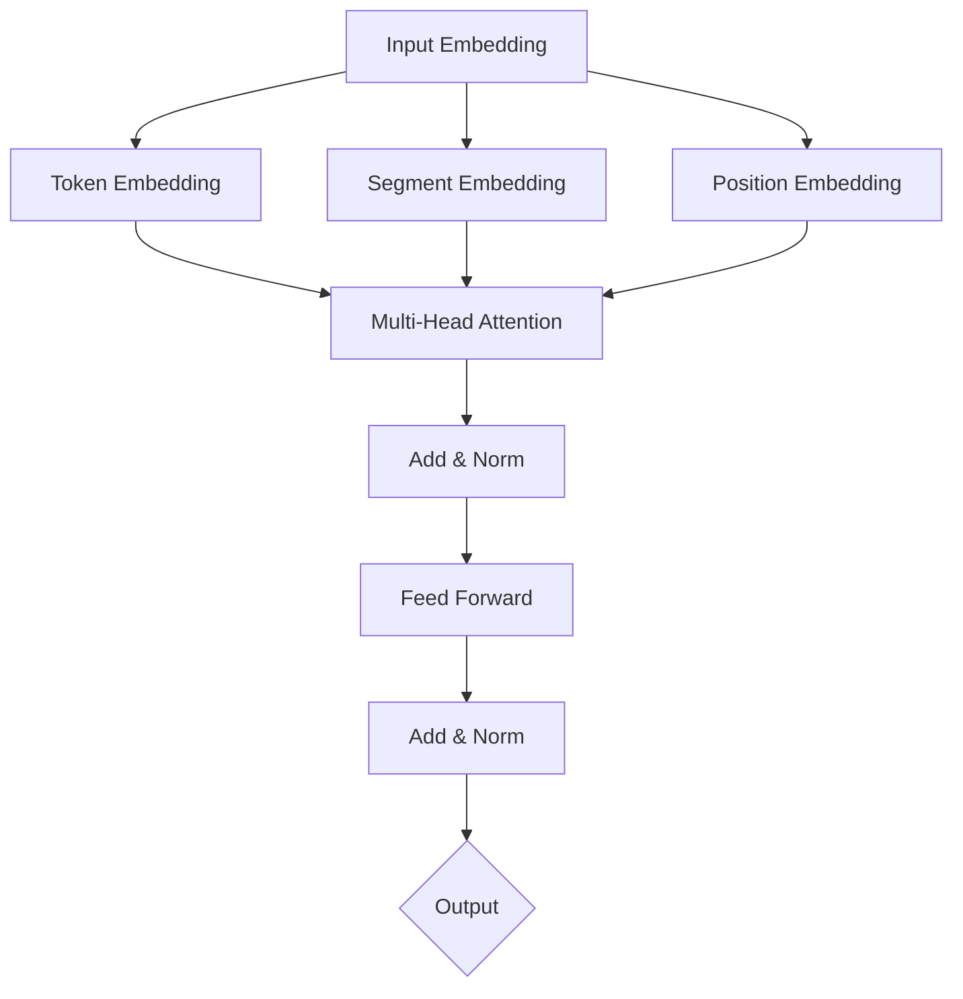

# Transformer大模型实战 预训练的BERT模型

## 1. 背景介绍

### 1.1 大语言模型的发展历程

近年来,自然语言处理(NLP)领域出现了一系列基于Transformer架构的大规模预训练语言模型,如BERT、GPT、XLNet等。这些模型在多个NLP任务上取得了显著的性能提升,引领了NLP技术的新发展方向。

### 1.2 BERT模型的诞生

BERT(Bidirectional Encoder Representations from Transformers)由Google AI团队在2018年提出,是一种革命性的预训练NLP模型。它采用了Transformer的编码器结构,通过自监督学习在大规模无标注文本语料上进行预训练,可以学习到丰富的语义表示。

### 1.3 BERT的影响力

BERT模型一经推出便在学术界和工业界掀起了研究热潮。众多研究者在BERT的基础上进行改进,提出了如RoBERTa、ALBERT等后续模型。同时BERT在问答、情感分析、命名实体识别等下游任务中展现出强大的迁移学习能力,极大地推动了NLP技术的进步。

## 2. 核心概念与联系

### 2.1 Transformer架构

BERT采用了Transformer的编码器结构作为骨干网络。Transformer摒弃了传统的RNN/CNN等结构,完全依靠注意力机制(Attention)来建模文本序列。其自注意力机制和位置编码等创新设计,使其能够高效地捕捉长距离依赖关系。

### 2.2 自监督预训练

与传统的有监督学习不同,BERT采用了自监督学习的范式进行预训练。通过Masked Language Modeling(MLM)和Next Sentence Prediction(NSP)两个预训练任务,BERT可以在无需人工标注的海量文本数据上学习通用的语言表示。

### 2.3 微调与迁移学习

预训练得到的BERT模型蕴含了丰富的语言知识,可以方便地迁移到下游的NLP任务中。通过在特定任务的标注数据上进行简单的微调,即可取得优异的性能,大大减少了任务特定的数据标注成本。

### 2.4 BERT与传统词向量的区别

相比word2vec、GloVe等传统词向量,BERT生成的词嵌入具有上下文相关性。同一个词在不同上下文中的表示是动态变化的,更好地刻画了词语的语义。此外BERT词向量融合了更多的句法、语义信息。

## 3. 核心算法原理具体操作步骤

### 3.1 BERT的网络结构

#### 3.1.1 输入表示
BERT的输入由Token Embeddings、Segment Embeddings和Position Embeddings三部分组成,将它们相加得到最终的输入表示。

#### 3.1.2 Transformer Encoder
多层Transformer Encoder堆叠而成,每一层包括多头自注意力(Multi-Head Attention)和前馈神经网络(Feed-Forward Network)两个子层。Layer Normalization和残差连接应用于每个子层之后。

### 3.2 预训练任务

#### 3.2.1 Masked Language Modeling(MLM)
随机Mask掉部分Token,通过上下文预测这些被Mask掉的Token。使BERT学会双向语言表示。

#### 3.2.2 Next Sentence Prediction(NSP)  
判断两个句子在原文中是否相邻。使BERT学会语篇级别的表示。

### 3.3 微调流程

#### 3.3.1 下游任务的输入表示
根据下游任务的类型,在BERT的输出之上添加任务特定的输出层,如分类、序列标注等。

#### 3.3.2 微调训练
使用下游任务的标注数据对整个模型进行端到端的微调训练,通过反向传播更新所有参数。

## 4. 数学模型和公式详细讲解举例说明

### 4.1 Scaled Dot-Product Attention

自注意力机制的核心是Scaled Dot-Product Attention。对于一个长度为$n$的输入序列$X \in \mathbb{R}^{n \times d}$,通过线性变换得到Query矩阵$Q$、Key矩阵$K$、Value矩阵$V$:

$$
\begin{aligned}
Q &= XW^Q \\
K &= XW^K \\
V &= XW^V
\end{aligned}
$$

其中$W^Q, W^K, W^V \in \mathbb{R}^{d \times d_k}$是可学习的参数矩阵。

Attention的计算公式为:

$$
\text{Attention}(Q, K, V) = \text{softmax}(\frac{QK^T}{\sqrt{d_k}})V
$$

$\frac{1}{\sqrt{d_k}}$起到缩放的作用,使点积不至于过大。

### 4.2 Multi-Head Attention

Multi-Head Attention由$h$个并行的Scaled Dot-Product Attention组成。对输入进行$h$次线性变换,得到$h$组Query、Key、Value矩阵,分别输入到$h$个Attention中,再将结果拼接起来:

$$
\begin{aligned}
\text{MultiHead}(Q, K, V) &= \text{Concat}(\text{head}_1, ..., \text{head}_h)W^O \\
\text{head}_i &= \text{Attention}(QW_i^Q, KW_i^K, VW_i^V)
\end{aligned}
$$

其中$W_i^Q \in \mathbb{R}^{d \times d_k}, W_i^K \in \mathbb{R}^{d \times d_k}, W_i^V \in \mathbb{R}^{d \times d_v}, W^O \in \mathbb{R}^{hd_v \times d}$。

Multi-Head Attention允许模型在不同的表示子空间中学习到不同的语义信息。

## 5. 项目实践：代码实例和详细解释说明

### 5.1 使用Hugging Face的Transformers库

Transformers是一个功能强大的NLP库,提供了BERT等主流预训练模型的实现。

首先安装Transformers库:

```bash
pip install transformers
```

加载预训练的BERT模型和分词器:

```python
from transformers import BertTokenizer, BertModel

tokenizer = BertTokenizer.from_pretrained('bert-base-uncased')
model = BertModel.from_pretrained('bert-base-uncased')
```

对输入文本进行分词、编码:

```python
text = "Hello, how are you? I am fine, thank you."
encoded_input = tokenizer(text, return_tensors='pt')
```

将编码后的输入传入BERT模型,得到输出表示:

```python
output = model(**encoded_input)
last_hidden_states = output.last_hidden_state
```

`last_hidden_states`即为BERT模型生成的上下文相关的词嵌入表示,可以用于下游任务。

### 5.2 基于BERT的文本分类

在BERT模型之上添加一个线性分类层,实现文本分类任务:

```python
from transformers import BertForSequenceClassification

model = BertForSequenceClassification.from_pretrained('bert-base-uncased', num_labels=2)
```

使用分类任务的标注数据对模型进行微调:

```python
from transformers import TrainingArguments, Trainer

training_args = TrainingArguments(
    output_dir='./results',
    num_train_epochs=3,
    per_device_train_batch_size=16,
    per_device_eval_batch_size=64,
    warmup_steps=500,
    weight_decay=0.01,
    logging_dir='./logs',
)

trainer = Trainer(
    model=model,
    args=training_args,
    train_dataset=train_dataset,
    eval_dataset=val_dataset,
)

trainer.train()
```

微调后的模型可以用于文本分类的预测和推理。

## 6. 实际应用场景

BERT模型在NLP领域有广泛的应用,包括但不限于:

- 文本分类:如情感分析、新闻分类、垃圾邮件检测等。
- 命名实体识别:识别文本中的人名、地名、机构名等实体。 
- 问答系统:基于给定问题和上下文,预测答案。
- 文本相似度:计算两段文本之间的语义相似度。
- 关系抽取:从文本中抽取实体之间的关系。
- 文本摘要:自动生成文章的摘要。
- 机器翻译:将一种语言的文本翻译成另一种语言。

BERT强大的语言理解能力使其在这些任务上取得了显著的性能提升,已成为NLP应用的首选基础模型。

## 7. 工具和资源推荐

- Hugging Face的Transformers库:提供了易用的API,可以方便地使用和微调BERT等预训练模型。
- Google Research的BERT官方实现:原始的TensorFlow版BERT实现。
- 百度的ERNIE:中文领域的BERT模型,在中文NLP任务上有优异表现。
- DistilBERT:蒸馏版的BERT模型,模型尺寸更小,推理速度更快。
- SpanBERT:通过span-masking预训练任务改进BERT,在阅读理解等任务上有提升。
- BERT-wwm:使用全词Mask的中文BERT模型。
- Hugging Face Model Hub:提供了大量预训练的BERT模型,可直接使用。

## 8. 总结：未来发展趋势与挑战

BERT的成功开启了NLP领域的预训练大模型时代,未来的发展趋势包括:

- 模型的持续改进:研究者不断探索新的预训练任务、网络结构、优化策略,以进一步提升模型性能。
- 模型的多语言化:开发适用于多种语言的通用预训练模型,实现跨语言的迁移学习。
- 模型的轻量化:设计参数更少、推理更快的BERT变体,以满足实际应用的需求。
- 预训练范式的扩展:将预训练思想拓展到NLP之外,如语音、图像、视频等领域。

同时,BERT也面临一些挑战:

- 计算资源要求高:BERT的预训练和微调需要大量的计算资源,对硬件提出了很高的要求。
- 模型的可解释性:BERT复杂的网络结构使其内部工作机制难以解释,需要更多的研究来理解其行为。
- 领域适应问题:对于特定领域的任务,如医疗、法律等,需要在领域语料上进一步预训练BERT模型。
- 推理速度和模型尺寸:如何在保持性能的同时,减小模型尺寸、提高推理速度,是一个需要权衡的问题。

尽管存在这些挑战,BERT作为NLP预训练大模型的代表,必将持续引领NLP技术的发展,推动人工智能在更多领域的应用。

## 9. 附录：常见问题与解答

### 9.1 BERT和GPT的区别是什么?

BERT和GPT都是基于Transformer的预训练语言模型,但它们的预训练任务和应用场景有所不同。BERT使用MLM和NSP任务,擅长自然语言理解类任务;GPT使用Language Modeling任务,擅长文本生成类任务。

### 9.2 BERT的最大输入长度是多少?

BERT的最大输入长度为512个token。对于更长的文本,需要进行截断或分段处理。

### 9.3 BERT预训练需要多少数据和计算资源?

BERT-base模型在2.5亿个单词的BookCorpus和8亿个单词的英文维基百科上进行预训练,使用64个TPU训练4天。BERT-large模型使用340亿个单词的语料,训练时间更长。可见BERT的预训练对算力和数据量要求很高。

### 9.4 如何处理BERT的OOV(Out-of-Vocabulary)问题?

BERT使用WordPiece分词,可以将OOV词切分为更小的词片段。此外还可以使用基于字符的模型如CharBERT,或者在更大的语料上预训练词表,以缓解OOV问题。

### 9.5 BERT能否用于文本生成任务?

尽管BERT在生成式任务上的表现不如GPT,但研究者提出了一些基于BERT的生成式方法,如BERT-Gen、BERT-CRF等,通过引入新的预训练任务和解码策略,使BERT也能应用于文本生成。

作者：禅与计算机程序设计艺术 / Zen and the Art of Computer Programming

## BERT模型的核心架构

