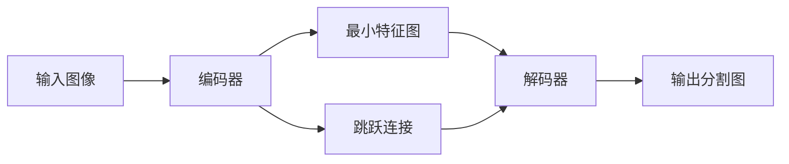

# UNet原理与代码实例讲解

## 1. 背景介绍

在医学图像分割领域，准确快速地从复杂的医学图像中提取出感兴趣的区域一直是一个挑战。2015年，Olaf Ronneberger等人提出了UNet，这是一个基于卷积神经网络的架构，专为医学图像分割任务设计。UNet的提出标志着医学图像分割领域的一个重大突破，它不仅在多个标准数据集上取得了优异的性能，而且由于其独特的网络结构，也为后续的研究提供了新的思路。

## 2. 核心概念与联系

UNet的核心概念在于其对称的U型结构，它包含一个收缩路径（编码器）和一个对称的扩展路径（解码器）。编码器用于捕获图像的上下文信息，而解码器则用于精确定位感兴趣的区域。两者之间的跳跃连接（skip connections）保证了在网络的高层也能够保留足够的位置信息。



## 3. 核心算法原理具体操作步骤

UNet的操作步骤可以分为以下几个阶段：

1. **收缩路径**：通过连续的卷积层和池化层，逐步降低图像的空间维度，同时增加特征通道数。
2. **最小特征图**：在收缩路径的最底部，得到具有丰富特征的最小特征图。
3. **扩展路径**：通过上采样和卷积层，逐步恢复图像的空间维度，同时减少特征通道数。
4. **跳跃连接**：将收缩路径中的特征图与扩展路径中的特征图进行拼接，以保留细节和上下文信息。
5. **输出层**：最后通过一个1x1的卷积将特征图转换为最终的分割图。

## 4. 数学模型和公式详细讲解举例说明

UNet的数学模型主要基于卷积神经网络（CNN）的基本原理。卷积层的数学表达为：

$$
f_{i,j}^{(l)} = \sigma\left(\sum_{m=0}^{M-1}\sum_{n=0}^{N-1}w_{m,n}^{(l)} \cdot x_{i+m,j+n}^{(l-1)} + b^{(l)}\right)
$$

其中，$f_{i,j}^{(l)}$ 是第 $l$ 层在位置 $(i, j)$ 的特征图的激活值，$\sigma$ 是激活函数，$w_{m,n}^{(l)}$ 是卷积核的权重，$x_{i+m,j+n}^{(l-1)}$ 是前一层的输入，$b^{(l)}$ 是偏置项，$M$ 和 $N$ 分别是卷积核的高度和宽度。

在UNet中，跳跃连接的操作可以看作是特征图的拼接，数学上表示为：

$$
F^{(l)} = \text{concat}\left(F_{\text{enc}}^{(l)}, F_{\text{dec}}^{(l)}\right)
$$

其中，$F^{(l)}$ 是第 $l$ 层的特征图，$F_{\text{enc}}^{(l)}$ 和 $F_{\text{dec}}^{(l)}$ 分别是编码器和解码器在第 $l$ 层的特征图。

## 5. 项目实践：代码实例和详细解释说明

在实践中，UNet的实现可以用以下Python代码示例表示：

```python
import torch
import torch.nn as nn

class UNet(nn.Module):
    def __init__(self):
        super(UNet, self).__init__()
        # 定义UNet的编码器部分
        # ...

        # 定义UNet的解码器部分
        # ...

    def forward(self, x):
        # 前向传播过程
        # ...

        return output

# 实例化模型并进行训练
model = UNet()
# ... 训练代码
```

在这个代码框架中，我们需要填充编码器和解码器的具体层次结构，以及前向传播的具体操作。

## 6. 实际应用场景

UNet在医学图像分割领域有广泛的应用，例如：

- 细胞分割
- 肿瘤检测
- 器官定位

## 7. 工具和资源推荐

- **PyTorch**：一个开源的机器学习库，适合于快速实验和研究。
- **TensorFlow**：谷歌开发的另一个强大的开源机器学习库。
- **Medical Segmentation Decathlon**：一个医学图像分割的标准数据集，包含多种不同的医学图像分割任务。

## 8. 总结：未来发展趋势与挑战

UNet自提出以来，已经成为医学图像分割领域的一个重要基准。未来的发展趋势可能包括：

- **网络结构的优化**：如何设计更高效的网络结构以处理更大的图像和更复杂的任务。
- **深度学习与其他领域的结合**：如何将深度学习与其他领域（如生物信息学）结合，以解决更多类型的问题。

## 9. 附录：常见问题与解答

- **Q: UNet适用于哪些类型的图像分割任务？**
- **A:** UNet最初是为医学图像分割设计的，但其强大的特征提取能力也使其适用于其他类型的图像分割任务。

- **Q: UNet的性能瓶颈在哪里？**
- **A:** UNet的性能瓶颈可能在于其对于大尺寸图像的处理能力有限，以及在处理极其复杂的图像时可能需要更深的网络结构。

作者：禅与计算机程序设计艺术 / Zen and the Art of Computer Programming