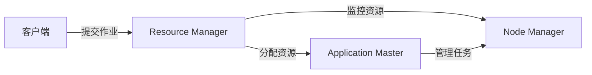

## 1. 背景介绍

在大数据处理领域，资源管理是一个至关重要的问题。Apache Hadoop YARN（Yet Another Resource Negotiator）是Hadoop平台上的资源管理和作业调度子系统。YARN允许多个数据处理引擎如MapReduce、Spark等在同一平台上高效地进行资源共享和调度。YARN的核心组件之一是Resource Manager（RM），它负责整个集群资源的管理和作业调度。

## 2. 核心概念与联系

YARN架构主要包括三个核心组件：Resource Manager、Node Manager和Application Master。Resource Manager是全局的资源管理器，负责资源的分配和调度；Node Manager是每个节点上的资源和任务管理器；Application Master负责协调运行在YARN上的应用程序，包括资源需求的申请和任务的监控。



## 3. 核心算法原理具体操作步骤

Resource Manager的核心算法包括资源请求解析、资源分配和调度。当Application Master向Resource Manager申请资源时，Resource Manager会根据集群的资源使用情况、作业的优先级和资源请求的约束条件来决定资源分配。

1. 解析资源请求：Application Master发送资源请求到Resource Manager。
2. 计算资源分配：Resource Manager使用调度算法计算资源分配方案。
3. 分配资源：Resource Manager向Application Master分配资源，并通知Node Manager启动任务。

## 4. 数学模型和公式详细讲解举例说明

YARN的资源调度可以用数学模型来描述。假设集群中有 $ N $ 个节点，每个节点有 $ M $ 类资源。每个作业 $ J $ 需要 $ R_{j} $ 类资源，每类资源的需求量为 $ r_{j,m} $。Resource Manager的目标是最大化资源利用率和作业满意度。

$$
\text{maximize} \quad U = \sum_{j=1}^{J} \sum_{m=1}^{M} u_{j,m} \cdot x_{j,m}
$$

其中，$ u_{j,m} $ 是作业 $ J $ 对资源 $ m $ 的满意度，$ x_{j,m} $ 是实际分配给作业 $ J $ 的资源 $ m $ 的数量。

## 5. 项目实践：代码实例和详细解释说明

以下是一个简单的YARN资源请求的代码示例：

```java
// 初始化YARN客户端
YarnClient yarnClient = YarnClient.createYarnClient();
yarnClient.init(conf);
yarnClient.start();

// 创建应用程序提交上下文
ApplicationSubmissionContext appContext = yarnClient.createApplication().getApplicationSubmissionContext();
ApplicationId appId = appContext.getApplicationId();

// 设置应用程序名称和其他参数
appContext.setApplicationName("example-app");

// 创建资源需求
Resource capability = Resource.newInstance(1024, 1);
appContext.setResource(capability);

// 提交应用程序
yarnClient.submitApplication(appContext);
```

这段代码首先初始化了YARN客户端，然后创建了一个应用程序提交上下文，并设置了应用程序的名称和资源需求。最后，提交应用程序到YARN集群。

## 6. 实际应用场景

YARN广泛应用于大数据分析、实时数据处理和机器学习等场景。例如，在一个大数据分析项目中，YARN可以有效地管理Hadoop集群资源，确保各种数据处理任务如MapReduce、Spark作业能够高效运行。

## 7. 工具和资源推荐

- Apache Hadoop YARN官方文档
- Hadoop: The Definitive Guide
- YARN权威指南

这些资源可以帮助读者更深入地理解YARN的工作原理和最佳实践。

## 8. 总结：未来发展趋势与挑战

随着云计算和容器技术的发展，YARN也在不断进化以支持更多类型的资源管理和调度。未来，YARN可能会更加灵活地支持多种计算框架和环境，同时面临着资源隔离、安全性和多租户等挑战。

## 9. 附录：常见问题与解答

Q1: YARN和传统的Hadoop MapReduce有什么区别？
A1: YARN提供了更灵活的资源管理和调度机制，允许多种计算框架在同一集群上运行，而不仅限于MapReduce。

Q2: 如何调优YARN集群的性能？
A2: 可以通过调整资源分配策略、优化作业配置和升级硬件等方式来提升YARN集群的性能。

作者：禅与计算机程序设计艺术 / Zen and the Art of Computer Programming