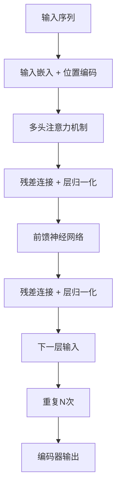
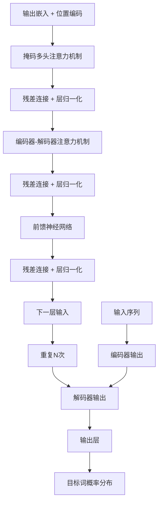

# transformer 原理与代码实例讲解

## 1.背景介绍

在自然语言处理(NLP)和序列数据建模领域,Transformer模型是一种革命性的架构,它完全依赖于注意力机制,摒弃了传统序列模型中的递归和卷积结构。自2017年被提出以来,Transformer模型在机器翻译、文本生成、语音识别等多个领域展现出卓越的性能,成为深度学习领域最成功的模型之一。

Transformer模型的核心思想是利用注意力机制捕捉序列数据中长距离依赖关系,避免了RNN/LSTM等模型存在的长期依赖问题。同时,Transformer完全基于并行计算,可以充分利用现代硬件(GPU/TPU)的并行计算能力,大幅提升模型的训练和推理效率。

## 2.核心概念与联系

Transformer模型主要由编码器(Encoder)和解码器(Decoder)两个子模块组成。编码器用于处理输入序列,解码器则负责生成目标序列。两个子模块均由多个相同的层组成,每一层包含多头注意力机制(Multi-Head Attention)和前馈神经网络(Feed-Forward Neural Network)。

### 2.1 注意力机制(Attention Mechanism)

注意力机制是Transformer模型的核心,它能够捕捉序列数据中任意两个位置之间的依赖关系。与RNN/LSTM不同,注意力机制不需要按序计算每个时间步,而是通过计算查询(Query)、键(Key)和值(Value)之间的相似性,直接获取序列中所有位置的信息。

在多头注意力机制中,查询、键和值通过不同的线性投影得到多组表示,从而从不同的子空间捕捉序列的不同依赖关系。最后,多头注意力的结果拼接并通过前馈神经网络进一步处理。

### 2.2 位置编码(Positional Encoding)

由于Transformer模型完全基于注意力机制,缺乏捕捉序列顺序信息的能力。因此,需要为序列的每个位置添加位置编码,以提供位置信息。常见的位置编码方法包括正弦/余弦编码、学习的位置嵌入等。

### 2.3 层归一化(Layer Normalization)

为了加速模型收敛并提高泛化能力,Transformer模型在每一层的输入端都应用了层归一化操作。层归一化可以看作是批归一化在时间维度上的特殊情况,能够有效缓解梯度消失/爆炸问题。

### 2.4 残差连接(Residual Connection)

为了更好地传递低层信息,Transformer模型在每一层的输出端都采用了残差连接,将输入和输出相加。残差连接有助于梯度反向传播,提高了模型的优化效率。

## 3.核心算法原理具体操作步骤

### 3.1 编码器(Encoder)

编码器的主要作用是将输入序列映射为一系列连续的表示,为解码器提供所需的上下文信息。编码器由N个相同的层组成,每一层包含两个子层:多头注意力机制和前馈神经网络。

1. **输入嵌入(Input Embedding)**: 将输入序列的每个词token映射为一个连续的向量表示,并与位置编码相加,作为编码器的输入。

2. **多头注意力机制(Multi-Head Attention)**: 在每一层,输入序列通过多头注意力机制捕捉序列内部的依赖关系,生成注意力表示。

3. **残差连接(Residual Connection)和层归一化(Layer Normalization)**: 注意力表示与输入相加,并通过层归一化操作,形成该层的输出。

4. **前馈神经网络(Feed-Forward Neural Network)**: 该层的输出通过两个线性变换和一个ReLU激活函数,生成该层的最终输出表示。

5. **残差连接和层归一化**: 类似于注意力子层,前馈神经网络的输出与输入相加,并通过层归一化操作。

6. **层堆叠(Layer Stacking)**: 将上一层的输出作为下一层的输入,重复上述步骤N次。编码器的最终输出是最后一层的输出表示。



### 3.2 解码器(Decoder)

解码器的作用是根据编码器的输出表示和输入序列,生成目标序列。解码器的结构与编码器类似,也由N个相同的层组成,但每一层包含三个子层:掩码多头注意力机制、编码器-解码器注意力机制和前馈神经网络。

1. **输出嵌入(Output Embedding)**: 将输出序列的前一个词token映射为连续向量表示,并与位置编码相加,作为解码器的输入。

2. **掩码多头注意力机制(Masked Multi-Head Attention)**: 在生成每个目标词时,只允许关注之前的输出词,忽略之后的输出词。这种掩码机制确保了模型的自回归性质。

3. **残差连接和层归一化**: 与编码器类似。

4. **编码器-解码器注意力机制(Encoder-Decoder Attention)**: 解码器关注编码器的输出表示,捕捉输入和输出序列之间的依赖关系。

5. **残差连接和层归一化**: 与编码器类似。

6. **前馈神经网络(Feed-Forward Neural Network)**: 与编码器类似。

7. **残差连接和层归一化**: 与编码器类似。

8. **层堆叠(Layer Stacking)**: 将上一层的输出作为下一层的输入,重复上述步骤N次。解码器的最终输出是最后一层的输出表示。

9. **输出层(Output Layer)**: 将解码器的输出表示通过线性层和softmax层,生成下一个目标词的概率分布。



## 4.数学模型和公式详细讲解举例说明

### 4.1 注意力机制(Attention Mechanism)

注意力机制是Transformer模型的核心,它能够直接捕捉序列中任意两个位置之间的依赖关系。给定一个查询(Query) $q$、一组键(Keys) $K=\{k_1, k_2, \dots, k_n\}$和一组值(Values) $V=\{v_1, v_2, \dots, v_n\}$,注意力机制的计算过程如下:

1. 计算查询与每个键之间的相似性分数:

$$\text{Score}(q, k_i) = \frac{q \cdot k_i^T}{\sqrt{d_k}}$$

其中,分母项 $\sqrt{d_k}$ 是为了防止内积值过大导致softmax饱和。

2. 对相似性分数应用softmax函数,得到注意力权重:

$$\text{Attention}(q, k_i, v_i) = \text{softmax}(\text{Score}(q, k_i))v_i$$

3. 将注意力权重与对应的值相乘并求和,得到注意力输出:

$$\text{Attention}(q, K, V) = \sum_{i=1}^n \text{Attention}(q, k_i, v_i)$$

在实际应用中,查询、键和值通常来自同一个输入序列,但经过不同的线性投影,以捕捉序列的不同表示。

### 4.2 多头注意力机制(Multi-Head Attention)

为了从不同的子空间捕捉序列的不同依赖关系,Transformer模型采用了多头注意力机制。具体来说,查询、键和值被分别投影到 $h$ 个不同的子空间,在每个子空间中计算注意力,最后将 $h$ 个注意力头的输出拼接起来:

$$\begin{aligned}
\text{MultiHead}(Q, K, V) &= \text{Concat}(\text{head}_1, \dots, \text{head}_h)W^O\\
\text{where } \text{head}_i &= \text{Attention}(QW_i^Q, KW_i^K, VW_i^V)
\end{aligned}$$

其中,投影矩阵 $W_i^Q \in \mathbb{R}^{d_\text{model} \times d_k}$、$W_i^K \in \mathbb{R}^{d_\text{model} \times d_k}$、$W_i^V \in \mathbb{R}^{d_\text{model} \times d_v}$ 和 $W^O \in \mathbb{R}^{hd_v \times d_\text{model}}$ 是可学习的参数。

### 4.3 位置编码(Positional Encoding)

由于Transformer模型完全基于注意力机制,缺乏捕捉序列顺序信息的能力。因此,需要为序列的每个位置添加位置编码,以提供位置信息。常见的位置编码方法是正弦/余弦编码,其公式如下:

$$\begin{aligned}
\text{PE}_{(pos, 2i)} &= \sin\left(\frac{pos}{10000^{2i/d_\text{model}}}\right)\\
\text{PE}_{(pos, 2i+1)} &= \cos\left(\frac{pos}{10000^{2i/d_\text{model}}}\right)
\end{aligned}$$

其中,pos是词在序列中的位置,i是维度的索引。这种编码方式能够很好地捕捉相对位置和绝对位置信息。

## 5.项目实践:代码实例和详细解释说明

以下是使用PyTorch实现Transformer模型的简化版本代码,包括编码器、解码器和注意力机制的核心部分。为了方便理解,我们省略了一些辅助函数和超参数设置。

### 5.1 导入所需库

```python
import math
import torch
import torch.nn as nn
```

### 5.2 实现注意力机制

```python
class Attention(nn.Module):
    def __init__(self, d_model, h, mask=None):
        super(Attention, self).__init__()
        self.d_k = d_model // h
        self.h = h
        self.linears = nn.ModuleList([nn.Linear(d_model, d_model, bias=False) for _ in range(3)])
        self.output_linear = nn.Linear(d_model, d_model)
        self.attn = None
        self.mask = mask

    def attention(self, query, key, value, mask=None):
        scores = torch.matmul(query, key.transpose(-2, -1)) / math.sqrt(self.d_k)
        if mask is not None:
            scores = scores.masked_fill(mask == 0, -1e9)
        attn = nn.Softmax(dim=-1)(scores)
        context = torch.matmul(attn, value)
        return context, attn

    def forward(self, query, key, value, mask=None):
        batch_size = query.size(0)
        query, key, value = [l(x).view(batch_size, -1, self.h, self.d_k).transpose(1, 2)
                             for l, x in zip(self.linears, (query, key, value))]
        context, attn = self.attention(query, key, value, mask=mask)
        context = context.transpose(1, 2).contiguous().view(batch_size, -1, self.h * self.d_k)
        output = self.output_linear(context)
        self.attn = attn
        return output
```

这段代码实现了注意力机制的核心逻辑。`Attention`类继承自`nn.Module`。在`__init__`方法中,我们初始化了三个线性层,用于投影查询、键和值。`attention`方法计算注意力权重和加权值的和。`forward`方法则将查询、键和值分别投影到多个注意力头,计算每个头的注意力输出,最后将所有头的输出拼接并通过一个线性层。

### 5.3 实现编码器层

```python
class EncoderLayer(nn.Module):
    def __init__(self, d_model, ffn_hidden, n_head, drop_prob):
        super(EncoderLayer, self).__init__()
        self.attention = Attention(d_model, n_head)
        self.norm1 = nn.LayerN