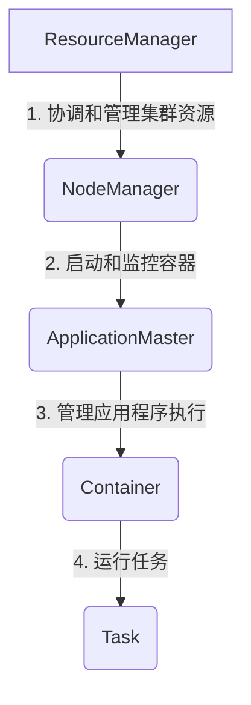

# 【AI大数据计算原理与代码实例讲解】ApplicationMaster

## 1. 背景介绍

在当今大数据时代,海量数据的存储、处理和分析成为了一个巨大的挑战。Apache Hadoop作为一个分布式系统基础架构,为大规模数据处理提供了可靠、高效的解决方案。Hadoop生态圈中,YARN(Yet Another Resource Negotiator)作为新一代资源管理和调度框架,为集群资源管理和任务调度提供了强大的支持。

作为YARN的核心组件之一,ApplicationMaster在整个任务执行过程中扮演着至关重要的角色。它负责协调和管理应用程序的执行,包括申请资源、启动容器、监控任务进度等。本文将深入探讨ApplicationMaster的工作原理、核心算法、实现细节以及实际应用场景,为读者提供全面的理解和实践指导。

## 2. 核心概念与联系

### 2.1 YARN架构概览



YARN架构主要由以下几个核心组件组成:

- **ResourceManager(RM)**: 集群资源管理和调度的主导者,负责处理来自客户端的作业请求,并将作业分配给适当的NodeManager。
- **NodeManager(NM)**: 运行在集群每个节点上,负责管理节点上的资源,并监控和启动容器。
- **ApplicationMaster(AM)**: 每个应用程序都有一个专属的AM进程,负责协调应用程序的执行,包括申请资源、启动容器、监控任务进度等。
- **Container**: AM启动的容器,用于运行具体的任务。

ApplicationMaster作为应用程序执行的大脑,与ResourceManager和NodeManager紧密协作,实现了资源的高效利用和任务的可靠执行。

### 2.2 ApplicationMaster生命周期

ApplicationMaster的生命周期可分为以下几个阶段:

1. **启动**: 当应用程序提交到YARN时,ResourceManager会为该应用程序分配一个容器来启动ApplicationMaster进程。
2. **资源申请**: ApplicationMaster向ResourceManager申请运行任务所需的资源(CPU、内存等)。
3. **容器分配**: ResourceManager根据集群资源状况,将容器分配给ApplicationMaster。
4. **任务执行**: ApplicationMaster在分配的容器中启动具体的任务,并监控任务执行进度。
5. **资源释放**: 任务执行完毕后,ApplicationMaster释放占用的资源。
6. **终止**: ApplicationMaster完成工作后终止运行。

## 3. 核心算法原理具体操作步骤

### 3.1 资源申请算法

ApplicationMaster采用基于容量调度器(Capacity Scheduler)的资源申请算法,该算法主要包括以下步骤:

1. **计算应用程序资源需求**: ApplicationMaster根据作业的输入数据大小、任务数量等信息,计算出作业所需的总资源量。
2. **确定资源池**: 根据作业的队列信息,确定该作业所属的资源池。
3. **计算资源池可用资源**: 容量调度器计算该资源池当前的可用资源量。
4. **资源申请**: ApplicationMaster向ResourceManager申请所需资源,申请量不超过资源池可用资源量和作业总需求量的较小值。
5. **资源分配**: ResourceManager根据集群资源状况,将可用资源分配给ApplicationMaster。
6. **重复申请**: 如果分配的资源不足以满足作业需求,ApplicationMaster会重复执行步骤4和5,直到获取足够的资源。

该算法保证了资源的合理分配,避免了资源浪费和任务饥饿等问题。

### 3.2 任务调度算法

ApplicationMaster采用延迟调度算法(Delay Scheduling)来调度任务,该算法主要包括以下步骤:

1. **计算任务本地性**: 对于每个待执行的任务,计算其输入数据在集群节点上的本地性,即数据与计算节点的距离。
2. **构建节点映射表**: 将节点按照与任务数据的距离由近及远排序,构建节点映射表。
3. **延迟调度**: 首先尝试将任务调度到与数据最近的节点上。如果该节点没有足够的资源,则延迟一段时间后,尝试调度到下一个最近的节点。
4. **资源分配**: 当找到合适的节点后,ApplicationMaster向该节点的NodeManager申请资源,启动容器来执行任务。

延迟调度算法可以最大限度地利用数据本地性,从而减少数据传输开销,提高任务执行效率。

## 4. 数学模型和公式详细讲解举例说明

### 4.1 资源分配模型

在YARN中,资源分配是一个复杂的优化问题。我们可以使用线性规划模型来描述和求解这个问题。

假设集群中有$N$个节点,每个节点$i$的可用资源为$(R_i^{CPU}, R_i^{MEM})$,表示CPU和内存资源。有$M$个应用程序,每个应用程序$j$的资源需求为$(D_j^{CPU}, D_j^{MEM})$。我们的目标是最大化集群资源利用率,同时满足每个应用程序的资源需求。

该问题可以用以下线性规划模型表示:

$$
\begin{aligned}
\max \quad & \sum_{i=1}^{N} \sum_{j=1}^{M} (a_{ij}^{CPU} + a_{ij}^{MEM}) \\
\text{s.t.} \quad & \sum_{i=1}^{N} a_{ij}^{CPU} \geq D_j^{CPU}, \quad \forall j \in \{1, \ldots, M\} \\
& \sum_{i=1}^{N} a_{ij}^{MEM} \geq D_j^{MEM}, \quad \forall j \in \{1, \ldots, M\} \\
& \sum_{j=1}^{M} a_{ij}^{CPU} \leq R_i^{CPU}, \quad \forall i \in \{1, \ldots, N\} \\
& \sum_{j=1}^{M} a_{ij}^{MEM} \leq R_i^{MEM}, \quad \forall i \in \{1, \ldots, N\} \\
& a_{ij}^{CPU}, a_{ij}^{MEM} \geq 0, \quad \forall i \in \{1, \ldots, N\}, \forall j \in \{1, \ldots, M\}
\end{aligned}
$$

其中,$a_{ij}^{CPU}$和$a_{ij}^{MEM}$分别表示分配给应用程序$j$在节点$i$上的CPU和内存资源量。

该模型的目标函数是最大化集群资源利用率,约束条件包括:

1. 每个应用程序的CPU和内存需求必须得到满足。
2. 每个节点分配的CPU和内存资源不能超过其可用资源。
3. 分配的资源量必须为非负数。

通过求解这个线性规划模型,我们可以得到最优的资源分配方案,从而提高集群资源利用效率。

### 4.2 数据本地性评估

在延迟调度算法中,评估任务与数据的本地性是一个关键步骤。我们可以使用以下公式来量化任务与数据的距离:

$$
dist(task, data) = \sum_{i=1}^{N} \sum_{j=1}^{M} w_{ij} \cdot d_{ij}
$$

其中:

- $N$是集群中节点的数量
- $M$是任务输入数据块的数量
- $w_{ij}$是数据块$j$在节点$i$上的权重,如果数据块存在于该节点,则权重为1,否则为0
- $d_{ij}$是节点$i$到数据块$j$所在节点的网络距离

该公式计算了任务与所有输入数据块之间的加权距离之和。距离越小,表示任务与数据的本地性越好。

基于这个距离度量,我们可以构建节点映射表,将节点按照与任务数据的距离由近及远排序。在延迟调度过程中,ApplicationMaster会优先尝试将任务调度到与数据最近的节点上,从而减少数据传输开销。

## 5. 项目实践: 代码实例和详细解释说明

为了更好地理解ApplicationMaster的工作原理,我们将通过一个实际项目案例来演示其核心功能的实现。该项目是一个基于Hadoop YARN的分布式词频统计应用程序。

### 5.1 项目结构

```
wordcount-app/
├── pom.xml
├── src/
│   ├── main/
│   │   ├── java/
│   │   │   └── com/
│   │   │       └── example/
│   │   │           ├── WordCountAM.java
│   │   │           ├── WordCountMapper.java
│   │   │           └── WordCountReducer.java
│   │   └── resources/
│   │       └── log4j.properties
│   └── test/
│       └── java/
│           └── com/
│               └── example/
│                   └── WordCountAMTest.java
└── README.md
```

该项目包括以下主要组件:

- `WordCountAM.java`: ApplicationMaster的实现,负责资源申请、任务调度和监控。
- `WordCountMapper.java`: MapReduce作业的Map阶段实现,用于对输入数据进行词频统计。
- `WordCountReducer.java`: MapReduce作业的Reduce阶段实现,用于合并和统计词频结果。

### 5.2 ApplicationMaster实现

`WordCountAM.java`是整个应用程序的核心,它继承自`ApplicationMaster`类,并实现了以下主要方法:

1. `init()`方法: 在ApplicationMaster启动时被调用,用于初始化作业配置和资源需求。

```java
@Override
public void init(String[] args) {
    // 初始化作业配置
    conf = new Configuration();
    conf.set("mapreduce.job.maps", args[0]);
    conf.set("mapreduce.job.reduces", args[1]);

    // 计算资源需求
    int numMappers = Integer.parseInt(args[0]);
    int numReducers = Integer.parseInt(args[1]);
    int memoryPerMapper = 1024; // 1GB
    int memoryPerReducer = 2048; // 2GB
    int totalMemoryRequired = numMappers * memoryPerMapper + numReducers * memoryPerReducer;

    // 申请资源
    Resource capability = Resource.newInstance(totalMemoryRequired, 1);
    amRmClient.addContainerRequest(new AMRMClient.ContainerRequest(capability, null, null, RM_REQUEST_PRIORITY));
}
```

2. `startContainer()`方法: 当ApplicationMaster获取到容器资源时被调用,用于启动Map或Reduce任务。

```java
@Override
public void startContainer(ContainerLaunchContext containerLaunchContext) {
    // 判断是启动Map任务还是Reduce任务
    if (numStartedMappers < numMappers) {
        // 启动Map任务
        startMapper(containerLaunchContext);
        numStartedMappers++;
    } else if (numStartedReducers < numReducers) {
        // 启动Reduce任务
        startReducer(containerLaunchContext);
        numStartedReducers++;
    }
}
```

3. `startMapper()`和`startReducer()`方法: 分别用于启动Map和Reduce任务容器,设置相应的命令行参数和环境变量。

4. `monitorTasks()`方法: 持续监控任务的执行进度,并在所有任务完成后释放资源和终止ApplicationMaster。

```java
private void monitorTasks() {
    while (numCompletedMappers < numMappers || numCompletedReducers < numReducers) {
        // 获取任务进度报告
        List<ContainerStatus> containerStatuses = amRmClient.getContainerStatuses(jobId);
        for (ContainerStatus status : containerStatuses) {
            if (status.getState() == ContainerState.COMPLETE) {
                if (status.getExitStatus() == 0) {
                    // 任务成功完成
                    if (status.getContainerType() == ContainerType.MAP) {
                        numCompletedMappers++;
                    } else {
                        numCompletedReducers++;
                    }
                } else {
                    // 任务失败
                    handleFailedTask(status);
                }
            }
        }
    }

    // 所有任务完成后释放资源并终止ApplicationMaster
    amRmClient.unregisterApplicationMaster(FinalApplicationStatus.SUCCEEDED, "", "");
}
```

通过这些核心方法的实现,ApplicationMaster能够协调和管理整个词频统计应用程序的执行过程。

## 6. 实际应用场景

ApplicationMaster在许多大数据处理场景中发挥着重要作用,以下是一些典型的应用场景:

1. **大数据分析**: 在大数据分析领域,ApplicationMaster可以用于管理和执行各种分析任务,如Hive查询、Spark作业等