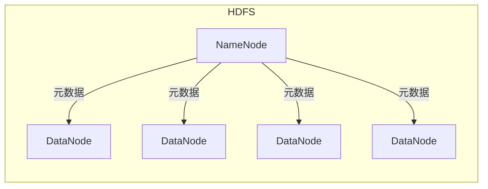
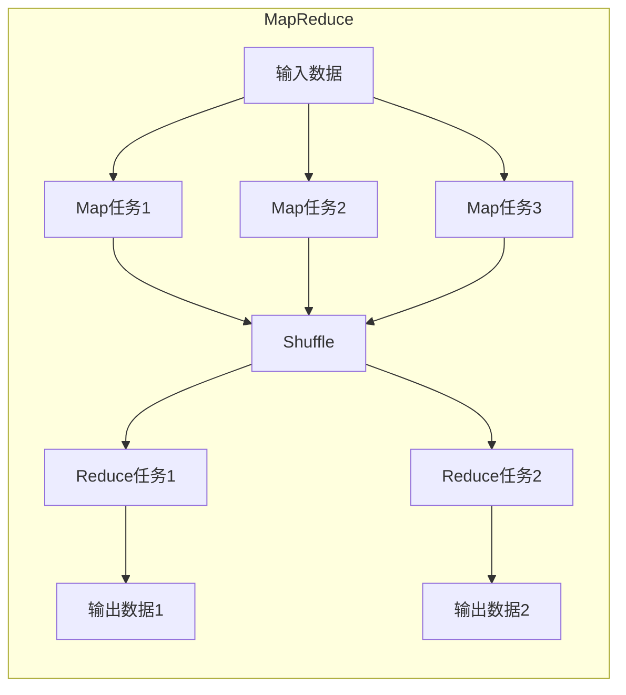
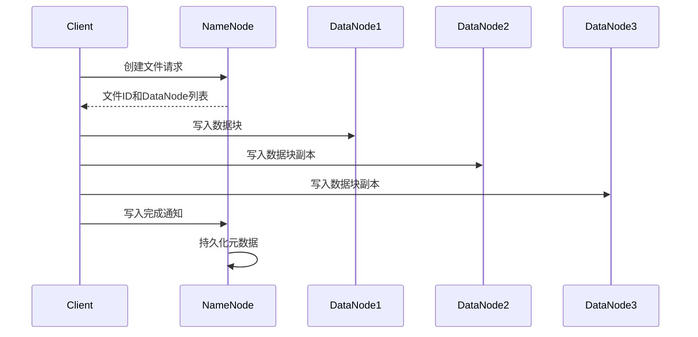
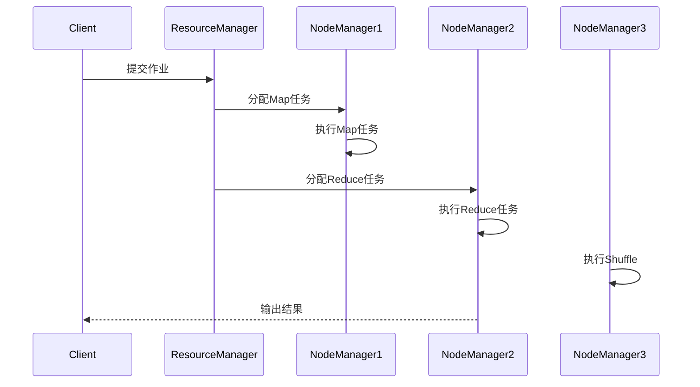

# 【AI大数据计算原理与代码实例讲解】Hadoop

## 1.背景介绍

### 1.1 大数据时代的到来

随着互联网、移动互联网、物联网等新兴技术的快速发展,海量的数据正以前所未有的规模和速度不断产生。这些数据来源于各个领域,包括社交媒体、电子商务、金融交易、物联网设备等。传统的数据处理系统已经无法有效地处理如此庞大的数据量,因此迫切需要一种新的计算模型和框架来满足大数据时代的需求。

### 1.2 大数据挑战

大数据带来了诸多挑战,主要体现在以下几个方面:

1. **数据量大**:数据量已经从TB级别增长到PB甚至EB级别,远远超出了传统数据库系统的处理能力。
2. **种类繁多**:数据种类包括结构化数据(如关系型数据库)、半结构化数据(如XML、JSON)和非结构化数据(如图像、视频、文本等)。
3. **增长迅速**:数据以前所未有的速度不断增长,需要实时处理和分析。
4. **价值密度低**:大部分数据是低价值密度的,需要从海量数据中发掘出有价值的信息。

### 1.3 Hadoop的诞生

为了解决大数据带来的挑战,Apache Hadoop应运而生。Hadoop是一个开源的分布式计算框架,它可以在廉价的商用硬件集群上运行,具有高可靠性、高可扩展性、高性能和高容错性等特点。Hadoop的核心设计理念是"移动计算而非移动数据",即将计算任务分发到数据所在的节点上进行计算,从而避免了大量数据在网络上的传输。

## 2.核心概念与联系

### 2.1 Hadoop生态系统

Hadoop生态系统包括多个子项目,共同构建了一个完整的大数据处理平台。主要组件包括:

- **HDFS**(Hadoop Distributed File System):分布式文件系统,用于存储大规模数据。
- **YARN**(Yet Another Resource Negotiator):资源管理和任务调度系统。
- **MapReduce**:分布式计算框架,用于大规模数据处理。
- **Hive**:基于SQL的数据仓库工具,用于结构化数据分析。
- **HBase**:分布式列存储数据库,适用于海量数据的随机实时读写。
- **Spark**:内存计算框架,比MapReduce更高效。
- **Kafka**:分布式流处理平台,用于实时数据处理。
- **Zookeeper**:分布式协调服务,用于维护配置信息和集群状态。

这些组件相互配合,为大数据的存储、计算、分析等提供了完整的解决方案。

### 2.2 HDFS架构

HDFS是Hadoop分布式文件系统的核心组件,它采用主从架构,由一个NameNode(名称节点)和多个DataNode(数据节点)组成。



- **NameNode**负责管理文件系统的命名空间和客户端对文件的访问,维护文件系统的目录树及文件与块的映射关系。
- **DataNode**负责实际存储文件数据块,并定期向NameNode发送心跳信号和块报告,汇报自身状态。

HDFS将文件切分为多个块(Block),并在多个DataNode上存储多个副本,从而实现高容错性和高吞吐量。

### 2.3 MapReduce计算模型

MapReduce是Hadoop的核心计算模型,它将大规模计算任务分解为两个阶段:Map阶段和Reduce阶段。



- **Map阶段**:将输入数据划分为多个Split,并为每个Split启动一个Map任务,执行用户自定义的Map函数,产生中间结果。
- **Shuffle阶段**:对Map阶段产生的中间结果进行归并和分组,为Reduce阶段做准备。
- **Reduce阶段**:对Shuffle阶段输出的数据进行处理,执行用户自定义的Reduce函数,产生最终结果。

MapReduce模型支持大规模数据的并行处理,具有高容错性和高可扩展性。

## 3.核心算法原理具体操作步骤

### 3.1 HDFS写数据流程

当客户端向HDFS写入数据时,会经历以下步骤:

1. 客户端向NameNode发送创建文件的请求。
2. NameNode检查文件是否已存在,如果不存在,则为该文件分配一个新的文件ID。
3. NameNode选择一组DataNode用于存储该文件的数据块副本。
4. NameNode将文件ID和DataNode列表返回给客户端。
5. 客户端开始向DataNode写入数据块,并根据副本策略将数据块复制到其他DataNode。
6. 当数据写入完成后,客户端通知NameNode写入操作已完成。
7. NameNode将元数据持久化到磁盘,以便在重启时恢复。



### 3.2 MapReduce执行流程

当客户端提交一个MapReduce作业时,会经历以下步骤:

1. 客户端将作业提交给ResourceManager。
2. ResourceManager将作业划分为多个Task,并将Task分配给各个NodeManager。
3. NodeManager启动Container,在Container中运行Map或Reduce任务。
4. Map任务读取输入数据,执行Map函数,产生中间结果。
5. Shuffle阶段对Map任务的输出进行归并和分组。
6. Reduce任务读取Shuffle阶段的输出,执行Reduce函数,产生最终结果。
7. 客户端从HDFS读取最终结果。



## 4.数学模型和公式详细讲解举例说明

### 4.1 数据局部性原理

Hadoop的设计理念之一是"移动计算而非移动数据",这体现了数据局部性的重要性。数据局部性原理可以用以下公式表示:

$$
T_{total} = T_{computation} + T_{transfer}
$$

其中:
- $T_{total}$表示作业的总执行时间
- $T_{computation}$表示计算时间
- $T_{transfer}$表示数据传输时间

由于网络带宽有限,数据传输时间通常远大于计算时间,因此应尽量减少数据传输。Hadoop通过将计算任务调度到数据所在的节点上执行,从而最小化数据传输时间,提高整体性能。

### 4.2 数据复制策略

为了提高数据可靠性和可用性,HDFS采用了数据复制策略。每个数据块会存储多个副本,副本数量由复制因子(Replication Factor)决定,默认为3。复制因子的选择需要权衡可靠性和存储开销,可以用以下公式表示:

$$
S_{total} = S_{data} \times R
$$

其中:
- $S_{total}$表示总存储空间
- $S_{data}$表示原始数据大小
- $R$表示复制因子

复制因子越大,可靠性越高,但存储开销也越大。Hadoop会根据集群状态和数据热度动态调整复制因子,以实现最佳的性能和可靠性平衡。

### 4.3 MapReduce数据分片

在MapReduce作业中,输入数据会被划分为多个Split,每个Split由一个Map任务处理。Split的大小会影响作业的并行度和性能,通常Split大小设置为HDFS块大小(默认为128MB)的整数倍。Split大小可以用以下公式表示:

$$
S_{split} = n \times S_{block}
$$

其中:
- $S_{split}$表示Split大小
- $n$表示整数倍数
- $S_{block}$表示HDFS块大小

Split大小过小会导致过多的Map任务,增加调度开销;Split大小过大会导致数据倾斜,降低并行度。因此,需要根据具体场景合理设置Split大小。

## 5.项目实践:代码实例和详细解释说明

### 5.1 WordCount示例

WordCount是MapReduce编程中最典型的示例,它统计给定文本文件中每个单词出现的次数。下面是WordCount的Java代码实现:

```java
// Mapper类
public static class TokenizerMapper extends Mapper<Object, Text, Text, IntWritable> {
    private final static IntWritable one = new IntWritable(1);
    private Text word = new Text();

    public void map(Object key, Text value, Context context) throws IOException, InterruptedException {
        StringTokenizer itr = new StringTokenizer(value.toString());
        while (itr.hasMoreTokens()) {
            word.set(itr.nextToken());
            context.write(word, one);
        }
    }
}

// Reducer类
public static class IntSumReducer extends Reducer<Text, IntWritable, Text, IntWritable> {
    private IntWritable result = new IntWritable();

    public void reduce(Text key, Iterable<IntWritable> values, Context context) throws IOException, InterruptedException {
        int sum = 0;
        for (IntWritable val : values) {
            sum += val.get();
        }
        result.set(sum);
        context.write(key, result);
    }
}

// 主函数
public static void main(String[] args) throws Exception {
    Configuration conf = new Configuration();
    Job job = Job.getInstance(conf, "word count");
    job.setJarByClass(WordCount.class);
    job.setMapperClass(TokenizerMapper.class);
    job.setCombinerClass(IntSumReducer.class);
    job.setReducerClass(IntSumReducer.class);
    job.setOutputKeyClass(Text.class);
    job.setOutputValueClass(IntWritable.class);
    FileInputFormat.addInputPath(job, new Path(args[0]));
    FileOutputFormat.setOutputPath(job, new Path(args[1]));
    System.exit(job.waitForCompletion(true) ? 0 : 1);
}
```

代码解释:

1. **Mapper**类实现了`map`函数,将输入文本按空格分割为单词,并为每个单词输出`(word, 1)`键值对。
2. **Reducer**类实现了`reduce`函数,将相同单词的计数值累加,并输出`(word, count)`键值对。
3. 在主函数中,设置作业配置,指定Mapper、Combiner和Reducer类,以及输入输出路径。
4. `Job.waitForCompletion(true)`提交作业并等待执行完成。

运行WordCount示例:

```bash
# 编译代码
$ hadoop com.sun.tools.javac.Main WordCount.java
# 创建输入文件
$ hadoop fs -mkdir -p /user/input
$ hadoop fs -put input.txt /user/input
# 运行MapReduce作业
$ hadoop jar hadoop-examples.jar WordCount /user/input /user/output
# 查看输出结果
$ hadoop fs -cat /user/output/part-r-00000
```

### 5.2 自定义MapReduce程序

除了WordCount这种基础示例,Hadoop还支持开发者编写自定义的MapReduce程序,以满足各种数据处理需求。下面是一个简单的自定义MapReduce程序示例,它统计每个文件的行数:

```java
// Mapper类
public static class LineMapper extends Mapper<LongWritable, Text, Text, IntWritable> {
    private final static IntWritable one = new IntWritable(1);
    private Text filename = new Text();

    protected void map(LongWritable key, Text value,