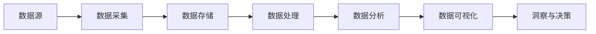

# 【AI大数据计算原理与代码实例讲解】大数据

## 1. 背景介绍

### 1.1 大数据时代的到来

随着互联网、物联网、移动互联网等技术的快速发展,数据呈现爆炸式增长。据统计,全球数据量每两年翻一番,预计到2025年,全球数据总量将达到175ZB。面对如此海量、多样化的数据,传统的数据处理和分析方法已经无法满足需求。大数据技术应运而生,为从海量数据中挖掘价值提供了新的途径。

### 1.2 大数据的定义与特征

大数据(Big Data)是指无法在一定时间范围内用常规软件工具进行捕捉、管理和处理的数据集合,需要新处理模式才能具有更强的决策力、洞察发现力和流程优化能力的海量、高增长率和多样化的信息资产。大数据具有4V特征:

- Volume(大量):数据量巨大,从TB级别到PB、EB、ZB级别
- Velocity(高速):数据产生和处理的速度很快,如实时流处理
- Variety(多样):数据类型和来源多样化,包括结构化、半结构化和非结构化数据
- Value(价值):大数据包含很多深度的价值,但密度很低

### 1.3 大数据的应用场景

大数据在各行各业得到广泛应用,为企业和组织创造了巨大价值,主要应用场景包括:

- 精准营销:分析用户行为、偏好等数据,实现个性化推荐和精准广告投放
- 金融风控:通过对交易数据、用户信息等分析,识别欺诈风险,优化信贷审批
- 智慧城市:收集和分析城市各类数据,优化城市管理,提升市民生活品质
- 工业制造:设备状态监测,产品质量分析,供应链优化等
- 医疗健康:医疗大数据分析,辅助诊断,药物研发,健康管理等

## 2. 核心概念与联系

### 2.1 分布式存储

海量数据需要分布式存储系统来支撑。常见的分布式文件系统有HDFS、GFS等,提供高吞吐量的数据读写能力。NoSQL数据库如HBase、Cassandra等,提供了高性能的随机读写和实时数据查询能力。

### 2.2 分布式计算

大数据处理需要分布式计算框架来实现。其代表性的技术有:

- MapReduce:由Google提出,用于大规模数据集的并行运算的编程模型
- Spark:专为大规模数据处理而设计的快速通用的计算引擎
- Flink:专注于流式计算和批处理的分布式大数据处理引擎

### 2.3 机器学习与数据挖掘

从海量数据中自动发现模式获得洞见,需要机器学习和数据挖掘技术。常见算法包括分类、聚类、关联规则、异常检测等。代表性的机器学习平台有Spark MLlib、TensorFlow、PyTorch等。

### 2.4 实时计算

很多场景需要对数据进行实时处理。流式计算框架如Storm、Spark Streaming、Flink等可以对数据进行实时的处理和分析。实时计算与离线处理相结合,可以快速响应业务需求。

### 2.5 可视化分析

将大数据的分析结果以可视化的方式呈现,可以帮助用户直观理解数据背后的价值。BI工具如Tableau、PowerBI,以及开源的可视化库如ECharts、D3.js等都是常用的可视化分析工具。

大数据处理流程可以用下面的Mermaid流程图来表示:



## 3. 核心算法原理具体操作步骤

### 3.1 MapReduce

MapReduce是一种分布式计算模型,用于在大规模集群上对海量数据进行并行处理。其核心思想是将大规模计算任务拆分成许多小的任务,然后由多台机器并行处理。

MapReduce主要分为两个阶段:Map和Reduce。

1. Map阶段:并行处理输入数据
   - 将数据集分割成若干独立的split,分配到不同节点
   - 在每个split上并行执行用户自定义的map函数,将数据转化为key-value对的形式
   - 对key-value对按key进行分区,将同一分区的数据发送到同一个reduce节点

2. Reduce阶段:对Map的输出结果进行合并
   - 对来自Map阶段的key-value对按key进行排序
   - 对排序后的数据执行用户自定义的reduce函数进行聚合
   - 将聚合结果输出到分布式文件系统

### 3.2 PageRank

PageRank是Google提出的一种用于评估网页重要性的算法,也是大数据分析中的经典算法。其基本思想是通过网页之间的链接关系计算网页的重要性得分。

PageRank计算步骤如下:

1. 初始化:为每个网页赋予相同的初始PageRank值,通常为1/N,N为网页总数

2. 迭代计算:根据下面的公式多次迭代计算每个网页的PageRank值,直到收敛
$$
PR(p_i) = \frac{1-d}{N} + d \sum_{p_j \in M(p_i)} \frac{PR(p_j)}{L(p_j)}
$$
其中:
- $PR(p_i)$:网页$p_i$的PageRank值
- $p_j$:存在指向$p_i$的链接的网页
- $M(p_i)$:指向网页$p_i$的网页集合
- $L(p_j)$:网页$p_j$的出链数量
- $N$:所有网页数
- $d$:阻尼系数,一般取0.85

3. 排序:根据计算得到的PageRank值对网页进行重要性排序

### 3.3 协同过滤

协同过滤是常用的推荐算法,通过分析用户或商品之间的相似性,给用户做个性化推荐。其基本假设是有相似兴趣的用户会喜欢相似的物品,喜欢相似物品的用户可能有相似的兴趣。

协同过滤主要分为两类:

1. 基于用户的协同过滤(UserCF)
   - 计算用户之间的相似度矩阵
   - 根据用户相似度和其他用户的评分,预测目标用户对物品的评分
   - 为目标用户推荐评分较高的物品

2. 基于物品的协同过滤(ItemCF) 
   - 计算物品之间的相似度矩阵
   - 根据用户的历史评分和物品相似度,预测用户对物品的评分
   - 为用户推荐评分较高的物品

## 4. 数学模型和公式详细讲解举例说明

### 4.1 TF-IDF

TF-IDF(Term Frequency-Inverse Document Frequency)是一种常用于文本挖掘和信息检索的加权技术。它可以用来评估一个词语对于一个文件集或一个语料库中的其中一份文件的重要程度。

- TF(词频):指词语t在文档d中出现的频率
$$
TF(t,d) = \frac{f_{t,d}}{\sum_{t' \in d} f_{t',d}}
$$
其中,$f_{t,d}$为词语t在文档d中出现的次数,$\sum_{t' \in d} f_{t',d}$为文档d中所有词语的出现次数之和。

- IDF(逆文档频率):衡量词语t对于一个文档集D的重要程度
$$
IDF(t,D) = \log \frac{|D|}{|\{d \in D: t \in d\}|}
$$
其中,|D|为文档集D中文档的总数,$|\{d \in D: t \in d\}|$为包含词语t的文档数。

- TF-IDF:将TF和IDF相乘得到
$$
TFIDF(t,d,D) = TF(t,d) \times IDF(t,D)
$$

例如,假设有两个文档:

- d1: This is a sample
- d2: This is another example

对于词语"this":

- $TF("this",d1) = 1/5 = 0.2$
- $TF("this",d2) = 1/4 = 0.25$
- $IDF("this",D) = \log(2/2) = 0$
- $TFIDF("this",d1,D) = 0.2 \times 0 = 0$
- $TFIDF("this",d2,D) = 0.25 \times 0 = 0$

对于词语"sample":

- $TF("sample",d1) = 1/5 = 0.2$
- $TF("sample",d2) = 0/4 = 0$  
- $IDF("sample",D) = \log(2/1) = 0.301$ 
- $TFIDF("sample",d1,D) = 0.2 \times 0.301 = 0.0602$
- $TFIDF("sample",d2,D) = 0 \times 0.301 = 0$

可见,"sample"这个词对d1的重要性高于d2。

### 4.2 余弦相似度

余弦相似度常用来衡量两个向量之间的相似程度。在大数据分析中,可以用它来度量文本、用户、物品等之间的相似性。

两个n维向量a和b的余弦相似度定义为:

$$
\cos(\theta) = \frac{\mathbf{a} \cdot \mathbf{b}}{\|\mathbf{a}\| \|\mathbf{b}\|} = \frac{\sum_{i=1}^n a_i b_i}{\sqrt{\sum_{i=1}^n a_i^2} \sqrt{\sum_{i=1}^n b_i^2}}
$$

其中,$a_i$和$b_i$分别是向量a和b的第i个分量。

例如,有两个用户对三部电影的评分:

- 用户1: (1, 2, 3)
- 用户2: (2, 4, 5)

则两个用户的余弦相似度为:

$$
\cos(\theta) = \frac{1 \times 2 + 2 \times 4 + 3 \times 5}{\sqrt{1^2 + 2^2 + 3^2} \sqrt{2^2 + 4^2 + 5^2}} \approx 0.99
$$

可见两个用户的兴趣非常相似。

## 5. 项目实践:代码实例和详细解释说明

下面通过Python代码实现几个大数据分析的例子。

### 5.1 MapReduce实现WordCount

WordCount是MapReduce的经典入门案例,用于统计文本中每个单词出现的次数。

```python
from mrjob.job import MRJob

class MRWordCount(MRJob):

    def mapper(self, _, line):
        for word in line.split():
            yield word, 1
            
    def reducer(self, word, counts):
        yield word, sum(counts)

if __name__ == '__main__':
    MRWordCount.run()
```

代码解释:

- 自定义一个继承自MRJob的MRWordCount类
- mapper方法接收每一行输入,将其切分成单词,并以(word, 1)的形式输出 
- reducer方法接收shuffle后的数据,对于每个word,将其对应的计数累加
- 最后将结果输出

在命令行运行:

```bash
python word_count.py input.txt > output.txt
```

### 5.2 Spark实现KMeans聚类

KMeans是常用的聚类算法,尝试将n个样本划分到k个聚类中,使得每个样本到其所属聚类中心的距离最小。

```python
from pyspark.ml.clustering import KMeans
from pyspark.ml.evaluation import ClusteringEvaluator
from pyspark.sql import SparkSession

spark = SparkSession.builder.appName("KMeansExample").getOrCreate()

# 加载数据集
dataset = spark.read.format("libsvm").load("data/mllib/sample_kmeans_data.txt")

# 训练KMeans模型
kmeans = KMeans().setK(2).setSeed(1)
model = kmeans.fit(dataset)

# 对样本进行聚类
predictions = model.transform(dataset)

# 评估聚类结果
evaluator = ClusteringEvaluator()
silhouette = evaluator.evaluate(predictions)
print(f"Silhouette with squared euclidean distance = {silhouette}")

# 打印聚类中心
centers = model.clusterCenters()
print("Cluster Centers: ")
for center in centers:
    print(center)
```

代码解释:

- 创建SparkSession对象
- 加载libsvm格式的数据集
- 创建KMeans对象,设置聚类数k为2,随机种子为1
- 训练KMeans模型