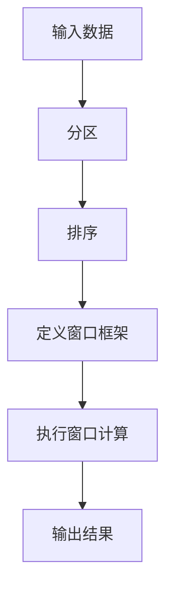

# 【AI大数据计算原理与代码实例讲解】窗口函数

## 1.背景介绍

### 1.1 大数据时代的到来

在当前的数字时代,数据正以前所未有的规模和速度呈爆炸式增长。无论是社交媒体、移动设备还是物联网,都在不断产生海量数据。这些数据蕴含着宝贵的洞见和商业价值,但同时也给数据处理和分析带来了巨大挑战。为了有效利用这些数据,需要高效、可扩展的数据处理技术。

### 1.2 数据库系统的演进

传统的关系数据库系统在处理结构化数据方面表现出色,但在处理非结构化和半结构化数据时却面临着挑战。为了应对大数据挑战,新一代的数据库系统应运而生,如NoSQL数据库、内存数据库和大数据处理框架(如Apache Hadoop、Apache Spark等)。这些系统旨在提供高度可扩展性、容错性和并行处理能力,以满足大数据时代的需求。

### 1.3 窗口函数的重要性

在大数据处理中,窗口函数(Window Functions)扮演着至关重要的角色。它们提供了一种高效、灵活的方式来处理和分析数据,特别是对于涉及跨行计算和数据分区的场景。窗口函数允许我们在不进行完全聚合的情况下,对数据进行部分聚合和排序操作,从而获得更丰富的分析视角。

## 2.核心概念与联系

### 2.1 什么是窗口函数?

窗口函数是一种特殊的SQL函数,它们在查询中以行为单位进行计算,但与聚合函数不同,窗口函数可以保留每一行的详细信息。它们允许我们对一组相关行(即窗口)执行计算,而不是对整个数据集进行聚合。

窗口函数的核心概念包括:

- 分区(PARTITION BY): 将数据划分为多个分区,每个分区单独计算。
- 排序(ORDER BY): 在窗口内对行进行排序,以便执行基于排序的计算。
- 窗口框架(WINDOW Frame): 定义要包含在计算中的行的范围。

通过组合这些概念,我们可以实现各种复杂的数据处理和分析任务,例如计算累计总和、移动平均值、排名等。

### 2.2 窗口函数与其他SQL概念的关系

窗口函数与SQL中的其他概念密切相关,但又有所区别:

- 聚合函数(Aggregate Functions): 聚合函数对整个数据集或分组进行计算,而窗口函数则在窗口范围内进行计算。
- 子查询(Subqueries): 子查询可用于实现类似的功能,但通常会导致性能下降和代码复杂性增加。
- 分析函数(Analytic Functions): 窗口函数实际上是��析函数的一种特殊形式,专门用于跨行计算。

通过将窗口函数与其他SQL概念相结合,我们可以构建出强大的数据查询和分析能力。

## 3.核心算法原理具体操作步骤

窗口函数的核心算法原理可以概括为以下几个步骤:



### 3.1 分区(PARTITION BY)

分区是将数据划分为多个逻辑组或分区的过程。在每个分区内,窗口函数将独立执行计算。分区可以基于一个或多个列进行,并且可以与排序一起使用。

示例:

```sql
SELECT
    product_name,
    category,
    sales,
    SUM(sales) OVER (PARTITION BY category) AS category_total_sales
FROM
    sales_data;
```

在上面的示例中,我们根据`category`列对数据进行分区,并计算每个类别的总销售额。

### 3.2 排序(ORDER BY)

排序是将窗口内的行按照指定的顺序排列的过程。这对于执行基于排序的计算(如排名、移动平均值等)至关重要。排序可以基于一个或多个列进行,并且可以与分区一起使用。

示例:

```sql
SELECT
    product_name,
    category,
    sales,
    RANK() OVER (PARTITION BY category ORDER BY sales DESC) AS rank_in_category
FROM
    sales_data;
```

在上面的示例中,我们首先根据`category`列对数据进行分区,然后在每个分区内根据`sales`列按降序对行进行排序,并计算每个产品在其类别中的销售排名。

### 3.3 定义窗口框架(WINDOW Frame)

窗口框架定义了要包含在窗口计算中的行的范围。有三种主要类型的窗口框架:

1. **行窗口(ROWS)**: 基于物理行的偏移量定义窗口范围。
2. **范围窗口(RANGE)**: 基于值的范围定义窗口范围。
3. **组合窗口(ROWS/RANGE)**: 结合行和范围条件定义窗口范围。

示例:

```sql
SELECT
    product_name,
    category,
    sales,
    AVG(sales) OVER (PARTITION BY category ORDER BY sales_date ROWS BETWEEN 2 PRECEDING AND 2 FOLLOWING) AS moving_avg
FROM
    sales_data;
```

在上面的示例中,我们计算每个产品的移动平均销售额,窗口框架被定义为包括当前行及其前后各两行。

### 3.4 执行窗口计算

一旦定义了分区、排序和窗口框架,窗口函数就会在每个窗口上执行指定的计算。这可能涉及聚合、排名、分析或其他类型的操作,具体取决于使用的窗口函数。

### 3.5 输出结果

最后,窗口函数的计算结果将与原始数据一起返回,提供了丰富的分析视角。

## 4.数学模型和公式详细讲解举例说明

虽然窗口函数本身不涉及复杂的数学模型,但它们经常与一些统计和数学概念相关。下面是一些常见的数学模型和公式,以及如何使用窗口函数来实现它们。

### 4.1 移动平均值(Moving Average)

移动平均值是一种常用的时间序列分析技术,它通过计算一段时间内的平均值来平滑数据并识别趋势。

公式:

$$MA_n = \frac{1}{n}\sum_{i=1}^{n}x_i$$

其中,$$n$$是窗口大小,$$x_i$$是时间序列中的值。

使用窗口函数计算移动平均值:

```sql
SELECT
    date,
    value,
    AVG(value) OVER (ORDER BY date ROWS BETWEEN 4 PRECEDING AND CURRENT ROW) AS moving_avg_5
FROM
    time_series_data;
```

在上面的示例中,我们使用`AVG`函数和`ROWS`窗口框架来计算过去5个时间点(包括当前时间点)的移动平均值。

### 4.2 指数加权移动平均值(EWMA)

指数加权移动平均值是一种更先进的时间序列平滑技术,它给予最近的观测值更高的权重。

公式:

$$EWMA_t = \alpha x_t + (1 - \alpha) EWMA_{t-1}$$

其中,$$\alpha$$是平滑系数(介于0和1之间),$$x_t$$是当前观测值,$$EWMA_{t-1}$$是前一时间点的EWMA值。

使用窗口函数计算EWMA:

```sql
SELECT
    date,
    value,
    CASE
        WHEN lag_value IS NULL THEN value
        ELSE 0.3 * value + 0.7 * lag_value
    END AS ewma
FROM
    (
        SELECT
            date,
            value,
            LAG(ewma, 1) OVER (ORDER BY date) AS lag_value
        FROM
            time_series_data
    ) subquery;
```

在上面的示例中,我们使用`LAG`函数和自连接来计算EWMA。`CASE`语句用于处理初始值的情况。平滑系数设置为0.3,这意味着当前观测值的权重为0.3,而前一个EWMA值的权重为0.7。

### 4.3 排名和分位数

窗口函数非常适合计算数据集中的排名和分位数。

示例:

```sql
SELECT
    student_name,
    score,
    RANK() OVER (ORDER BY score DESC) AS rank,
    NTILE(4) OVER (ORDER BY score) AS quartile
FROM
    student_scores;
```

在上面的示例中,我们使用`RANK`函数计算每个学生的成绩排名,并使用`NTILE`函数将学生分为四个等级。

## 5.项目实践:代码实例和详细解释说明

为了更好地理解窗口函数的使用,让我们通过一个实际项目来演示。在这个项目中,我们将分析一家零售公司的销售数据,并使用窗口函数来获得有价值的见解。

### 5.1 数据集

我们将使用一个名为`sales_data`的表,其中包含以下列:

- `product_id`: 产品ID
- `product_name`: 产品名称
- `category`: 产品类别
- `sales_date`: 销售日期
- `sales`: 销售额

### 5.2 查询示例

#### 5.2.1 计算每个产品类别的总销售额

```sql
SELECT
    category,
    SUM(sales) AS total_sales
FROM
    sales_data
GROUP BY
    category;
```

上面的查询使用`GROUP BY`和`SUM`函数计算每个产品类别的总销售额。但是,如果我们想在同一个查询中获取每个产品的销售额以及其所属类别的总销售额,该怎么办呢?这就是窗口函数大显身手的时候。

```sql
SELECT
    product_name,
    category,
    sales,
    SUM(sales) OVER (PARTITION BY category) AS category_total_sales
FROM
    sales_data;
```

在这个查询中,我们使用`PARTITION BY`子句将数据按照`category`列进行分区,然后在每个分区内使用`SUM`窗口函数计算总销售额。这样,我们就可以在同一个结果集中看到每个产品的销售额以及其所属类别的总销售额。

#### 5.2.2 计算每个产品在其类别中的销售排名

```sql
SELECT
    product_name,
    category,
    sales,
    RANK() OVER (PARTITION BY category ORDER BY sales DESC) AS rank_in_category
FROM
    sales_data;
```

在这个查询中,我们首先使用`PARTITION BY`子句将数据按照`category`列进行分区,然后在每个分区内使用`ORDER BY`子句根据`sales`列按降序对行进行排序。最后,我们使用`RANK`窗口函数为每个产品在其类别中的销售额赋予排名。

#### 5.2.3 计算每个产品的移动平均销售额

```sql
SELECT
    product_name,
    category,
    sales_date,
    sales,
    AVG(sales) OVER (PARTITION BY product_name ORDER BY sales_date ROWS BETWEEN 2 PRECEDING AND 2 FOLLOWING) AS moving_avg
FROM
    sales_data;
```

在这个查询中,我们首先使用`PARTITION BY`子句将数据按照`product_name`列进行分区,然后在每个分区内使用`ORDER BY`子句根据`sales_date`列对行进行排序。接下来,我们使用`ROWS`窗口框架定义窗口范围为当前行及其前后各两行。最后,我们使用`AVG`窗口函数计算每个产品在该窗口范围内的移动平均销售额。

#### 5.2.4 识别销售异常

```sql
SELECT
    product_name,
    category,
    sales_date,
    sales,
    AVG(sales) OVER (PARTITION BY product_name ORDER BY sales_date ROWS BETWEEN 30 PRECEDING AND CURRENT ROW) AS avg_30_days,
    CASE
        WHEN sales > 1.5 * AVG(sales) OVER (PARTITION BY product_name ORDER BY sales_date ROWS BETWEEN 30 PRECEDING AND CURRENT ROW) THEN 'High'
        WHEN sales < 0.5 * AVG(sales) OVER (PARTITION BY product_name ORDER BY sales_date ROWS BETWEEN 30 PRECEDING AND CURRENT ROW) THEN 'Low'
        ELSE 'Normal'
    END AS sales_status
FROM
    sales_data;
```

在这个查询中,我们首先计算每个产品在过去30天内的平均销售额。然后,我们使用`CASE`语句根据当前销售额与平均销售额的比值来确定销售状态。如果当前销售额超过平均销售额的1.5倍,则标记为"High";如果当前销售额低于平均销售额的0.5倍,则标记为"Low";否则标记为"Normal"。这样,我们就可以快速识别出销售