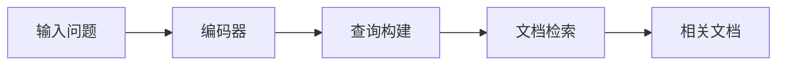
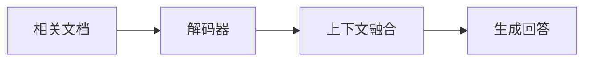

# 【LangChain编程：从入门到实践】RAG技术的关键挑战

## 1. 背景介绍

在人工智能的发展历程中，自然语言处理（NLP）一直是一个极具挑战性的领域。近年来，随着深度学习技术的突破，NLP领域出现了许多创新的模型和技术，其中之一就是检索增强生成（Retrieval-Augmented Generation，简称RAG）技术。RAG技术结合了检索（Retrieval）和生成（Generation）两大机制，旨在提升机器理解和生成自然语言的能力。本文将深入探讨RAG技术的核心挑战，并提供实用的解决方案。

## 2. 核心概念与联系

### 2.1 RAG技术概述
RAG技术是一种结合了检索系统和序列到序列（Seq2Seq）模型的NLP技术。它通过从大规模的文本数据库中检索相关信息，辅助生成模型更准确地生成回答或文本。

### 2.2 RAG的工作流程
RAG的工作流程主要包括两个阶段：检索阶段和生成阶段。在检索阶段，模型会根据输入的问题或提示从数据库中检索出相关的文档或信息片段；在生成阶段，模型将这些检索到的信息作为上下文，辅助生成模型输出更加准确和丰富的内容。

### 2.3 RAG与传统Seq2Seq模型的区别
与传统的Seq2Seq模型相比，RAG模型在生成回答前引入了外部知识的检索过程，这使得模型能够处理更加复杂和开放式的问题，提高了生成内容的质量和相关性。

## 3. 核心算法原理具体操作步骤

### 3.1 检索阶段


1. 输入问题被编码器处理，转换为查询向量。
2. 根据查询向量在数据库中检索相关文档。
3. 选择与查询向量最相关的文档作为检索结果。

### 3.2 生成阶段


1. 将检索到的文档与输入问题一同输入解码器。
2. 解码器融合上下文信息，开始生成回答。
3. 输出最终的文本生成结果。

## 4. 数学模型和公式详细讲解举例说明

RAG模型的核心是如何将检索到的文档有效地融入生成过程。这一过程可以用以下数学公式表示：

$$
P(y|x,D) = \prod_{t=1}^{T} P(y_t|y_{<t}, x, D)
$$

其中，$x$ 是输入问题，$D$ 是检索到的文档集合，$y$ 是生成的回答，$T$ 是回答的长度，$y_t$ 是在时间步 $t$ 的预测词，$y_{<t}$ 是在时间步 $t$ 之前的所有预测词。

为了计算这个概率，我们需要定义一个联合概率分布，它结合了检索和生成两个阶段：

$$
P(y,D|x) = P(D|x) \cdot P(y|x,D)
$$

这里，$P(D|x)$ 是给定输入 $x$ 时检索到文档集合 $D$ 的概率，$P(y|x,D)$ 是给定输入 $x$ 和文档集合 $D$ 时生成回答 $y$ 的概率。

## 5. 项目实践：代码实例和详细解释说明

在实际项目中，我们可以使用以下Python代码片段来实现一个简单的RAG模型：

```python
from transformers import RagTokenizer, RagRetriever, RagTokenForGeneration

tokenizer = RagTokenizer.from_pretrained("facebook/rag-token-nq")
retriever = RagRetriever.from_pretrained("facebook/rag-token-nq", index_name="exact", use_dummy_dataset=True)
model = RagTokenForGeneration.from_pretrained("facebook/rag-token-nq", retriever=retriever)

input_dict = tokenizer.prepare_seq2seq_batch("What is the capital of France?", return_tensors="pt")
generated = model.generate(input_ids=input_dict["input_ids"])

print(tokenizer.batch_decode(generated, skip_special_tokens=True))
```

这段代码首先加载了预训练的RAG模型和相关的检索器，然后对一个简单的问题进行编码，并使用模型生成回答。最后，我们解码生成的回答并打印出来。

## 6. 实际应用场景

RAG技术在多个领域都有广泛的应用，例如：

- 问答系统：提供准确的答案和解释。
- 文本摘要：生成与原文相关性高的摘要。
- 对话系统：生成更加自然和丰富的对话内容。

## 7. 工具和资源推荐

- Transformers库：提供了RAG模型的预训练版本和实现。
- Hugging Face's Model Hub：可以找到多种预训练的RAG模型。
- Elasticsearch：用于构建高效的检索系统。

## 8. 总结：未来发展趋势与挑战

RAG技术作为NLP领域的一项创新，其未来的发展趋势将更加注重检索内容的质量和生成文本的多样性。同时，如何平衡检索速度和生成质量，如何处理更加复杂的查询，以及如何提高模型的可解释性，都是RAG技术面临的关键挑战。

## 9. 附录：常见问题与解答

Q1: RAG模型如何选择检索到的文档？
A1: RAG模型通常使用基于相似度的方法，如余弦相似度，来选择与查询最相关的文档。

Q2: RAG模型的训练数据是怎样的？
A2: RAG模型的训练数据通常包括大量的文本对，例如问题和答案对，以及相关的文档信息。

Q3: RAG模型如何处理不同长度的输入和输出？
A3: RAG模型使用注意力机制和位置编码来处理不同长度的输入和输出，确保模型能够有效地处理序列信息。

作者：禅与计算机程序设计艺术 / Zen and the Art of Computer Programming