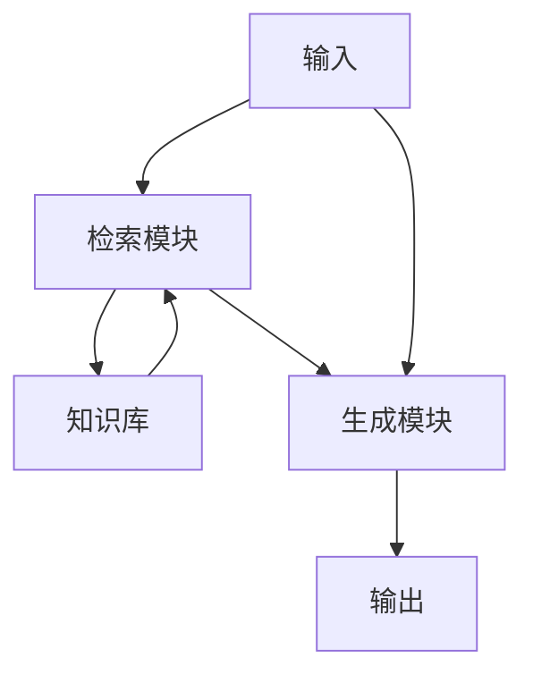
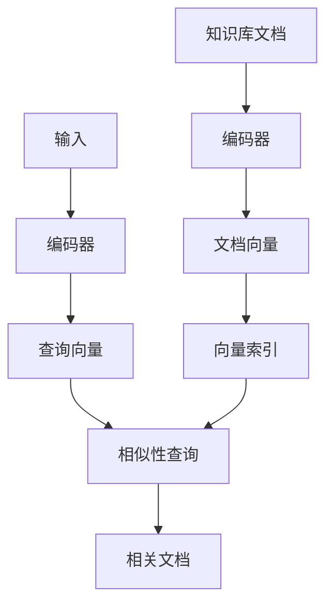
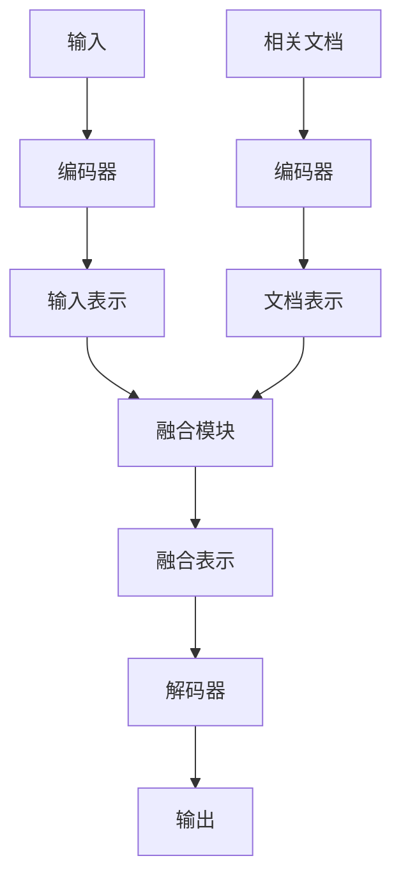

# 【大模型应用开发 动手做AI Agent】何谓检索增强生成

## 1. 背景介绍

### 1.1 大模型时代的来临

近年来,大型语言模型(Large Language Models, LLMs)在自然语言处理领域取得了令人瞩目的成就。这些模型通过在海量文本数据上进行预训练,学习到了丰富的语言知识和上下文理解能力,使得它们能够生成高质量、连贯、多样化的文本输出。

代表性的大型语言模型包括 GPT-3、PaLM、ChatGPT 等,它们展现出了强大的文本生成能力,在诸多领域产生了广泛的影响,如内容创作、问答系统、代码生成等。然而,这些模型也存在一些固有的局限性,例如:

- 知识覆盖范围有限
- 缺乏最新信息
- 存在事实错误和不一致性
- 难以处理特定领域的专业知识

### 1.2 检索增强生成的兴起

为了解决大型语言模型的上述局限性,检索增强生成(Retrieval-Augmented Generation, RAG)应运而生。这一新兴范式将大型语言模型与检索系统相结合,旨在利用外部知识库来增强模型的生成能力。

在检索增强生成系统中,检索模块负责从知识库中查找与输入相关的文档或片段,而生成模块则利用检索到的信息,结合原始输入,生成最终的输出。这种方式不仅可以提高模型的知识覆盖面,还能确保生成的内容具有更高的准确性和新颖性。

## 2. 核心概念与联系

### 2.1 检索模块

检索模块是检索增强生成系统的关键组成部分,其主要功能是从知识库中检索与输入相关的文档或片段。常见的检索方法包括:

1. **基于关键词的检索**:利用输入中的关键词在知识库中进行匹配,返回与关键词相关的文档。
2. **基于语义的检索**:利用语义相似度模型(如 BERT)计算输入与知识库文档之间的语义相似性,返回最相关的文档。
3. **基于密集向量的检索**:将输入和知识库文档编码为密集向量表示,然后基于向量相似性进行检索。

### 2.2 生成模块

生成模块负责将检索到的相关信息与原始输入相结合,生成最终的输出。常见的生成模型包括:

1. **序列到序列模型**:将输入和检索到的文档拼接,输入到序列到序列模型(如 GPT)中进行生成。
2. **融合模型**:将输入和检索到的文档分别编码,然后通过一个融合模块(如注意力机制)将两者的表示融合,最后输入到解码器进行生成。

### 2.3 知识库

知识库是检索增强生成系统的另一个关键组成部分,它存储了大量的文本信息,为检索模块提供检索资源。常见的知识库类型包括:

1. **维基百科**:包含大量的通用知识信息,覆盖面广泛。
2. **专业领域语料库**:针对特定领域(如医学、法律等)构建的专业知识库,可提供领域专业知识。
3. **动态知识库**:实时从互联网上爬取最新信息,确保知识库的及时性。

### 2.4 核心流程

检索增强生成系统的核心流程如下所示:



1. 用户输入查询或指令。
2. 检索模块从知识库中检索与输入相关的文档或片段。
3. 生成模块将检索到的信息与原始输入相结合,生成最终的输出。

## 3. 核心算法原理具体操作步骤

### 3.1 密集向量检索

密集向量检索是检索增强生成系统中常用的检索方法之一。其核心思想是将输入和知识库文档编码为密集向量表示,然后基于向量相似性进行检索。具体步骤如下:

1. **文档编码**:使用预训练语言模型(如 BERT)对知识库中的每个文档进行编码,得到对应的密集向量表示。
2. **构建向量索引**:将所有文档向量构建成高效的向量索引(如 FAISS、Annoy 等),以加速向量相似性查询。
3. **查询编码**:对用户输入进行编码,得到查询向量表示。
4. **相似性查询**:在向量索引中查找与查询向量最相似的文档向量,返回对应的文档。



密集向量检索的优点是可以捕捉输入和文档之间的语义相关性,检索质量较高。但同时也面临一些挑战,如向量索引的构建和查询效率、向量的语义偏移等。

### 3.2 融合生成

融合生成是检索增强生成系统中常用的生成方法之一。其核心思想是将输入和检索到的相关文档分别编码,然后通过一个融合模块(如注意力机制)将两者的表示融合,最后输入到解码器进行生成。具体步骤如下:

1. **输入编码**:使用预训练语言模型对用户输入进行编码,得到输入表示。
2. **文档编码**:使用同一预训练语言模型对检索到的相关文档进行编码,得到文档表示。
3. **表示融合**:通过注意力机制或其他融合模块,将输入表示和文档表示融合成一个综合表示。
4. **解码生成**:将融合后的表示输入到解码器(如 GPT),生成最终的输出序列。



融合生成的优点是可以充分利用检索到的相关信息,生成更准确、更丰富的输出。但同时也面临一些挑战,如表示融合的有效性、解码器的一致性等。

## 4. 数学模型和公式详细讲解举例说明

### 4.1 向量相似性度量

在密集向量检索中,向量相似性度量是一个关键环节。常用的向量相似性度量包括:

1. **余弦相似度**:
   $$\text{sim}_\text{cosine}(\vec{a}, \vec{b}) = \frac{\vec{a} \cdot \vec{b}}{\|\vec{a}\| \|\vec{b}\|}$$
   余弦相似度测量两个向量之间的夹角余弦值,取值范围为 $[-1, 1]$,值越大表示两个向量越相似。

2. **欧几里得距离**:
   $$\text{dist}_\text{euclidean}(\vec{a}, \vec{b}) = \sqrt{\sum_{i=1}^{n}(a_i - b_i)^2}$$
   欧几里得距离测量两个向量之间的直线距离,值越小表示两个向量越相似。

3. **内积**:
   $$\text{sim}_\text{dot}(\vec{a}, \vec{b}) = \vec{a} \cdot \vec{b} = \sum_{i=1}^{n}a_i b_i$$
   内积可以看作是向量长度和夹角余弦值的综合测度,值越大表示两个向量越相似。

在实际应用中,需要根据具体场景选择合适的相似性度量,以获得最佳的检索效果。

### 4.2 注意力机制

注意力机制是表示融合中常用的技术,它可以自适应地捕捉输入和文档之间的关联关系,并生成更加准确的融合表示。

设输入表示为 $\vec{x}$,文档表示为 $\vec{y}$,注意力机制的计算过程如下:

1. **计算注意力分数**:
   $$\alpha_{ij} = \frac{\exp(e_{ij})}{\sum_{k=1}^{n}\exp(e_{ik})}, \quad e_{ij} = f(\vec{x}_i, \vec{y}_j)$$
   其中 $f$ 是一个评分函数,用于计算输入和文档之间的关联程度。

2. **计算加权和**:
   $$\vec{z}_i = \sum_{j=1}^{n}\alpha_{ij}\vec{y}_j$$
   将文档表示按照注意力分数进行加权求和,得到融合表示 $\vec{z}$。

3. **生成输出**:
   $$\vec{o}_i = g(\vec{x}_i, \vec{z}_i)$$
   将输入表示和融合表示输入到一个函数 $g$ 中,生成最终的输出 $\vec{o}$。

注意力机制的优点是可以自适应地捕捉输入和文档之间的关联关系,生成更加准确的融合表示。但同时也面临一些挑战,如注意力分数的计算效率、注意力分布的可解释性等。

## 5. 项目实践:代码实例和详细解释说明

为了更好地理解检索增强生成系统的实现细节,我们将基于 Hugging Face 的 Transformers 库,构建一个简单的检索增强生成系统。

### 5.1 环境配置

首先,我们需要安装所需的Python库:

```bash
pip install transformers datasets faiss-cpu
```

### 5.2 加载数据

我们将使用 Hugging Face 的 `datasets` 库加载维基百科数据集作为知识库。

```python
from datasets import load_dataset

dataset = load_dataset("wikipedia", "20200501.en", split="train")
```

### 5.3 密集向量检索

接下来,我们将实现密集向量检索模块。

```python
from transformers import AutoTokenizer, AutoModel
import faiss
import numpy as np

# 加载预训练模型和tokenizer
tokenizer = AutoTokenizer.from_pretrained("sentence-transformers/all-mpnet-base-v2")
model = AutoModel.from_pretrained("sentence-transformers/all-mpnet-base-v2")

# 编码知识库文档
doc_embeddings = []
for doc in dataset["text"]:
    inputs = tokenizer(doc, return_tensors="pt", padding=True, truncation=True, max_length=512)
    with torch.no_grad():
        outputs = model(**inputs)
        embeddings = outputs.last_hidden_state[:, 0, :]
        doc_embeddings.append(embeddings.cpu().numpy())

doc_embeddings = np.vstack(doc_embeddings)

# 构建向量索引
index = faiss.IndexFlatIP(model.config.hidden_size)
index.add(doc_embeddings)

# 查询相关文档
def retrieve(query):
    inputs = tokenizer(query, return_tensors="pt", padding=True, truncation=True, max_length=512)
    with torch.no_grad():
        outputs = model(**inputs)
        query_embedding = outputs.last_hidden_state[:, 0, :]
    
    scores, indices = index.search(query_embedding.cpu().numpy(), k=5)
    return [dataset["text"][idx] for idx in indices.squeeze().tolist()]
```

在上述代码中,我们首先加载预训练的语言模型和tokenizer。然后,我们对知识库中的每个文档进行编码,得到对应的密集向量表示。接下来,我们使用 FAISS 库构建向量索引,以加速相似性查询。最后,我们定义了一个 `retrieve` 函数,用于根据查询向量在索引中检索最相关的文档。

### 5.4 融合生成

接下来,我们将实现融合生成模块。

```python
from transformers import AutoModelForSeq2SeqLM

# 加载序列到序列模型
model = AutoModelForSeq2SeqLM.from_pretrained("facebook/bart-large")
tokenizer = AutoTokenizer.from_pretrained("facebook/bart-large")

# 融合生成
def generate(query, docs):
    inputs = tokenizer(query, return_tensors="pt", padding=True, truncation=True, max_length=512)
    with tokenizer.as_target_tokenizer():
        labels = tokenizer(docs, return_tensors="pt", padding=True, truncation=True, max_length=512)

    outputs = model(**inputs, labels=labels["input_ids"])
    loss = outputs.loss
    logits = outputs.logits

    generated_ids = model.generate(
        inputs["input_ids"],
        attention_mask=inputs["attention_mask"],
        use_cache=True,
        max_length=