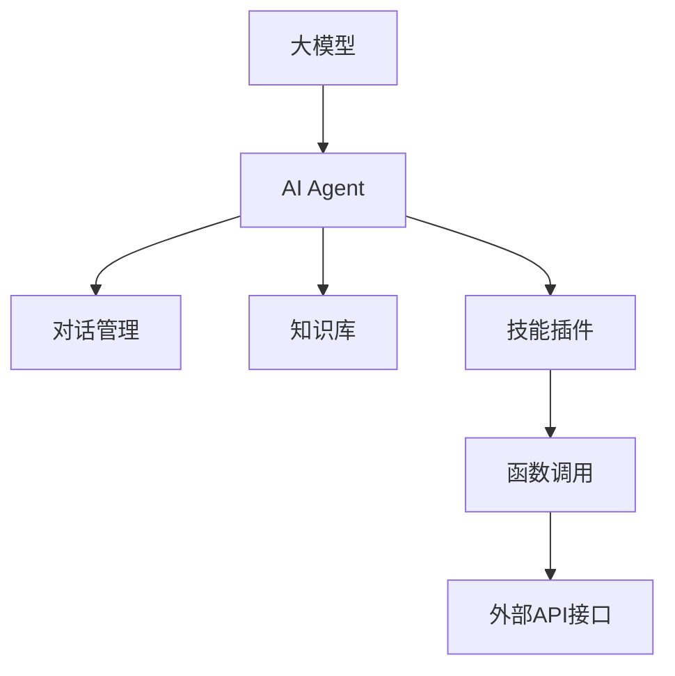

# 【大模型应用开发 动手做AI Agent】函数调用

## 1. 背景介绍
### 1.1 大模型的崛起
近年来,随着深度学习技术的快速发展,大规模预训练语言模型(Large Pre-trained Language Models,简称大模型)取得了令人瞩目的成就。从GPT系列、BERT到最新的GPT-4,这些大模型展现出了惊人的自然语言理解和生成能力,在许多NLP任务上达到甚至超越了人类的水平。

### 1.2 大模型应用开发的挑战
尽管大模型非常强大,但如何将其有效应用到实际的应用开发中仍面临诸多挑战:
1. 大模型的训练和推理都需要消耗大量算力,对计算资源要求很高。
2. 大模型通常以API形式提供服务,开发者需要熟悉API的使用方法。
3. 大模型生成的文本可能存在不确定性和偏差,需要开发者进行后处理和校正。
4. 大模型的输入输出都是自然语言文本,如何与应用程序的其他模块(如数据库、业务逻辑等)进行交互和集成也是一大难题。

### 1.3 AI Agent的兴起
为了更好地将大模型应用到实际开发中,AI Agent(人工智能代理)的概念应运而生。AI Agent本质上是一个基于大模型的智能对话系统,它可以根据用户的输入理解对方的意图,并给出恰当的回应或执行相应的任务。通过引入函数调用的机制,AI Agent可以实现与外部程序的交互,极大拓展了其应用范围和实用性。

## 2. 核心概念与联系
### 2.1 大模型
大模型是指参数量达到数亿、数十亿甚至更多的超大规模深度学习模型,主要应用于自然语言处理领域。其核心是利用海量文本数据进行预训练,学习语言的统计规律和隐含语义,从而具备强大的语言理解和生成能力。目前主流的大模型包括GPT系列、BERT、T5、Switch Transformer等。

### 2.2 AI Agent 
AI Agent是一种基于大模型的智能对话代理,可以用自然语言与人进行交互,完成问答、分析、任务执行等多种功能。它的核心是大模型,但同时也需要包括对话管理、知识库、技能插件等其他组件。AI Agent的目标是成为一个得力的智能助手,为人类用户提供高效、准确、全面的服务。

### 2.3 函数调用
函数调用是程序设计的基本概念,指在程序运行过程中调用某个函数(子程序)并执行其中的代码。在AI Agent的上下文中,函数调用特指Agent在对话过程中调用外部的程序接口或API,通过传递参数并获取返回值,实现与外部应用程序的交互。引入函数调用使得AI Agent可以大大拓展其技能边界,调用各种丰富的外部资源为用户提供服务。

### 2.4 概念之间的联系
下图展示了大模型、AI Agent和函数调用三个核心概念之间的关系:



可以看出,大模型是AI Agent的核心组件,负责自然语言理解和生成;AI Agent在大模型的基础上,还包括对话管理、知识库等必要模块;函数调用作为AI Agent的技能插件,帮助其连接外部应用,拓展服务边界。三者相辅相成,共同构成了一个功能强大的智能对话系统。

## 3. 核心算法原理具体操作步骤
实现一个支持函数调用的AI Agent,核心步骤如下:

### 3.1 选择合适的大模型
可以选用GPT-3、ChatGLM、BLOOM等开源或商业的大模型作为Agent的语言模型底座。需要权衡模型的性能、可用性和成本。

### 3.2 定义函数调用接口
为Agent设计一套统一的函数调用接口规范。常见的做法是用一些特殊的标记符号(如<<func_name()>>)来标识函数调用,并在其中包含函数名和参数。Agent在生成回复时,一旦识别出函数调用标记,就可以提取出函数名和参数,然后进行实际的API调用。

### 3.3 开发对话管理模块
对话管理负责控制人机对话的进程。需要实现多轮对话记录、上下文理解、意图识别、槽位填充等功能。可以借助一些开源的对话管理框架如Rasa、DeepPavlov等。

### 3.4 搭建知识库
为Agent构建所需的知识库,进行知识的收集、组织和索引,涵盖常见问题的答案、任务执行步骤等。知识库可以存储在向量数据库如Faiss、Milvus中,便于快速匹配和检索。

### 3.5 实现函数调用执行
根据函数调用接口规范,实现一个通用的函数调用执行器。执行器解析函数名和参数,查找对应的API接口,发起实际的调用请求,并将结果返回给Agent。

### 3.6 集成各模块形成完整系统
最后将大模型、对话管理、知识库、函数调用等模块集成到一起,形成完整的AI Agent系统。用户的请求先经过对话管理模块处理,提取意图和槽位,再由大模型结合知识库生成回复。如果回复中包含函数调用,则交由执行器进一步处理。

## 4. 数学模型和公式详细讲解举例说明
大模型的核心是Transformer架构和Self-Attention机制。以GPT-3为例,其数学模型可以表示为:

$$ \text{GPT-3}(x) = \text{Decoder}(\text{Embed}(x)) $$

其中,$x$表示输入的文本序列,$\text{Embed}$表示词嵌入层,$\text{Decoder}$表示Transformer解码器。

Transformer解码器由$N$个相同的层堆叠而成,每一层包括两个子层:Multi-Head Self-Attention和前馈神经网络(Feed Forward)。

$$ \text{Decoder} = \text{FFN}^N(\text{MultiHead}^N(\text{Embed}(x))) $$

其中,Multi-Head Self-Attention的计算公式为:

$$ \text{MultiHead}(Q, K, V) = \text{Concat}(\text{head}_1, ..., \text{head}_h)W^O $$

$$ \text{head}_i = \text{Attention}(QW_i^Q, KW_i^K, VW_i^V) $$

$$ \text{Attention}(Q, K, V) = \text{softmax}(\frac{QK^T}{\sqrt{d_k}})V $$

$Q$、$K$、$V$分别表示Query、Key、Value矩阵,$W^O$、$W_i^Q$、$W_i^K$、$W_i^V$为学习参数矩阵,$d_k$为Key的维度。

前馈网络由两层全连接层组成,中间加入ReLU激活:

$$ \text{FFN}(x) = \text{max}(0, xW_1 + b_1)W_2 + b_2 $$

$W_1$、$W_2$、$b_1$、$b_2$为前馈网络的学习参数。

通过这些公式,大模型可以建模文本序列的上下文依赖关系,从海量无标注语料中学习语言知识,进而具备强大的自然语言理解和生成能力。将大模型应用到AI Agent中,就可以实现与人自然流畅的交互对话。

## 5. 项目实践：代码实例和详细解释说明
下面以一个简单的天气查询AI Agent为例,演示如何用Python实现函数调用。

```python
import openai
import requests

# 设置OpenAI API Key
openai.api_key = "your_api_key"

# 定义函数调用接口
def call_weather_api(location):
    url = f"http://api.openweathermap.org/data/2.5/weather?q={location}&appid=your_api_key"
    response = requests.get(url)
    if response.status_code == 200:
        data = response.json()
        weather = data["weather"][0]["description"]
        temp = data["main"]["temp"] - 273.15
        return f"The weather in {location} is {weather}, temperature is {temp:.1f}°C."
    else:
        return "Failed to get weather data."

# 定义AI Agent函数
def ai_agent(prompt):
    # 调用OpenAI API生成回复
    response = openai.Completion.create(
        engine="text-davinci-003",
        prompt=prompt,
        max_tokens=100,
        n=1,
        stop=None,
        temperature=0.5,
    )
    reply = response.choices[0].text.strip()
    
    # 解析函数调用
    if "<<weather(" in reply:
        location = reply.split("<<weather(")[1].split(")>>")[0]
        weather_info = call_weather_api(location)
        reply = reply.replace(f"<<weather({location})>>", weather_info)
        
    return reply

# 测试Agent
while True:
    user_input = input("User: ")
    if user_input.lower() in ["bye", "quit", "exit"]:
        print("Agent: Bye!")
        break
    agent_reply = ai_agent(user_input)
    print(f"Agent: {agent_reply}")
```

代码解释:
- 首先设置OpenAI API Key,用于调用GPT-3 API生成回复。
- 定义了`call_weather_api`函数作为天气查询的函数调用接口,它会根据传入的地点参数,调用OpenWeatherMap API获取天气信息,并返回一个格式化的字符串。
- `ai_agent`函数是Agent的主函数。它接收用户输入的prompt,调用GPT-3 API生成回复。然后检查回复中是否包含`<<weather(location)>>`标记,如果有则提取出地点参数,调用`call_weather_api`获取实际天气数据,再替换回复中的标记。
- 最后是一个简单的交互循环,用户输入问题,Agent给出回复,直到用户输入退出命令为止。

运行该程序,就可以与Agent进行简单的天气查询对话,体验函数调用的威力。例如:

```
User: What's the weather like in London today?
Agent: <<weather(London)>>

User: How about in Tokyo?
Agent: <<weather(Tokyo)>>

User: bye
Agent: Bye!
```

可以看到,Agent通过调用天气API,成功获取到了伦敦和东京的实时天气信息,并自然地融入到了对话回复中。

## 6. 实际应用场景
支持函数调用的AI Agent有非常广泛的应用前景,下面列举几个具体场景:

### 6.1 智能客服
传统客服系统往往只能应对一些常见问题的查询和解答,对于复杂的业务咨询和操作指导则力不从心。引入支持函数调用的AI Agent后,可以大大提升客服的服务能力。例如Agent可以调用订单系统API查询用户的订单信息,调用物流系统API查询发货进度,调用支付系统API处理退款申请等。用户无需再经历漫长的人工客服排队,就可以享受到快速高效的一站式智能客服服务。

### 6.2 智能办公助手
在日常办公场景中,我们经常需要执行一些重复性很强的任务,如日程安排、会议记录、文档处理等。AI Agent可以作为一个得力的智能办公助手,帮我们自动化完成这些任务。它可以调用日历API添加和查询日程,调用语音识别API记录和整理会议讨论要点,调用文档API进行文件格式转换、内容提取、信息搜索等。有了AI Agent的协助,我们可以从繁琐的事务性工作中解放出来,将更多时间投入到更有创造力和价值的工作中去。

### 6.3 智能家居控制
随着物联网技术的发展,越来越多的家电设备实现了联网化,并提供了开放的API接口。这为AI Agent控制智能家居设备创造了条件。用户可以用自然语言指示Agent,"帮我把客厅的灯调亮一点"、"把空调温度设到25度"、"播放一首舒缓的轻音乐"等,Agent就可以调用对应设备的API,执行实际的控制操作。通过语音交互式AI Agent,用户可以轻松实现对家居环境的集中控制,尽享智慧生活。

### 6.4 数据分析和可视化
在数据分析工作中,我们经常要编写大量代码来完成数据加载、清洗、转换、建模、可视化等任务。如果有一个支持函数调用的AI Agent就好了