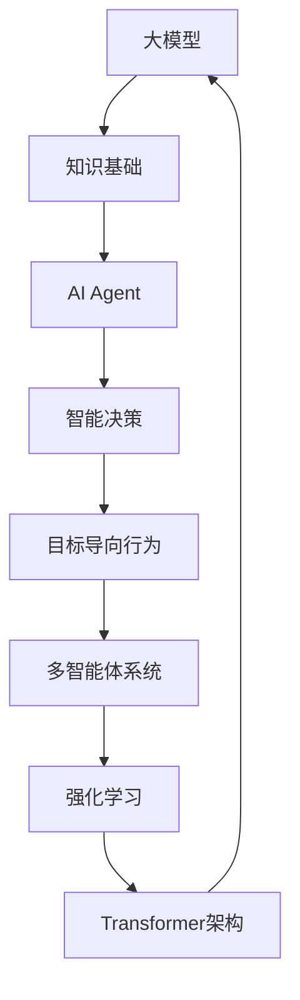

# 【大模型应用开发 动手做AI Agent】大开脑洞的演讲：Life 3.0

## 1. 背景介绍
### 1.1 人工智能的发展历程
#### 1.1.1 人工智能的起源与早期发展
#### 1.1.2 人工智能的"冬天"与复兴
#### 1.1.3 深度学习的崛起与人工智能的新时代
### 1.2 大模型的出现与影响
#### 1.2.1 大模型的定义与特点
#### 1.2.2 大模型在自然语言处理领域的应用
#### 1.2.3 大模型对人工智能发展的推动作用
### 1.3 AI Agent的概念与意义
#### 1.3.1 AI Agent的定义与特点 
#### 1.3.2 AI Agent在人工智能领域的地位
#### 1.3.3 AI Agent对未来社会发展的影响

## 2. 核心概念与联系
### 2.1 大模型的核心概念
#### 2.1.1 Transformer架构
#### 2.1.2 注意力机制
#### 2.1.3 迁移学习
### 2.2 AI Agent的核心概念
#### 2.2.1 强化学习
#### 2.2.2 多智能体系统
#### 2.2.3 目标导向行为
### 2.3 大模型与AI Agent的关系
#### 2.3.1 大模型为AI Agent提供知识基础
#### 2.3.2 AI Agent利用大模型实现智能决策
#### 2.3.3 大模型与AI Agent的协同发展



## 3. 核心算法原理具体操作步骤
### 3.1 Transformer架构详解
#### 3.1.1 编码器与解码器
#### 3.1.2 多头注意力机制
#### 3.1.3 前馈神经网络
### 3.2 强化学习算法详解
#### 3.2.1 Q-Learning
#### 3.2.2 策略梯度
#### 3.2.3 Actor-Critic
### 3.3 多智能体系统算法详解 
#### 3.3.1 博弈论基础
#### 3.3.2 多智能体强化学习
#### 3.3.3 群体智能优化

## 4. 数学模型和公式详细讲解举例说明
### 4.1 Transformer的数学模型
#### 4.1.1 自注意力机制的数学表示
$$
Attention(Q,K,V) = softmax(\frac{QK^T}{\sqrt{d_k}})V
$$
其中，$Q$, $K$, $V$ 分别表示查询、键、值向量，$d_k$为键向量的维度。

#### 4.1.2 多头注意力的数学表示
$$
MultiHead(Q,K,V) = Concat(head_1,...,head_h)W^O \\
head_i = Attention(QW_i^Q, KW_i^K, VW_i^V)
$$
其中，$W_i^Q$, $W_i^K$, $W_i^V$, $W^O$ 为可学习的权重矩阵。

### 4.2 强化学习的数学模型
#### 4.2.1 马尔可夫决策过程
$$
G_t = R_{t+1} + \gamma R_{t+2} + ... = \sum_{k=0}^{\infty} \gamma^k R_{t+k+1}
$$
其中，$G_t$为累积回报，$R_t$为即时回报，$\gamma$为折扣因子。

#### 4.2.2 Bellman方程
$$
V(s) = \max_a Q(s,a) \\
Q(s,a) = r + \gamma \max_{a'} Q(s',a')
$$
其中，$V(s)$为状态价值函数，$Q(s,a)$为动作价值函数。

### 4.3 多智能体系统的数学模型
#### 4.3.1 纳什均衡
在纳什均衡点，每个智能体的策略都是其他智能体给定策略下的最优策略。
$$
\forall i, \pi_i^* = \arg\max_{\pi_i} V_i(\pi_i, \pi_{-i}^*)
$$
其中，$\pi_i$为智能体$i$的策略，$\pi_{-i}^*$为其他智能体的策略。

#### 4.3.2 博弈论中的最大最小值算法
$$
V^* = \max_{\pi_1} \min_{\pi_2} V(\pi_1, \pi_2)
$$
求解双人零和博弈问题的最优策略。

## 5. 项目实践：代码实例和详细解释说明
### 5.1 使用PyTorch实现Transformer
```python
import torch
import torch.nn as nn

class MultiHeadAttention(nn.Module):
    def __init__(self, d_model, num_heads):
        super().__init__()
        self.d_model = d_model
        self.num_heads = num_heads
        self.head_dim = d_model // num_heads
        
        self.qkv_linear = nn.Linear(d_model, 3*d_model)
        self.out_linear = nn.Linear(d_model, d_model)
        
    def forward(self, x, mask=None):
        batch_size, seq_len, _ = x.size()
        qkv = self.qkv_linear(x)
        q, k, v = qkv.chunk(3, dim=-1)
        q = q.view(batch_size, seq_len, self.num_heads, self.head_dim).transpose(1,2)
        k = k.view(batch_size, seq_len, self.num_heads, self.head_dim).transpose(1,2)
        v = v.view(batch_size, seq_len, self.num_heads, self.head_dim).transpose(1,2)
        
        attn_scores = torch.matmul(q, k.transpose(-2,-1)) / math.sqrt(self.head_dim)
        if mask is not None:
            attn_scores = attn_scores.masked_fill(mask==0, -1e9)
        attn_probs = F.softmax(attn_scores, dim=-1)
        
        attn_output = torch.matmul(attn_probs, v)
        attn_output = attn_output.transpose(1,2).contiguous().view(batch_size, seq_len, self.d_model)
        attn_output = self.out_linear(attn_output)
        return attn_output
```
以上代码实现了Transformer中的多头注意力机制。主要步骤包括：
1. 将输入x通过线性变换得到q,k,v
2. 将q,k,v按照多头注意力的方式进行分割和变形
3. 计算注意力分数attn_scores，并应用mask
4. 计算注意力概率分布attn_probs
5. 将attn_probs与v相乘得到注意力输出attn_output
6. 对attn_output进行线性变换得到最终的多头注意力输出

### 5.2 使用TensorFlow实现DQN
```python
import tensorflow as tf

class DQN(tf.keras.Model):
    def __init__(self, state_dim, action_dim):
        super().__init__()
        self.dense1 = tf.keras.layers.Dense(64, activation='relu')
        self.dense2 = tf.keras.layers.Dense(64, activation='relu')
        self.out = tf.keras.layers.Dense(action_dim) 

    def call(self, state):
        x = self.dense1(state)
        x = self.dense2(x)
        q_values = self.out(x)
        return q_values
      
def train_step(state_batch, action_batch, reward_batch, next_state_batch, done_batch):
    with tf.GradientTape() as tape:
        q_values = model(state_batch)
        action_masks = tf.one_hot(action_batch, num_actions)
        q_values_masked = tf.reduce_sum(q_values * action_masks, axis=1)

        next_q_values = target_model(next_state_batch)
        max_next_q_values = tf.reduce_max(next_q_values, axis=1)
        target_q_values = reward_batch + (1 - done_batch) * discount_factor * max_next_q_values

        loss = tf.reduce_mean(tf.square(target_q_values - q_values_masked))

    grads = tape.gradient(loss, model.trainable_variables)
    optimizer.apply_gradients(zip(grads, model.trainable_variables))
    return loss
```
以上代码实现了DQN算法的核心部分。主要步骤包括：
1. 定义DQN网络结构，包括两个隐藏层和一个输出层
2. 在train_step函数中，使用梯度带(GradientTape)计算损失函数关于模型参数的梯度
3. 根据当前状态state_batch，计算Q值q_values
4. 使用action_batch构建掩码action_masks，提取对应动作的Q值q_values_masked
5. 根据下一状态next_state_batch，计算下一时刻的最大Q值max_next_q_values
6. 根据贝尔曼方程计算目标Q值target_q_values
7. 计算均方误差损失loss
8. 计算梯度grads并使用优化器更新模型参数

### 5.3 使用MADDPG算法实现多智能体强化学习
```python
import torch
import torch.nn as nn
import torch.optim as optim

class Actor(nn.Module):
    def __init__(self, state_dim, action_dim):
        super().__init__()
        self.fc1 = nn.Linear(state_dim, 64)
        self.fc2 = nn.Linear(64, 64)
        self.out = nn.Linear(64, action_dim)

    def forward(self, state):
        x = torch.relu(self.fc1(state))
        x = torch.relu(self.fc2(x))
        action = torch.tanh(self.out(x))
        return action

class Critic(nn.Module):  
    def __init__(self, state_dim, action_dim):
        super().__init__()
        self.fc1 = nn.Linear(state_dim + action_dim, 64)
        self.fc2 = nn.Linear(64, 64)
        self.out = nn.Linear(64, 1)

    def forward(self, state, action):
        x = torch.cat([state, action], dim=1)
        x = torch.relu(self.fc1(x))  
        x = torch.relu(self.fc2(x))
        q_value = self.out(x)
        return q_value

class MADDPG:
    def __init__(self, state_dim, action_dim, num_agents):
        self.actors = [Actor(state_dim, action_dim) for _ in range(num_agents)]
        self.critics = [Critic(state_dim * num_agents, action_dim * num_agents) for _ in range(num_agents)]
        self.actor_optimizers = [optim.Adam(actor.parameters(), lr=0.01) for actor in self.actors] 
        self.critic_optimizers = [optim.Adam(critic.parameters(), lr=0.01) for critic in self.critics]

    def select_action(self, states):
        actions = []
        for i in range(len(self.actors)):
            state = states[i]
            action = self.actors[i](state)
            actions.append(action)
        return actions

    def train(self, states, actions, rewards, next_states, dones):
        for i in range(len(self.actors)):
            state = states[i]
            action = actions[i]
            reward = rewards[i]  
            next_state = next_states[i]
            done = dones[i]

            next_actions = self.select_action(next_states)
            next_actions = torch.cat(next_actions, dim=1)
            
            target_q = reward + (1 - done) * 0.99 * self.critics[i](torch.cat(next_states, dim=1), next_actions)
            current_q = self.critics[i](torch.cat(states, dim=1), torch.cat(actions, dim=1))
            
            critic_loss = nn.MSELoss()(current_q, target_q.detach())
            self.critic_optimizers[i].zero_grad()
            critic_loss.backward()
            self.critic_optimizers[i].step()

            actor_loss = -self.critics[i](torch.cat(states, dim=1), torch.cat(actions, dim=1)).mean()
            self.actor_optimizers[i].zero_grad()
            actor_loss.backward()
            self.actor_optimizers[i].step()
```
以上代码实现了MADDPG算法，用于多智能体强化学习。主要步骤包括：
1. 定义Actor网络和Critic网络
2. 实现MADDPG类，包括动作选择函数select_action和训练函数train
3. 在select_action函数中，根据当前状态选择每个智能体的动作
4. 在train函数中，对每个智能体分别进行训练
5. 根据下一时刻的状态和动作，计算目标Q值target_q
6. 计算当前Q值current_q和target_q之间的均方误差损失critic_loss
7. 使用critic_loss更新Critic网络参数
8. 计算Actor网络的损失actor_loss，使用actor_loss更新Actor网络参数

## 6. 实际应用场景
### 6.1 智能客服
利用大模型和AI Agent技术，可以开发出高效、智能的客服系统。系统可以理解用户的问题，并给出准确、个性化的回答，大大提高客服效率和用户满意度。

### 6.2 自动驾驶
将大模型和AI Agent应用于自动驾驶领域，可以实现更加