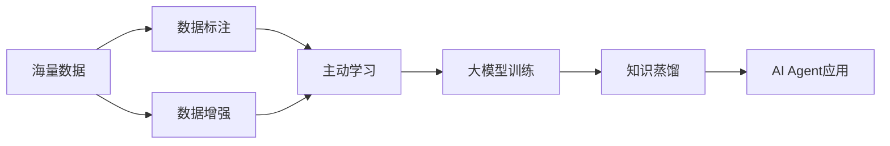

# 【大模型应用开发 动手做AI Agent】数据的收集与整理

## 1. 背景介绍
### 1.1 大模型应用开发的兴起
近年来,随着人工智能技术的飞速发展,尤其是大规模预训练语言模型(如GPT、BERT等)的出现,AI在自然语言处理、对话交互等领域取得了突破性进展。这为构建智能化的AI Agent提供了强大的技术基础。越来越多的企业和开发者开始探索如何利用大模型来开发实用的AI应用,如智能客服、个人助理、知识问答等。

### 1.2 数据是AI开发的核心要素
众所周知,数据是人工智能的核心驱动力。高质量的训练数据是开发高性能AI模型的关键。对于大模型应用开发而言,海量的高质量数据更是不可或缺。只有基于大规模的优质数据进行训练,才能充分发挥大模型的性能优势,训练出鲁棒性强、泛化能力好的AI Agent。因此,数据的收集与整理是大模型应用开发过程中极其重要的一环。

### 1.3 数据收集与整理面临的挑战
尽管大模型为AI开发带来了新的机遇,但同时数据收集与整理也面临诸多挑战:

1. 数据来源分散,获取难度大。构建AI Agent所需的训练语料通常来自多个渠道,如网页、文档、数据库等,数据格式多样,获取过程繁琐。

2. 数据质量参差不齐,噪声较多。原始数据中往往存在大量噪声,如HTML标签、错别字、不相关内容等,需要进行大量的清洗工作。

3. 数据规模庞大,处理效率低。动辄数百GB甚至TB级别的海量数据给存储和计算带来巨大压力,需要高效的分布式处理手段。

4. 数据安全与隐私保护困难。很多数据涉及用户隐私,如何在确保数据安全的前提下进行收集和利用是一大难题。

本文将重点探讨大模型应用开发中数据收集与整理的关键技术,分享实践经验和最佳实践,为AI开发者提供参考和指导。

## 2. 核心概念与联系
### 2.1 大模型(Large Language Model)
大模型是指参数量极其庞大(数十亿到上千亿)的深度学习语言模型,当前最著名的当属OpenAI的GPT系列模型。与传统的LSTM等语言模型相比,大模型具有强大的语义理解和语言生成能力,在QA、对话、摘要、创作等任务上取得了接近甚至超越人类的性能。大模型的训练需要消耗大量计算资源,离不开优质海量语料的支撑。

### 2.2 AI Agent
AI Agent是一种基于人工智能技术,能够自主感知环境、推理决策并采取行动的智能体。它可以是聊天机器人、智能助手、自动驾驶汽车等具体应用形态。构建AI Agent的关键是赋予其海量的知识,使其能够像人一样理解语义、把握上下文、进行多轮交互。大模型为AI Agent的开发提供了理想的技术路径。

### 2.3 数据标注(Data Annotation)
原始数据通常是无结构的,缺乏明确的语义信息,不能直接用于模型训练。数据标注就是为原始数据添加结构化的语义标签,如分词、词性标注、命名实体识别、关系抽取、情感分析等。标注后的数据能够为模型提供更丰富的特征信息,大幅提升训练效果。高质量的人工标注数据是AI开发的重要资产,但成本很高,通常需要众包的方式来完成。

### 2.4 数据增强(Data Augmentation)
数据增强是一种提升模型泛化性能、降低过拟合风险的重要手段。其核心思想是在保持数据语义不变的前提下,通过一些随机变换(如同义词替换、回译、句法分析等)来扩充原始数据集。数据增强可以有效缓解标注数据不足的问题,在低资源场景下尤为有效。大模型的数据增强需要更多考虑语义的连贯性。

### 2.5 主动学习(Active Learning)
主动学习是一种减少标注成本、提高标注效率的策略。传统的被动学习需要标注全量数据,而主动学习可以主动挑选对模型提升效果最大的数据进行标注。具体来说,训练初期先在小规模数据集上训练模型,然后用模型去预测未标注数据,筛选出置信度较低的进行人工标注,再合并已标注数据重新训练。如此迭代,不断优化标注质量。主动学习可以显著降低大模型训练的标注成本。

### 2.6 知识蒸馏(Knowledge Distillation)
知识蒸馏是一种模型压缩技术,其核心思想是用大模型(Teacher)去指导小模型(Student)的训练,使其能够继承大模型的"知识"。具体来说,先用海量数据训练一个性能优异但参数量巨大的大模型,然后利用大模型的软标签(soft label)去监督小模型训练。知识蒸馏可以在保持模型性能的前提下大幅降低模型体积,便于工程落地。对于大模型应用而言,蒸馏是提升推理速度、节约资源开销的重要手段。

下图展示了上述核心概念之间的关系:

## 3. 核心算法原理与操作步骤
### 3.1 数据爬取与解析
数据收集的第一步是爬取互联网上的海量文本数据。常见的数据来源有新闻网站、百科、博客、论坛、社交媒体等。爬虫需要具备以下核心功能:

1. 遵循Robots协议,避免爬取禁止抓取的页面。
2. 支持多线程、分布式爬取,提高数据采集效率。 
3. 具备反爬机制,如IP代理、请求头伪装等。
4. 支持增量爬取,定期更新数据。
5. 对爬取的页面进行解析,提取正文、标题、时间等结构化字段。

常用的爬虫框架有Scrapy、Pyspider、Crawley等,可以显著降低爬虫开发成本。解析HTML页面可以使用BeautifulSoup、Lxml等库。

### 3.2 文本数据清洗
爬取回来的原始文本数据通常含有大量噪声,需要进行清洗,具体步骤如下:

1. 过滤掉低质量文本,如太短、无意义、重复、乱码的内容。
2. 去除HTML标签、JS代码、样式等非文本内容。
3. 删除广告、导航、版权声明等无关文本。
4. 规范化文本表示,如全半角、大小写、数字、标点符号等。
5. 中文分词,英文做Tokenize。
6. 词性标注、命名实体识别等基础NLP处理。

文本清洗需要借助正则表达式、文本相似度算法(如SimHash)等技术手段。

### 3.3 数据标注与增强
为了进一步提升数据质量,需要对清洗后的文本数据进行人工标注,常见的标注任务有:

1. 关键词/关键短语标注
2. 意图识别与槽位填充
3. 句法依存分析
4. 指代消解
5. 篇章结构分析
6. 摘要生成
7. 问题生成与匹配
8. 对话一致性标注

标注任务需要制定详细的标注规范,保证标注质量的一致性。可以使用Doccano、BRAT等开源标注工具提高标注效率。

数据增强主要有以下手段:

1. 回译:将文本翻译成另一种语言,再翻译回来。
2. 同义词替换:用WordNet等知识库替换词语。
3. TF-IDF等统计特征筛选关键词,生成新样本。
4. 使用预训练语言模型(如BERT)来生成句子。
5. 句法分析树变换,生成语义等价的句子。

### 3.4 数据存储与管理
海量文本数据对存储和访问性能提出了很高要求,需要采用合适的存储方案:

1. 采用分布式文件系统HDFS存储原始数据。
2. 对结构化数据采用Hive、HBase等NoSQL数据库。
3. 对爬取元数据、任务管理等采用MySQL等关系型数据库。
4. 对数据处理中间结果、调度信息等采用Redis等内存数据库。
5. 对训练样本、模型等采用对象存储如AWS S3。

数据管理平台需要提供数据检索、权限管理、血缘分析、质量监控等功能,借助Atlas、Amundsen等开源数据治理工具可以显著提升管理效率。

## 4. 数学模型与公式详解
### 4.1 文本相似度
为了对文本数据进行去重、聚类等操作,需要度量两个文本之间的相似度。常用的文本相似度模型有:

1. 基于词袋(BOW)的TF-IDF、BM25等。
2. 基于主题模型的LSI、LDA等。
3. 基于词向量的Word2Vec、GloVe等。
4. 基于深度学习的BERT、RoBERTa等。

以TF-IDF为例,其基本思想是:一个词在一篇文档中出现的频率越高,在所有文档中出现的频率越低,则认为这个词对这篇文档越重要。公式如下:

$$
w_{i,j} = tf_{i,j} \times \log(\frac{N}{df_i})
$$

其中,$w_{i,j}$表示词$i$在文档$j$中的TF-IDF权重,$tf_{i,j}$表示词频,$df_i$表示含有词$i$的文档数,$N$为总文档数。

两个文本的相似度可以用TF-IDF向量的余弦相似度来衡量:

$$
\cos(\vec{v_1}, \vec{v_2}) = \frac{\vec{v_1} \cdot \vec{v_2}}{|\vec{v_1}| |\vec{v_2}|}
$$

### 4.2 主动学习
主动学习的核心是样本选择策略,即如何选择最有价值的样本给专家标注。常见的样本选择策略有:

1. 不确定性采样:选择模型预测置信度最低的样本。
2. 密度加权:选择密度高的区域内不确定度高的样本。
3. 基于委员会的采样:训练多个模型,选择预测差异最大的样本。
4. 基于熵的采样:选择能最大程度降低整个数据集熵的样本。

以不确定性采样为例,假设当前模型对样本$x$的预测概率向量为$\vec{p} = [p_1, p_2, ..., p_k]$,则可以用如下指标来衡量不确定性:

1. 最大概率:
$$
\phi_{lc}(x) = 1 - \max_{i=1}^k p_i
$$

2. 边缘采样:
$$
\phi_{margin}(x) = p_{i1} - p_{i2}
$$
其中$i1, i2$分别为第一、第二大概率对应的类别。

3. 熵:
$$
\phi_{entropy}(x) = -\sum_{i=1}^k p_i \log p_i
$$

不确定性越大的样本,优先被选中标注。

### 4.3 知识蒸馏
假设有训练好的复杂Teacher模型$T$和待训练的简单Student模型$S$,知识蒸馏的目标是最小化两个模型在给定数据集$D$上的预测差异,从而使$S$模仿$T$的行为。一般选择KL散度作为蒸馏的损失函数:

$$
\mathcal{L}_{KD} = \sum_{i=1}^N \sum_{j=1}^K p_T(y_j|x_i) \log \frac{p_T(y_j|x_i)}{p_S(y_j|x_i)}
$$

其中$N$为数据集大小,$K$为类别数,$p_T$和$p_S$分别是两个模型的预测概率分布。

此外,为了让Student模型也能正确分类,通常在蒸馏的同时加入一个分类损