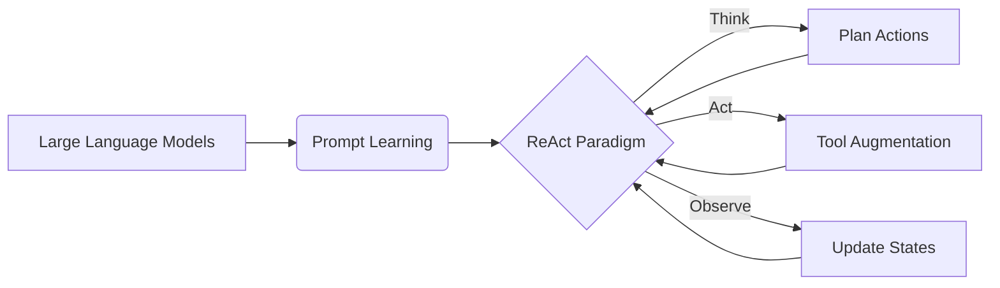

# 【大模型应用开发 动手做AI Agent】构建ReAct Agent

## 1. 背景介绍

### 1.1 大模型的兴起与发展
近年来,随着深度学习技术的飞速发展,大规模预训练语言模型(Large Pre-trained Language Models,简称PLMs)取得了突破性进展。从2018年的BERT到2020年的GPT-3,再到2022年的PaLM等,PLMs的参数规模不断增大,性能也持续提升。这些大模型展现出了惊人的自然语言理解和生成能力,在问答、对话、文本分类、命名实体识别等多个NLP任务上取得了超越人类的表现。

### 1.2 大模型在AI领域的应用
大模型强大的语言理解和生成能力,使其在人工智能领域有广泛的应用前景。一方面,大模型可以作为基础设施,赋能下游的各种AI应用,如智能客服、知识问答、内容创作等。另一方面,大模型还可以直接构建成智能对话代理(Conversational AI Agent),执行open-domain的开放域对话,甚至完成复杂的任务型对话。微软的小冰、Anthropic的Claude、OpenAI的ChatGPT等就是这方面的代表性产品。

### 1.3 AI Agent的发展现状与挑战
当前,AI Agent的研究与应用正成为AI领域的热点。一方面,AI Agent代表了人机交互的新形态,有望成为未来人机协作的重要界面。另一方面,如何让AI Agent具备更强的语言理解、常识推理、多轮对话、任务规划等认知能力,让其胜任更加复杂开放的应用场景,仍面临诸多技术挑战。

### 1.4 本文的主要内容
本文将重点介绍一种名为ReAct的AI Agent构建范式。ReAct通过大模型+外部工具的方式,让Agent具备调用API、数据库、搜索引擎等外部接口的能力,从而极大拓展了其感知与操控能力。在此基础上,ReAct还引入了"思考-行动-观察"的交互范式,赋予Agent主动探索与持续学习的能力。本文将详细阐述ReAct的技术原理,分享动手构建ReAct Agent的实践经验,并展望其在智能助理、数字人等领域的应用前景。

## 2. 核心概念与联系

### 2.1 大模型(Large Language Models) 
大模型是指参数量级在数十亿到上千亿、在超大规模语料上训练的语言模型。它们通过自监督学习从海量无标注文本中习得了丰富的语言知识,具备强大的语言理解(Language Understanding)和语言生成(Language Generation)能力。当前主流的大模型包括GPT系列、PaLM、BLOOM等。大模型是构建ReAct Agent的核心基础。

### 2.2 提示学习(Prompt Learning)
提示学习是指通过设计恰当的提示模板(prompt template),引导大模型执行特定的任务。不同于传统的微调(finetune)范式,提示学习无需重新训练模型参数,只需设计任务相关的提示即可。这使得在大模型上快速适配、组合不同任务成为可能。ReAct Agent正是利用提示学习来编排大模型执行"思考-行动-观察"的交互过程。

### 2.3 工具增强(Tool Augmentation) 
尽管大模型掌握了丰富的语言知识,但它们对外部世界的感知和操控能力有限。工具增强的思路是为大模型接入外部工具,如API、数据库、搜索引擎等,让其获得搜集信息、更新知识、执行动作的能力。ReAct Agent通过封装外部工具,让大模型驱动调用这些工具,从而拓展其感知和行动空间。

### 2.4 反应式执行(ReAct Paradigm)
传统的AI系统遵循"观察-行动"的交互模式,即根据当前观察到的状态采取下一步行动。ReAct则引入了"思考"这一步骤,遵循"思考-行动-观察"的交互范式。其中,"思考"环节通过大模型进行推理,规划出一系列行动;"行动"环节则调用外部工具执行规划好的行动;"观察"环节感知行动的效果,用于更新Agent的认知状态,进行下一轮的"思考"。通过这种反应式执行,ReAct Agent表现出了连贯的多轮交互能力。

### 2.5 概念联系小结
ReAct Agent的核心在于将大模型、提示学习、工具增强有机结合,通过"思考-行动-观察"的反应式执行范式,构建出感知、认知、行动俱全的AI Agent。如下图所示:



## 3. 核心算法原理与操作步骤

### 3.1 ReAct的系统架构
一个典型的ReAct Agent系统由以下几个关键模块组成:

1. 语言模型(Language Model):负责自然语言的理解和生成,通常采用GPT-3、PaLM等大模型。
2. 工具集(Tool Set):提供Agent可调用的外部接口,如搜索引擎、数据库、API等。
3. 提示生成器(Prompt Generator):根据输入和历史信息,生成引导语言模型进行思考、行动的提示。
4. 行动解析器(Action Parser):从语言模型的输出中解析出要执行的行动指令。
5. 观察器(Observer):执行行动后,收集环境的反馈信息。
6. 状态记忆(State Memory):存储Agent的历史观察、行动、思考记录,用于生成下一步提示。

以上模块协同工作,遵循"思考-行动-观察"的交互范式,使Agent能够进行多轮对话,完成复杂开放域任务。

### 3.2 "思考-行动-观察"交互范式 
ReAct Agent的核心算法可总结为以下步骤:

1. 输入分析:对用户输入进行解析,提取关键信息。
2. 思考:
    a. 提示生成:根据输入和历史信息,生成引导语言模型进行推理、规划的提示。
    b. 语言模型推理:语言模型根据提示,输出一系列思考内容和行动计划。
3. 行动:
    a. 行动解析:从语言模型输出中抽取行动指令。
    b. 工具调用:根据指令调用对应的外部工具执行行动。
4. 观察:
    a. 结果收集:获取行动执行的结果反馈。
    b. 环境感知:感知行动对环境状态的影响。
5. 状态更新:将最新的观察信息添加到状态记忆中。
6. 循环:根据是否达成目标,决定是否进入下一轮"思考-行动-观察"。
7. 输出:根据思考结果和行动效果,生成最终回复输出。

通过上述步骤的迭代执行,ReAct Agent表现出了连贯的推理、规划和问题解决能力。

### 3.3 算法伪代码
下面的伪代码展示了ReAct的核心算法逻辑:

```python
def ReAct(input, state_memory, tool_set, language_model):
    # 输入分析
    parsed_input = analyze_input(input)
    
    while not is_goal_achieved(state_memory):
        # 提示生成
        prompt = generate_prompt(parsed_input, state_memory)
        
        # 语言模型推理
        thoughts_and_actions = language_model.inference(prompt)
        
        # 行动解析
        actions = extract_actions(thoughts_and_actions)
        
        # 工具调用
        for action in actions:
            tool = match_tool(action, tool_set)
            result = tool.execute(action)
            
            # 结果收集
            observations = collect_observations(result)
            
            # 状态更新
            state_memory.update(observations)
            
    # 输出生成        
    output = generate_output(state_memory, language_model)
    
    return output
```

以上就是ReAct的核心算法原理和操作步骤。通过语言模型+工具增强+反应式执行,ReAct为构建更加智能、通用的AI Agent提供了一种新思路。

## 4. 数学模型与公式详解

### 4.1 语言模型的数学形式
ReAct的核心在于语言模型,它负责Agent的语言理解和生成。当前主流的语言模型基于Transformer架构,其数学形式可表示为:

$$
\begin{aligned}
\mathbf{H}_0 &= \mathbf{E}\mathbf{X} + \mathbf{P} \\
\mathbf{H}_l &= \textbf{Transformer}(\mathbf{H}_{l-1}), \forall l \in [1, L] \\
p(x) &= \text{softmax}(\mathbf{W}\mathbf{H}_L + \mathbf{b})
\end{aligned}
$$

其中,$\mathbf{X} \in \mathbb{R}^{n \times d}$为输入token序列的embedding表示,$\mathbf{E} \in \mathbb{R}^{d \times v}$为embedding矩阵,$\mathbf{P} \in \mathbb{R}^{n \times d}$为位置编码,$\mathbf{H}_l$为第$l$层Transformer的隐藏状态输出,$L$为Transformer的层数,$\mathbf{W} \in \mathbb{R}^{v \times d}$为输出层矩阵,$\mathbf{b} \in \mathbb{R}^{v}$为输出偏置,$p(x)$为输出token的概率分布。

Transformer的内部结构可进一步分解为:

$$
\begin{aligned}
\mathbf{A}_l &= \text{MultiHead}(\mathbf{H}_{l-1}, \mathbf{H}_{l-1}, \mathbf{H}_{l-1}) \\
\mathbf{I}_l &= \text{LayerNorm}(\mathbf{A}_l + \mathbf{H}_{l-1}) \\
\mathbf{F}_l &= \text{FeedForward}(\mathbf{I}_l) \\
\mathbf{H}_l &= \text{LayerNorm}(\mathbf{F}_l + \mathbf{I}_l)
\end{aligned}
$$

其中,$\text{MultiHead}$为多头自注意力层,$\text{LayerNorm}$为层归一化,$\text{FeedForward}$为前馈神经网络。

通过这种Transformer堆叠结构,语言模型能够建模长距离的token依赖,捕捉丰富的语义信息。ReAct正是利用语言模型强大的语义表示能力,实现了Agent的语言理解、推理、规划等关键能力。

### 4.2 提示学习的数学形式
传统的语言模型是通过 $p(x|\theta)$ 直接建模文本序列 $x$ 的生成概率。而提示学习则引入了提示模板 $t$,通过 $p(x|t,\theta)$ 建模文本 $x$ 在给定提示 $t$ 下的条件概率。形式化地,有:

$$
p(x|t,\theta) = \prod_{i=1}^{n} p(x_i|x_{<i},t,\theta)
$$

其中,$x_i$为第$i$个token,$x_{<i}$为$x_i$之前的token序列。通过设计恰当的提示$t$,可以引导语言模型执行特定的任务。

在ReAct中,提示模板 $t$ 被设计为包含Agent的观察、动作历史以及思考任务定义的形式,例如:

```
观察: 用户问"火星上有生命吗" 
动作1: <搜索>[火星 生命]
结果1: NASA尚未在火星上发现生命存在的确凿证据,但不排除这种可能性。火星上发现了液态水的证据,以及甲烷等有机物的痕迹,这些发现让科学家对火星生命的探索更加期待。
动作2: <搜索>[火星 液态水]
结果2: 2015年,NASA宣布在火星表面发现了液态水流动的证据。雷达数据显示,在火星表面30米深处,存在液态盐水。这些盐水在火星表面形成了暗色条纹,在温暖季节出现,寒冷季节消失。
动作3: <搜索>[火星 甲烷]  
结果3: 2004年,美国"勇气号"和欧洲"火星快车"探测器在火星大气中发现少量甲烷。甲烷可能来源于地质活动,也可能由微生物产生。2019年,"好奇号"首次在火星表面检测到甲烷浓度的周期性波动,进一步支持了火星生命存在的可能性