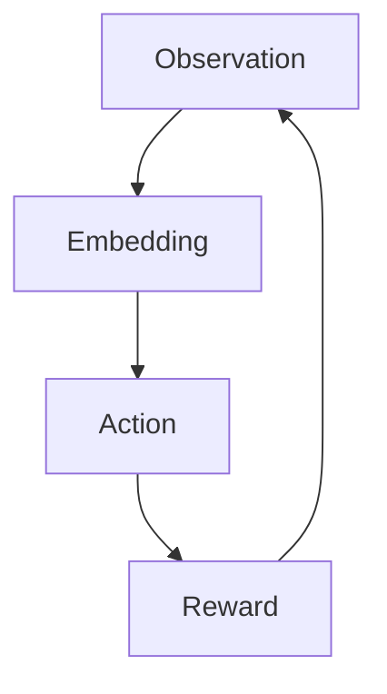

# 【大模型应用开发 动手做AI Agent】用ReAct框架实现简单Agent

## 1. 背景介绍

### 1.1 大模型时代的到来

近年来,大型语言模型(Large Language Models,LLMs)在自然语言处理领域取得了令人瞩目的成就。这些模型通过在海量文本数据上进行预训练,学习了丰富的语言知识和上下文关联能力,从而在下游任务中表现出色。著名的大模型包括GPT-3、PaLM、ChatGPT等,它们展现出了强大的文本生成、问答、总结和推理能力,在多个领域产生了广泛的影响。

随着模型规模和计算能力的不断提升,大模型正在逐步突破传统任务的界限,向更加通用和复杂的应用领域延伸。其中,将大模型应用于构建智能代理(Agent)是一个引人注目的新兴方向。智能代理旨在模拟人类的认知和决策过程,能够根据环境状态做出合理的行为选择,并与外部世界进行交互。通过赋予大模型感知、规划和行动的能力,我们有望构建出更加智能、通用和自主的人工智能系统。

### 1.2 ReAct:大模型智能代理框架

ReAct是一个用于构建大模型智能代理的开源框架,由OpenAI与DeepMind等机构共同推出。该框架提供了一种统一的范式,将大模型的语言能力与决策和规划模块相结合,实现了从自然语言指令到有意义行为的端到端映射。ReAct的核心思想是将智能代理视为一个持续交互的循环过程,包括观察(Observation)、嵌入(Embedding)、行为(Action)和奖励(Reward)四个阶段。

该框架支持多种类型的环境,包括基于文本的模拟环境、基于游戏的环境、基于物理世界的机器人环境等。通过定义环境的状态空间、行为空间和奖励函数,ReAct可以灵活地适配各种应用场景。同时,框架还提供了一系列工具和库,用于训练、评估和部署智能代理模型。

本文将介绍如何使用ReAct框架构建一个简单的智能代理,并探讨其核心原理、实现细节和实践经验,为读者提供一个动手实践的机会。

## 2. 核心概念与联系

在深入探讨ReAct框架之前,我们需要先了解一些核心概念,这些概念构成了智能代理系统的基础。

### 2.1 马尔可夫决策过程(MDP)

马尔可夫决策过程(Markov Decision Process,MDP)是一种用于形式化描述序列决策问题的数学框架。在MDP中,智能体(Agent)与环境(Environment)进行交互,环境会随着时间推移而转移到新的状态,同时智能体也会根据当前状态采取相应的行为。

MDP可以用一个四元组 $(S, A, P, R)$ 来表示,其中:

- $S$ 是状态空间(State Space),表示环境可能出现的所有状态。
- $A$ 是行为空间(Action Space),表示智能体可以采取的所有行为。
- $P$ 是状态转移概率(State Transition Probability),描述了在执行某个行为后,环境从一个状态转移到另一个状态的概率分布。
- $R$ 是奖励函数(Reward Function),定义了在特定状态下执行某个行为所获得的即时奖励。

智能体的目标是学习一个策略(Policy) $\pi: S \rightarrow A$,该策略能够最大化预期的累积奖励。

### 2.2 强化学习(Reinforcement Learning)

强化学习(Reinforcement Learning,RL)是一种基于MDP框架的机器学习范式,旨在通过与环境的交互来学习最优策略。在强化学习中,智能体通过试错和累积经验,不断优化其策略,以获得更高的长期奖励。

强化学习算法通常分为两大类:基于价值函数的方法(Value-based)和基于策略的方法(Policy-based)。前者旨在估计每个状态或状态-行为对的价值函数,然后根据价值函数导出最优策略;后者直接对策略进行参数化,并通过策略梯度等方法优化策略参数。

### 2.3 序列决策与语言

将强化学习应用于自然语言处理领域,需要解决一个关键问题:如何将序列决策问题与语言相结合?ReAct框架提出了一种新颖的方法,将语言指令视为MDP中的初始状态,而智能体的行为则对应于生成自然语言响应。

具体而言,ReAct将MDP中的状态 $s_t$ 表示为一个语言上下文(Context),包括初始指令和之前的交互历史。智能体的策略 $\pi$ 则由一个大型语言模型参数化,该模型根据当前语言上下文生成下一个自然语言行为(Response)。环境则根据这个响应,更新语言上下文并给出相应的奖励信号。

通过这种方式,ReAct成功地将序列决策问题映射到了自然语言领域,使得我们可以利用大型语言模型强大的语言理解和生成能力,构建出智能的对话代理。

## 3. 核心算法原理具体操作步骤 

### 3.1 ReAct框架流程

ReAct框架将智能代理的工作流程抽象为一个循环过程,包括以下四个核心步骤:

1. **Observation(观察)**: 代理从环境中获取当前状态的观察数据,例如文本指令、图像等。
2. **Embedding(嵌入)**: 将观察数据映射到一个连续的向量空间中,作为大型语言模型的输入。
3. **Action(行为)**: 大型语言模型根据嵌入向量生成自然语言响应,作为代理在该时刻的行为输出。
4. **Reward(奖励)**: 环境根据代理的行为,计算一个奖励信号,并更新状态进入下一个时刻。

该循环过程持续进行,直到达到终止条件(如任务完成或步数上限)。在训练阶段,我们的目标是优化语言模型的参数,使得生成的行为序列能够maximiz累积奖励。

### 3.2 行为生成(Action Generation)

行为生成是ReAct框架中最核心的环节,它决定了代理在特定语境下的响应方式。ReAct采用了一种基于提示(Prompt)的范式,将当前的语言上下文作为提示输入到大型语言模型中,然后对模型的输出进行解码,得到自然语言形式的行为。

具体地,给定当前时刻的语言上下文 $c_t$,ReAct会构造一个提示字符串 $x_t$,其中包含任务说明、上下文信息等。然后,将 $x_t$ 输入到语言模型中,对模型的输出 $y_t$ 进行解码,得到代理的行为 $a_t$:

$$a_t = \text{decode}(y_t) \quad \text{where} \quad y_t = \text{LLM}(x_t)$$

提示工程(Prompt Engineering)是行为生成中一个关键的技术,合理的提示设计能够极大提升语言模型的性能和可解释性。ReAct框架支持多种提示模板,用户可以根据具体任务进行定制。

### 3.3 奖励模型(Reward Model)

为了评估代理行为的质量并提供学习信号,ReAct需要一个奖励模型(Reward Model)来计算每个时刻的奖励值。奖励模型的设计高度依赖于具体的应用场景和任务目标。

在一些简单场景下,我们可以直接根据行为与目标状态的匹配程度来设计奖励函数,例如使用字符级或token级的相似度作为奖励信号。但在更加复杂的场景中,奖励模型往往需要引入人类偏好、规则约束等先验知识,以确保代理行为的合理性和安全性。

ReAct框架支持使用另一个独立的语言模型作为奖励模型,该模型根据当前语境和代理行为,生成一个衡量行为质量的分数或等级,作为奖励信号的来源。通过这种方式,我们可以将人类的语言理解能力注入到奖励模型中,从而获得更加准确和可解释的奖励信号。

### 3.4 优化策略(Policy Optimization)

ReAct框架中的策略由大型语言模型参数化,因此优化策略的目标就是调整语言模型的参数,使得生成的行为序列能够maximiz预期的累积奖励。

为了实现这一目标,ReAct采用了策略梯度(Policy Gradient)的优化范式。具体来说,我们定义了一个目标函数 $J(\theta)$,它是语言模型参数 $\theta$ 下行为序列的期望奖励:

$$J(\theta) = \mathbb{E}_{\tau \sim \pi_\theta} \left[ \sum_{t=0}^T r_t \right]$$

其中 $\tau = (s_0, a_0, r_0, s_1, a_1, r_1, \ldots)$ 表示一个完整的状态-行为-奖励序列,也被称为一个轨迹(Trajectory)。

接下来,我们可以通过计算目标函数关于模型参数的梯度,并采用某种优化算法(如Adam)对参数进行更新,从而最大化预期奖励:

$$\theta \leftarrow \theta + \alpha \nabla_\theta J(\theta)$$

其中 $\alpha$ 是学习率。梯度 $\nabla_\theta J(\theta)$ 可以通过策略梯度定理和一些技巧(如重要性采样)进行高效的估计和计算。

除了基本的策略梯度方法,ReAct框架还支持一些更加先进的优化算法,如信任区域策略优化(TRPO)、近端策略优化(PPO)等,以提高优化效率和策略性能。

## 4. 数学模型和公式详细讲解举例说明

在上一节中,我们介绍了ReAct框架的核心算法原理,其中涉及到一些重要的数学模型和公式。在这一节,我们将对其中的关键部分进行更加详细的讲解和举例说明。

### 4.1 马尔可夫决策过程(MDP)

马尔可夫决策过程(MDP)是强化学习的数学基础,它将序列决策问题形式化为一个四元组 $(S, A, P, R)$。让我们分别来看一下每个元素的具体含义。

**状态空间 $S$**

状态空间 $S$ 表示环境可能出现的所有状态的集合。在ReAct框架中,状态通常被表示为一个语言上下文,包括任务描述、历史交互等信息。例如,在一个简单的对话场景中,状态可以用一个字符串表示:

$$s_t = \text{"Task: Order a pizza"} + \text{History}$$

其中 `History` 是之前的问答交互记录。

**行为空间 $A$**

行为空间 $A$ 表示智能体可以采取的所有行为的集合。在ReAct中,行为对应于自然语言响应,因此行为空间实际上是所有可能的文本序列。例如,对于上面的状态,一个可能的行为是:

$$a_t = \text{"What kind of pizza would you like?"}$$

**状态转移概率 $P$**

状态转移概率 $P(s' | s, a)$ 描述了在执行某个行为 $a$ 后,环境从状态 $s$ 转移到状态 $s'$ 的概率分布。在ReAct框架中,状态转移通常由环境模型隐式地定义,而不是显式地给出概率分布。

例如,在对话场景中,如果智能体的行为是 $a_t = \text{"What kind of pizza would you like?"}$,那么下一个状态 $s_{t+1}$ 可能是:

$$s_{t+1} = s_t + \text{"Human: I'd like a pepperoni pizza."}$$

**奖励函数 $R$**

奖励函数 $R(s, a)$ 定义了在特定状态 $s$ 下执行行为 $a$ 所获得的即时奖励。在ReAct中,奖励函数通常由一个独立的奖励模型来计算,该模型可以是一个语言模型或者一些手工设计的规则。

例如,在对话场景中,如果智能体的行为是合理的,那么奖励模型可能会给出一个正