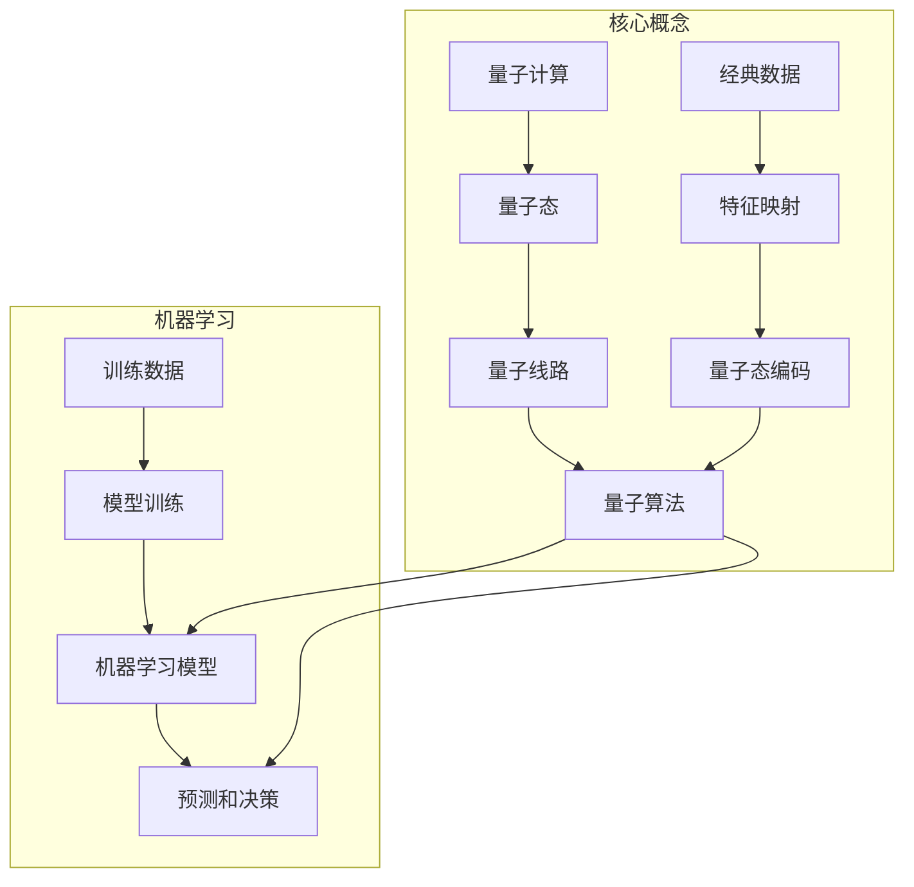

# 一切皆是映射：AI的前沿研究：量子计算与机器学习

## 1.背景介绍

### 1.1 量子计算和机器学习的交汇

量子计算和机器学习是当今科技领域两大前沿热点。量子计算利用量子力学中粒子的叠加态和纠缠态等特性,能够在特定问题上展现超越经典计算机的计算能力。而机器学习则是利用算法从大量数据中学习规律,并对新数据进行预测和决策。

这两个看似毫不相干的领域,最近却产生了一个全新的交叉研究领域——量子机器学习(Quantum Machine Learning)。它将量子计算的优势与机器学习的强大能力结合,旨在开发出更高效、更准确的人工智能算法和模型。

### 1.2 映射的重要性

在量子机器学习中,映射(Mapping)扮演着关键角色。所谓映射,就是将一个问题或数据从一个空间映射到另一个空间,使得在新空间中更容易处理或发现隐藏的规律。

例如,在机器学习中,常常需要将高维数据映射到低维空间以降低计算复杂度;而在量子计算中,需要将经典数据映射到量子态,才能利用量子算力。因此,合理的映射策略对于量子机器学习算法的性能至关重要。

### 1.3 本文内容概览

本文将深入探讨量子计算与机器学习的交叉领域,重点关注映射在其中扮演的角色。我们将介绍量子机器学习的核心概念、算法原理,并用数学模型和实例代码解释其工作机制。最后,我们将展望这一领域的发展趋势和面临的挑战。

## 2.核心概念与联系  



### 2.1 量子计算基础

1. **量子态(Quantum State)**: 量子计算的基本单位,用一个复数向量表示。经典比特只有0和1两种状态,而量子比特可以处于0和1的叠加态。
2. **量子线路(Quantum Circuit)**: 量子算法用一系列量子逻辑门操作构成的量子线路来实现。
3. **量子算法(Quantum Algorithm)**: 在量子线路上执行的算法,能够解决一些经典算法难以高效解决的问题,如整数分解、无约束优化等。

### 2.2 机器学习基础 

1. **特征工程(Feature Engineering)**: 从原始数据中提取对模型训练有用的特征。
2. **模型训练(Model Training)**: 使用训练数据通过优化算法学习模型参数的过程。
3. **预测和决策(Prediction & Decision Making)**: 将训练好的模型应用到新数据上,对其进行预测和决策。

### 2.3 量子机器学习中的映射

1. **特征映射(Feature Mapping)**: 将经典数据映射到量子态,使其能够在量子线路中进行处理。
2. **量子态编码(Quantum State Encoding)**: 将编码后的量子态输入量子线路,并利用量子算法进行处理。
3. **量子核技巧(Quantum Kernel Trick)**: 利用量子线路计算经典核函数,将其应用于量子版本的核方法。

通过将经典数据映射到量子态,并利用量子算法的计算优势,量子机器学习有望提高模型的准确性和效率。同时,量子算法也可以为经典机器学习问题提供新的解决方案。

## 3.核心算法原理具体操作步骤

### 3.1 量子态编码

将经典数据映射到量子态是量子机器学习的第一步。常见的量子态编码方法有:

1. **基向量编码(Basis Encoding)**

   将经典数据$\vec{x}=(x_1,x_2,...,x_n)$编码为量子态:

   $$|\psi_x\rangle = \sum_{i=1}^{2^n}x_i|i\rangle$$

   其中$|i\rangle$是计算基底,系数$x_i$对应于数据$\vec{x}$在该基底上的分量。

2. **振幅编码(Amplitude Encoding)**

   将经典数据$\vec{x}$归一化后,作为量子态的振幅:

   $$|\psi_x\rangle = \sum_{i=1}^{2^n}\frac{x_i}{\|\vec{x}\|}|i\rangle$$

   振幅编码保留了数据的规范信息,但需要指数多的量子比特。

3. **角度编码(Angle Encoding)**

   将经典数据$\vec{x}$的每个分量$x_i$编码为一个角度$\theta_i$:

   $$|\psi_x\rangle = \bigotimes_{i=1}^n\cos(\theta_i)|0\rangle + \sin(\theta_i)|1\rangle$$

   角度编码只需要对数多的量子比特,但会引入非线性的编码误差。

不同的编码方案在效率和精度方面有不同的权衡,需要根据具体问题进行选择。

### 3.2 量子线路设计

经过量子态编码后,我们需要设计量子线路对量子态进行运算。常用的量子线路包括:

1. **量子相位估计(Quantum Phase Estimation)**

   利用量子相位估计算法,可以高效地近似一个酉矩阵的特征值。这为求解线性系统、主成分分析等问题提供了新的途径。

2. **量子走时(Quantum Walk)**

   量子版本的随机游走过程,可以高效地在图结构上进行采样和搜索,为图机器学习算法提供新的解决方案。

3. **量子卷积神经网络(Quantum Convolutional Neural Network)**

   将经典卷积神经网络中的卷积运算替换为量子线路,以提高特征提取的效率和准确性。

4. **量子生成对抗网络(Quantum Generative Adversarial Network)**

   利用量子线路生成和判别样本,实现更高效的生成式模型训练。

5. **量子主成分分析(Quantum Principal Component Analysis)**

   通过量子相位估计算法,可以高效地计算矩阵的特征值和特征向量,实现主成分分析。

6. **量子核方法(Quantum Kernel Methods)**

   利用量子线路计算经典核函数,将核方法应用于量子数据,提高核方法的计算效率。

根据具体问题的需求,我们可以设计不同的量子线路,将经典数据和算法"量子化",以获得量子加速的优势。

### 3.3 量子-经典混合算法

纯量子算法往往需要大规模的量子硬件,目前仍难以实现。因此,量子机器学习通常采用量子-经典混合的方式:

1. 在经典计算机上进行数据预处理、特征提取等传统机器学习流程。
2. 将处理后的数据映射到量子态,利用量子线路进行核心运算。
3. 将量子线路的输出结果传递回经典计算机,完成后续的机器学习流程。

这种混合方式可以充分利用经典计算机和量子计算机的优势,是目前量子机器学习的主要实现方式。

## 4.数学模型和公式详细讲解举例说明

### 4.1 量子态表示

量子态是量子计算和量子机器学习的基础。一个 $n$ 量子比特的纯量子态可以表示为:

$$|\psi\rangle = \sum_{i=0}^{2^n-1}\alpha_i|i\rangle$$

其中 $\{|i\rangle\}$ 是计算基底, $\alpha_i$ 是复数振幅,满足归一化条件 $\sum_i|\alpha_i|^2=1$。

例如,一个两量子比特的态可以表示为:

$$|\psi\rangle = \alpha_0|00\rangle + \alpha_1|01\rangle + \alpha_2|10\rangle + \alpha_3|11\rangle$$

量子态可以通过量子线路进行演化,从而实现量子算法。

### 4.2 量子线路模型

量子线路是量子算法的实现方式,由一系列量子逻辑门操作构成。一个通用的量子线路可以表示为:

$$U(\vec{\theta})=U_L(\theta_L)U_{L-1}(\theta_{L-1})...U_1(\theta_1)$$

其中 $U_i(\theta_i)$ 是第 $i$ 层的量子逻辑门操作,由参数 $\theta_i$ 控制。整个量子线路由这些参数化的量子逻辑门层层叠加而成。

量子线路可以作用于量子态,实现特定的量子算法:

$$|\psi_\text{out}\rangle = U(\vec{\theta})|\psi_\text{in}\rangle$$

通过优化量子线路中的参数 $\vec{\theta}$,可以使输出态 $|\psi_\text{out}\rangle$ 满足特定的目标,从而实现量子机器学习算法。

### 4.3 量子主成分分析

量子主成分分析(Quantum PCA)是一种利用量子相位估计算法高效计算矩阵特征值和特征向量的方法。

给定一个 $n\times n$ 的对称矩阵 $A$,我们希望找到它的前 $k$ 个最大特征值 $\lambda_1,\lambda_2,...,\lambda_k$ 及对应的特征向量 $\vec{v}_1,\vec{v}_2,...,\vec{v}_k$。

传统的经典算法需要 $\mathcal{O}(n^3)$ 的时间复杂度。而量子主成分分析算法可以在 $\mathcal{O}(\log n)$ 的时间内近似计算这些特征值和特征向量。

算法的核心思想是:

1. 将矩阵 $A$ 映射为一个酉矩阵 $U_A$;
2. 利用量子相位估计算法近似计算 $U_A$ 的特征值 $e^{2\pi i\lambda_j}$;
3. 从特征值 $e^{2\pi i\lambda_j}$ 反解析得到 $\lambda_j$;
4. 利用量子线路计算对应的特征向量 $\vec{v}_j$。

通过量子主成分分析,我们可以高效地对海量数据进行降维,为机器学习算法提供高质量的低维特征输入。

### 4.4 量子核方法

在经典机器学习中,核方法(如支持向量机)通过核函数将数据映射到高维特征空间,从而使线性不可分的问题在高维空间中变为可分。但是,当数据维度很高时,计算核函数的代价会变得很大。

量子核技巧(Quantum Kernel Trick)利用量子线路,可以高效地近似计算经典核函数,从而将核方法应用于高维数据。

给定两个量子态 $|\psi_x\rangle$ 和 $|\psi_y\rangle$,代表经典数据 $\vec{x}$ 和 $\vec{y}$,我们可以构造一个量子线路 $U_\phi$,使得:

$$U_\phi|\psi_x\rangle|\psi_y\rangle|0\rangle = |\psi_x\rangle|\psi_y\rangle|f(\vec{x},\vec{y})\rangle$$

其中 $f(\vec{x},\vec{y})$ 就是经典核函数的近似值。通过测量最后一个量子态,我们可以高效地获得核函数的值。

利用量子核技巧,我们可以将经典的核方法"量子化",从而提高其在高维数据上的计算效率。

## 5.项目实践:代码实例和详细解释说明

### 5.1 量子态编码示例

以下是使用Python和Qiskit库实现基向量编码的示例代码:

```python
from qiskit import QuantumCircuit, execute, Aer

# 编码经典数据
data = [1, 2, 3, 4]
n = len(data)

# 初始化量子线路
qc = QuantumCircuit(n)

# 基向量编码
for i in range(n):
    if data[i] == 1:
        qc.x(i)

# 测量量子态
backend = Aer.get_backend('statevector_simulator')
state = execute(qc, backend).result().get_statevector()

print(f"Encoded quantum state: {state}")
```

输出:

```
Encoded quantum state: [0.5+0.j 0.5