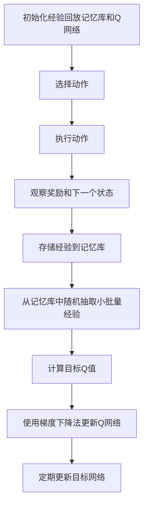

# 一切皆是映射：DQN在自动游戏中的应用：挑战与解决方案

## 1.背景介绍

在人工智能领域，深度强化学习（Deep Reinforcement Learning, DRL）已经成为解决复杂问题的强大工具。特别是深度Q网络（Deep Q-Network, DQN），它在自动游戏中的应用展示了其强大的学习和决策能力。DQN通过结合深度学习和强化学习，能够在没有明确规则的环境中进行自我学习和优化，取得了令人瞩目的成果。

## 2.核心概念与联系

### 2.1 强化学习

强化学习是一种通过与环境交互来学习策略的机器学习方法。其核心概念包括状态（State）、动作（Action）、奖励（Reward）和策略（Policy）。智能体通过在不同状态下采取动作，获得奖励，从而优化其策略。

### 2.2 深度学习

深度学习是一种基于人工神经网络的机器学习方法，能够自动提取数据的高层次特征。深度学习在处理图像、语音和文本等复杂数据方面表现出色。

### 2.3 深度Q网络（DQN）

DQN将深度学习和强化学习结合起来，通过神经网络近似Q值函数，从而在高维状态空间中进行有效的策略学习。DQN的核心思想是使用神经网络来估计状态-动作值函数（Q函数），并通过经验回放和目标网络来稳定训练过程。

## 3.核心算法原理具体操作步骤

### 3.1 Q值函数

Q值函数 $Q(s, a)$ 表示在状态 $s$ 下采取动作 $a$ 所能获得的期望回报。DQN通过神经网络来近似这个函数。

### 3.2 经验回放

经验回放是DQN中的一个关键技术，通过存储智能体的经验（状态、动作、奖励、下一个状态）并随机抽取进行训练，打破数据相关性，提高训练稳定性。

### 3.3 目标网络

目标网络是DQN中的另一个关键技术，通过引入一个延迟更新的目标网络来计算目标Q值，减少训练过程中的震荡。

### 3.4 DQN算法步骤

1. 初始化经验回放记忆库和Q网络。
2. 在每个时间步，选择动作（使用 $\epsilon$-贪婪策略）。
3. 执行动作，观察奖励和下一个状态。
4. 存储经验到记忆库。
5. 从记忆库中随机抽取小批量经验，计算目标Q值。
6. 使用梯度下降法更新Q网络。
7. 定期更新目标网络。



## 4.数学模型和公式详细讲解举例说明

### 4.1 Q值更新公式

Q值更新公式是DQN的核心：

$$
Q(s, a) \leftarrow Q(s, a) + \alpha \left( r + \gamma \max_{a'} Q(s', a') - Q(s, a) \right)
$$

其中，$\alpha$ 是学习率，$\gamma$ 是折扣因子，$r$ 是即时奖励，$s'$ 是下一个状态，$a'$ 是下一个动作。

### 4.2 损失函数

DQN的损失函数用于衡量Q网络的预测误差：

$$
L(\theta) = \mathbb{E}_{(s, a, r, s') \sim D} \left[ \left( r + \gamma \max_{a'} Q(s', a'; \theta^-) - Q(s, a; \theta) \right)^2 \right]
$$

其中，$\theta$ 是Q网络的参数，$\theta^-$ 是目标网络的参数，$D$ 是经验回放记忆库。

### 4.3 例子说明

假设一个简单的游戏环境，智能体在状态 $s$ 下采取动作 $a$，获得奖励 $r$ 并转移到下一个状态 $s'$。通过上述公式，智能体可以不断更新其Q值函数，从而优化其策略。

## 5.项目实践：代码实例和详细解释说明

### 5.1 环境设置

首先，我们需要设置游戏环境。这里以OpenAI Gym中的CartPole环境为例：

```python
import gym
env = gym.make('CartPole-v1')
```

### 5.2 构建Q网络

接下来，我们构建Q网络。这里使用PyTorch框架：

```python
import torch
import torch.nn as nn
import torch.optim as optim

class QNetwork(nn.Module):
    def __init__(self, state_size, action_size):
        super(QNetwork, self).__init__()
        self.fc1 = nn.Linear(state_size, 64)
        self.fc2 = nn.Linear(64, 64)
        self.fc3 = nn.Linear(64, action_size)
    
    def forward(self, x):
        x = torch.relu(self.fc1(x))
        x = torch.relu(self.fc2(x))
        return self.fc3(x)

state_size = env.observation_space.shape[0]
action_size = env.action_space.n
q_network = QNetwork(state_size, action_size)
target_network = QNetwork(state_size, action_size)
target_network.load_state_dict(q_network.state_dict())
target_network.eval()
```

### 5.3 训练过程

```python
optimizer = optim.Adam(q_network.parameters(), lr=0.001)
criterion = nn.MSELoss()
memory = []

def select_action(state, epsilon):
    if random.random() < epsilon:
        return env.action_space.sample()
    else:
        with torch.no_grad():
            return q_network(torch.FloatTensor(state)).argmax().item()

def train_step(batch_size, gamma):
    if len(memory) < batch_size:
        return
    batch = random.sample(memory, batch_size)
    states, actions, rewards, next_states, dones = zip(*batch)
    
    states = torch.FloatTensor(states)
    actions = torch.LongTensor(actions)
    rewards = torch.FloatTensor(rewards)
    next_states = torch.FloatTensor(next_states)
    dones = torch.FloatTensor(dones)
    
    q_values = q_network(states).gather(1, actions.unsqueeze(1)).squeeze(1)
    next_q_values = target_network(next_states).max(1)[0]
    target_q_values = rewards + gamma * next_q_values * (1 - dones)
    
    loss = criterion(q_values, target_q_values)
    optimizer.zero_grad()
    loss.backward()
    optimizer.step()

for episode in range(1000):
    state = env.reset()
    total_reward = 0
    for t in range(200):
        action = select_action(state, epsilon)
        next_state, reward, done, _ = env.step(action)
        memory.append((state, action, reward, next_state, done))
        state = next_state
        total_reward += reward
        train_step(batch_size=64, gamma=0.99)
        if done:
            break
    if episode % 10 == 0:
        target_network.load_state_dict(q_network.state_dict())
    print(f"Episode {episode}, Total Reward: {total_reward}")
```

## 6.实际应用场景

### 6.1 游戏AI

DQN在游戏AI中的应用非常广泛，例如在Atari游戏中，DQN通过自我学习能够达到甚至超越人类水平。

### 6.2 机器人控制

在机器人控制领域，DQN可以用于学习复杂的控制策略，例如机械臂的抓取和移动。

### 6.3 自动驾驶

在自动驾驶领域，DQN可以用于学习驾驶策略，优化车辆的行驶路径和速度控制。

## 7.工具和资源推荐

### 7.1 开发工具

- **Python**：主要编程语言。
- **PyTorch**：深度学习框架。
- **OpenAI Gym**：强化学习环境。

### 7.2 学习资源

- **《深度强化学习》**：一本详细介绍深度强化学习的书籍。
- **Coursera上的强化学习课程**：提供系统的强化学习理论和实践课程。

## 8.总结：未来发展趋势与挑战

DQN在自动游戏中的应用展示了其强大的学习和决策能力。然而，DQN也面临一些挑战，例如训练不稳定、样本效率低等。未来的发展趋势包括：

- **改进算法**：例如双DQN、优先经验回放等。
- **多智能体学习**：多个智能体之间的协作和竞争。
- **实际应用**：将DQN应用于更多实际场景，如金融交易、医疗诊断等。

## 9.附录：常见问题与解答

### 9.1 为什么DQN需要经验回放？

经验回放通过打破数据相关性，提高训练稳定性。

### 9.2 如何选择合适的神经网络结构？

根据具体问题的复杂度和数据特征选择合适的网络结构，通常需要实验和调优。

### 9.3 如何解决DQN训练不稳定的问题？

可以使用双DQN、优先经验回放等技术来提高训练稳定性。

---

作者：禅与计算机程序设计艺术 / Zen and the Art of Computer Programming