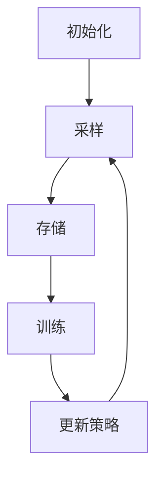

# 一切皆是映射：DQN训练策略：平衡探索与利用

## 1.背景介绍

深度强化学习（Deep Reinforcement Learning, DRL）近年来在多个领域取得了显著的进展，从游戏AI到自动驾驶，再到机器人控制，DRL的应用场景越来越广泛。深度Q网络（Deep Q-Network, DQN）作为DRL中的一种经典算法，因其在Atari游戏中的出色表现而备受关注。然而，DQN在训练过程中面临一个重要的挑战：如何在探索（exploration）和利用（exploitation）之间取得平衡。

探索指的是智能体尝试新的动作，以发现潜在的高回报策略；利用则是智能体利用已知的最佳策略来最大化回报。本文将深入探讨DQN训练策略中的探索与利用问题，提供详细的算法原理、数学模型、代码实例以及实际应用场景，帮助读者更好地理解和应用DQN。

## 2.核心概念与联系

### 2.1 强化学习基本概念

在强化学习中，智能体通过与环境的交互来学习策略，以最大化累积回报。基本概念包括：

- **状态（State, S）**：环境在某一时刻的描述。
- **动作（Action, A）**：智能体在某一状态下可以采取的行为。
- **回报（Reward, R）**：智能体采取某一动作后环境反馈的奖励。
- **策略（Policy, π）**：智能体在各状态下选择动作的规则。

### 2.2 Q学习与深度Q网络

Q学习是一种无模型的强化学习算法，通过学习状态-动作值函数（Q函数）来指导智能体的行为。Q函数表示在某一状态下采取某一动作的预期回报。深度Q网络（DQN）将Q学习与深度神经网络结合，通过神经网络逼近Q函数。

### 2.3 探索与利用的平衡

在DQN训练过程中，智能体需要在探索和利用之间取得平衡。常见的策略包括：

- **ε-贪婪策略（ε-greedy）**：以概率ε选择随机动作（探索），以概率1-ε选择当前最优动作（利用）。
- **软max策略（Softmax）**：根据动作的Q值分布选择动作，概率较高的动作更有可能被选择。

## 3.核心算法原理具体操作步骤

### 3.1 DQN算法流程

DQN算法的核心流程如下：

1. **初始化**：初始化经验回放池（Replay Buffer）和Q网络参数。
2. **采样**：从环境中采样状态、动作、回报和下一个状态。
3. **存储**：将采样结果存储到经验回放池中。
4. **训练**：从经验回放池中随机抽取小批量样本，计算损失并更新Q网络参数。
5. **更新策略**：根据ε-贪婪策略选择动作，继续与环境交互。



### 3.2 经验回放机制

经验回放池用于存储智能体与环境交互的经验，通过随机抽取小批量样本进行训练，打破数据相关性，提高训练稳定性。

### 3.3 目标网络

DQN引入目标网络（Target Network）来稳定训练过程。目标网络的参数固定一段时间后再更新，减少Q值更新的波动。

## 4.数学模型和公式详细讲解举例说明

### 4.1 Q函数更新公式

Q学习的核心是Q函数的更新公式：

$$
Q(s, a) \leftarrow Q(s, a) + \alpha \left[ r + \gamma \max_{a'} Q(s', a') - Q(s, a) \right]
$$

其中，$\alpha$是学习率，$\gamma$是折扣因子，$r$是即时回报，$s'$是下一状态，$a'$是下一动作。

### 4.2 损失函数

DQN使用均方误差（Mean Squared Error, MSE）作为损失函数：

$$
L(\theta) = \mathbb{E}_{(s, a, r, s') \sim \mathcal{D}} \left[ \left( r + \gamma \max_{a'} Q(s', a'; \theta^-) - Q(s, a; \theta) \right)^2 \right]
$$

其中，$\theta$是Q网络的参数，$\theta^-$是目标网络的参数，$\mathcal{D}$是经验回放池。

### 4.3 ε-贪婪策略

ε-贪婪策略的数学表达式为：

$$
\pi(a|s) = 
\begin{cases} 
1 - \epsilon + \frac{\epsilon}{|A|} & \text{if } a = \arg\max_{a'} Q(s, a') \\
\frac{\epsilon}{|A|} & \text{otherwise}
\end{cases}
$$

其中，$|A|$是动作空间的大小。

## 5.项目实践：代码实例和详细解释说明

### 5.1 环境设置

首先，我们需要设置环境和必要的库：

```python
import gym
import numpy as np
import tensorflow as tf
from collections import deque
import random
```

### 5.2 Q网络定义

定义Q网络：

```python
class QNetwork(tf.keras.Model):
    def __init__(self, action_size):
        super(QNetwork, self).__init__()
        self.dense1 = tf.keras.layers.Dense(24, activation='relu')
        self.dense2 = tf.keras.layers.Dense(24, activation='relu')
        self.out = tf.keras.layers.Dense(action_size, activation=None)

    def call(self, x):
        x = self.dense1(x)
        x = self.dense2(x)
        return self.out(x)
```

### 5.3 经验回放池

定义经验回放池：

```python
class ReplayBuffer:
    def __init__(self, buffer_size):
        self.buffer = deque(maxlen=buffer_size)

    def add(self, experience):
        self.buffer.append(experience)

    def sample(self, batch_size):
        return random.sample(self.buffer, batch_size)

    def size(self):
        return len(self.buffer)
```

### 5.4 DQN训练过程

定义DQN训练过程：

```python
def train_dqn(env, num_episodes, buffer_size, batch_size, gamma, epsilon, epsilon_min, epsilon_decay, learning_rate):
    action_size = env.action_space.n
    state_size = env.observation_space.shape[0]

    q_network = QNetwork(action_size)
    target_network = QNetwork(action_size)
    target_network.set_weights(q_network.get_weights())

    optimizer = tf.keras.optimizers.Adam(learning_rate)
    replay_buffer = ReplayBuffer(buffer_size)

    for episode in range(num_episodes):
        state = env.reset()
        total_reward = 0

        while True:
            if np.random.rand() <= epsilon:
                action = np.random.choice(action_size)
            else:
                q_values = q_network(np.expand_dims(state, axis=0))
                action = np.argmax(q_values)

            next_state, reward, done, _ = env.step(action)
            replay_buffer.add((state, action, reward, next_state, done))
            total_reward += reward

            if replay_buffer.size() >= batch_size:
                batch = replay_buffer.sample(batch_size)
                states, actions, rewards, next_states, dones = map(np.array, zip(*batch))

                target_q_values = target_network(next_states)
                max_target_q_values = np.max(target_q_values, axis=1)
                targets = rewards + gamma * max_target_q_values * (1 - dones)

                with tf.GradientTape() as tape:
                    q_values = q_network(states)
                    q_values = tf.reduce_sum(q_values * tf.one_hot(actions, action_size), axis=1)
                    loss = tf.reduce_mean(tf.square(targets - q_values))

                grads = tape.gradient(loss, q_network.trainable_variables)
                optimizer.apply_gradients(zip(grads, q_network.trainable_variables))

            state = next_state

            if done:
                break

        if epsilon > epsilon_min:
            epsilon *= epsilon_decay

        if episode % 10 == 0:
            target_network.set_weights(q_network.get_weights())

        print(f"Episode: {episode}, Total Reward: {total_reward}, Epsilon: {epsilon}")

    return q_network
```

### 5.5 训练模型

训练DQN模型：

```python
env = gym.make('CartPole-v1')
num_episodes = 500
buffer_size = 10000
batch_size = 64
gamma = 0.99
epsilon = 1.0
epsilon_min = 0.01
epsilon_decay = 0.995
learning_rate = 0.001

trained_q_network = train_dqn(env, num_episodes, buffer_size, batch_size, gamma, epsilon, epsilon_min, epsilon_decay, learning_rate)
```

## 6.实际应用场景

### 6.1 游戏AI

DQN在游戏AI中有广泛应用，特别是在Atari游戏中，DQN通过学习能够在多个游戏中达到甚至超越人类水平。

### 6.2 自动驾驶

在自动驾驶领域，DQN可以用于决策和控制，例如路径规划和避障。

### 6.3 机器人控制

DQN在机器人控制中也有应用，通过学习复杂的控制策略，机器人能够完成各种任务，如抓取、移动等。

## 7.工具和资源推荐

### 7.1 开源库

- **TensorFlow**：一个广泛使用的深度学习框架，支持DQN的实现。
- **PyTorch**：另一个流行的深度学习框架，具有灵活性和易用性。
- **OpenAI Gym**：一个用于开发和比较强化学习算法的工具包，提供了多种环境。

### 7.2 书籍和论文

- **《深度强化学习》**：一本详细介绍深度强化学习理论和实践的书籍。
- **DQN原始论文**：Mnih et al., "Playing Atari with Deep Reinforcement Learning"。

## 8.总结：未来发展趋势与挑战

DQN作为深度强化学习的经典算法，已经在多个领域取得了显著成果。然而，DQN也面临一些挑战，如训练不稳定、样本效率低等。未来的发展趋势包括：

- **改进算法稳定性**：通过引入双重DQN、优先经验回放等技术，提高算法的稳定性。
- **提高样本效率**：通过分布式训练、多智能体协作等方法，提高样本利用效率。
- **扩展应用场景**：将DQN应用于更多实际场景，如金融交易、医疗诊断等。

## 9.附录：常见问题与解答

### 9.1 为什么DQN需要经验回放池？

经验回放池通过打破数据相关性，提高训练稳定性和效率。

### 9.2 如何选择合适的ε值？

ε值的选择需要根据具体问题进行调整，通常从较大值开始，逐渐减小。

### 9.3 DQN的训练时间为什么较长？

DQN的训练时间较长是因为需要大量的交互数据和计算资源，可以通过分布式训练和硬件加速来优化。

---

作者：禅与计算机程序设计艺术 / Zen and the Art of Computer Programming