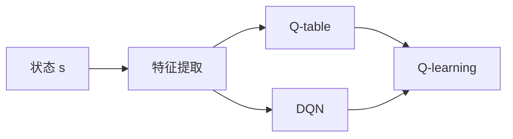

# 一切皆是映射：如何使用DQN处理高维的状态空间

## 1. 背景介绍

在强化学习(Reinforcement Learning, RL)领域,处理高维状态空间一直是一个巨大的挑战。传统的Q-learning算法在面对大规模状态空间时会变得低效甚至无法收敛。为了解决这个问题,DeepMind在2015年提出了深度Q网络(Deep Q-Network, DQN)[1],通过引入深度神经网络来逼近最优Q函数,大大提升了RL算法处理高维状态空间的能力。

DQN的核心思想是:将状态映射到一个低维的特征表示,然后基于这个特征表示来估计每个动作的Q值。这个过程可以看作是一种"降维"操作,即将原始的高维状态空间映射到一个低维的特征空间。通过这种方式,DQN能够有效地处理图像、文本等高维观测数据,在Atari游戏、机器人控制等任务上取得了突破性的进展。

本文将深入探讨DQN算法的原理和实现细节,阐述其在处理高维状态空间方面的优势。我们会从数学和代码两个角度来解析DQN,帮助读者全面理解这一里程碑式的算法。

## 2. 核心概念与联系

在讨论DQN之前,我们先来回顾一下Q-learning的基本原理。Q-learning是一种值迭代(Value Iteration)算法,其核心是学习一个Q函数来估计每个状态-动作对的长期回报。具体来说,Q函数定义为:

$$Q(s,a)=\mathbb{E}[R_t|s_t=s,a_t=a]$$

其中$s$表示状态,$a$表示动作,$R_t$表示从时刻$t$开始的累积回报(Discounted Return):

$$R_t=\sum_{k=0}^{\infty}\gamma^kr_{t+k}$$

这里$r_t$表示在时刻$t$获得的即时奖励,$\gamma\in[0,1]$是折扣因子。

Q-learning的目标是学习一个最优策略$\pi^*$,使得在该策略下的Q函数达到最大:

$$\pi^*(s)=\arg\max_a Q^*(s,a)$$

其中最优Q函数$Q^*$满足贝尔曼最优方程(Bellman Optimality Equation):

$$Q^*(s,a)=\mathbb{E}_{s'\sim P(\cdot|s,a)}[r+\gamma\max_{a'}Q^*(s',a')]$$

Q-learning通过不断迭代更新Q函数来逼近$Q^*$:

$$Q(s,a)\leftarrow Q(s,a)+\alpha[r+\gamma\max_{a'}Q(s',a')-Q(s,a)]$$

其中$\alpha\in(0,1]$是学习率。

当状态空间和动作空间都较小时,Q函数可以用一个表格(Q-table)来表示。但在面对高维状态空间时,这种表格式的表示方法就变得不切实际了。DQN的关键创新在于,它用一个深度神经网络$Q_{\theta}$来逼近Q函数,其中$\theta$表示网络参数。通过优化神经网络,DQN可以自动学习到状态的一个低维表示,从而有效地估计Q值。

DQN与Q-learning的联系可以用下图来表示:



可以看到,DQN和Q-learning的主要区别在于Q函数的表示方式:前者使用神经网络,后者使用Q-table。但它们的优化目标和更新方式是一致的,都是通过最小化TD误差(Temporal-Difference Error)来学习Q函数:

$$\mathcal{L}(\theta)=\mathbb{E}_{(s,a,r,s')\sim\mathcal{D}}[(r+\gamma\max_{a'}Q_{\theta^-}(s',a')-Q_{\theta}(s,a))^2]$$

其中$\mathcal{D}$表示经验回放池(Experience Replay Buffer),$\theta^-$表示目标网络(Target Network)的参数。

## 3. 核心算法原理与具体操作步骤

DQN算法可以分为以下几个关键步骤:

1. 状态预处理:将原始的观测数据(如图像)预处理成一个固定大小的张量,作为神经网络的输入。通常的做法是将图像灰度化、下采样、裁剪和归一化。

2. 神经网络设计:构建一个卷积神经网络(CNN)来提取状态特征和估计Q值。网络的输入是预处理后的状态,输出是每个动作的Q值估计。

3. 经验回放:用一个缓冲区(Buffer)来存储智能体与环境交互得到的转移样本$(s_t,a_t,r_t,s_{t+1})$。在训练时,从Buffer中随机采样一个批次(Batch)的样本来更新网络参数。这种做法可以打破样本之间的相关性,提高训练的稳定性。

4. 目标网络:为了提高训练的稳定性,DQN使用了一个目标网络$Q_{\theta^-}$来计算TD目标值。目标网络的参数$\theta^-$每隔一段时间从主网络$Q_{\theta}$复制一次,而不是实时更新。

5. Q值估计:对于每个状态$s_t$,用神经网络$Q_{\theta}$估计每个动作$a$的Q值$Q_{\theta}(s_t,a)$。在训练时,根据贝尔曼方程计算TD目标值:

$$y_t=r_t+\gamma\max_{a'}Q_{\theta^-}(s_{t+1},a')$$

然后最小化TD误差:

$$\mathcal{L}(\theta)=\mathbb{E}_{(s,a,r,s')\sim\mathcal{D}}[(y_t-Q_{\theta}(s_t,a_t))^2]$$

6. $\epsilon$-贪心探索:在与环境交互时,智能体以$\epsilon$的概率随机选择动作,以$1-\epsilon$的概率选择Q值最大的动作。这种探索策略可以在探索和利用之间取得平衡。随着训练的进行,$\epsilon$通常会逐渐衰减到一个较小的值。

7. 算法伪代码:

```
Initialize replay memory D to capacity N
Initialize action-value function Q with random weights θ
Initialize target action-value function Q̂ with weights θ− = θ
for episode = 1, M do
    Initialize sequence s1 = {x1} and preprocessed sequenced φ1 = φ(s1)
    for t = 1, T do
        With probability ε select a random action at
        otherwise select at = argmaxa Q(φ(st), a; θ)
        Execute action at in emulator and observe reward rt and image xt+1
        Set st+1 = st, at, xt+1 and preprocess φt+1 = φ(st+1)
        Store transition (φt, at, rt, φt+1) in D
        Sample random minibatch of transitions (φj , aj , rj , φj+1) from D
        Set yj = rj if episode terminates at step j + 1
        otherwise set yj = rj + γ maxa′ Q̂(φj+1, a′; θ−)
        Perform a gradient descent step on (yj − Q(φj , aj ; θ))2 with respect to the network parameters θ
        Every C steps reset Q̂ = Q
    end for
end for
```

## 4. 数学模型和公式详细讲解举例说明

DQN的数学模型可以用马尔可夫决策过程(Markov Decision Process, MDP)来描述。一个MDP由以下元素组成:

- 状态空间$\mathcal{S}$:所有可能的状态的集合。
- 动作空间$\mathcal{A}$:所有可能的动作的集合。 
- 转移概率$\mathcal{P}$:状态转移的概率分布,即$\mathcal{P}(s'|s,a)$表示在状态$s$下执行动作$a$后转移到状态$s'$的概率。
- 奖励函数$\mathcal{R}$:$\mathcal{R}(s,a)$表示在状态$s$下执行动作$a$后获得的即时奖励。
- 折扣因子$\gamma$:用于衡量未来奖励的重要性,$\gamma\in[0,1]$。

在MDP中,智能体与环境交互的过程可以看作是一个状态序列$s_1,s_2,\dots$和一个动作序列$a_1,a_2,\dots$。在每个时刻$t$,智能体根据当前状态$s_t$选择一个动作$a_t$,然后环境根据转移概率$\mathcal{P}$转移到下一个状态$s_{t+1}$,同时给予智能体一个即时奖励$r_t=\mathcal{R}(s_t,a_t)$。

智能体的目标是学习一个策略$\pi:\mathcal{S}\rightarrow\mathcal{A}$,使得期望的累积奖励最大化:

$$\max_{\pi}\mathbb{E}_{\pi}[\sum_{t=0}^{\infty}\gamma^tr_t]$$

Q-learning算法通过学习一个最优Q函数来实现这个目标。Q函数$Q:\mathcal{S}\times\mathcal{A}\rightarrow\mathbb{R}$表示在状态$s$下执行动作$a$的期望累积奖励:

$$Q(s,a)=\mathbb{E}[r_t+\gamma r_{t+1}+\gamma^2r_{t+2}+\dots|s_t=s,a_t=a]$$

最优Q函数$Q^*$满足贝尔曼最优方程:

$$Q^*(s,a)=\mathbb{E}_{s'\sim\mathcal{P}(\cdot|s,a)}[r+\gamma\max_{a'}Q^*(s',a')]$$

Q-learning算法通过不断迭代更新Q函数来逼近$Q^*$:

$$Q(s,a)\leftarrow Q(s,a)+\alpha[r+\gamma\max_{a'}Q(s',a')-Q(s,a)]$$

其中$\alpha\in(0,1]$是学习率。

举个例子,假设我们要用Q-learning来玩一个简单的迷宫游戏。迷宫有4个房间,每个房间表示一个状态,智能体在每个房间都有4个可选动作:上、下、左、右。智能体的目标是尽快到达目标房间并获得奖励。

我们可以用一个Q-table来表示Q函数,每个状态-动作对对应一个Q值:

|  状态\动作 |  上  |  下  |  左  |  右  |
|  ----  | ----  | ----  | ----  | ----  |
| 房间1  | -0.1 | -0.1 | -0.1 | -0.1 |
| 房间2  | -0.1 | -0.1 | -0.1 | -0.1 |
| 房间3  | -0.1 | -0.1 | -0.1 | -0.1 |
| 房间4  | -0.1 |   1  | -0.1 | -0.1 |

初始时,Q-table中的值都是随机的。在每个时刻,智能体根据当前的Q值选择一个动作,然后观察即时奖励和下一个状态,并根据Q-learning的更新公式更新Q-table。例如,假设智能体当前在房间3,选择向右移动,到达了房间4并获得奖励1,则Q-table中的Q(房间3,右)会被更新为:

$$Q(房间3,右)\leftarrow Q(房间3,右)+\alpha[1+\gamma\max_{a'}Q(房间4,a')-Q(房间3,右)]$$

假设$\alpha=0.1,\gamma=0.9$,则更新后的Q(房间3,右)为:

$$Q(房间3,右)=-0.1+0.1[1+0.9\times1-(-0.1)]=0.11$$

经过多轮迭代,Q-table会收敛到最优值,此时智能体只需根据Q值选择动作即可获得最优策略。

然而,当状态空间很大时,Q-table就会变得难以存储和更新。DQN算法用一个深度神经网络$Q_{\theta}$来逼近Q函数,将状态映射到一个低维特征,从而高效地处理高维状态空间。

具体来说,DQN的目标是最小化TD误差:

$$\mathcal{L}(\theta)=\mathbb{E}_{(s,a,r,s')\sim\mathcal{D}}[(r+\gamma\max_{a'}Q_{\theta^-}(s',a')-Q_{\theta}(s,a))^2]$$

其中$\mathcal{D}$是经验回放池,$\theta^-$是目标网络的参数。在每次迭代中,DQN从$\mathcal{D}$中采样一个批次的转移样本$(s,a,r,s')$,然后计算TD目标值:

$$y=r+\gamma\max_{a'}Q