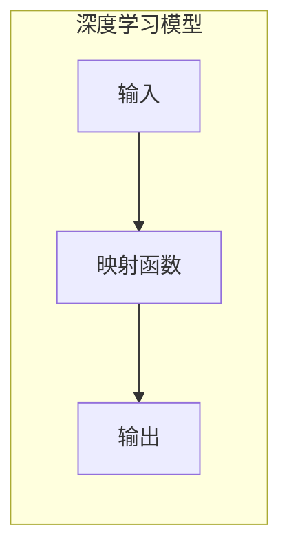
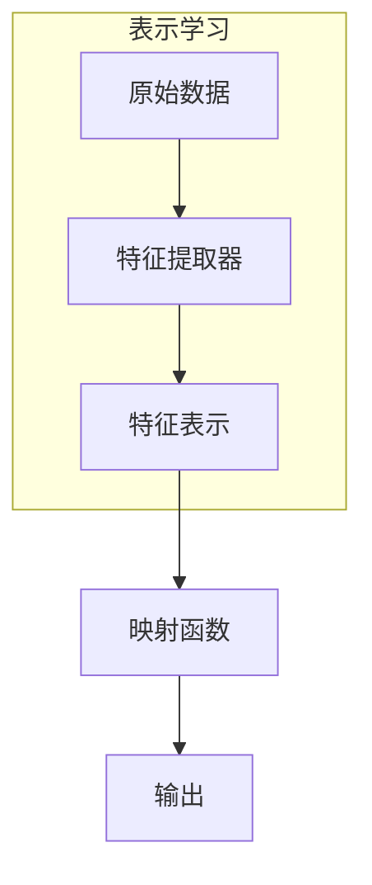
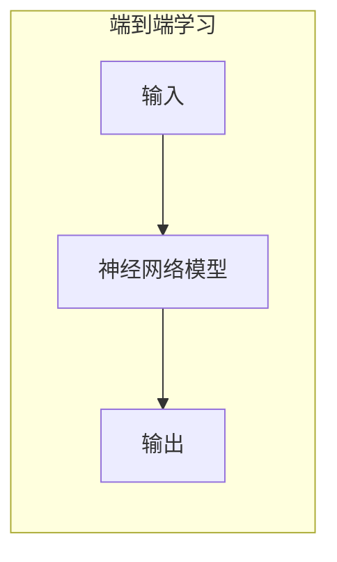
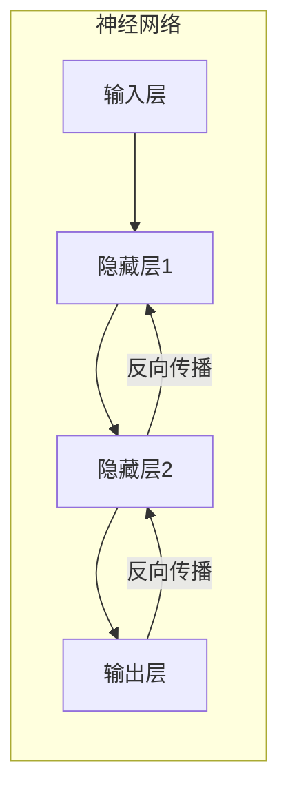
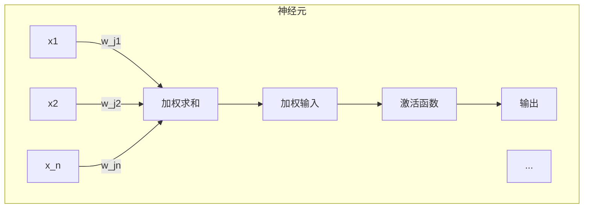

# 一切皆是映射：深度学习的基石与概念入门

## 1. 背景介绍

### 1.1 人工智能的崛起

人工智能(Artificial Intelligence, AI)是当代科技领域最具变革性的力量之一。近年来,AI的发展如火如荼,尤其是深度学习(Deep Learning)技术的突破性进展,使得AI系统在图像识别、自然语言处理、决策控制等领域表现出超乎想象的能力,引发了全球范围内的人工智能热潮。

### 1.2 深度学习的核心地位

在人工智能的大家族中,深度学习是当之无愧的核心力量。它借鉴了人类大脑神经网络的工作原理,通过构建深层次的人工神经网络模型,对海量数据进行自主学习和模式识别,从而获得解决复杂问题的能力。无论是计算机视觉、自然语言处理,还是决策控制等领域,深度学习都取得了令人惊叹的成就。

### 1.3 理解深度学习的重要性

然而,尽管深度学习技术取得了巨大成功,但对于大多数人来说,它仍然是一个"黑箱"。深度学习模型的内部运作机制、核心概念和数学原理,对于很多从业者和爱好者来说都显得晦涩难懂。因此,揭开深度学习的神秘面纱,理解其核心思想和基本原理,对于充分利用这一强大技术,把握其发展趋势至关重要。

## 2. 核心概念与联系

### 2.1 一切皆是映射

在深度学习的世界里,有一个核心概念贯穿始终——"一切皆是映射"(Everything is a Mapping)。这个概念是理解深度学习本质的钥匙,也是构建深度学习模型的基石。

所谓"映射",就是将一个输入(Input)通过某种转换规则,映射到一个输出(Output)。在深度学习中,我们利用神经网络模型来学习这种映射关系,使得给定的输入能够得到我们期望的输出。

例如,在图像分类任务中,我们将图像像素作为输入,通过神经网络模型进行一系列非线性转换,最终映射到一个分类标签(如猫、狗等)作为输出。在机器翻译任务中,我们将一种语言的句子作为输入,通过序列到序列(Sequence-to-Sequence)模型,映射到另一种语言的句子作为输出。

虽然应用场景不同,但本质上都是在学习一种映射关系。因此,"一切皆是映射"这一核心思想,为我们构建和理解各种深度学习模型奠定了基础。

### 2.2 表示学习

而要实现这种映射,关键在于神经网络模型能够自主地学习数据的内在表示(Representation)。这个过程被称为"表示学习"(Representation Learning),是深度学习的核心能力。

所谓"表示学习",就是从原始数据中自动提取出有意义的特征表示,使得这些特征能够很好地描述输入数据的本质属性,从而为后续的映射任务提供有价值的信息。例如,在图像识别任务中,神经网络会自动学习到图像中的边缘、纹理、形状等低级特征,以及更高级的语义概念,如物体部件和类别。

表示学习的能力使得深度学习模型能够自主发现数据的内在结构和模式,而不需要人工设计特征。这不仅大大降低了特征工程的工作量,更重要的是,神经网络自动学习到的特征往往比人工设计的特征更加有效和鲁棒。

### 2.3 端到端学习

基于表示学习的能力,深度学习模型可以实现"端到端"(End-to-End)的学习方式。所谓"端到端",就是将整个映射过程集成到一个统一的模型中,使得模型能够直接从原始输入数据学习到最终的输出,而无需人工分解和设计中间步骤。

传统的机器学习方法通常需要人工设计特征提取、特征选择等中间环节,而深度学习模型则能够自主完成这些步骤,大大简化了建模过程。例如,在图像分类任务中,传统方法需要先提取手工设计的特征(如SIFT、HOG等),然后使用分类器(如支持向量机)进行分类。而深度学习模型则能够直接从原始图像像素开始,通过卷积神经网络自动提取特征并完成分类,实现真正的端到端学习。

端到端学习不仅提高了模型的性能和泛化能力,也大大降低了人工参与的工作量,使得深度学习模型能够更加高效地应用于各种复杂任务。

## 3. 核心算法原理具体操作步骤

### 3.1 神经网络基本原理

要理解深度学习的核心算法原理,我们需要先了解神经网络的基本工作原理。神经网络是一种受生物神经元启发而设计的数学模型,它由多层人工神经元(也称为节点或单元)组成,这些神经元通过加权连接进行信息传递和处理。

神经网络的基本运作过程如下:

1. **输入层**:原始数据(如图像像素、文本等)被输入到神经网络的输入层。
2. **隐藏层**:输入数据经过一系列线性和非线性变换,在隐藏层中进行特征提取和表示学习。
3. **输出层**:隐藏层的输出被映射到最终的输出,如分类标签、回归值等。
4. **反向传播**:通过比较输出与期望目标之间的误差,神经网络使用反向传播算法调整连接权重,以最小化误差。
5. **迭代训练**:重复上述过程,直到神经网络收敛,得到最优的权重参数。

通过这种端到端的训练方式,神经网络能够自主学习数据的内在表示,并找到最优的映射函数,实现期望的任务目标。

### 3.2 反向传播算法

神经网络训练的核心算法是反向传播(Backpropagation)算法。它是一种高效的优化算法,用于计算神经网络中每个权重参数对最终误差的敏感度,并根据这些敏感度调整权重,以最小化误差。

反向传播算法的具体步骤如下:

1. **前向传播**:输入数据经过神经网络的前向计算,得到最终输出。
2. **计算误差**:将输出与期望目标进行比较,计算误差(如交叉熵损失函数)。
3. **反向传播误差**:从输出层开始,将误差反向传播到每一层的神经元,计算每个权重对误差的敏感度(梯度)。
4. **更新权重**:使用优化算法(如梯度下降)根据梯度调整每个权重,以减小误差。
5. **迭代训练**:重复上述过程,直到神经网络收敛。

反向传播算法的关键在于利用链式法则,高效地计算出每个权重对最终误差的梯度,从而能够有针对性地调整权重,使神经网络逐步优化。这种自动微分(Automatic Differentiation)的能力是深度学习算法的核心所在,也是它能够高效训练大规模神经网络的关键所在。

$$
\frac{\partial E}{\partial w_{ij}} = \frac{\partial E}{\partial y_j} \cdot \frac{\partial y_j}{\partial u_j} \cdot \frac{\partial u_j}{\partial w_{ij}}
$$

上式表示了反向传播算法计算权重梯度的基本思路,其中 $E$ 是误差函数, $y_j$ 是第 $j$ 个神经元的输出, $u_j$ 是第 $j$ 个神经元的加权输入, $w_{ij}$ 是连接第 $i$ 个神经元和第 $j$ 个神经元的权重。通过链式法则,我们可以计算出每个权重对误差的梯度,从而进行权重更新。

### 3.3 优化算法

在反向传播算法计算出权重梯度之后,我们需要使用优化算法来更新权重,以最小化神经网络的误差。最常用的优化算法是梯度下降(Gradient Descent)及其变体。

**梯度下降**是一种迭代优化算法,它沿着梯度的反方向更新权重,以不断减小误差。具体地,在每一次迭代中,权重 $w$ 会按照下式进行更新:

$$
w_{t+1} = w_t - \eta \cdot \frac{\partial E}{\partial w}
$$

其中 $\eta$ 是学习率(Learning Rate),控制着每次更新的步长。较大的学习率可以加快收敛速度,但也可能导致不稳定;较小的学习率则更加稳定,但收敛速度较慢。

为了提高优化效率,研究者们提出了多种梯度下降的变体算法,如:

- **动量优化**(Momentum Optimization):在梯度更新中引入动量项,帮助加速收敛并跳出局部最优。
- **RMSProp**:通过对梯度进行指数加权平均,自适应地调整每个参数的学习率。
- **Adam**:结合动量优化和RMSProp的优点,是当前最常用的优化算法之一。

除了梯度下降算法外,还有一些基于二阶导数的优化算法,如L-BFGS、共轭梯度法等,它们在某些情况下可以取得更快的收敛速度。

通过不断迭代优化,神经网络最终能够找到一组最优权重参数,使得输入数据能够被正确映射到期望的输出,从而完成相应的任务。

## 4. 数学模型和公式详细讲解举例说明

### 4.1 神经元数学模型

神经网络的基本计算单元是神经元(Neuron),它是一种简单的数学模型,模拟生物神经元的工作原理。一个神经元接收来自上一层多个神经元的加权输入,经过非线性激活函数的转换,产生自身的输出,并传递给下一层的神经元。

设第 $j$ 个神经元接收来自上一层 $n$ 个神经元的输入 $x_1, x_2, \dots, x_n$,权重分别为 $w_{j1}, w_{j2}, \dots, w_{jn}$,偏置项为 $b_j$,则该神经元的加权输入 $u_j$ 可以表示为:

$$
u_j = \sum_{i=1}^{n} w_{ji} x_i + b_j
$$

然后,加权输入 $u_j$ 通过一个非线性激活函数 $f$ 进行转换,得到该神经元的输出 $y_j$:

$$
y_j = f(u_j)
$$

常用的激活函数包括Sigmoid函数、Tanh函数、ReLU函数等,它们引入了非线性,使神经网络能够拟合更加复杂的映射关系。

通过堆叠多层神经元,我们可以构建出深层神经网络,实现复杂的映射关系。每一层神经元的输出作为下一层的输入,层与层之间通过可训练的权重参数连接,形成了一个端到端的映射模型。

### 4.2 损失函数

在训练神经网络时,我们需要定义一