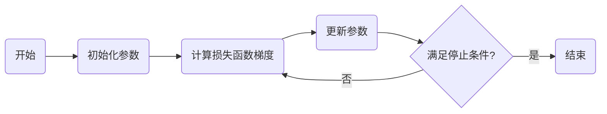

# 优化算法：梯度下降 (Gradient Descent) 原理与代码实例讲解

## 1. 背景介绍
在机器学习和深度学习的世界里，梯度下降算法是最基础也是最关键的优化工具之一。它的核心思想是利用函数梯度信息寻找全局最小值或局部最小值。从最简单的线性回归到复杂的神经网络，梯度下降算法都扮演着至关重要的角色。

## 2. 核心概念与联系
梯度下降算法的核心概念包括损失函数、梯度、学习率等。损失函数衡量模型预测值与真实值之间的差异；梯度是损失函数在参数空间中的方向导数，指向函数增长最快的方向；学习率决定了在梯度方向上前进的步长。

## 3. 核心算法原理具体操作步骤
梯度下降算法的操作步骤可以概括为：
1. 初始化参数
2. 计算损失函数的梯度
3. 更新参数
4. 重复步骤2和3直到满足停止条件



## 4. 数学模型和公式详细讲解举例说明
梯度下降算法的数学模型可以表示为：
$$
\theta_{next} = \theta_{current} - \alpha \cdot \nabla_\theta J(\theta)
$$
其中，$\theta$ 表示模型参数，$J(\theta)$ 是损失函数，$\alpha$ 是学习率，$\nabla_\theta J(\theta)$ 是损失函数关于参数$\theta$的梯度。

## 5. 项目实践：代码实例和详细解释说明
以线性回归为例，我们可以使用梯度下降算法来优化模型参数。以下是Python代码实例：

```python
import numpy as np

# 损失函数
def compute_loss(y, y_pred):
    return np.mean((y - y_pred) ** 2)

# 梯度计算
def compute_gradients(X, y, theta):
    y_pred = X.dot(theta)
    error = y_pred - y
    grad = 2 * X.T.dot(error) / len(y)
    return grad

# 梯度下降算法
def gradient_descent(X, y, theta, alpha, iterations):
    for i in range(iterations):
        grad = compute_gradients(X, y, theta)
        theta = theta - alpha * grad
    return theta

# 示例数据
X = np.array([[1, 1], [1, 2], [1, 3]])
y = np.array([1, 2, 3])
theta = np.array([0, 0])
alpha = 0.01
iterations = 1000

# 执行梯度下降
theta_final = gradient_descent(X, y, theta, alpha, iterations)
print("Optimized parameters:", theta_final)
```

## 6. 实际应用场景
梯度下降算法广泛应用于各种机器学习模型的训练中，包括线性回归、逻辑回归、支持向量机、神经网络等。

## 7. 工具和资源推荐
- NumPy：进行高效的数值计算
- Matplotlib：可视化损失函数和参数更新过程
- TensorFlow和PyTorch：提供自动梯度计算和优化器

## 8. 总结：未来发展趋势与挑战
梯度下降算法虽然简单有效，但在面对非凸优化、高维数据和局部最小值问题时仍存在挑战。未来的发展趋势包括自适应学习率算法、二阶优化方法等。

## 9. 附录：常见问题与解答
Q1: 如何选择合适的学习率？
A1: 通过实验调整，或使用自适应学习率算法如Adam。

Q2: 梯度下降算法是否总能找到全局最小值？
A2: 只有在凸函数上才能保证找到全局最小值，非凸函数可能陷入局部最小值。

作者：禅与计算机程序设计艺术 / Zen and the Art of Computer Programming