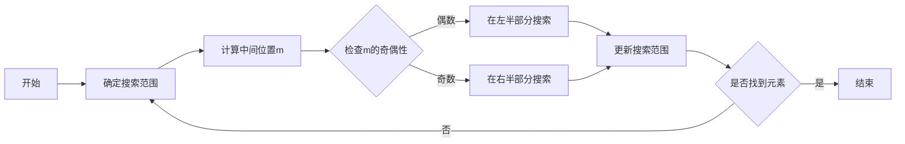

# 像数学家一样思考：奇偶原理

## 1. 背景介绍

在计算机科学中，奇偶原理是一种基础的数学概念，它在算法设计、数据结构优化、错误检测和校正等多个领域发挥着重要作用。奇偶性质描述了整数被2整除的能力，这一简单的性质却能引出丰富的逻辑和算法结构。本文将深入探讨奇偶原理在IT领域的应用，并通过实例展示如何像数学家一样思考，解决实际问题。

## 2. 核心概念与联系

### 2.1 奇偶性定义
奇数和偶数是整数的两个基本分类，偶数可以表示为 $2k$，奇数可以表示为 $2k+1$，其中 $k$ 是整数。

### 2.2 奇偶性在计算机科学中的意义
计算机科学中的二进制系统与奇偶性紧密相关，二进制数的最低位决定了其奇偶性。此外，奇偶性影响着算法的分支结构和迭代效率。

### 2.3 奇偶性与算法优化
算法中经常利用奇偶性来减少不必要的计算，例如快速幂算法和二分搜索。

## 3. 核心算法原理具体操作步骤

### 3.1 快速幂算法
快速幂算法利用了指数的奇偶性来减少乘法操作的次数。

```mermaid
graph LR
A[开始] --> B[计算指数n的奇偶性]
B --> C{如果n是偶数}
C -->|是| D[将n除以2]
D --> E[计算x^(n/2)]
E --> F[结果为x^(n/2) * x^(n/2)]
C -->|否| G[将n减去1]
G --> H[计算x^(n-1)]
H --> I[结果为x^(n-1) * x]
I --> J[结束]
F --> J
```

### 3.2 二分搜索
二分搜索通过不断检查中间元素的奇偶性来缩小搜索范围。



## 4. 数学模型和公式详细讲解举例说明

### 4.1 奇偶性的数学模型
奇数和偶数的数学模型可以表示为：
$$
\text{偶数} = 2k, \quad k \in \mathbb{Z}
$$
$$
\text{奇数} = 2k + 1, \quad k \in \mathbb{Z}
$$

### 4.2 奇偶性的性质
奇偶性的基本性质包括：
- 偶数加偶数仍为偶数
- 奇数加奇数仍为偶数
- 偶数加奇数为奇数

### 4.3 举例说明
例如，快速幂算法中，如果我们要计算 $x^6$，可以将其分解为 $(x^3)^2$，进一步分解为 $((x^1)^2)^2$，这样只需要进行三次乘法操作。

## 5. 项目实践：代码实例和详细解释说明

### 5.1 快速幂算法实现

```python
def quick_pow(x, n):
    if n == 0:
        return 1
    elif n % 2 == 0:
        return quick_pow(x*x, n//2)
    else:
        return x * quick_pow(x, n-1)

# 示例
print(quick_pow(2, 6))  # 输出 64
```

### 5.2 代码解释
在 `quick_pow` 函数中，我们首先检查指数 `n` 是否为0，如果是，则返回1。如果 `n` 是偶数，我们计算 `x*x` 的 `n/2` 次幂；如果 `n` 是奇数，我们先计算 `x` 的 `n-1` 次幂，然后乘以 `x`。

## 6. 实际应用场景

奇偶原理在多个领域有实际应用，例如：
- 在计算机网络中，奇偶校验位用于错误检测。
- 在图形处理中，奇偶规则用于确定点是否在多边形内部。
- 在游戏开发中，奇偶性用于优化棋盘游戏的算法。

## 7. 工具和资源推荐

- Python：用于实现和测试算法的高级编程语言。
- Jupyter Notebook：提供交云环境，方便算法的演示和教学。
- GitHub：代码托管和版本控制服务，用于分享和协作开发代码。

## 8. 总结：未来发展趋势与挑战

奇偶原理作为一种基础的数学概念，在未来的计算机科学领域仍将保持其重要性。随着计算机硬件的发展和算法的优化，如何更有效地利用奇偶性来提升性能，将是一个持续的挑战。

## 9. 附录：常见问题与解答

Q1: 为什么奇偶性在计算机科学中如此重要？
A1: 奇偶性直接关联到二进制系统，它影响着数据的表示、处理和算法的效率。

Q2: 快速幂算法的时间复杂度是多少？
A2: 快速幂算法的时间复杂度为 $O(\log n)$，远优于简单的迭代方法。

Q3: 如何判断一个数的奇偶性？
A3: 在二进制表示中，如果一个数的最低位是0，则为偶数；如果是1，则为奇数。

作者：禅与计算机程序设计艺术 / Zen and the Art of Computer Programming