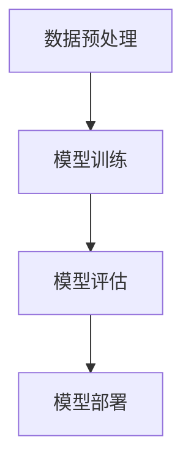

# 公平机器学习 原理与代码实例讲解

## 1.背景介绍

在现代社会，机器学习已经成为各行各业不可或缺的工具。然而，随着机器学习模型在决策过程中的广泛应用，公平性问题逐渐引起了广泛关注。公平机器学习旨在确保模型在不同群体之间的决策结果不具有偏见，从而避免对某些群体造成不公正的影响。

公平性问题不仅仅是技术问题，更是社会问题。模型的偏见可能会加剧社会不平等，甚至引发法律和伦理问题。因此，研究和实现公平机器学习具有重要的现实意义。

## 2.核心概念与联系

### 2.1 公平性定义

公平性在机器学习中有多种定义，常见的包括：

- **统计公平性**：不同群体的预测结果在统计上相似。
- **个体公平性**：相似的个体应当得到相似的预测结果。
- **机会均等**：不同群体在相同条件下应当有相同的机会获得正面结果。

### 2.2 偏见来源

偏见可能来源于多个方面：

- **数据偏见**：训练数据本身存在偏见。
- **模型偏见**：模型在训练过程中引入了偏见。
- **应用偏见**：模型在实际应用中引入了偏见。

### 2.3 公平性与准确性权衡

在追求公平性的同时，可能会牺牲模型的准确性。因此，如何在公平性和准确性之间找到平衡点是一个重要的研究课题。

## 3.核心算法原理具体操作步骤

### 3.1 数据预处理

数据预处理是实现公平机器学习的第一步。常见的方法包括：

- **数据重采样**：通过过采样或欠采样来平衡不同群体的数据量。
- **数据清洗**：去除数据中的偏见特征。

### 3.2 模型训练

在模型训练过程中，可以采用以下方法来提高公平性：

- **加权损失函数**：在损失函数中引入权重，以减少对某些群体的偏见。
- **对抗训练**：通过引入对抗网络来减少模型的偏见。

### 3.3 模型评估

模型评估是确保模型公平性的关键步骤。常见的评估指标包括：

- **公平性指标**：如统计公平性、个体公平性等。
- **准确性指标**：如精确率、召回率等。

以下是一个简单的Mermaid流程图，展示了公平机器学习的核心步骤：



## 4.数学模型和公式详细讲解举例说明

### 4.1 公平性指标

#### 4.1.1 统计公平性

统计公平性可以通过以下公式来衡量：

$$
P(\hat{Y} = 1 | A = 0) = P(\hat{Y} = 1 | A = 1)
$$

其中，$\hat{Y}$ 是模型的预测结果，$A$ 是敏感属性（如性别、种族等）。

#### 4.1.2 个体公平性

个体公平性可以通过以下公式来衡量：

$$
d(\hat{Y}_i, \hat{Y}_j) \leq \epsilon
$$

其中，$\hat{Y}_i$ 和 $\hat{Y}_j$ 是两个相似个体的预测结果，$d$ 是距离函数，$\epsilon$ 是一个小的正数。

### 4.2 加权损失函数

加权损失函数可以通过以下公式来定义：

$$
L = \sum_{i=1}^n w_i \cdot l(y_i, \hat{y}_i)
$$

其中，$w_i$ 是第 $i$ 个样本的权重，$l$ 是损失函数，$y_i$ 和 $\hat{y}_i$ 分别是真实值和预测值。

## 5.项目实践：代码实例和详细解释说明

### 5.1 数据预处理

以下是一个简单的Python代码示例，展示了如何进行数据预处理：

```python
import pandas as pd
from sklearn.model_selection import train_test_split

# 读取数据
data = pd.read_csv('data.csv')

# 去除偏见特征
data = data.drop(columns=['biased_feature'])

# 数据重采样
majority_class = data[data['target'] == 0]
minority_class = data[data['target'] == 1]

minority_class_upsampled = minority_class.sample(len(majority_class), replace=True)
data_balanced = pd.concat([majority_class, minority_class_upsampled])

# 划分训练集和测试集
X_train, X_test, y_train, y_test = train_test_split(data_balanced.drop(columns=['target']), data_balanced['target'], test_size=0.2, random_state=42)
```

### 5.2 模型训练

以下是一个简单的Python代码示例，展示了如何进行模型训练：

```python
from sklearn.linear_model import LogisticRegression
from sklearn.metrics import accuracy_score, confusion_matrix

# 定义加权损失函数
class WeightedLossLogisticRegression(LogisticRegression):
    def fit(self, X, y, sample_weight=None):
        super().fit(X, y, sample_weight=sample_weight)

# 训练模型
model = WeightedLossLogisticRegression()
model.fit(X_train, y_train, sample_weight=[1 if y == 1 else 0.5 for y in y_train])

# 预测
y_pred = model.predict(X_test)

# 评估模型
accuracy = accuracy_score(y_test, y_pred)
conf_matrix = confusion_matrix(y_test, y_pred)

print(f'Accuracy: {accuracy}')
print(f'Confusion Matrix: \n{conf_matrix}')
```

### 5.3 模型评估

以下是一个简单的Python代码示例，展示了如何进行模型评估：

```python
from sklearn.metrics import roc_auc_score

# 计算公平性指标
def statistical_parity(y_true, y_pred, sensitive_attr):
    group_0 = y_pred[sensitive_attr == 0]
    group_1 = y_pred[sensitive_attr == 1]
    return abs(group_0.mean() - group_1.mean())

# 计算统计公平性
stat_parity = statistical_parity(y_test, y_pred, X_test['sensitive_attr'])

# 计算AUC
auc = roc_auc_score(y_test, y_pred)

print(f'Statistical Parity: {stat_parity}')
print(f'AUC: {auc}')
```

## 6.实际应用场景

### 6.1 金融领域

在金融领域，公平机器学习可以用于信用评分、贷款审批等场景，确保不同群体在获得金融服务时不受偏见影响。

### 6.2 医疗领域

在医疗领域，公平机器学习可以用于疾病预测、治疗方案推荐等场景，确保不同群体在获得医疗服务时不受偏见影响。

### 6.3 教育领域

在教育领域，公平机器学习可以用于学生成绩预测、招生决策等场景，确保不同群体在获得教育资源时不受偏见影响。

## 7.工具和资源推荐

### 7.1 工具

- **Fairlearn**：一个用于评估和改进机器学习模型公平性的Python库。
- **AIF360**：IBM推出的一个用于检测和减少AI模型偏见的开源工具包。

### 7.2 资源

- **《公平机器学习》**：一本详细介绍公平机器学习理论和实践的书籍。
- **Coursera上的公平机器学习课程**：一个在线课程，详细讲解了公平机器学习的基本概念和实现方法。

## 8.总结：未来发展趋势与挑战

公平机器学习是一个快速发展的领域，未来可能会有更多的研究和应用。然而，公平性问题不仅仅是技术问题，更是社会问题。因此，解决公平性问题需要多学科的合作和社会的共同努力。

### 8.1 未来发展趋势

- **多模态数据的公平性研究**：随着多模态数据的广泛应用，如何在多模态数据中实现公平性将成为一个重要的研究方向。
- **动态公平性**：随着时间的推移，数据和模型可能会发生变化，如何在动态环境中保持模型的公平性将成为一个重要的研究课题。

### 8.2 挑战

- **数据获取和标注**：获取和标注公平性数据是一个重要的挑战。
- **公平性与准确性的权衡**：如何在保证模型公平性的同时，不显著降低模型的准确性是一个重要的挑战。

## 9.附录：常见问题与解答

### 9.1 什么是公平机器学习？

公平机器学习是指在机器学习模型的开发和应用过程中，确保模型在不同群体之间的决策结果不具有偏见，从而避免对某些群体造成不公正的影响。

### 9.2 为什么公平机器学习重要？

公平机器学习不仅仅是技术问题，更是社会问题。模型的偏见可能会加剧社会不平等，甚至引发法律和伦理问题。因此，研究和实现公平机器学习具有重要的现实意义。

### 9.3 如何评估模型的公平性？

模型的公平性可以通过多种指标来评估，如统计公平性、个体公平性等。此外，还可以通过对模型的预测结果进行分析，来评估模型在不同群体之间的公平性。

### 9.4 如何提高模型的公平性？

提高模型公平性的方法包括数据预处理、模型训练和模型评估等。在数据预处理阶段，可以通过数据重采样和数据清洗来减少数据中的偏见。在模型训练阶段，可以通过加权损失函数和对抗训练来减少模型的偏见。在模型评估阶段，可以通过多种公平性指标来评估和改进模型的公平性。

### 9.5 公平性与准确性是否冲突？

在追求公平性的同时，可能会牺牲模型的准确性。因此，如何在公平性和准确性之间找到平衡点是一个重要的研究课题。

---

作者：禅与计算机程序设计艺术 / Zen and the Art of Computer Programming