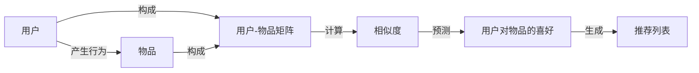

# 协同过滤 原理与代码实例讲解

## 1. 背景介绍

### 1.1 什么是协同过滤

协同过滤(Collaborative Filtering,CF)是一种常用的推荐算法,它通过分析用户的历史行为数据,发现用户的喜好,并根据用户的喜好推荐用户可能感兴趣的内容。协同过滤算法广泛应用于各种推荐系统中,如电商网站的商品推荐、视频网站的影视推荐、社交网络的好友推荐等。

### 1.2 协同过滤的优势

与其他推荐算法相比,协同过滤具有以下优势:

1. 不需要对物品本身进行建模,只需要用户的历史行为数据即可。
2. 可以发现用户的隐性喜好,挖掘用户可能感兴趣但未表现出来的内容。  
3. 算法实现相对简单,易于理解和上手。
4. 推荐结果的解释性强,便于向用户解释推荐的理由。

### 1.3 协同过滤的挑战

尽管协同过滤算法被广泛应用,但它仍然面临一些挑战:

1. 冷启动问题:对于新用户和新物品,由于缺乏足够的历史数据,难以给出准确的推荐。
2. 稀疏性问题:现实中的用户-物品矩阵往往非常稀疏,大部分用户只与少量物品发生过交互,导致难以计算用户之间的相似度。
3. 扩展性问题:随着用户和物品数量的增加,用户-物品矩阵会变得非常大,计算用户相似度的开销会急剧增加。
4. 攻击问题:协同过滤容易受到恶意用户的攻击,比如刷单、刷评论等,影响推荐结果的公正性。

## 2. 核心概念与联系

### 2.1 用户(User)

在协同过滤中,用户指参与协同过滤的个体,通常用一个唯一的ID表示。用户会对物品产生行为,如购买、评分、点击等,这些行为构成了用户的行为数据。

### 2.2 物品(Item) 

物品指协同过滤中被推荐的对象,可以是商品、电影、音乐等。每个物品也有一个唯一的ID。物品的属性信息,如类别、关键词等,有时也会被用来计算物品之间的相似度。

### 2.3 用户-物品矩阵(User-Item Matrix)

用户-物品矩阵是协同过滤的核心数据结构,它记录了每个用户对每个物品的行为数据。行为数据可以是显式反馈,如评分、点赞等;也可以是隐式反馈,如点击、购买等。矩阵中的每个元素表示一个用户对一个物品的行为值。

### 2.4 相似度(Similarity)

相似度衡量了两个用户或两个物品之间的相似程度。常见的相似度计算方法有:
- 余弦相似度(Cosine Similarity):计算两个向量夹角的余弦值
- 皮尔逊相关系数(Pearson Correlation Coefficient):计算两组数据的线性相关程度
- 欧几里得距离(Euclidean Distance):计算两个向量之间的欧氏距离

### 2.5 预测(Prediction)

预测指估计一个用户对一个物品的喜好程度。基于用户和物品的相似度,可以预测用户对未评分物品的评分,或者用户对物品的购买概率。常见的预测方法有:
- 加权平均(Weighted Average):根据相似用户的评分和相似度,计算加权平均值
- 矩阵分解(Matrix Factorization):将用户-物品矩阵分解为两个低维矩阵的乘积,再用这两个矩阵预测评分

### 2.6 推荐(Recommendation)

推荐是协同过滤的最终目的,即根据预测结果,向用户推荐其可能感兴趣的物品。常见的推荐方式有:
- TopN推荐:为每个用户推荐预测评分最高的N个物品
- 个性化推荐:根据用户的历史行为和兴趣,为其量身定制推荐列表

### 2.7 核心概念之间的联系

下图展示了协同过滤中几个核心概念之间的联系:



从用户对物品的行为开始,构建用户-物品矩阵,计算用户或物品的相似度,进而预测用户对物品的喜好,最终生成个性化的推荐列表。

## 3. 核心算法原理具体操作步骤

协同过滤的核心算法可以分为以下几个步骤:

### 3.1 建立用户-物品矩阵

根据用户对物品的行为数据,构建用户-物品矩阵R。矩阵的行表示用户,列表示物品,元素 $r_{ui}$ 表示用户u对物品i的行为值。行为值可以是显式的评分,也可以是隐式的反馈,如点击、购买等。

### 3.2 计算相似度

根据用户-物品矩阵,计算用户之间或物品之间的相似度。常用的相似度计算方法有:

#### 3.2.1 余弦相似度

余弦相似度计算两个向量夹角的余弦值,公式如下:

$$sim(i,j) = \frac{\sum_{u\in U}r_{ui}r_{uj}}{\sqrt{\sum_{u\in U}r_{ui}^2}\sqrt{\sum_{u\in U}r_{uj}^2}}$$

其中,U是同时评分了物品i和j的用户集合。

#### 3.2.2 皮尔逊相关系数

皮尔逊相关系数计算两组数据的线性相关程度,公式如下:

$$sim(i,j) = \frac{\sum_{u\in U}(r_{ui}-\bar{r}_i)(r_{uj}-\bar{r}_j)}{\sqrt{\sum_{u\in U}(r_{ui}-\bar{r}_i)^2}\sqrt{\sum_{u\in U}(r_{uj}-\bar{r}_j)^2}}$$

其中, $\bar{r}_i$ 和 $\bar{r}_j$ 分别是物品i和j的平均评分。

### 3.3 预测评分

根据相似度,预测用户对未评分物品的评分。常用的预测方法有:

#### 3.3.1 基于用户的协同过滤

对于用户u和物品i,根据与u最相似的K个用户(记为集合 $N_u(i)$ )的评分,计算u对i的预测评分:

$$\hat{r}_{ui} = \bar{r}_u + \frac{\sum_{v\in N_u(i)}sim(u,v)(r_{vi}-\bar{r}_v)}{\sum_{v\in N_u(i)}|sim(u,v)|}$$

其中, $\bar{r}_u$ 和 $\bar{r}_v$ 分别是用户u和v的平均评分。

#### 3.3.2 基于物品的协同过滤

对于用户u和物品i,根据u评分过的物品中与i最相似的K个物品(记为集合 $N_i(u)$ )的评分,计算u对i的预测评分:

$$\hat{r}_{ui} = \frac{\sum_{j\in N_i(u)}sim(i,j)r_{uj}}{\sum_{j\in N_i(u)}|sim(i,j)|}$$

### 3.4 生成推荐列表

根据预测评分,为每个用户生成个性化的推荐列表。常用的推荐方法有:

#### 3.4.1 TopN推荐

对于用户u,计算其对所有未评分物品的预测评分,取预测评分最高的N个物品作为推荐列表。

#### 3.4.2 个性化推荐

对于用户u,根据其历史行为和兴趣特点,选择与其最相关的物品作为推荐列表。可以考虑物品的流行度、新鲜度、多样性等因素。

## 4. 数学模型和公式详细讲解举例说明

### 4.1 用户-物品矩阵

假设有m个用户和n个物品,用户-物品矩阵R可以表示为:

$$R = \begin{bmatrix} 
r_{11} & r_{12} & \cdots & r_{1n} \\
r_{21} & r_{22} & \cdots & r_{2n} \\
\vdots & \vdots & \ddots & \vdots \\
r_{m1} & r_{m2} & \cdots & r_{mn} 
\end{bmatrix}$$

其中, $r_{ui}$ 表示用户u对物品i的评分。如果用户u没有评分物品i,则 $r_{ui}=0$ 。

例如,有5个用户和4个物品,用户-物品矩阵可能如下:

$$R = \begin{bmatrix}
4 & 0 & 2 & 0 \\
0 & 3 & 0 & 1 \\
1 & 0 & 0 & 5 \\
0 & 0 & 4 & 0 \\
2 & 4 & 0 & 3
\end{bmatrix}$$

### 4.2 余弦相似度

以计算物品i和j的相似度为例。假设有4个用户同时评分了物品i和j,他们的评分如下:

$$\begin{array}{c|cc}
\hline
\text{User} & \text{Item i} & \text{Item j} \\
\hline
\text{A} & 4 & 5 \\
\text{B} & 2 & 1 \\ 
\text{C} & 3 & 4 \\
\text{D} & 5 & 4 \\
\hline
\end{array}$$

根据余弦相似度公式:

$$\begin{aligned}
sim(i,j) &= \frac{4\times5+2\times1+3\times4+5\times4}{\sqrt{4^2+2^2+3^2+5^2}\sqrt{5^2+1^2+4^2+4^2}} \\
&= \frac{54}{\sqrt{54}\sqrt{54}} \\
&= 0.931
\end{aligned}$$

可见,物品i和j的相似度为0.931,说明它们非常相似。

### 4.3 基于物品的协同过滤预测

以预测用户u对物品i的评分为例。假设用户u评分过3个物品,这3个物品与物品i的相似度和用户u的评分如下:

$$\begin{array}{c|cc}
\hline
\text{Item} & \text{Similarity} & \text{User Rating} \\
\hline
\text{A} & 0.8 & 4 \\
\text{B} & 0.6 & 3 \\ 
\text{C} & 0.4 & 5 \\
\hline
\end{array}$$

根据基于物品的协同过滤预测公式:

$$\begin{aligned}
\hat{r}_{ui} &= \frac{0.8\times4+0.6\times3+0.4\times5}{0.8+0.6+0.4} \\
&= \frac{10}{1.8} \\
&= 3.89
\end{aligned}$$

可见,预测用户u对物品i的评分为3.89。

## 5. 项目实践:代码实例和详细解释说明

下面以Python为例,实现一个简单的基于物品的协同过滤算法。

### 5.1 导入所需的库

```python
import numpy as np
import pandas as pd
from sklearn.metrics.pairwise import cosine_similarity
```

### 5.2 读取用户-物品矩阵

假设用户-物品矩阵保存在文件"ratings.csv"中,每行格式为"user_id,item_id,rating"。

```python
# 读取用户-物品矩阵
ratings = pd.read_csv('ratings.csv')
```

### 5.3 构建用户-物品矩阵

```python
# 构建用户-物品矩阵
user_item_matrix = ratings.pivot_table(index='user_id', columns='item_id', values='rating')
user_item_matrix.fillna(0, inplace=True)
```

使用pandas的pivot_table函数,将数据转换为用户-物品矩阵。其中,user_id为行索引,item_id为列索引,rating为元素值。由于有些用户没有评分某些物品,需要用0填充这些缺失值。

### 5.4 计算物品相似度矩阵

```python
# 计算物品相似度矩阵
item_similarity = cosine_similarity(user_item_matrix.T)
```

使用sklearn的cosine_similarity函数,计算物品相似度矩阵。由于cosine_similarity计算的是行向量之间的相似度,需