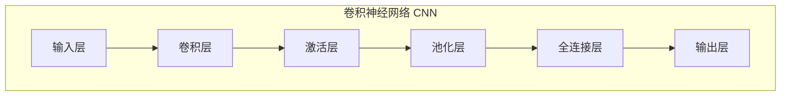

# 卷积神经网络(CNN)原理与代码实战案例讲解

## 1. 背景介绍
### 1.1 人工智能和深度学习的发展历程
### 1.2 卷积神经网络(CNN)在计算机视觉领域的重要地位  
### 1.3 本文的主要内容和目标受众

## 2. 核心概念与联系
### 2.1 人工神经网络(ANN)
#### 2.1.1 神经元
#### 2.1.2 前馈神经网络
#### 2.1.3 反向传播算法
### 2.2 卷积神经网络(CNN) 
#### 2.2.1 卷积层
#### 2.2.2 池化层
#### 2.2.3 全连接层
### 2.3 CNN与传统ANN的区别与联系



## 3. 核心算法原理具体操作步骤
### 3.1 卷积操作
#### 3.1.1 卷积核
#### 3.1.2 填充Padding
#### 3.1.3 步幅Stride
### 3.2 激活函数
#### 3.2.1 Sigmoid
#### 3.2.2 ReLU
#### 3.2.3 Tanh
### 3.3 池化操作  
#### 3.3.1 最大池化
#### 3.3.2 平均池化
### 3.4 反向传播与参数更新
#### 3.4.1 损失函数
#### 3.4.2 梯度计算
#### 3.4.3 权重更新

## 4. 数学模型和公式详细讲解举例说明
### 4.1 卷积的数学表示
#### 4.1.1 二维卷积
$$y(m,n) = \sum_{i}\sum_{j} x(i,j)w(m-i,n-j)$$
#### 4.1.2 三维卷积
### 4.2 激活函数的数学表示
#### 4.2.1 Sigmoid函数
$$\sigma(x) = \frac{1}{1+e^{-x}}$$
#### 4.2.2 ReLU函数  
$$ReLU(x) = max(0,x)$$
### 4.3 池化的数学表示
#### 4.3.1 最大池化
#### 4.3.2 平均池化
### 4.4 反向传播的数学推导
#### 4.4.1 均方误差损失函数
$$E = \frac{1}{2}\sum_{i=1}^{n}(y_i-\hat{y}_i)^2$$
#### 4.4.2 权重梯度的计算
$$\frac{\partial E}{\partial w} = (y-\hat{y})x$$

## 5. 项目实践：代码实例和详细解释说明
### 5.1 基于Python和Keras实现CNN
#### 5.1.1 导入必要的库
```python
import numpy as np
from keras.models import Sequential
from keras.layers import Conv2D, MaxPooling2D, Flatten, Dense
```
#### 5.1.2 准备数据集
```python
(x_train, y_train), (x_test, y_test) = mnist.load_data()
x_train = x_train.reshape(x_train.shape[0], 28, 28, 1)
x_test = x_test.reshape(x_test.shape[0], 28, 28, 1)
x_train, x_test = x_train / 255.0, x_test / 255.0
```
#### 5.1.3 构建CNN模型
```python
model = Sequential([
    Conv2D(32, (3,3), activation='relu', input_shape=(28, 28, 1)),
    MaxPooling2D((2,2)),
    Conv2D(64, (3,3), activation='relu'),
    MaxPooling2D((2,2)),
    Conv2D(64, (3,3), activation='relu'),
    Flatten(),
    Dense(64, activation='relu'),
    Dense(10, activation='softmax')
])
```
#### 5.1.4 编译和训练模型
```python
model.compile(optimizer='adam',
              loss='sparse_categorical_crossentropy',
              metrics=['accuracy'])

model.fit(x_train, y_train, epochs=5, validation_data=(x_test, y_test))
```
### 5.2 模型评估与预测
```python
test_loss, test_acc = model.evaluate(x_test, y_test)
print('Test accuracy:', test_acc)
```

## 6. 实际应用场景
### 6.1 图像分类
#### 6.1.1 物体识别
#### 6.1.2 人脸识别
#### 6.1.3 场景分类
### 6.2 目标检测  
#### 6.2.1 人脸检测
#### 6.2.2 行人检测
#### 6.2.3 车辆检测
### 6.3 图像分割
#### 6.3.1 语义分割
#### 6.3.2 实例分割  
### 6.4 其他应用
#### 6.4.1 风格迁移
#### 6.4.2 图像超分辨率重建

## 7. 工具和资源推荐
### 7.1 深度学习框架
#### 7.1.1 TensorFlow
#### 7.1.2 PyTorch
#### 7.1.3 Keras
### 7.2 CNN模型库
#### 7.2.1 VGGNet
#### 7.2.2 GoogLeNet
#### 7.2.3 ResNet
### 7.3 数据集资源
#### 7.3.1 ImageNet
#### 7.3.2 COCO
#### 7.3.3 PASCAL VOC
### 7.4 相关书籍和教程
#### 7.4.1 《深度学习》
#### 7.4.2 《Python深度学习》
#### 7.4.3 CS231n课程

## 8. 总结：未来发展趋势与挑战
### 8.1 CNN的优势与局限性
### 8.2 CNN的发展历程与里程碑
### 8.3 当前研究热点与未来方向
#### 8.3.1 模型压缩与加速
#### 8.3.2 小样本学习
#### 8.3.3 可解释性与鲁棒性
### 8.4 CNN在工业界的应用前景

## 9. 附录：常见问题与解答 
### 9.1 如何选择CNN的超参数？
### 9.2 如何避免过拟合？
### 9.2.1 数据增强
### 9.2.2 正则化
### 9.2.3 Dropout
### 9.3 如何提高CNN的性能？ 
#### 9.3.1 Batch Normalization
#### 9.3.2 学习率衰减
#### 9.3.3 迁移学习
### 9.4 CNN的可视化与理解

作者：禅与计算机程序设计艺术 / Zen and the Art of Computer Programming

卷积神经网络(CNN)是深度学习领域最重要的模型之一，特别是在计算机视觉任务中取得了巨大的成功。CNN通过局部连接和权重共享，能够有效地提取图像的空间特征，对图像的平移、缩放、旋转等变化保持不变性。

CNN的核心是卷积层，通过卷积核在输入特征图上滑动，提取不同位置的局部特征。卷积操作可以数学表示为：

$$y(m,n) = \sum_{i}\sum_{j} x(i,j)w(m-i,n-j)$$

其中，$x$为输入特征图，$w$为卷积核，$y$为输出特征图。通过设置卷积核的大小、步幅和填充方式，可以控制感受野和特征图的尺寸。

在卷积层之后，通常会接一个非线性激活函数，如ReLU：

$$ReLU(x) = max(0,x)$$

ReLU能够增加网络的非线性表达能力，同时避免梯度消失问题。

接下来是池化层，用于降低特征图的空间维度，提取主要特征。常见的池化操作有最大池化和平均池化。

经过多个卷积层和池化层，CNN逐步提取出图像的高层语义特征。最后通过全连接层将特征映射到输出类别上。

CNN的训练过程通过反向传播算法，利用链式法则计算损失函数对每个参数的梯度，并用梯度下降法更新参数，最小化预测值与真实值的误差。

CNN已经在图像分类、目标检测、语义分割等任务上取得了state-of-the-art的结果。经典的CNN模型如LeNet、AlexNet、VGGNet、GoogLeNet、ResNet等，都有着广泛的应用。

在实践中，我们可以用Keras等深度学习框架快速搭建CNN模型。以MNIST手写数字识别为例：

```python
model = Sequential([
    Conv2D(32, (3,3), activation='relu', input_shape=(28, 28, 1)),
    MaxPooling2D((2,2)),
    Conv2D(64, (3,3), activation='relu'),
    MaxPooling2D((2,2)),
    Conv2D(64, (3,3), activation='relu'),
    Flatten(),
    Dense(64, activation='relu'),
    Dense(10, activation='softmax')
])
```

这个简单的CNN模型包含了3个卷积层、2个池化层和2个全连接层，可以在MNIST上达到99%以上的准确率。

展望未来，CNN还有许多值得研究的方向，如模型压缩、小样本学习、可解释性等。同时，CNN与其他领域如自然语言处理、语音识别的结合，也将释放出巨大的潜力。

总之，CNN是一种强大的深度学习模型，对理解视觉系统和解决现实问题都有重要意义。对算法原理的掌握和代码实践的积累，将助力我们更好地应用CNN技术。