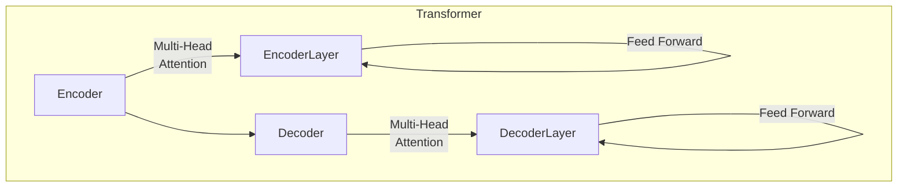

# 基于Transformer架构的预训练模型

## 1.背景介绍

在自然语言处理(NLP)领域,预训练模型已成为解决各种下游任务的关键技术。传统的NLP模型通常是基于统计方法或浅层神经网络,需要大量手工设计的特征工程,且在面对复杂的语言现象时表现有限。而预训练模型通过在大规模无标注语料上进行自监督学习,能够自动获取通用的语言表示,从而极大提高了模型的泛化能力。

预训练模型的兴起始于2018年,Transformer结构被提出并应用于机器翻译任务,取得了突破性的成果。此后,以BERT、GPT等为代表的预训练模型相继问世,在广泛的NLP任务上展现出卓越的性能。这些模型的核心是利用Transformer编码器-解码器架构,结合掩码语言模型(MLM)、下一句预测(NSP)等自监督学习目标,在大规模语料上进行预训练。经过预训练后,模型可以捕获丰富的语义和语法知识,为下游任务提供强大的语言表示能力。

## 2.核心概念与联系

### 2.1 Transformer架构

Transformer是一种全新的基于注意力机制的序列到序列模型,不同于传统的基于RNN或CNN的架构。它完全放弃了循环和卷积结构,使用多头自注意力机制来直接建模输入和输出之间的依赖关系。

Transformer架构主要由编码器(Encoder)和解码器(Decoder)两部分组成。编码器将输入序列映射为连续的表示,解码器则根据编码器的输出生成目标序列。两者均由多个相同的层组成,每一层包括多头自注意力子层和前馈全连接子层。



### 2.2 注意力机制

注意力机制是Transformer的核心,它能够捕捉输入序列中任意两个位置之间的依赖关系。具体来说,在计算目标位置的表示时,注意力机制会根据其与所有其他位置的关联程度,对这些位置的表示进行加权求和。

```mermaid
graph TD
    subgraph Attention
        Q[Query] --> |Dot Product| Attention
        K[Key] --> |Dot Product| Attention
        V[Value] --> |Dot Product| Attention
        Attention --> |Weighted Sum| Output
    end
```

多头注意力机制是对多个注意力的结果进行合并,以提高模型对不同位置关系的建模能力。

### 2.3 自监督学习目标

预训练模型通过自监督学习在大规模语料上进行预训练,以捕获通用的语言知识。常见的自监督学习目标包括:

- **掩码语言模型(MLM)**: 随机掩码部分输入token,模型需要基于上下文预测被掩码的token。
- **下一句预测(NSP)**: 判断两个句子是否为连续的句子对。
- **因果语言模型(CLM)**: 基于前面的token预测下一个token。

通过这些自监督学习目标,预训练模型可以学习到丰富的语义和语法知识,为下游任务提供强大的语言表示能力。

## 3.核心算法原理具体操作步骤

### 3.1 Transformer编码器

Transformer编码器的输入为一个源语句的token序列,输出为对应的连续表示序列。编码器由多个相同的层组成,每一层包括两个子层:多头自注意力机制和前馈全连接网络。

1. **输入表示**

   首先,将输入token序列映射为embeddings,并增加位置编码以引入位置信息。

   $$\mathrm{Input\:Embeddings} = \mathrm{Word\:Embeddings} + \mathrm{Position\:Encodings}$$

2. **多头自注意力子层**

   对输入embeddings进行多头自注意力变换,捕捉输入序列中任意两个位置之间的依赖关系。

   $$\mathrm{MultiHead}(Q,K,V) = \mathrm{Concat}(\mathrm{head_1}, \ldots, \mathrm{head_h})W^O\\
   \mathrm{where\:head_i} = \mathrm{Attention}(QW_i^Q,KW_i^K,VW_i^V)$$

3. **残差连接和层归一化**

   对注意力的输出进行残差连接,并进行层归一化,以保持梯度稳定。

   $$\mathrm{output} = \mathrm{LayerNorm}(\mathrm{input} + \mathrm{MultiHead}(Q,K,V))$$

4. **前馈全连接子层**

   输出通过两个线性变换和一个ReLU激活函数组成的前馈全连接网络。

   $$\mathrm{FFN}(x) = \max(0,xW_1 + b_1)W_2 + b_2$$

5. **残差连接和层归一化**

   同样进行残差连接和层归一化。

   $$\mathrm{output} = \mathrm{LayerNorm}(\mathrm{input} + \mathrm{FFN}(\mathrm{input}))$$

6. **层堆叠**

   将上述两个子层堆叠多次,形成最终的编码器输出。

### 3.2 Transformer解码器

解码器的输入为目标语句的token序列,输出为对应的概率分布序列。解码器的结构与编码器类似,也由多个相同的层组成,每一层包括三个子层:掩码多头自注意力、编码器-解码器注意力和前馈全连接网络。

1. **输入表示**

   将目标token序列映射为embeddings,并增加位置编码。

   $$\mathrm{Input\:Embeddings} = \mathrm{Word\:Embeddings} + \mathrm{Position\:Encodings}$$

2. **掩码多头自注意力子层**

   对embeddings进行掩码多头自注意力变换,确保每个位置只能关注之前的位置。

   $$\mathrm{MultiHead}(Q,K,V) = \mathrm{Concat}(\mathrm{head_1}, \ldots, \mathrm{head_h})W^O\\
   \mathrm{where\:head_i} = \mathrm{AttentionMask}(QW_i^Q,KW_i^K,VW_i^V)$$

3. **残差连接和层归一化**

   进行残差连接和层归一化。

4. **编码器-解码器注意力子层**

   将解码器的输出与编码器的输出进行注意力计算,获取源语句的语义信息。

   $$\mathrm{MultiHead}(Q,K,V) = \mathrm{Concat}(\mathrm{head_1}, \ldots, \mathrm{head_h})W^O\\
   \mathrm{where\:head_i} = \mathrm{Attention}(QW_i^Q,KW_i^K,VW_i^V)$$

5. **残差连接和层归一化**

   进行残差连接和层归一化。

6. **前馈全连接子层**

   输出通过前馈全连接网络。

   $$\mathrm{FFN}(x) = \max(0,xW_1 + b_1)W_2 + b_2$$

7. **残差连接和层归一化**

   进行残差连接和层归一化。

8. **线性和softmax**

   最后通过线性层和softmax计算下一个token的概率分布。

   $$P(x_t) = \mathrm{softmax}(W_o\mathrm{output}_t + b_o)$$

### 3.3 预训练过程

预训练阶段的目标是在大规模无标注语料上学习通用的语言表示,为下游任务提供强大的初始化参数。常见的预训练目标包括掩码语言模型(MLM)和下一句预测(NSP)。

1. **掩码语言模型(MLM)**

   在输入序列中随机选择15%的token进行掩码,模型需要基于其他token预测被掩码的token。具体操作为:

   - 80%的掩码token用特殊的`[MASK]`token替换
   - 10%的掩码token用随机的token替换
   - 10%的掩码token保留原值

   模型的目标是最大化被掩码token的条件概率:

   $$\mathcal{L}_\mathrm{MLM} = -\mathbb{E}_{x\sim X}\left[\sum_{i\in\mathrm{MASK}}\log P(x_i|\mathbf{x}_{\backslash i})\right]$$

2. **下一句预测(NSP)**

   对于一对输入序列,模型需要判断它们是否为连续的句子对。NSP目标有助于模型捕获句子之间的关系和语境信息。

   $$\mathcal{L}_\mathrm{NSP} = -\mathbb{E}_{(x,y)\sim D}\left[\log P(y|x)\right]$$

3. **预训练目标组合**

   最终的预训练目标是MLM和NSP的线性组合:

   $$\mathcal{L} = \mathcal{L}_\mathrm{MLM} + \lambda\mathcal{L}_\mathrm{NSP}$$

   其中$\lambda$是一个权重系数。通过预训练,模型可以学习到通用的语言表示能力。

## 4.数学模型和公式详细讲解举例说明

在Transformer模型中,注意力机制是最核心的部分。我们将详细介绍注意力机制的数学原理和计算过程。

### 4.1 注意力机制

注意力机制的基本思想是,在计算目标位置的表示时,根据其与所有其他位置的关联程度,对这些位置的表示进行加权求和。具体来说,给定一个查询向量(query)、键向量(key)和值向量(value),注意力机制的计算过程如下:

1. **计算注意力分数**

   首先,计算查询向量与所有键向量之间的相似度分数,作为注意力分数。常用的相似度函数是点积:

   $$\mathrm{Attention}(Q,K,V) = \mathrm{softmax}\left(\frac{QK^\top}{\sqrt{d_k}}\right)V$$

   其中$Q\in\mathbb{R}^{n\times d_q}$为查询向量矩阵,$K\in\mathbb{R}^{n\times d_k}$为键向量矩阵,$V\in\mathbb{R}^{n\times d_v}$为值向量矩阵。$\sqrt{d_k}$是一个缩放因子,用于防止点积值过大导致softmax饱和。

2. **计算加权和**

   将注意力分数与值向量相乘,得到加权和作为注意力的输出:

   $$\mathrm{Attention}(Q,K,V) = \mathrm{softmax}\left(\frac{QK^\top}{\sqrt{d_k}}\right)V$$

通过注意力机制,模型可以自适应地为每个目标位置分配不同的注意力权重,从而更好地捕捉输入序列中任意两个位置之间的依赖关系。

### 4.2 多头注意力机制

单一的注意力机制只能从一个角度捕捉位置关系,为了提高模型的表示能力,Transformer引入了多头注意力机制。多头注意力机制将查询向量、键向量和值向量分别线性投影到不同的子空间,并在每个子空间上并行计算注意力,最后将所有注意力的输出拼接起来。具体计算过程如下:

1. **线性投影**

   将查询向量矩阵$Q$分别投影到$h$个子空间,得到$Q_1,Q_2,\ldots,Q_h$;对键向量矩阵$K$和值向量矩阵$V$做同样的操作,得到$K_1,K_2,\ldots,K_h$和$V_1,V_2,\ldots,V_h$。

   $$\begin{aligned}
   Q_i &= QW_i^Q & K_i &= KW_i^K & V_i &= VW_i^V\\
   \mathrm{for}\:i&=1,2,\ldots,h
   \end{aligned}$$

   其中$W_i^Q\in\mathbb{R}^{d_q\times d_{q_i}}$,$W_i^K\in\mathbb{R}^{d_k\times d_{k_i}}$,$W_i^V\in\mathbb{R}^{d_v\times d_{v_i}}$为线性投影矩阵。

2. **并行计算注意力**

   在每个子空间上并行计算注意力:

   $$\mathrm{head}_i = \mathrm{Attention}(Q_i,K_i,V_i)$$

3. **拼接注意力输出**

   将所有注意力的输出拼接